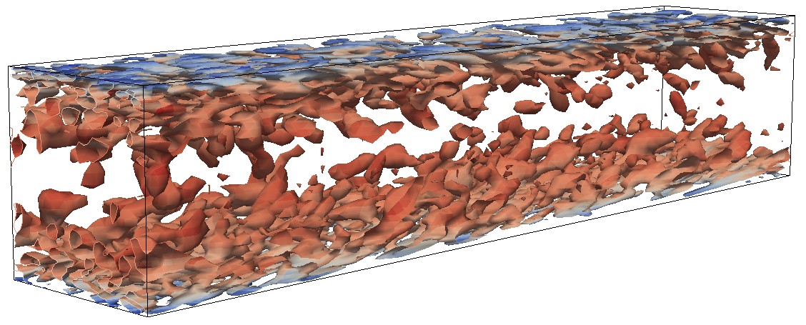
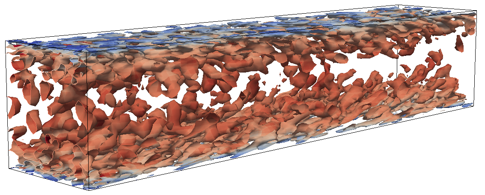
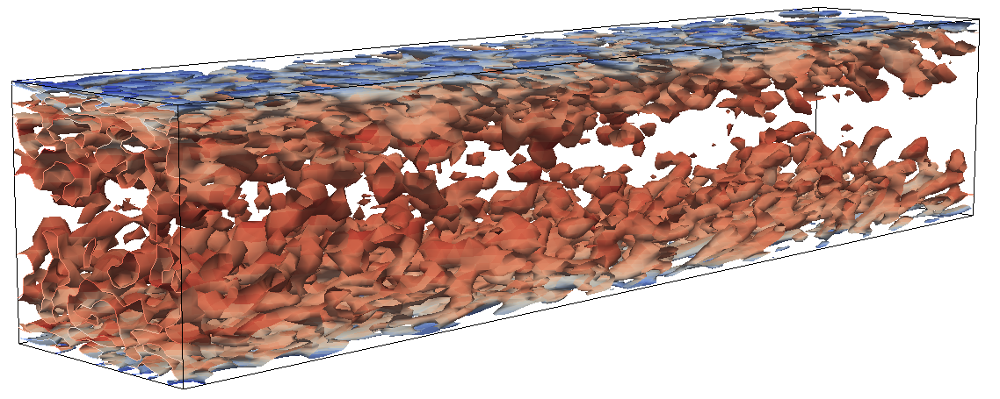
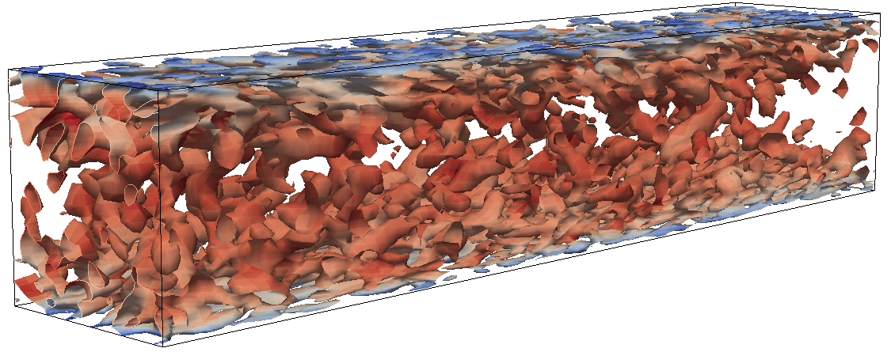

.. lblExamples

Examples
========

Fully Developed Channel Flow
----------------------------

Fully developed turbulent channel flow is one of the most studied flow problem of engineering interest in computational fluid dynamics (CFD) community. The flow problem has a simple three dimensional geometry comprising two flat walls at the top and bottom (see :numref:`fig_TinF01NE`), which makes the channel flow an ideal test case for investigating the near wall behavior of turbulence. When the flow is fully developed in the channel, there is a constant mean pressure gradient in the stream-wise direction which is directly related to the friction velocity :math:`u_{\tau}` and the channel half width :math:`\delta` in terms of the relation

.. math::

        \frac{\mathrm{d}p}{\mathrm{d}x} = \frac{u_{\tau}^2}{2\delta}

\noindent Due to the homogeneity of turbulent channel flows in the stream-wise and span-wise directions, periodic boundary conditions can be applied to the boundaries normal to these two directions. In a standard case where periodic boundary conditions are employed, the simulation generates its own turbulence and can therefore be considered as a benchmark to assess simulations with synthetic turbulent inflow.

.. _fig_TinF01NE:

.. figure:: figures/TInF-NE-01.eps
   :align: center
   :figclass: align-center
   :width: 350px
   
   Sketch of a channel flow and the coordinate system adopted

The turbulence in the fully developed channel flow shows different levels of anisotropy with the varying wall distance, and isotropy is approximately recovered only in a small region adjacent to the mid plane of the channel. Compared to more complex flow problems, where the downstream evolution of the inflow turbulence might be quickly dominated by complicated geometries or other forcing factors, the turbulence in the channel is only induced by the presence of the flat wall and develops quite slowly. These circumstances make the channel flow a challenging test case for turbulent inflow generation, because impurities in the generated turbulence are very clearly identified.

Over the past two decades, direct numerical simulation (DNS) and large eddy simulation (LES) have been a valuable tool for the investigation of turbulent channel flows with periodic boundaries. A variety of studies of such simulations have yielded insights into both the statistical and structural characteristics of wall-bounded turbulence. :numref:`fig_TinF02NE` and :numref:`fig_TinF03NE` demonstrate the mean velocity and Reynolds stress tensor extracted from a LES simulation for the channel flow (using the tutorial case *channel395* available in the OpenFOAM) at the friction Reynolds number :math:`\mathrm{Re}_{\tau} = 395` defined as

.. math::

        \mathrm{Re}_{\tau} = \frac{\delta u_{\tau}}{\nu}

Based on the data demonstrated in :numref:`fig_TinF02NE` and :numref:`fig_TinF03NE`, the application of the turbulent inflow tool to generate inlet conditions for large eddy simulation (LES) of turbulent plane channel flow at :math:`\mathrm{Re}_{\tau} = 395` will be presented.

.. _fig_TinF02NE:

.. figure:: figures/TInF-NE-02.eps
   :align: center
   :figclass: align-center
   
   Mean velocity profile for the channel flow at :math:`\mathrm{Re}_{\tau} = 395`
   
.. _fig_TinF03NE:

.. figure:: figures/TInF-NE-03.eps
   :align: center
   :figclass: align-center
   
   Reynolds stress profile for the channel flow at :math:`\mathrm{Re}_{\tau} = 395`
   
   
Numerical Setup
^^^^^^^^^^^^^^^

The dimensions of the computational domain are chosen as :math:`2\pi\delta\times 2\delta \times \pi\delta` in the stream-wise, wall-normal and span-wise directions, respectively. This is sufficient to resolve the largest structures of the flow at :math:`\mathrm{Re}_{\tau} = 395`. In the meantime, the number of grid nodes are chosen as :math:`100 \times 60 \times 60` in the stream-wise, wall-normal and span-wise directions, respectively. The grid nodes are uniformly distributed in the stream-wise and span-wise directions, whereas an exponential profile is employed to determine the grid spacing in the wall-normal direction. Periodic boundary conditions were applied in the span-wise direction, whereas no-slip boundary conditions were imposed at the walls. For all simulations, the time step :math:`\Delta t` was adjusted so that the maximum Courant-Friedrichs-Lewy (CFL) number remains lower than unity during all simulations. The :math:`k`-equation model with Van Driest damping at the wall is used for LES. The different synthetic turbulent inflow methods investigated are summarized in :numref:`table_TinF01_NE`.

.. figure:: figures/TInF-NE-00.gif
   :align: center
   :figclass: align-center
   :width: 350px
   
   A velocity contour of the channel flow at :math:`\mathrm{Re}_{\tau} = 395`

.. _table_TinF01_NE:

.. table:: Basic numerical setup.
    :align: center
    
    +-----+--------------------------+---------------------------------------------------------------------------------------+
    | Run |:math:`\mathrm{Re}_{\tau}`|boundary condition for inflow                                                          |
    +=====+==========================+=======================================================================================+
    |  A  |           395            |periodic                                                                               |
    +-----+--------------------------+---------------------------------------------------------------------------------------+
    |  B  |           395            |digital filtering method (DFM) by :cite:`xie2008`                                      |
    +-----+--------------------------+---------------------------------------------------------------------------------------+
    |  C  |           395            |synthetic eddy method (SEM) by :cite:`jarrin2006`                                      |
    +-----+--------------------------+---------------------------------------------------------------------------------------+
    |  D  |           395            |divergence free synthetic eddy method (DFSEM) by :cite:`poletto2013`                   |
    +-----+--------------------------+---------------------------------------------------------------------------------------+
    |  E  |           395            |turbulent spot method with anisotropic vortons of type R (ATSM-R) by :cite:`kroger2018`|
    +-----+--------------------------+---------------------------------------------------------------------------------------+
    |  F  |           395            |turbulent spot method with anisotropic vortons of type L (ATSM_L) by :cite:`kroger2018`|
    +-----+--------------------------+---------------------------------------------------------------------------------------+

    
* The entries to employ the digital filtering method by :cite:`xie2008` in the OpenFOAM are

.. code-block:: none

    inlet
    {
            type            turbulentDFMInlet;
            filterType      exponential;
            periodicInZ     ture;
            cleanRestart    false;
            value           $internalField;
    }

* The entries to employ the synthetic eddy method by :cite:`jarrin2006` in the OpenFOAM are

.. code-block:: none

    inlet
    {
            type            turbulentSEMInlet;
            eddyType        gaussian;
            periodicInZ     ture;
            cleanRestart    false;
            value           $internalField;
    }

* The entries to employ the divergence free synthetic eddy method by :cite:`poletto2013` in the OpenFOAM are

.. code-block:: none

    inlet
    {
            type            turbulentDFSEMInlet;
            periodicInZ     ture;
            cleanRestart    false;
            value           $internalField;
    }

* The entries to employ the divergence free synthetic eddy method by :cite:`kroger2018` in the OpenFOAM are

.. code-block:: none

    inlet
    {
            type            turbulentATSMInlet;
            vortonType      typeR (or typeL);
            periodicInZ     ture;
            cleanRestart    false;
            value           $internalField;
    }

Simulation Results
^^^^^^^^^^^^^^^^^^

A first impression of the turbulence in the flow is given in :numref:`fig_TinF04NE` ~ :numref:`fig_TinF07NE`. It shows the contour-surfaces of the :math:`\lambda_2` vortex identification criterion. The vortices from the simulation with ATSM-R and ATSM_L are shown in Fig. :numref:`fig_TinF06NE` and :numref:`fig_TinF07NE`, respectively. The vortex content is very rich compared to all other simulations, especially in the vicinity of the inlet (on the left side of the images). A large number of vortices is visible there, which also extend relatively far from the wall. The simulations with SEM or DFM look more sparsely populated by vortices. Especially for the simulation with DFM, a very clear decay of vortex density after the inlet is visible.

.. _fig_TinF04NE:

   
   Visualization of turbulent vortices in the channel flow simulation with DFM by contour-surfaces of :math:`\lambda_2`
   
   
.. _fig_TinF05NE:

   
   Visualization of turbulent vortices in the channel flow simulation with SEM by contour-surfaces of :math:`\lambda_2`
   

.. _fig_TinF06NE:

   
   Visualization of turbulent vortices in the channel flow simulation with ATSM_R by contour-surfaces of :math:`\lambda_2`
   
   
.. _fig_TinF07NE:

   
   Visualization of turbulent vortices in the channel flow simulation with ATSM-L by contour-surfaces of :math:`\lambda_2`
   
In :numref:`fig_TinF08NE` ~ :numref:`fig_TinF11NE`, the pressure fluctuations in the channel flow simulations are plotted vs. the axial distance to the inlet. The SEM, which does not obey continuity, produces very intense pressure noise near the inlet. The peak amplitude of its pressure fluctuations is much larger than the amplitude of the natural pressure fluctuations in the channel. In comparsion, the DFSEM and ATSM formulations produce a pressure noise level which is much lower.

.. _fig_TinF08NE:

.. figure:: figures/TInF-NE-08.eps
   :align: center
   :figclass: align-center
   
   Pressure fluctuations vs. axial distance for the channel flow simulation with SEM
   
   
.. _fig_TinF09NE:

.. figure:: figures/TInF-NE-09.eps
   :align: center
   :figclass: align-center
   
   Pressure fluctuations vs. axial distance for the channel flow simulation with DFSEM
   

.. _fig_TinF10NE:

.. figure:: figures/TInF-NE-10.eps
   :align: center
   :figclass: align-center
   
   Pressure fluctuations vs. axial distance for the channel flow simulation with ATSM-R
   
   
.. _fig_TinF11NE:

.. figure:: figures/TInF-NE-11.eps
   :align: center
   :figclass: align-center
   
   Pressure fluctuations vs. axial distance for the channel flow simulation with ATSM-L
   
   
In :numref:`fig_TinF12NE` ~ :numref:`fig_TinF15NE`, the main components of the Reynolds stress tensor in the channel flow simulations with different synthetic methods are plotted against the axial distance to the inlet. Generally, all methods produce an initial decay in vortex intensity. The turbulence generated by the ATSM-L turns much faster into its equilibrium state than the others. It seems that it is more important to produce turbulence with valid length scales rather than with the exact magnitude of fluctuation velocity.

.. _fig_TinF12NE:

.. figure:: figures/TInF-NE-12.eps
   :align: center
   :figclass: align-center
   
   Main components of the Reynolds stress tensor at different sections in the channel flow simulation with DFM
   
.. _fig_TinF13NE:

.. figure:: figures/TInF-NE-13.eps
   :align: center
   :figclass: align-center
   
   Main components of the Reynolds stress tensor at different sections in the channel flow simulation with SEM
   
.. _fig_TinF14NE:

.. figure:: figures/TInF-NE-14.eps
   :align: center
   :figclass: align-center
   
   Main components of the Reynolds stress tensor at different sections in the channel flow simulation with ATSM-R
   
.. _fig_TinF15NE:

.. figure:: figures/TInF-NE-15.eps
   :align: center
   :figclass: align-center
   
   Main components of the Reynolds stress tensor at different sections in the channel flow simulation with ATSM-L
   
   

