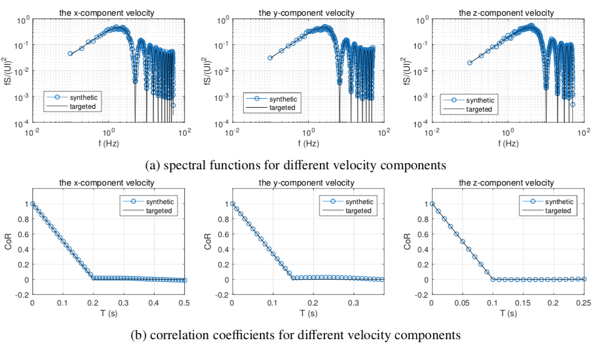

.. _lblVerificationTurbulenceINflow:

Verification of the Turbulence Inflow 
=====================================

The performance of the turbulent inflow in reproducing the statistical properties of the targeted turbulence can be verified by examining the synthetic velocity fluctuations generated at the inflow patch. To carry out such a verification, the first step is to record those velocity fluctuations during the simulations which can be achieved by adding the following lines in the “inflowProperties” file.

.. code-block:: none

   nOutputFace 6;
   outputFaceIndices (0 1 2 3 4 5);

The two entries to be specified, i.e., ”nOutputFace” and ”outputFaceIndices”, denote the total number and the indices of the face elements (on the inflow patch) at which the time-histories of the velocities are to be recorded.

.. note::

   Tthe components of ”outputFaceIndices” should be integers lying between zero and the total number of the
face elements on the inflow patch. Meanwhile, the number of the components of ”outputFaceIndices” should equal to the value of ”nOutputFace” which is an no larger than the total number of the face elements on the inflow patch. Once, the command lines shown above are added to the “inflowProperties” file, separate file named by the indices of the output face elements will be generated inside the ”postProcessing” folder (created if not exists) at the root directory of the case project during the simulations. Those files (see below) contain not only the time-histories of the velocities but also the parameters defining the statistical properties of the targeted turbulence.

.. code-block:: none

   # face index : 400
   # face centroid: (0.000000e+00 1.050000e+01 5.000000e-01)
   # mean velocity magnitude: 1.000000e+01
   # turbulent intensity tensor: (1.000000e-01 0.000000e+00 0.000000e+00 1.000000e-01 0.000000e+00 1.000000e-01)
   # integral length scale for the x-component velocity: 1.500000e+00
   # integral length scale for the y-component velocity: 1.000000e+00
   # integral length scale for the z-component velocity: 5.000000e-01
   # synthetic method: digital filtering
   # filter function: gaussian
   # time length : 1.000000e+03
   # time step size: 1.000000e-02
   # Time ux uy uz
   0.01 1.134177e+01 9.334704e-01 4.628306e-02
   0.02 1.082484e+01 3.726139e-01 1.433661e-01
   0.03 1.114386e+01 9.974869e-02 3.533047e-04
   0.04 1.148161e+01 -3.989044e-01 6.526394e-01
   0.05 1.134108e+01 2.558397e-01 -4.537671e-01
   0.06 1.100006e+01 4.039564e-01 -1.318910e+00
   0.07 1.140864e+01 4.799761e-01 -8.001173e-01
   0.08 1.143868e+01 7.390340e-02 -1.079113e+00
   0.09 1.098772e+01 4.546511e-01 -1.137630e+00
   0.1 1.143417e+01 2.590234e-01 -1.843147e+00
   ...

When the simulations are finished, one can easily verify if the synthetic turbulence meet the initial requirements by conducting a statistical analysis of the velocity fluctuations contained in the files. For simplicity, we have provided a Matlab R code for the statistical analysis of the velocity fluctuations which are capable of computing the correlation coefficients and the velocity spectral functions of the synthetic turbulence at some specific face elements on the inflow patch. The code should be placed in the root dictionary of the case project before running. While running, the code will automatically search for the data files existing in the ”postProcessing” folder, create and write figures demonstrating the comparison of the synthetic results with the targeted values for each face element. A number of examples are given below for demonstration.

.. _figTinF1V:

.. figure:: figures/vTinF1.png
   :align: center
   :figclass: align-center

   Synthetic turbulence using the digital filtering method with :math:`U = 10m/s`, :math:`L_{ux} = 1m`, :math:`L_{vx} = 0.75m`, and :math:`L_{wx} = 0.5m`

.. _figTinF2V:

.. figure:: figures/vTinF2.png
   :align: center
   :figclass: align-center

   Synthetic turbulence using the synthetic eddy method with :math:`U = 10m/s`, :math:`L_{ux} = 1m`, :math:`L_{vx} = 0.75m`, and :math:`L_{wx} = 0.5m` and and Gaussian function for eddy shape

.. _figTinF3V:

.. figure:: figures/vTinF3.png
   :align: center
   :figclass: align-center

   Synthetic turbulence using the synthetic eddy method with :math:`U = 10m/s`, :math:`L_{ux} = 1m`, :math:`L_{vx} = 0.75m`, and :math:`L_{wx} = 0.5m` and tent function for eddy shape

.. _figTinF4V:

   Synthetic turbulence using the synthetic eddy method with :math:`U = 10m/s`, :math:`L_{ux} = 1m`, :math:`L_{vx} = 0.75m`, and :math:`L_{wx} = 0.5m` and step function for eddy shape

