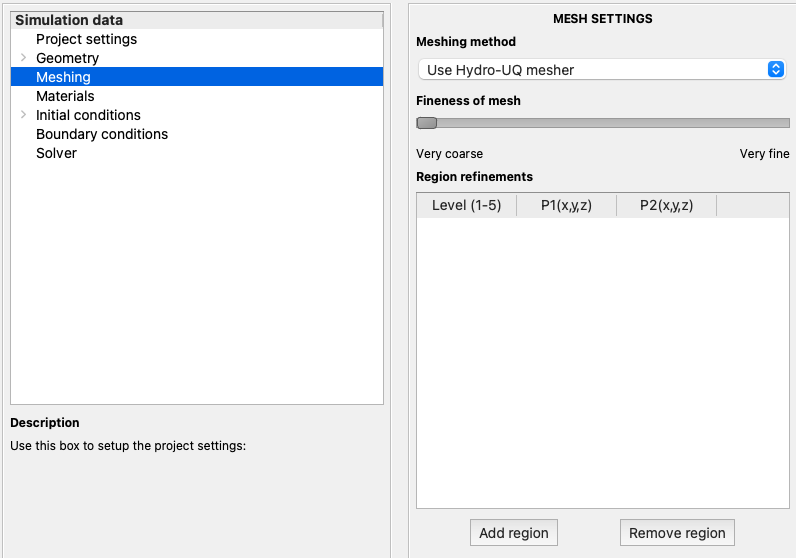

.. _lbl-meshing:

***********************************************
Meshing
***********************************************

The |app| provides basic meshing capabilities. The meshing window can be activated by selecting the option from the left panel as shown in :numref:`MeshWin`.

.. _MeshWin:

   Meshing settings panel available in ``EVT``

Three possible options are available in the |app| to define the mesh. This includes the internal mesher, importing external meshes, or importing mesh dictionaries. 

#. **HydroUQ meshing:** This is the inbuilt mesher provided in the application and is shown in :numref:`MeshMethod`. A slider bar from ``Very coarse`` to ``Very fine`` defines the mesh quality. Further on, specific regions can be specified for regional refinements. These regional refinements are specified through a tabular format by identifying the two diagonal points of the region of interest.

   .. _MeshMethod:

   .. figure:: figures/Meshing/MeshMethod.png
      :align: center
      :width: 300px
      :figclass: align-center

      Meshing methods available in ``EVT``

#. **External mesh import:** |app| also supports the import of meshes generated from existing pre-processing software and is shown in :numref:`UploadMesh`. At present, the supported formats include Fluent (.msh), I-DEAS (.ans), CFX (.geo), GAMBIT (.neu) and Gmsh (.msh) file formats. 

   .. _UploadMesh:

   .. figure:: figures/Meshing/UploadMesh.png
      :align: center
      :width: 300px
      :figclass: align-center

      Mesh generated from commercial tools can be directly imported into ``EVT``

#. **Mesh dictionary:** |app| also supports importing mesh dictionaries of ``OpenFOAM v7.0``. The user can upload the ``blockMeshDict`` and the ``snappyHexMeshDict``. These dictionaries will be used instead of the dictionaries generated by the |app|. 

   .. _UploadMeshDict:

   .. figure:: figures/Meshing/MeshDict.png
      :align: center
      :width: 300px
      :figclass: align-center

      Mesh dictionaries for OpenFOAM / OlaFlow solvers can also be directly imported into ``EVT``