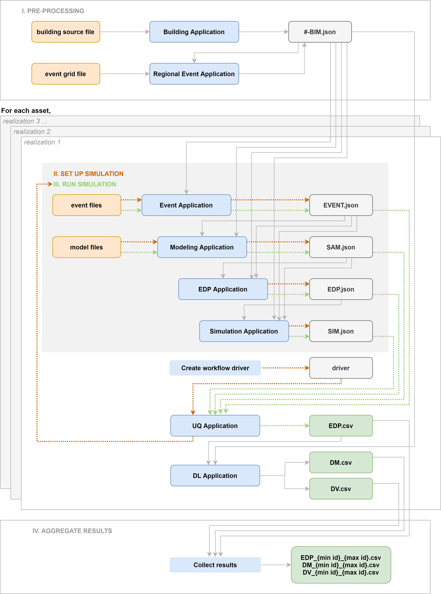

RDT Backend Applications
========================

[Description of how files are propagated through the backend applications]

.. note::

   The following terminology is used:

   1. **Input Files**: files containing input data which is prepared by the user.

   4. **Intermediate Files**: JSON files automatically produced during the execution of the workflow to aid in propagating data (BIM.json, EDP.json, EVENT.json, SAM.json, SIM.json).

   5. **Application**: name of a specific instance of a workflow application, executed through software (i. e. MDOF-LU, OpenSeesInput, OpenSeesPyInput).

   6. **Output Files**: files produced by the workflow with analysis results.

.. toctree::
   :maxdepth: 1

   Inputs
   backendApplications
   Outputs

.. _figBackendApps:

   Diagram of backend applications workflow.

.. _figSequenceDiagram:

.. figure:: figures/sequence_diagram.png
   :align: center
   :figclass: align-center

How to Run
====================

   runLocal
   runRemote
   troubleshooting

