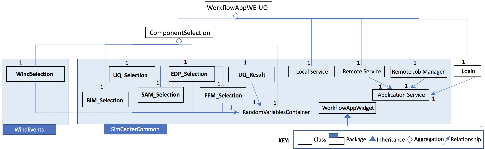

.. _lblc4model:

===================================
C4 Model of the SimCenter Ecosystem
===================================

The SimCenter workflow systems are aimed at facilitating the use, reuse and extension of common workflows encountered in NHE by a broad range of natural hazards engineering researchers with varying levels of software skills. In order to encourage this use and adoption, this chapter presents the software architecture for the SimCenter framework and |app| using the `C4 model <https://c4model.com>`_. The C4 model is a graphical approach for documenting software architecture through diagrams that describe and communicate the software architecture at different levels of abstraction. It is a top-down approach that starts at a high level (level 1) showing how a user would interact with the software and drills down through three more levels, with level 4 containing the typical UML diagrams. The choice of the **C4** model was made to provide NHE researchers with a diverse range of software architecture knowledge and an understanding of the software architecture behind SimCenter applications that fit their skill level. These four levels are as follows:

The SimCenter scientific workflow systems aim to facilitate the use, reuse, and extension of common workflows encountered in NHE by a broad range of natural hazards engineering researchers with varying software skills. This chapter presents the software architecture for the SimCenter framework and |app| using the `C4 model <https://c4model.com>`_ to encourage this use and adoption. The **C4** model is a graphical approach for documenting software architecture through diagrams describing and communicating the software architecture at various levels of abstraction. It is a top-down approach that starts at a high level (level 1), showing how a user would interact with the software, and drills down through three more levels, with level 4 containing comprehensive UML diagrams. The **C4** model was chosen to provide NHE researchers with a diverse range of software architecture knowledge to understand the software architecture behind SimCenter applications that fit their skill level. The four levels are as follows:

- Level 1: The level one diagram is a system diagram that shows how the software system fits in the real world in terms of people who use it and other software systems it interacts with.
- Level 2: Level 2 is a container diagram showing the containers (applications, databases, etc.) that make up the software system.
- Level 3: Level three diagrams are component diagrams, showing how the components of the individual containers.
- Level 4: The level four diagrams show how the individual components are implemented. They are typically UML class diagrams.

.. contents:: Table of Contents
   :local:
   :backlinks: none

.. _lblc4model1:

Level 1: Context Diagram
------------------------

A Level 1 diagram in :numref:`c4model_figContext` shows the system context for the SimCenter applications, i.e. how it fits in the world. In the diagram:

- the SimCenter computational applications (EE-UQ, WE-UQ, PBE, R2D) are shown in the center surrounded by the user and the systems it interacts with.
- input data for the SimCenter applications can be obtained either from NHERI datasets accessible on the DesignSafe `Data Depot <https://www.designsafe-ci.org/data/browser/public/designsafe.storage.community/>`_, shown to the right, or from web-based databases, shown to the left.
- the SimCenter applications can then be run in conjunction with open-source software applications (such as Dakota, FEAP, OpenSees, Python, OpenFOAM, etc.) either on a local desktop, shown below, or using HPC resources on |DesignSafe|, shown to the right.

.. figure:: figures/context.png
   :name: c4model_figContext
   :align: center
   :width: 800
   :figclass: align-center

   System context diagram for SimCenter applications.

.. _lblc4model2:

Level 2: Container Diagram
--------------------------

A Level 2 diagram in :numref:`c4model_figContainer` demonstrates how the SimCenter applications are broken into high-level containers (applications, databases, etc.). Each of the SimCenter applications is broken into two components: A front-end UI and a back-end application that runs the workflow. The front-end is a desktop application written using the cross-platform `Qt framework <https://www.qt.io/product/framework>`_. The back-end is an application that processes the input from the front-end, which comes in the form of a JSON file, creates a workflow and runs it. The workflow applications, written in Python, C, or C++, utilize existing applications where possible and run on either the local desktop machine or on an HPC utilizing resources made available to NHE community through DesignSafe.

.. figure:: figures/container.png
   :name: c4model_figContainer
   :align: center
   :width: 800
   :figclass: align-center

   System container diagram for SimCenter applications.

.. _lblc4model3:

Level 3: Component Diagram
--------------------------

Two level 3 diagrams are now presented which break up the two containers into the major building blocks or
components in C4 terminology. In :numref:`c4model_figComponentFront` the component diagram for the front-end UI is presented. It outlines the interaction between the user and the individual graphical elements (widgets) of the UI. Given the analogy of a jigsaw puzzle, the user selects which piece of the jigsaw puzzle they are working on in the component selection widget. The widget for the jigsaw piece will then be displayed on the desktop. The user for each jigsaw piece then selects which application to run for that piece, and for the chosen application, they provide the inputs. When the inputs are all provided, the user can select to run the simulations locally or remotely. For jobs that run remotely, the user can download and review previously run simulations. As seen the widgets may subsequently interact with web services through HTTPS requests, or with DesignSafe utilizing TAPIS Restful API through the RemoteService container.

.. figure:: figures/componentFront.png
   :name: c4model_figComponentFront
   :align: center
   :width: 800
   :figclass: align-center

   Component diagram for front end UI.

The component diagram for the backend application shown in :numref:`c4model_figComponentBack`, shows that the backend is made up of a number of component applications. The application ``femUQ.py`` is the application that parses the input from the front end, sets up the workflow by creating a ``workflow_driver`` script and then launches the UQ engine. Which UQ Engine and which applications to run in the workflow, is determined from the data passed from the UI and information contained in a file, ``WorkflowApplication.json``. The ``WorkflowApplication.json`` file is a file that maps the applications specified in the output from the UI with a specific application contained on the user's local machine or at the remote HPC resource, as such it allows the researchers to modify the applications that may be run in the workflow w/o the need to recompile the application. Once the ``workflow_driver`` file is created, control is passed to a UQ engine, which repeatedly runs the ``workflow_driver`` to generate the results. In running the workflow some of the applications will invoke applications not developed to meet the API. For such applications, pre- and post-processors are provided. The figure shows the backend application running locally or remotely on an HPC at DesignSafe.

.. figure:: figures/componentBack.png
   :name: c4model_figComponentBack
   :align: center
   :width: 800
   :figclass: align-center

   Component diagram for Backend Application.

.. _lblc4model4:

Level 4: Code Diagram
--------------------------

To facilitate the development of the different SimCenter applications and to encourage their reuse and extension by other NHE researchers, the SimCenter is providing the NHE community with a software framework for building such applications. From this framework, the SimCenter is building the applications, of which |app| is but one, that it releases. These individual applications are built from the components of the framework. The components of the SimCenter are grouped, as shown in the figure below, into the following components:

#. **Cloud**: applications/libraries for communicating with remote web services to launch and monitor applications on HPC resources and to upload and download files from the filesystems of such resources.

#. **UQ**: applications for performing sampling, sensitivity, reliability and optimization methods.

#. **SAM**: applications for creating a finite element model of the building asset.

#. **EVENT**: applications for creating loads on the building asset given a natural hazard event.

#. **FEM**: application for determining the response parameter of the building asset given applied loads.

#. **DL**: application to determine the damage and loss to the building asset given the event.

#. **EDP**: application to determine the response parameter given the event, building asset, and damage and loss application.

#. **BRAILS**: a framework of applications for creating regional-level building inventories using machine learning.   

#. **Databases**; contain information on building inventories for regional simulations, consequence functions for the DL applications, and experimental and corresponding simulation models for future machine learning-based AI algorithms.

.. note::
   ``femUQ.py`` is the backend application for the EE-UQ, WE-UQ, Hydro-UQ, and PBE applications. For R2D the backend application is ``R2D_Workflow.py``.

The interaction between the front-end and the back-end is best understood by looking at the sequence of events that occurs when the user presses the ``Run`` button. As shown in the figure below, the UI application will first perform several steps:

1. It will create a temporary directory in the Documents folder named ``tmp.SimCenter``, and inside ``tmp.SimCenter`` will create another directory ``templatedir``.

2. It will then run through all the currently selected widgets and on each invoke the ``copyFiles()`` method, telling these widgets to copy all files that will be needed during the workflow to the ``templatedir`` directory.

3. It will then create a JSON file and will run through the currently selected widgets and on each invoke the methods ``outputToJSON()`` and ``outputAppDataToJSON``, these telling the application to augment the JSON file with the inputs the user has provided in the widget and also the name of the widget.

4. The UI will now start the backend application and will spin until the backend application returns with a completion signal.
   
Now that the UI has been handed over to the backend application, the backend application will perform the following:

5. Open the output file from the UI and parse it to obtain the name of the application to run and the arguments to run the application with. Open up another file, the ``WorkflowApplications.json`` file, contained with the application, to determine given the application name the full path to the executable to be invoked. It will then create in ``templatedir`` a file named ``workflow_driver``. This file is a script file that when run by the UQ engine will generate a file named ``results.out``. ``results.out`` when the ``workflow_driver`` script has completed will contain a single line of space-separated values, one value for each EDP.

6. It will invoke each of the applications with supplied arguments and an additional command line argument, ``--getRV``, to inform the application to process the input file, and to create any additional random variables and input files needed before the workflow runs.

7. It will then launch the UQengine. The UQengine, is typically a pre- and post-processor to an existing UQ engine.

8. The pre-processor takes the json input file and creates an input file needed by the actual UQ engine.

9. The preprocessor will launch the UQ application. This application will typically run the ``workflow_driver`` many times, passing as input to the workflow a file ``\params`` and obtaining as output from the ``workflow_driver`` a file ``results.out``.

10. When done the engine will output its results.

11. The UQengine will notify the UQpreprocessor that it is done.

12. The UQpreprocessor will notify the femUQ application that it is done.

13. The femUQ application will notify the UI that it is done.

14. The UI will read the results and present them to the user.

.. figure:: figures/sequenceLocal.png
   :name: c4model_figSequenceLocal
   :align: center
   :width: 800
   :figclass: align-center

   Sequence diagram showing what happens when a workflow runs locally.

That is for the case where the computations are performed on the local computer. When the computations are
performed remotely the steps are different. The first 8 steps are the same. But now the UQwrapper will not
start the UQ engine. Instead, control is returned to the UI. The UI will, as shown in the following: (11)
Compress the temporary folder. (12) Send the compressed folder to the remote HPC, shown in :numref:`c4model_figSequenceRemote`. (13) Start an application to perform the computations. All the remote data transfer and application invocation is down through a cloud service. The `TACC tapis <https://tapis-project.org/>`_ interface is used to provide SimCenter users with access to the TACC HPC resources through the DesignSafe portal.

.. figure:: figures/sequenceRemote.png
   :name: c4model_figSequenceRemote
   :align: center
   :width: 800
   :figclass: align-center

   Sequence diagram showing what happens when a workflow runs remotely.

Below we visualize aspects of SimCenter software via schematics. These are mostly UML diagrams showing how the applications are built. The SimCenter releases a number of front-end applications: EE-UQ shown in :numref:`figUmlEE`, WE-UQ shown in :numref:`figUmlWE`, and PBE shown in :numref:`figUmlPBE`. These applications share code with each other and other SimCenter applications. As a consequence, the common code is bundled into a number of shared packages: EarthquakeEvents shown in :numref:`figUmlEarthquakeEvents`, WindEvents shown in :numref:`figUmlWindEvents`, and SimCenterCommon shown in :numref:`figUmlCommon`. A number of packages were chosen over placing all common code inside a single package to simplify development efforts for outside programmers (whom it is envisioned will mostly be adding new event components) and to reduce the overhead of package management and compile time for SimCenter programmers. UML diagrams are presented for these front-end applications and shared packages. THE UML diagrams that are presented are not exhaustive, in that they do not show all classes used, for it was decided not to for example show the myriad of Line edits, labels, spin boxes, etc. that make up the widgets. What is shown is sufficient to present the SimCenter architecture.

While there are a number of different types of UML diagrams, those shown below are limited to class diagrams and sequence diagrams. SimCenter applications are object-oriented in nature. An object-oriented program consists of objects interacting with one another,  with each object being of a certain type or class. A class diagram shows the classes, their attributes and methods, and the relationships between the classes. A sequence diagram or event diagram shows the order in which objects interact. To understand the SimCenter framework it is useful to first present the main() function for a SImCenter application, in this case, EE-UQ, shown in :numref:`codeMainCode`. The code presented is a stripped-down version of the actual code, code for dealing with style sheets, analytics, etc. is not shown as it is not pertinent to understanding the software architecture.

.. _codeMainCode:

.. code-block::
   
   int main(int argc, char *argv[]) {

     QApplication app(argc, argv);
 
    //                                                                       
    // create a remote interface                                             
    //                                                                       

    QString tenant("designsafe");
    QString storage("agave://designsafe.storage.default/");
    QString dirName("EE-UQ");
    
    //                                                                       
    // create the main window                                                
    // 
    
    WorkflowAppWidget *theInputApp = new WorkflowAppEE_UQ(theRemoteService);
    MainWindowWorkflowApp window(QString("EE-UQ: Response of Building to Earthquake"), theInputApp, theRemoteService);
    
    windows.setVersion("Version 1.0.0");

    //                                                                       
    // move the remote interface to a thread                                     
    //                                                                       

    QThread *thread = new QThread();
    theRemoteService->moveToThread(thread); 
    thread->start();

    //                                                                       
    // show the main window, set styles & start the event loop               
    //                                                                       

    window.show(); 
    int res = app.exec();

    //                                                                       
    // on done with the event loop, logout & stop the thread                     
    //                                                                       

    theRemoteService->logout();
    thread->quit();
    
     return res;
   }

As was mentioned the Front end UI applications are built using Qt. In a Qt application, the programmer creates a QApplication object, in :numref:`codeMainCode` the object named `app` and a QMainWindow, in the example named `window`. As will be shown in :numRef:`figUmlCommon`, MainWindowWorkflowApp is a type of QMainWindow that is used in all SimCenter research applications as it deals with all the application menu items, e.g. File open and close, Help cites, etc. The QMainWindowWorkflowApp is a SImCenter class that contains a single QWidget of type WorkflowAppWidget. The WorkflowAppWidget object is passed a RemoteService, the remote cloud service that the application will interact with. This RemoteService is placed in its own QThread object, so that the UI can respond to user requests while communication with the cloud service is underway. Once the window object is shown, control is passed to the QApplication until the user is done.

.. _lblUmlEE:

UML EE-UQ
---------

EE-UQ is an application to determine the response of a building subjected to an earthquake event. As shown in :numref:`figumlEE` it comprises a component selection that presents the user with a number of components, jigsaw pieces, which include: earthquake event (EarthquakeEventSelection), UQ engine (UQ Selection), demand parameters of interns (EDP Selection), building information model (BIM Selection),  structural analysis model generator (SAM Selection), finite element application (FEM Selection), and RandomVariableContainer.  RandomVariableContainer is a widget allowing user to specify distributions associated with the random variables created by a user. As will be seen in :numref:`figUmlEarthquakeEvents` and :numref:`figUmlCommon` each component offers the user a number of applications to choose from for that component. Other classes corresponding to widgets presented in the Front end UI include: UQ Result for displaying the results, Local and Remote Services for running the job locally or remotely, Remote job Manager for monitoring job status and retrieving old jobs, and Login for obtaining credentials from DesignSafe to access and run jobs on the HPC resources. All communication between the applications and DesignSafe-ci is through the Application Service. This is done to allow the applications to switch to other cloud service providers, possibly allowing applications to run at DesignSafe, on Amazon EC-2, IBM's Azure or elsewhere.

.. _figUmlEE:

.. figure:: figures/umlEE.png
   :align: center
   :figclass: align-center

   UML Diagram for EU-UQ

.. _lblUmlWE:

UML WE-UQ
---------

Similar in construction to EE-UQ is WE-UQ, as shown in figure :numref:`figUmlWE`.  In fact, the only difference is that Wind Event Selection is present in the component selection, instead of Earthquake Events. The wind event applications, as will be shown in :numref:`figUmlWindEvents` include stochastic wind models, wind loading from online services such as Vortex-Winds, applications that take online wind tunnel experimental datasets such as those from Tokyo Polytechnic.

.. _figUmlWE:

.. figure:: figures/umlWE.png
   :align: center
   :figclass: align-center

   UML diagram for WE-UQ.

UML HydroUQ
-----------

Similar in construction to EE-UQ is HydroUQ, as shown in figure :numref:`figUmlHydroUQ`.  In fact, the only difference is that Hydro Event Selection is present in the component selection, instead of Earthquake Events. The hydrodynamic event applications, as will be shown in :numref:`figUmlHydroEvents` include stochastic wave models, tsunami loading from online services, digital wave flumes, and more.

.. _figUmlHydroUQ:

   UML diagram for HydroUQ.

.. only:: PBE

.. _lblUmlPBE:
   
UML PBE
-------

PBE is a tool for performance-based engineering. Given a building and an event, it will calculate downtime and loss estimates. As can be seen in :numref:`figumlPBE`,  it adds a LossModelSelection to the component Selections available in EE-UQ. 
The Loss Model applications currently available for selection include a P58 Loss Model and a HAZUS Loss Model. Depending on selection, different widgets are presented for the user to input the different input arguments needed for the different loss model calculations. Presently the calculations for both loss models are performed by the same Python script, CalculateDL.py, in the collection of backend applications.

.. _figUmlPBE:

.. figure:: figures/umlPBE.png
   :align: center
   :figclass: align-center

   UML diagram for PBE.

.. _lblUmlEarthquakeEvents:

UML EarthquakeEvents
--------------------

The Earthquake Events package, as shown in :numref:`figUmlEarthquakeEvents`, contains an Earthquake Event selector with several Earthquake Event selections available. The selections include options that interface with the NGA west server directly and options that will collect inputs for stochastic input models of Vlachos et Al or Dabahi and DerKiuerghian, peer NGA records, site response and our SimCenterEvent format. Each of these widgets corresponds to one application in the backend, e.g. RockOutcrop corresponds to SiteResponse, and it is this application that will run when the workflow runs.

.. _figUmlEarthquakeEvents:

.. figure:: figures/umlEarthquakeEvents.png
   :align: center
   :figclass: align-center

   UML diagram for earthquake events.

.. _lblUmlWindEvents:

UML WindEvents
--------------

Similar to the Earthquake Events package, the wind events package shown in :numref:`figUmlWindEvents`, contains a Wind Event Selector with a number of Wind Event selections available. The selections include options for stochastically generated wind events, events that obtain wind loading from the vortex-winds server, and options to obtain forces from wind tunnel events, either from the Tokyo Polytechnic University database or a user-supplied file.

.. _figUmlWindEvents:

.. figure:: figures/umlWindEvents.png
   :align: center
   :figclass: align-center

   UML diagram for wind events.

 

.. _lblUmlHydroEvents:

UML HydroEvents
---------------

Similar to the Earthquake Events package, the hydrodynamic events package shown in :numref:`figUmlHydroEvents`, contains a Hydrodynamic Event Selector with a number of Hydrodynamic Event selections available. The selections include options for stochastically generated wave events, 3D CFD events, and more.

.. _figUmlHydroEvents:

.. figure:: figures/umlHydroEvents.png
   :align: center
   :figclass: align-center

   UML diagram for hydrodynamic events.

 

.. _lblSimCenterCommon:

UML SimCenterCommon
-------------------

SimCenter common shown in :numref:`figUmlCommon` contains a number of component selections, BIM selection, EDP Selection, SAM Selection, FEM Selection and UQ Engine Selection. Each contains a number of options. The components and their options are all subclasses of the SImCenterAppWidget class, The SImCenterAppWidget has methods to output and input from a JSON object. SimCenterCommon also contains the RandomVariablesContainer class, each object being a container for several RandomVariables. Each RansomVariable has a name and a RandomVariable Distribution associated with it. Types of RandomVariableDistributions include for example Normal, Lognormal, Uniform, Beta, and Gumbel.

 
.. _figUmlCommon:

.. figure:: figures/umlCommon.png
   :align: center
   :figclass: align-center

   UML diagram for SimCenter common.

.. _lblSimCenterBackendApplications:

UML SimCenterBackendApplications
--------------------------------

The BackendApplications are currently all in a single package. These are the applications that perform the numerical computations when the workflow runs. Some of these applications rely on external applications, websites, and external packages.  The external applications, web services, and libraries are as shown in :numref:`figAppDiagramBackend`.

.. _figAppDiagramBackend:

.. figure:: figures/appDiagramBackend.png
   :align: center
   :figclass: align-center

   Applications for backend applications.
