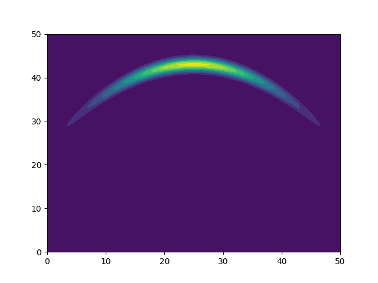
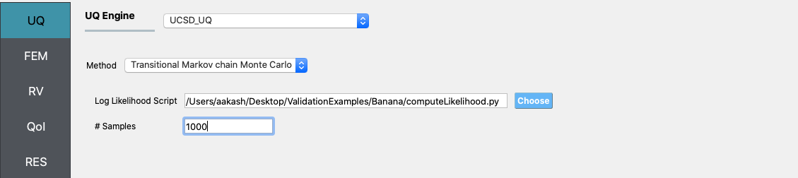
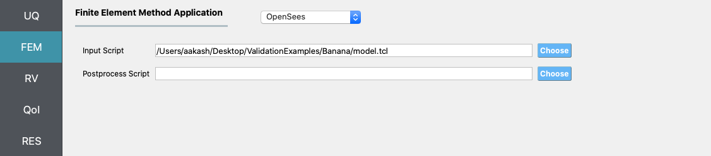
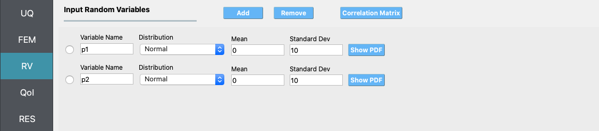
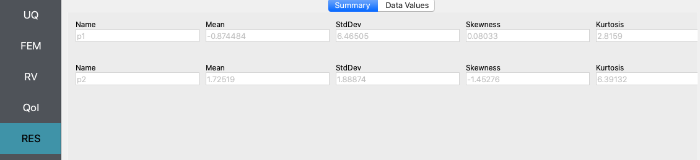
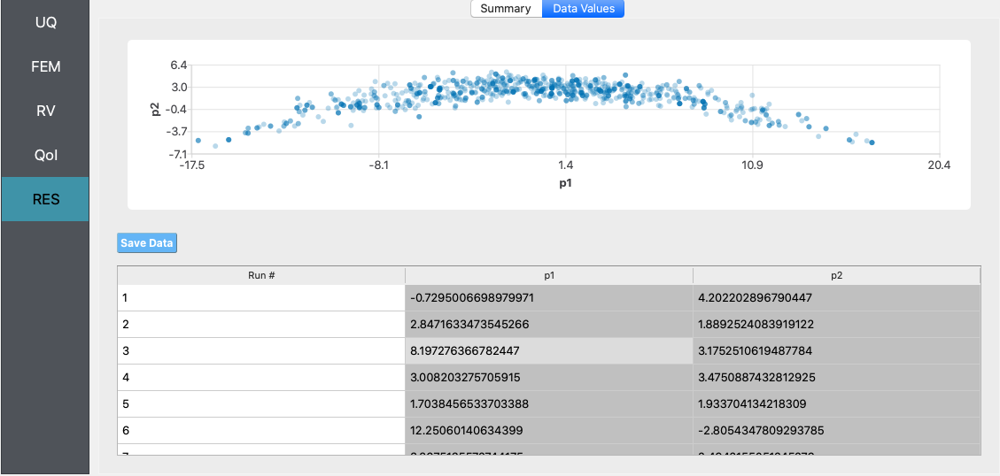
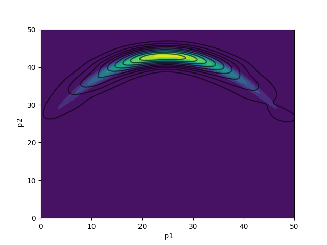
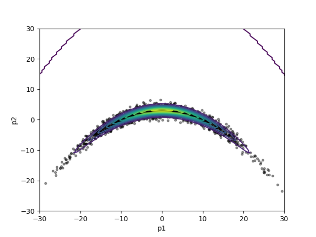
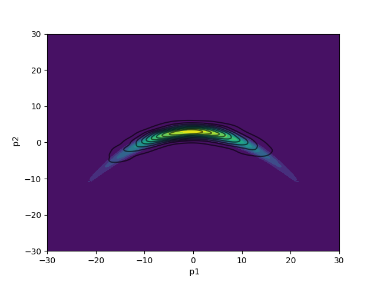
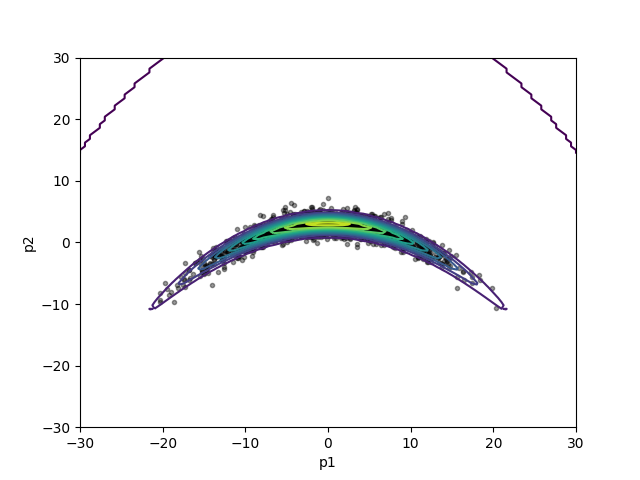

.. _lbl_Banana_MCMCVerification:

MCMC verification example 1
===========================

This is an example taken from [Haario1999]_ , and is widely used in literature to verify MCMC sampling methods, as an analytical solution to the problem is available. In the example presented, the target distribution from which samples need to be drawn is a non-linear 'banana shaped' distribution. This banana shaped distribution is constructed from a multivariate Gaussian distribution by twisting it as described next. 

Let :math:`f` be the density of the multivariate normal distribution :math:`N(0, C)`, where :math:`C` is the covariance matrix given by :math:`C = diag(100, 1)`. The density function of the 'twisted' Gaussian is given by:

.. math::
   f_b = f \circ \phi_b
   

where, the function :math:`\phi_b` is given by

.. math::
   \phi_b(x) = (x_1, x_2 + bx_1^2 - 100b)

Thus, the function :math:`\phi_b` only changes the second co-ordinate and the determinant of the Jacobian of :math:`\phi_b` is identically equal to 1. This makes it possible to calculate the probability regions for the twisted Gaussian target distribution. The nonlinearity of the function :math:`\phi_b` increases with the value of :math:`b`. In this example, a value of 0.03 is used for :math:`b`, which results in a moderately non-linear twisted Gaussian target distribution. This distribution is visualized in the Figure below. 

.. This figure is from [Zhang2019]_.

Files required
--------------
The exercise requires two script files - an OpenSees script file which writes the samples values to a file called ``results.out``, and a Python script file which post-processes the samples and computes the log-likelihood. The user should download these file and place it in a *new* folder. The post-processing script calculates the log-likelihood that the input values of the story stiffness produced the set of measurement data. 

1. ``model.tcl``

.. literalinclude:: src/model.tcl
   :language: tcl

.. .. note::
..    This tcl script creates a file called ``results.out`` when it runs. This file contains the first eigenvalue and the second component of the first eigenvector obtained from finite element analysis of the structure.
   

2. ``computeLoglikelihood.py``

.. literalinclude:: src/computeLoglikelihood.py
   :language: python

.. .. warning::
..
..    Do not place the files in your root, downloads, or desktop folder as when the application runs it will copy the contents on the directories and subdirectories containing these files multiple times. If you are like me, your root, Downloads or Documents folders contains and awful lot of files.
..

Solving the problem using the TMCMC algorithm in quoFEM
-------------------------------------------------------
The steps involved are as follows:

1. Start the application and the **UQ** panel will be highlighted. In the **UQ Engine** drop down menu, select the **UCSD_UQ** engine. In the **Method** category drop down menu the **Transitional Markov chain Monte Carlo** option will be highlighted. In the **Log Likelihood Script** field, enter the path to the script which computes the log-likelihood (i.e., the file called ``computeLoglikelihood.py`` in this example), or select **Choose** and navigate to the file. Enter the number of samples desired to be drawn from the posterior distribution in the **# Samples** field.

2. Next select the **FEM** panel from the input panel selection. This will default to the **OpenSees** FEM engine. In the **Input Script** field, enter the path to the ``model.tcl`` file or select **Choose** and navigate to the file. 

3. Next select the **RV** tab from the input panel. This panel should be pre-populated with two random variables named ``p1`` snd ``p2``. If not, press the **Add** button twice to create two fields to define the input random variables. Enter the same variable names (``p1`` and ``p2``), as required in the ``model.tcl`` script. 

For each variable, specify the prior probability distribution - from the **Distribution** drop down menu, select **Uniform** and then provide the lower bounds and upper bounds shown in the figure below. 

4. The **QoI** panel can be left blank for this example and for problems using the **UCSD_UQ** engine.

5. Next click on the **Run** button. This will cause the backend application to launch the **UCSD_UQ** engine, which performs Bayesian calibration using the TMCMC algorithm. When done the **RES** tab will be selected and the results will be displayed as shown in the figure below. The results show the first four moments of the posterior marginal probability distribution of ``p1`` and ``p2``.

If the user selects the **Data Values** tab in the results panel, they will be presented with both a graphical plot and a tabular listing of the data.

.. .. figure:: figures/MCMCExample-RES-DataValues1.png
..    :align: center
..    :figclass: align-center

Various views of the graphical display can be obtained by left and right clicking in the columns of the tabular data.

Pressing the **Save Data** button will allow the user to export the data shown in the spreadsheet as a **csv** file. This data is then used to obtain the following two plots which show a kernel density estimate of the posterior probability distribution obtained from the samples using the TMCMC algorithm, superposed on a contour plot of the target posterior probability distribution.

In this plot, a uniform prior probability distribution is used, with bounds from 0 to 50 for both the parameters.

.. .. figure:: figures/posteriorSamplesBananaUniformPrior.png
..    :align: center
..    :figclass: align-center
   

   

In this plot, a normal prior probability distribution is used with the mean vector being :math:`(0, 100)` and the covariance matrix being :math:`Diag(400, 400)`.

.. .. figure:: figures/posteriorSamplesBananaNormalPrior.png
..    :align: center
..    :figclass: align-center
   

..
..
.. If a singular column of the tabular data is pressed with both right and left buttons a histogram and CDF will be displayed, as shown in figure below.
..
.. .. figure:: figures/MCMCExample-RES-DataValues3.png
..    :align: center
..    :figclass: align-center
..
.. .. figure:: figures/MCMCExample-RES-DataValues4.png
..    :align: center
..    :figclass: align-center

.. [Haario1999] 
   H. Haario, E. Saksman, and J. Tamminen, “Adaptive proposal distribution for random walk Metropolis algorithm”, *Computational Statistics*, 14, 375-395, 1999.
   
.. [Zhang2019] 
   J. Zhang, and A. Taflanidis, “Accelerating MCMC via Kriging-based adaptive independent proposals and delayed rejection”, *Computational Methods in Applied Mechanics and Engineering*, 355, 1124-1147, 2019.
