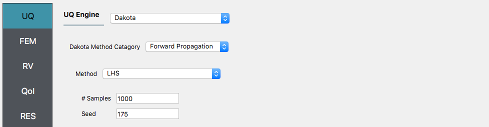
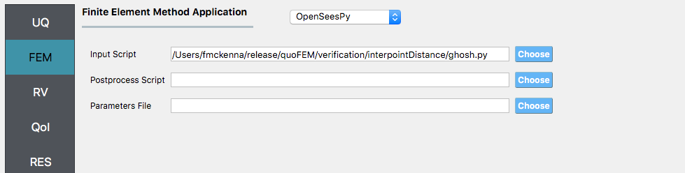
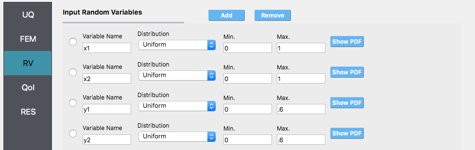
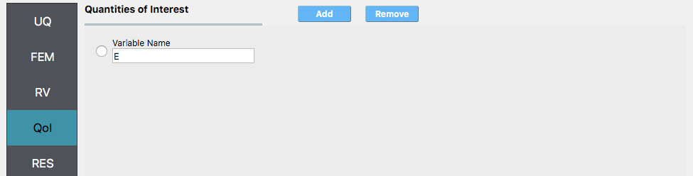

.. _lblInterpointDistVeri:

Interpoint Distances
====================

This is not a structural example, it is one used in the literature to verify sampling methods as a mathematical formula
exists for the solution. The example presented is computing the average distance between randomly chosen points
in a rectangular region. Such average distances come up in many settings. For cell phone companies, the probability that a distributed network is fully connected depends on average distances between communicating nodes. For city planners preparing for disasters, 
it could represent the average distances from dwellings to fire stations or from the dwellings to the epicenter of an earthquake.

The problem is defined as follows: Suppose two points :math:`P` and :math:`Q` are independent and considered uniformly distributed random points in a finite rectangle of dimension :math:`L_w` and :math:`L_h`. It has been `shown <http://www.math.utep.edu/Faculty/moschopoulos/Publications/1999-Random_Points_Associated_With_Rectangles.pdf>`_ that the expected average distance between these two points :math:`E(P,Q)` is given by the formula:

.. math::
   E(P,Q) = \frac{1}{15} \left( \frac{L_w^3}{L_h^2}+\frac{L_h^3}{L_w^2}+d\left(3-\frac{L_w^2}{L_h^2}-\frac{L_h^2}{L_w^2}\right)
   +\frac{5}{2} \left(\frac{L_h^2}{L_w}\log\right(\frac{L_w+d}{L_h}\left)+\frac{L_w^2}{L_h}\log\left(\frac{L_h+d}{L_w}\right)\right)\right)

where :math:`d=\sqrt{L_w^2+L_h^2}`
      
Using the above formula one can compute a number of expected distances for rectangles of different sizes, for example:

.. csv-table:: 
   :header: "Lw", "Lh", "E"
   :widths: 20, 20, 20

   1.0, 0.6, 0.4239
   2.0, 0.8, 0.7651
   10.0, 7.5, 4.5865
   10.0, 10.0, 7.7502

.. note:: The above table was computed using the following Matlab script, run repeatedly for different values of ``Lw`` and ``Lh``.

   .. literalinclude:: InterpointDistance.m
      :language: python

In the following steps we will demonstrate how this is done using the |app| with figures showing the inputs for case with ``Lw=1.0``, ``Lh= 0.6`` and utilizing **LHS** with 1000 samples. A table will provide additional results for other sampling methods and numbers of samples.

1.  Repeating this exercise in quoFEM requires using either the OpenSees or the OpenSeesPy Interpreter. Depending on your choice, create a *new* folder and in it place one of the following files, the first is a Python script to be named ``ghosh.py``. It is to be used with the OpenSeesPy FEM application.

.. literalinclude:: ghosh.py
   :language: python

The second a tcl script to be named ``ghosh.tcl``. It is to be used with the OpenSees FEM application.

.. literalinclude:: ghosh.tcl
   :language: tcl

2. Start the |app| and select Dakota UQ Engine, Forward propagation type of problem and LHS method. Specify ``10000`` samples and a seed of ``175``.

3. Select next the **FEM** tab. From this tab select either OpenSees or OpenSeesPy depending on which file you choose to place in the folder. For the input file specify the full path to this file.

4. Select the **RV** tab. Create four random variables named ``X1``, ``Y1``, ``X2``, ``Y2``. For each specify a uniform distribution with the range for the ``X`` variables being ``0`` and ``Lw`` and range of ``Y`` variables being ``0`` and ``Lh``. This is as shown for ``Lw = 1.0`` and ``Lh = 0.6``.

5. Select the **QoI** tab. Create one EDP and name it ``E`` as shown.

6. Press the Run button. The results should show the mean to be ``0.425709``.

.. figure:: figures/ghoshRES.png
   :align: center
   :figclass: align-center

   
These simulations can be performed for a number of the different sampling methods for a number of different number of samples.

.. csv-table:: 
   :header: "Method", "#Samples", "E(P,Q)", "Error"
   :widths: 20, 20, 20, 20

   MC, 100,  0.447626, 0.0560
   MC, 1000, 0.430936, 0.0166
   MC, 10000, 0.421910, 0.0047
   LHS, 100,  0.435349, 0.0270
   LHS, 1000, 0.425709, 0.0043
   LHS, 10000, 0.422350, 0.0037

