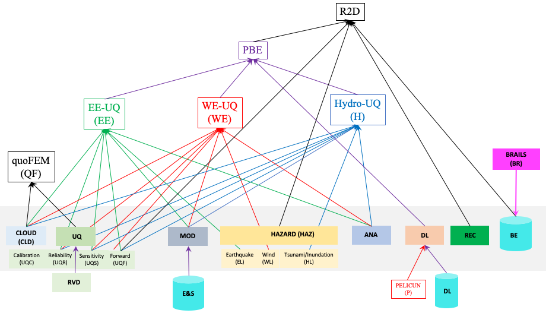

################################
Requirements Traceability Matrix
################################

++++++++++++
Introduction
++++++++++++

The SimCenter has relied on community input to drive application and educational activities. We track these inputs as requirements in our Requirements Traceability Matrix (RTM). This is a living document, which is updated at least yearly. In this document is listed the general requirements for each tool and for each tool there is also listed the requirements for each component that is used to build up the tool. The components are as shown in the figure below, for example EE-UQ has components of Cloud (CLD), Reliability (UQR), Sensitivity (UQS), Sampling (UQF), Modelling (MOD), Earthquake Loading (EL), and  Analysis (ANA).

.. _figRTM:

	Application & Component Abbreviations for RTM

Each requirement in the RTM has the following entry fields:

   #. A unique identifier, that is a combination of an abbreviation of tool or component name, plus one or more numbers; the sequence of numbers indicating a hierarchy in the requirements.

   #. A brief description of the requirement.

   #. A source for the requirement indicating were the requirement originated. That can be one of three:
      
      #. GC: Grand challenges in hazard engineering are the problems, barriers, and bottlenecks that hinder the ideal of a nation resilient from the effects of natural hazards. The vision documents referenced in the solicitation [XX,XX,XXX] outline the grand challenges for wind and earthquake hazards. These documents all present a list of research and educational advances needed that can contribute knowledge and innovation to overcome the grand challenges. The advances summarized in the vision documents were identified through specially formed committees and workshops comprising researchers and practicing engineers. They identified both the grand challenges faced and also identified what was needed to address these challenges. The software needs identified in these reports that are applicable to research in natural hazards as permitted under the NSF NHERI program were identified in these reports. Those tasks that the NHERI SimCenter identified as pertaining to aiding NHERI researchers perform their research and those which would aid practicing engineers utilize this research in their work are identified here.
	 
      #. SP: From the senior personnel on the SimCenter project. The vision documents outline general needs without going into the specifics. From these general needs the senior personnel on the project identified specific requirements that would provide basic functionality to allow research.
	 
      #. UF: SimCenter workshops, boot camps and direct user feedback. As the SimCenter develops and releases tools, feedback from researchers using these tools is obtained at the tool training workshops, programmer boot-camps, in one-on-one discussions, via direct email, and through online user feedback surveys. For the feedback related to what additional functionality to include, entries are added to the RTM. For other feedback, related to simple tasks related to operation of tool and UI, entries are placed in our Jira system.

   #. A designation determined by the management group indicating the importance of the requirement, which again has 3 possible values:
     #.	M - Mandatory: This requirement must be satisfied 
     #.	D - Desirable: It would be desirable to implement the functionality as it would aid research. If time and resources permit it should be.
     #.	P - Possible: Such an activity is possible within the SimCenter Framework. SimCenter could work to include it or work with NHERI researchers to do so.

  #. A column indicating whether the requirement has been implemented and available to users.

  #. A column indicating which examples are provided that can be used to test the features.

The software requirements are many. For ease of presentation they are broken into three groups: 1) Building Scale Applications, 2) Regional Scale Applications, and 3) Education and Outreach Activities.

+++++++++++++++++++++++++++
Building Scale Applications
+++++++++++++++++++++++++++

Applications to allow researchers to improve on methods related to determining on the response assessment and performance based design of individual buildings subject to the impact of a natural hazard. For building scale simulations, the requirements are broken down by SimCenter application. There are a number of applications under development for each of the hazards. Many of the requirements related to UQ and nonlinear analysis are repeated amongst the different applications under the assumption that if they are beneficial to engineers dealing with one hazard, they will be beneficial to engineers dealing with other hazards.

.. toctree-filt::
   :caption: Building Scale
   :maxdepth: 1
   :numbered: 4

   QUOFEM
   WE-UQ
   EE-UQ
   HydroUQ
   PBER

+++++++++++++++++++++++++++
Regional Scale Applications
+++++++++++++++++++++++++++

For regional scale, the requirements are broken down into four classes. AI related requirements in **BRAILS**, damage and loss prediction in **pelicun**, backend workflow requirements in **rWhale**, and front end user interface requirements in **R2D**.

.. toctree-filt::
   :caption: Regional Scale 
   :maxdepth: 1
   :numbered: 4

   R2D
   BRAILS
   pelicun
   testbeds

++++++++++++++++++++
Educational Software
++++++++++++++++++++

The following are educational activities obtained that are related to software development.

.. toctree-filt::
   :caption: Education
   :maxdepth: 1
   :numbered: 4

   edRequirements

++++++++++++++++
All Requirements
++++++++++++++++

.. toctree-filt::
   :caption: All Rquirements
   :maxdepth: 1
   :numbered: 4

   allRequirements

.. toctree::
   :caption: Gallery

   ../user_manual/examples/desktop/gallery

   
Contact
=======
Frank McKenna, NHERI SimCenter, UC Berkeley, fmckenna@berkeley.edu
