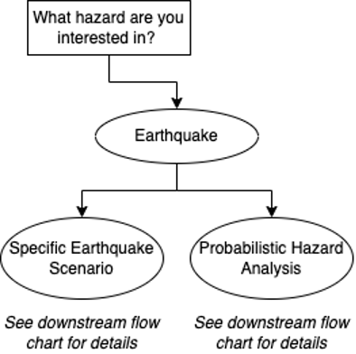
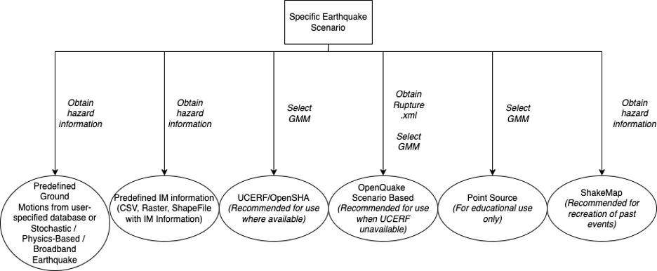
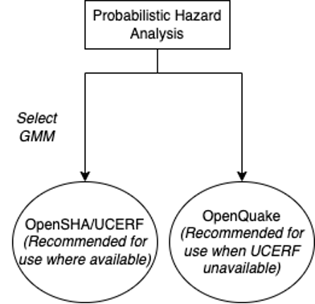

.. _lblEQSimulationUseCases:

Regional Earthquake Hazard Use Cases
====================================

The major use cases of Regional Earthquake Hazard in R2D can be divided
into Scenario-specific or Probabilistic Seismic Hazard Analysis.

.. _fig-R2DScenarioOrPSHA:

  Specific Earthquake Scenario or Probabilistic Hazard Analysis.

Scenario-specific Earthquake
----------------------------

This option is for analyzing an earthquake scenario that consists of one or more ruptures
based on the description of a past or hypothetical event. Some use cases
for this option are:
    #. Analysis of a single rupture. For example, running the "Hayward-Rodgers Creek; HN+HS" segment, which is a specific rupture location, length, characteristics, etc.
    #. Broader analysis of a scenario. For example, running "an M7 earthquake on the San Andreas Fault." This would include realizations with different ruptures, all describing an M7 on the San Andreas.
    #. Multiple specified ruptures. This would be used when a user already has a defined set of ruptures they are interested in studying. This option does not fully capture the probabilistic seismic hazard of a region.
    #. A past earthquake. For example, recreating the Loma Prieta earthquake.

:numref:`fig-R2DScenarioSpecificUseCases` shows typical scenario-specific use cases in R2D.
All the use cases in :numref:`fig-R2DScenarioSpecificUseCases` can be achieved with R2D. The first two options are loading predefined
ground motion records or intensity measures in the region and are described in
:ref:`User-specified Ground Motions <lbl-UserSpecifiedGroundMotions>`. The functionality to
interface with some physics-based earthquake simulation databases is also under development in R2D.
The third to fifth use cases in :numref:`fig-R2DScenarioSpecificUseCases` require
the :ref:`earthquake hazard simulation tool <ground_motion_tool>`, and the last option
can be achieved as described in :ref:`ShakeMap Earthquake Scenarios <lbl-shakeMapEQScenarios>`.

The functions in the earthquake hazard simulation tool required for 
scenario-specific use cases are Site Definition,
Earthquake Rupture Forecasting, Intensity Measure Definition, Ground Motion Prediction
Equations, Spatial Correlations, and Ground Motion Record Selection (optional).
The "Scenario-specific" option should be selected in the "Scenario Selection" tool tab.
More details of the use cases, required inputs, and some benefits/limitations are
summarized in :numref:`tab-R2DScenarioSpecificUseCases`.

.. _fig-R2DScenarioSpecificUseCases:

  Scenario-specific earthquake hazard use cases.

.. _tab-R2DScenarioSpecificUseCases:

.. list-table:: Typical Scenario-specific Earthquake Hazard Use Cases
   :widths: 25 60 60 60
   :header-rows: 1

   * - Use Case
     - Recommended Uses
     - Required Inputs
     - Benefits/Limitations
   * - Predefined GM
     - User already has ground motion time histories they are interested in.
     - Describe any specific file type/folder structure required.
     -
   * - Predefined IM
     - User already has an IM field they are interested in. GM selection can be done.
     - Describe any specific file type/folder structure required.
     -
   * - OpenSHA/UCERF
     - Recommended where UCERF ruptures are available (maybe we can show a map). Recommended because it requires no additional inputs other than selections using the R2D interface (source models are openly available).
     - No external files are required, and all selections can be done in R2D.
     - Users can select from several choices of GMM and correlation models through the R2D interface. Limited in that it only has information about ruptures in certain locations.
   * - OpenQuake
     - Recommended to describe distributed and background seismicity. Also recommended for use where rupture information is unavailable through UCERF.
     - External source model file required. The format of source models can be found :ref:`here <lbl-ERFOpenquake>`, and a database of global earthquake sources can be found at the `GEM's Global Active Faults Database <https://github.com/GEMScienceTools/gem-global-active-faults>`_ [Styron2020]_
     - Can be used to describe distributed and background seismicity where information on the faults is unavailable.
   * - Point Source
     - For educational and/or academic use only. The point source option does not accurately reflect real faults.
     - No external files are required, and all selections can be done in R2D.
     - Not representative of real faults/scenarios.
   * - ShakeMap
     - Re-creation of a past earthquake event by obtaining seismic intensity measures sufficiently representative of the event.
     - Inputs are USGS ShakeMap files for a given earthquake scenario. These files must be located in a folder with at least a grid.xml file. The files contain ShakeMaps that include the intensity measures for a given earthquake event as spectral ordinate values (These can be given as PGA, PGV, PGD, and spectral ordinates at different periods). These files can be obtained from `USGS's ShakeMap archives <https://earthquake.usgs.gov/earthquakes/search/>`_ for real past earthquake events.
     - ShakeMap intensity measures (as spectral ordinates) for past earthquakes might not be an accurate representation of the event in locations far from the grid control points (usually recording stations where GMM predictions are adjusted to match real recorded ground motion spectra). Moreover, the set of scenarios is limited.

Regional Probabilistic Seismic Hazard Analysis
----------------------------------------------

The regional probabilistic seismic hazard analysis (PSHA) characterizes the probability
that certain levels of intensity are exceeded in a region considering all nearby
earthquake sources.
:numref:`fig-R2DRegionalPSHAUseCases` shows two typical use cases in regional PSHA.
Both use cases can be achieved in R2D with the :ref:`earthquake hazard simulation tool <ground_motion_tool>`.
The functions in the earthquake hazard simulation tool required for 
regional PSHA are Site Definition,
Earthquake Rupture Forecasting, Intensity Measure Definition, Ground Motion Prediction
Equations, Spatial Correlations, Ground Motion Record Selection (optional), and hazard consistent
downsampling (optional). The "Conventional Monte Carlo" or "Hazard consistent downsampling" option
should be selected in the "Scenario Selection" tool tab. More details of the use cases,
required inputs, and some benefits/limitations are summarized in :numref:`tab-R2DRegionalPSHAUseCases`.

.. _fig-R2DRegionalPSHAUseCases:

  Regional probabilistic seismic hazard analysis use cases.

.. _tab-R2DRegionalPSHAUseCases:

.. list-table:: Typical Regional Probabilistic Seismic Hazard Analysis Use Cases
   :widths: 25 60 60 60
   :header-rows: 1

   * - Use Case
     - Recommended Uses
     - Required Inputs
     - Benefits/Limitations
   * - OpenSHA/UCERF
     - Recommended where UCERF ruptures are available (maybe we can show a map). Recommended because it requires no additional inputs other than selections using the R2D interface (source models are openly available).
     - No external files are required, and all selections can be done in R2D.
     - Only available for California.
   * - OpenQuake
     - Recommended for use where UCERF ruptures are unavailable.
     - External files required. The format of source models can be found :ref:`here <lbl-ERFOpenquake>`, and a database of global earthquake sources can be found at the `GEM's Global Active Faults Database <https://github.com/GEMScienceTools/gem-global-active-faults>`_ [Styron2020]_
     - Users need to prepare their earthquake source model.

.. [Styron2020]
   Styron, R., & Pagani, M. (2020). The GEM global active faults database. Earthquake Spectra, 36(1_suppl), 160-180.
