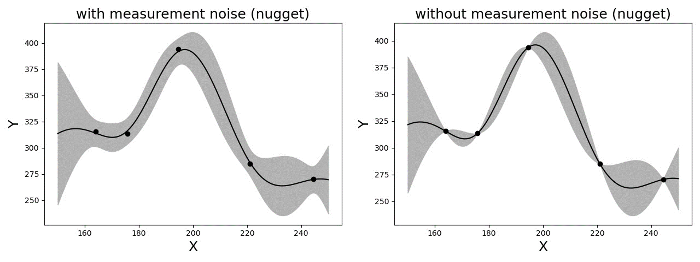

Methods in SimCenterUQ Engine 
*****************************

Nataf transformation
====================

Nataf transformation is introduced to standardize the interface between UQ methods and Simulation models. Nataf converts the samples in the physical space (X-space) into the standard normal samples (U-space), :math:`T:\rm{X} \rightarrow \rm{U}`, and vice versa, during UQ computations [Liu1986]_. Specifically, the latter transformation, called inverse Nataf :math:`T^{-1}`, is performed each time when UQ engine generates sample points and calls external workflow applications, so that the main UQ algorithms would face only the standard normal random variables. Among various standardization transformations, Nataf is one of the most popular methods which exploits **marginal distributions** of each physical variables and their **correlation coefficients**.

.. _figNataf1:

.. figure:: figures/SimCenterNataf1.png
   :align: center
   :figclass: align-center
   :width: 600

   Standardization of random variables using Nataf transformation

.. Note ::
(Ongoing implementation) All the custom UQ algorithm need to prepare for the standard Gaussian input while quoFEM intertwines with the simulation model to receive standard normal input u and gives physical y=G(u) back.

For the Nataf trasformation, the SimCenterUQ engine borrows a part of the distribution class structure developed by ERA group in the Technical University of Munich [ERA2019]_ 

.. [Liu1986]
   Liu, P.L. and Der Kiureghian, A. (1986). Multivariate distribution models with prescribed marginals and covariances. *Probabilistic Engineering Mechanics*, 1(2), 105-112.

.. [ERA2019]
   Engineering Risk Analysis Group, Technische Universität München: https://www.bgu.tum.de/era/software/eradist/ (Matlab, python programs and documentations)

Global sensitivity analysis
===========================

Variance-based global sensitivity indices
-----------------------------------
Global sensitivity analysis (GSA) is performed to quantify the contribution of each input variable to the uncertainty in QoI. Using the global sensitivity indices, users can set preferences between random variables considering both inherent randomness and its propagation through the model. GSA helps users to understand the overall impact of different sources of uncertainties, as well as to accelerate UQ computations by focusing on dominant dimensions or screening out trivial input variables.

.. _figSensitivity1:

.. figure:: figures/SimCenterSensitivity1.png
   :align: center
   :figclass: align-center
   :width: 600

   Concept of global sensitivity analysis
	
	
Sobol indices are widely used variance-based global sensitivity measures. It has two types: main effect and total effect sensitivity indices. The **main effect index** finds the fraction of variance in QoI that can be attributed to specific input random variable(s) but without considering interactive effect with other input variables. The **total effect index**, on the other hand, additionally takes the interactions into account.

Given the output of model :math:`y=g(\boldsymbol{x})` and input random variables :math:`\boldsymbol{x}=\{x_1,x_2, \cdots ,x_d\}`, the first-order main and total effect indices of each input variable is defined as

.. math::
	:label: Si
	
	S_i=\frac{\text{Var}_{x_i}[\text{E}_{\boldsymbol{x}_{\sim i}}[y|x_i]]}{\text{Var}[y]}, \qquad i=1, \cdots ,d
	
   
.. math::
	:label: SiT

	S_i^T=\frac{\text{E}_{\boldsymbol{x}_{\sim i}}[\text{Var}_{x_i}[y|\boldsymbol{x}_{\sim i}]]}{\text{Var}[y]},  \qquad  i=1, \cdots ,d

respectively, where :math:`\boldsymbol{x}_{\sim i}` indicates the set of all input variables except :math:`x_i`. It is noteworthy that in both equations, the variance operator :math:`\text{Var}_{x_i}[\cdot]` captures only the part of uncertainty associated with :math:`x_i`, while the mean operator :math:`\text{E}_{\boldsymbol{x}_{\sim i}}[\cdot]` averages out all remaining uncertainties. From the definitions, two indices theoretically have values between zero and one. Eq. :eq:`Si` can also be understood intuitively. For example, if the QoI is insensitive to :math:`x_i`, the term inside :math:`\text{Var}_{x_i}[\cdot]` is nearly constant and :math:`S_i` approaches zero. On the other hand, when one single variable :math:`x_i` dominates QoI, inside :math:`\text{Var}_{x_i}[\cdot]` is approximately the same as :math:`y`, and thus :math:`S_i` approaches one. Eq. :eq:`SiT` can be understood in similar ways. The second-order main effect index that provides the pair-wise interaction effect is defined as

.. math::
	:label: Sij

	S_{ij}=\frac{\text{Var}_{x_i,x_j}[\text{E}_{\boldsymbol{x}\sim ij}[y|x_i,x_j]]}{\text{Var}[y]} - S_i - S_j,  \qquad  i,j=1, \cdots ,d
	
where :math:`\boldsymbol{x}_{\sim ij}` indicates the set of all input variables except :math:`x_i` and :math:`x_j`. The higher-order indices are derived likewise. Theoretically, When all the input variables are uncorrelated to each other, the following equality holds.

.. math::

	\sum^d_{i=1} S_i + \sum^d_{i<j} S_{ij} + \cdots + S_{12 \cdots d} = 1 

Estimation of Sobol indices
----------------------------

GSA is typically computationally expensive. High computation cost attributes to the multiple integrations (:math:`d`-dimensional) associated with the variance and expectation operations shown in Eqs. :eq:`Si` and :eq:`SiT`. To reduce the computational cost, efficient Monte Carlo methods, stochastic expansion methods, or meta model-based methods can be employed. Among different approaches, the SimCenterUQ engine supports the probability model-based GSA (PM-GSA) framework developed by [Hu2019]_. 

The framework first conducts ordinary MCS to obtain input-output data pairs. Then by extracting only a subset dimension of the dataset, the probability distribution of a reduced dimension can be approximated and used for estimating the Sobol index. Among different probability distribution models introduced in [Hu2019]_  the Gaussian mixture model is implemented in this engine to approximate this lower dimension distribution. For example, to identify 1st order main Sobol index for a variable :math:`x_i`, a bivariate Gaussian mixture model is fitted for the joint probability distribution of :math:`x_i` and :math:`y`, i.e.

.. math::
	:label: GM

	f_{x_i,y}(x_i,y) \simeq f_{x_i,y}^{GM} (x_i,y)
	

using expectation-maximization (EM) algorithm. The mean operation Eq. :eq:`Si` is then derived analytically from the Gaussian mixture model, while variance is approximated to be the sample variance. Therefore, the accuracy of the method depends on the quality of the base samples as well as the fitness of the mixture model. The below figure summarizes the procedure of Gaussian mixture model-based PM-GSA introduced in [Hu2019]_. The number of mixture components is optimized along with the mixture parameters during expectation-maximization iterations. 

.. _figSensitivity2:

.. figure:: figures/SimCenterSensitivity2.png
	:align: center
	:figclass: align-center
	:width: 600

  	Data-driven global sensitivity analysis by Hu and Mahadevan (2019)

.. [Hu2019]
   Hu, Z. and Mahadevan, S. (2019). Probability models for data-driven global sensitivity analysis. *Reliability Engineering & System Safety*, 187, 40-57.

Global surrogate modeling 
============================

Introduction to Gaussian process regression (Kriging)
--------------------------------------------------------

Global surrogate modeling aims to build a regression model that reproduces the outcomes of computationally expensive high fidelity simulations. 

.. math::
	:label: GP

	\boldsymbol{y}=f^{\rm{ex}} (\boldsymbol{x}) \simeq f^{\rm{sur}} (\boldsymbol{x})  

where the basic assumption is that function evaluation speed of :math:`f^{\rm{sur}}(\boldsymbol{x})` is incomparably faster than :math:`f^{\rm{ex}}(\boldsymbol{x})`. To perform surrogate modeling, we first need to acquire data samples, :math:`(\boldsymbol{x},\boldsymbol{y})`, of exact model based on few rounds of model evaluations, and then the function is interpolated and extrapolated based on the data set. Among various surrogate techniques, Kriging approximates the response surface using a Gaussian process model. Specifically, Kriging surrogate model has the following form: 

.. math::
	:label: GPsurr

	f^{\rm{sur}} (\boldsymbol{x}) = \tilde{f}(\boldsymbol{x})^T\boldsymbol{\beta}+z(\boldsymbol{x})

where the term :math:`\tilde{f}(\boldsymbol{x})^T\boldsymbol{\beta}` captures the deterministic global trend via basis functions and linear combination coefficients :math:`\boldsymbol{\beta}`. The second term :math:`z(\boldsymbol{x})` represents the residual and is modeled as a centered second-order stationary Gaussian process. The assumption is that the true residual value is one of the realizations of the random process:

.. math::
	:label: GPresidual

	z(\boldsymbol{x}) \sim GP (\boldsymbol{x};0,K(\boldsymbol{x_i},\boldsymbol{x_j}))

Therefore the main tasks of surrogate modeling is (1) to find optimal stochastic parameters :math:`\hat{\boldsymbol{\beta}}` and :math:`\hat{K}(x_i,x_j)` that best match the observations, and (2) to predict the response at an arbitrary sample point :math:`\boldsymbol{x^*}` as a conditional distribution of :math:`f(\boldsymbol{y^*}|\boldsymbol{y^{obs}})`, exploiting the fact that 
:math:`\boldsymbol{y^*}` and :math:`\boldsymbol{y^{obs}}` are joint Gaussian distribution with known mean and covariances.

.. _figSensitivity2_2:

.. figure:: figures/SimCenterSurrogate.png
	:align: center
	:figclass: align-center
	:width: 600

  	Surrogate model for UQ/Optimization

* **Dealing with noisy measurements**

  | In natural hazard applications, often the exact observations of :math:`\boldsymbol{y}` are not available and only the noisy observations :math:`\boldsymbol{y^{obs}}` are available:

	.. math::
		:label: GP

			\boldsymbol{y^{obs}}=\boldsymbol{y} + \boldsymbol{\varepsilon} =f^{\rm{ex}} (\boldsymbol{x}) + \boldsymbol{\varepsilon}

  | where a common assumption is that the measurement noise, :math:`\boldsymbol{\varepsilon}`, follows a white Gaussian distribution (i.e. :math:`\varepsilon` is unbiased, follows a normal distribution with variance :math:`\tau`, and is independent of other observation noises). Additionally since the noise level is often unknown, :math:`\tau` is also calibrated along with :math:`\beta` and :math:`K(x_i,x_j)`. In such settings, surrogate model estimation will not interpolate the observation outputs :math:`\boldsymbol{y^{obs}}`, but instead make a regression curve passing through the optimal estimation of the true underlying outputs :math:`\boldsymbol{y}`. Additional to the measurement noise, a mild amount of inherent uncertainty in the simulation model (mild compared to a global trend) can be accounted for in terms of the same noise parameter :math:`\varepsilon`.

* **Nugget effect: artificial noise for numerical stability**

	| The constructed Kriging surrogate model is always smooth and continuous as it is a realization of a Gaussian process, while the actual response may be non-smooth, discontinuous, or highly variant that goes beyond the flexibility of the surrogate model. Especially when the measurements are noiseless, the Gaussian process training can suffer from numerical instability. In such ill-posed problems, the introduction of a small amount of artificial noise, often referred to as *nugget*, may significantly improve the algorithmic stability. In the quoFEM, the nugget parameter is automatically optimized in the loop along with the other parameters. (Note: technically, nugget effect and measurement noise do not coincide in the mathematical formulation as the nugget effect conserves the *interpolating* property while measurement noise does not [Roustant2012]_. However, this program treats the nugget as an artificial noise as their outcomes are often practically indistinguishable.)

.. _figGP1_2:

  	Gaussian process regression with and without measurement noise ( or nugget effect)

Construction of surrogate model
---------------------------------

Input-Output settings
^^^^^^^^^^^^^^^^^^^^^

+-----------+----------------------------------------------------------+-------------------------------------------+
|           | Input (RV) type                                          |  Output (QoI) type                        |
+===========+==========================================================+===========================================+
| **Case1** | Adaptive Design of Experiments (DoE) :                   | Simulator :                               |
|           |                                                          |                                           |
|           | a bounded variable space of :math:`\boldsymbol{x}`       | :math:`\boldsymbol{y}=f(\boldsymbol{x})`  |
+-----------+------------------------------------------+---------------+-------------------------------------------+
| **Case2** | Data set :                                               | Simulator :                               |
|           |                                                          |                                           |
|           | {:math:`\boldsymbol{x_1,x_2, ... ,x_N}`}                 | :math:`\boldsymbol{y}=f(\boldsymbol{x})`  |
+-----------+----------------------------------------------------------+-------------------------------------------+
| **Case3** | Data set :                                               | Data set :                                |
|           |                                                          |                                           |
|           | {:math:`\boldsymbol{x_1,x_2, ... ,x_N}`}                 | {:math:`\boldsymbol{y_1,y_2, ... ,y_N}`}  |
+-----------+----------------------------------------------------------+-------------------------------------------+

User have the following options:

* **Case1** : users can provide a range of input variables (bounds) and a simulation model. After initial space-filling phase using Latin hypercube sampling (LHS), **adaptive design of experiment (DoE)** is activated. Given current predictions, the next optimal simulation point is optimized such that expected gain is maximized. 
* **Case2** : users can provide pairs of input-output dataset
* **Case3** : users can provide input data points and a simulation model

Kernel and basis functions
^^^^^^^^^^^^^^^^^^^^^^^^^^^
The covariance kernel of the outcome process is unknown in most practical applications. Therefore, the mathematical form of the kernel is first assumed, and its parameters are calibrated based on the observation data. Followings are some of the popular stationary covariance kernels. 

* **Radial-basis function (RBF)**

  | Radial-basis function, also known as squared-exponential or Gaussian kernel, is one of the most widely used covariance kernel. 

	.. math::
		:label: RBD

		k(\boldsymbol{x_i},\boldsymbol{x_j}) = \sigma\prod_{d=1}^{D} \exp\Bigg(-\frac{1}{2} \frac{(x_{i,d}-x_{j,d})^2}{l_d^2}\Bigg)

	
  | where :math:`\boldsymbol{x_i}` and :math:`\boldsymbol{x_j}` are two arbitrary points in the domain and the hyper parameters, :math:`D` is number of the input variables. The parameters :math:`\sigma` and :math:`l_d` respectively control the error scale and correlation length of the process. 

.. _figGP2:

.. figure:: figures/GPtmp.png
	:align: center
	:figclass: align-center
	:width: 600

  	Gaussian process regression for different correlation length parameters

* **Exponential**

  | Similarly, exponential covariance function is defined as follows.

	.. math::
		:label: exponential

		k(\boldsymbol{x_i},\boldsymbol{x_j}) = \sigma\prod_{d=1}^{D} \exp\Bigg(-\frac{1}{2} \frac{|x_{i,d}-x_{j,d}|}{l_d}\Bigg)

* **Matern Class** 

  | Matern class of covariance function is another popular choice. It has a positive shape  parameter often denotoed as :math:`\nu` which additionally determines the roughness of the parameters. For Kriging regression, :math:`\nu=5/2` and :math:`\nu=3/2` is known to be generally applicable choices considering roughness property and the simplicity of the functional form. [Rasmussen2006]_

	.. math::
		:label: Matern1

		k(\boldsymbol{x_i},\boldsymbol{x_j}) = \sigma\prod_{d=1}^{D} g_d(h_{d})

  | where :math:`h_d = x_{i,d}-x_{j,d}` and

	.. math::
		:label: Matern2

		g_{d,\frac{5}{2}}(h_d) &= \Bigg(1+ \frac{\sqrt{5}|h_d|}{l_d}+\frac{5h_d^2}{3l_d^2}\Bigg)\exp\Bigg(-\frac{\sqrt{5}|h_d|}{l_d}\Bigg)     \\
		g_{d,\frac{3}{2}}(h_d) &= \Bigg(1+ \frac{\sqrt{3}|h_d|}{l_d}\Bigg)\exp\Bigg(-\frac{\sqrt{3}|h_d|}{l_d}\Bigg)

  | respectively for :math:`\nu=5/2` (smoother) and :math:`\nu=3/2` (rougher). It is noted in the literature that if :math:`\nu` is greater than :math:`5/2`, the Matern kernel behaves similar to the radial-basis function. 

Once the kernel form is selected, the parameters are calibrated to maximize the likelihood of observations within the Gaussian process model. The default optimization function embedded in GPy is limited-memory BFGS with bound constraints (L-BFGS-B) algorithm from `Python/Numpy <https://docs.scipy.org/doc/scipy/reference/optimize.minimize-lbfgsb.html>`_ package. [ShaffieldML2012]_

Adaptive Design of Experiments (DoE)
-------------------------------------

In the case where bounds of input variables and a simulator model is provided (Case 1), model evaluation points can be selected by space-filling methods, e.g. Latin hyper cube sampling (LHS). This is non-adaptive Design of Experiments (DoE) in a sense that the whole samples can be located before running any simulations. On the other hand, the number of model evaluations can be reduced by selecting evaluation points *adaptively* after each run to get the best model improvements. 

.. _figGP_DoE1:

.. figure:: figures/GPtmp1.png
	:align: center
	:figclass: align-center
	:width: 600

  	Two optimizations in design of experiments

However, as shown in the figure, adaptive DoE requires multiple optimization turns to find the optimal surrogate model parameters as well as the next optimal DoE. Therefore, it is noted that the adaptive DoE is efficient only when model evaluation time is significantly greater than the optimization time. 

**Adaptive DoE algorithm: IMSEw, MMSEw [Kyprioti2020]_**

The optimal design points can be selected by finding arguments that maximize (or minimize) the so-called score function. The score function in global surrogate modeling is often designed to predict the amount of reduced (or remaining) variance and bias after adding the new sample points. While there are many variations of the score function [Fuhg2020]_, in quoFEM, the modified integrated mean squared error (IMSE) from Kyprioti *et al.* (2020) is introduced as:

.. math::
	:label: IMSE

	\begin{align*}
		\rm{IMSE}_w(\boldsymbol{X},\boldsymbol{x_{new}}) &= \int_{\boldsymbol{X_d}} \phi^\rho\boldsymbol{\sigma_n}^2(\boldsymbol{x}|\boldsymbol{X,x_{new}})dx
	\end{align*}

where :math:`\phi` is bias measure from leave-one-out cross validation (LOOCV) analysis, :math:`\rho` is a weighting coefficient, and :math:`\boldsymbol{\sigma_n}^2(\boldsymbol{x}|\boldsymbol{X,x_{new}})` is the predictive variance after additional observation :math:`x_{new}` [Kyprioti2020]_. To find the sample location that gives minimum IMSE value, two step screening-clustering algorithm is implemented.

.. _figGP_DoE2:

.. figure:: figures/GPtmp2.png
	:align: center
	:figclass: align-center
	:width: 600

  	Adaptive DoE procedure by Kyprioti et al. (2020) [Kyprioti2020]_

**Adaptive DoE algorithm: Pareto**

Alternatively, multiple design points can be selected by multi-objective optimization scheme. The variance mesure and bias measure defined by

.. math::
	:label: Pareto

	\begin{align*}
		\rm{IMSE}_w(\boldsymbol{X},\boldsymbol{x_{new}}) &= \int_{\boldsymbol{X_d}} \phi^\rho\boldsymbol{\sigma_n}^2(\boldsymbol{x}|\boldsymbol{X,x_{new}})dx
	\end{align*}

Adaptive DoE is terminated when one of the three conditions is met:

* **Time**: analysis time exceeds a predefined (rough) time constraint
* **Count**: number of model evaluation exceeds a predefined count constraint 
* **Accuracy**: accuracy measure of the model meets a predefined convergence level

Verification of surrogate model
-------------------------------

Once the training is completed, the following three verification measures are presented based on leave-one-out cross-validation (LOOCV) error estimation.

* **Leave-one-out cross-validation (LOOCV)**

  | LOOCV prediction :math:`\hat{\boldsymbol{y}}_k` at each sample location :math:`\boldsymbol{x}_k` is obatined by the following procedure: A temporary surrogate model :math:`\hat{\boldsymbol{y}}=f^{sur}_{loo,k}(\boldsymbol{\boldsymbol{x}})` is constructed using the samples :math:`\{\boldsymbol{x}_1,\boldsymbol{x}_2,...,\boldsymbol{x}_{k-1},\boldsymbol{x}_{k+1},...,\boldsymbol{x}_N\}` and the calibrated parameters, and the prediction :math:`\hat{\boldsymbol{y}}_k=f^{sur}_{loo,k}(\boldsymbol{x}_k)` is compared with the exact outcome :math:`y_k=f(\boldsymbol{x}_k)`.

* **R2 error**

  | R2 error is defined in terms of the total sum of squares over the residual sum of squares

	.. math::
		:label: R2

		\begin{align*}
			R^2 &= 1 - \frac{\sum^N_{k=1} (\hat{y}_k-\mu_\hat{y})^2}{\sum^N_{k=1} (\hat{y}_k-y_k)^2}
		\end{align*}	

  | The surrogate model is considered well-trained when the **R2 (<1) approaches 1**
 

* **Normalized root-mean-squared-error (NRMSE)**

	.. math::
		:label: NRMSE

		\begin{align*}
			\rm{NRMSE} ~ &= \frac{\sqrt{\frac{1}{N_t} \sum^{N_t}_{k=1} (y_k-\hat{y}_k)^2}}{\max_{k=1,...,N_t}(y_k)-\min_{k=1,...,N_t}(y_k)}
		\end{align*}	

  | The surrogate model is considered well-trained when the **NRMSE (>0) approaches 0**

* **Correlation coefficient**

  | Correlation coefficient is a statistic that measures linear correlation between two variables

  .. math::
    :label: corr

      \rho_{y,\hat{y}} = \frac{\sum^N_{k=1}(y_k-\mu_{y})(\hat{y}_k-\mu_{\hat{y}})} {\sigma_y \sigma_\hat{y}}

  |   where 
  |      :math:`\mu_{y}` : mean of :math:`\{y_k\}`
  |      :math:`\mu_{\hat{y}}`: mean of :math:`\{\hat{y}_k\}`
  |      :math:`\sigma_{y}`: standard deviation of :math:`\{y_k\}`
  |      :math:`\sigma_{\hat{y}}`: standard deviation of :math:`\{\hat{y}_k\}`

  | The surrogate model is considered well-trained when the **correlation coefficient (** :math:`-1<\rho<1` **) approaches 1**

.. Note:: 

	Since these measures are calculated from the cross-validation predictions rather than external validation predictions, they can be biased, particularly when a **highly localized nonlinear range exists in the actual response surface** and those regions are not covered by the training samples. 

.. [Rasmussen2006]
	Rasmussen, C.E. and Williams, C.K. (2006). *Gaussian Process for Machine Learning*. Cambridge, MA: The MIT Press, 2006 (available on-line at http://www.gaussianprocess.org/gpml/)

.. [Kyprioti2020]
   	Kyprioti, A.P., Zhang, J., and Taflanidis, A.A. (2020). Adaptive design of experiments for global Kriging metamodeling through cross-validation information. *Structural and Multidisciplinary Optimization*, 1-23.
.. [ShaffieldML2012]
   	GPy, A Gaussian process framework in python, http://github.com/SheffieldML/GPy, since 2012
.. [Sacks1989]
	Sacks J.,Welch W.J.,Mitchell T.J.,Wynn H.P. (1989). Design and analysis of
	computer experiments. *Stat Sci* 4(4):409–435
.. [Fuhg2020]
	Fuhg, J.N., Fau, A., and Nackenhorst, U. (2020). State-of-the-art and comparative review of adaptive sampling methods for kriging. *Archives of Computational Methods in Engineering*, 1-59.
.. [Roustant2012]
	Roustant, O., Ginsbourger, D., and Deville, Y. (2012). DiceKriging, DiceOptim: Two R packages for the analysis of computer experiments by kriging-based metamodeling and optimization. *Journal of Statistical Software*, 21:1–55, 2012