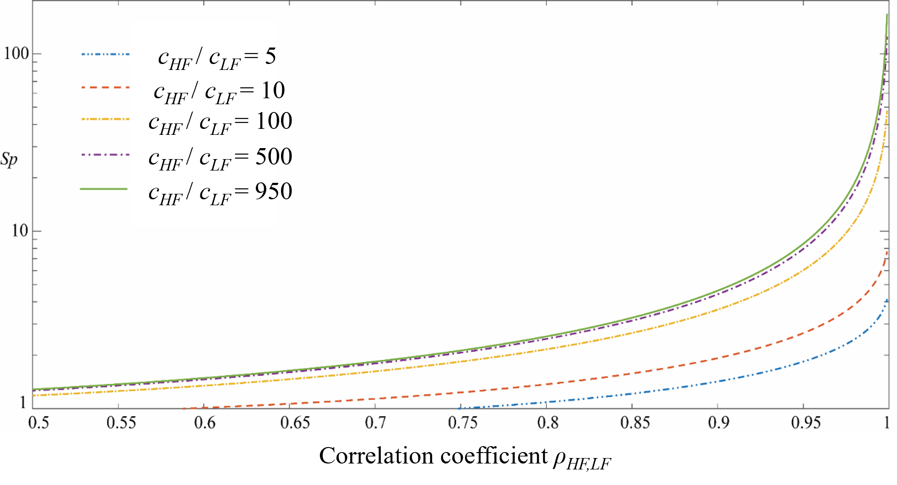

.. _lbluqSimTechnical:

Methods in SimCenterUQ Engine 
*****************************

.. _lbluqSimTechnical_Nataf:

Nataf transformation
====================

Nataf transformation is introduced to standardize the interface between UQ methods and Simulation models. Nataf converts the samples in the physical space (X-space) into the standard normal samples (U-space), :math:`T:\rm{X} \rightarrow \rm{U}`, and vice versa, during UQ computations [Liu1986]_. Specifically, the latter transformation, called inverse Nataf :math:`T^{-1}`, is performed each time when UQ engine generates sample points and calls external workflow applications, so that the main UQ algorithms would face only the standard normal random variables. Among various standardization transformations, Nataf is one of the most popular methods which exploits **marginal distributions** of each physical variables and their **correlation coefficients**.

.. _figNataf1:

.. figure:: figures/UQ/SimCenterNataf1.png
   :align: center
   :figclass: align-center
   :width: 600

   Standardization of random variables using Nataf transformation

.. Note ::
(Ongoing implementation) All the custom UQ algorithms need to prepare for the standard Gaussian input while quoFEM intertwines with the simulation model to receive standard normal input u and gives physical :math:`y=G(u)` back.

For the Nataf transformation, the SimCenterUQ engine borrows a part of the distribution class structure developed by ERA group in the Technical University of Munich [ERA2019]_ 

.. [Liu1986]
   Liu, P.L. and Der Kiureghian, A. (1986). Multivariate distribution models with prescribed marginals and covariances. *Probabilistic Engineering Mechanics*, 1(2), 105-112.

.. [ERA2019]
   Engineering Risk Analysis Group, Technische Universität München: https://www.bgu.tum.de/era/software/eradist/ (Matlab, python programs and documentations)

.. _lbluqSimTechnical_Sensitivity:

Global sensitivity analysis
===========================

Video Resources 
------------------
Global Sensitivity Analysis: why, what, and how.

.. raw:: html

   

      <iframe src="https://www.youtube.com/embed/JC8xN5LAo84?start=134" width="560" height="315" frameborder="5" allowfullscreen="allowfullscreen"></iframe>
   

 
.. raw:: html

   
 Click to replay the video from <a href="javascript:window.location.reload(true);">2:14</a>. 

Variance-based global sensitivity indices
-----------------------------------
Global sensitivity analysis (GSA) is performed to quantify the contribution of each input variable to the uncertainty in QoI. Using the global sensitivity indices, users can set preferences between random variables considering both inherent randomness and its propagation through the model. GSA helps users to understand the overall impact of different sources of uncertainties, as well as accelerate UQ computations by focusing on dominant dimensions or screening out trivial input variables.

.. _figSensitivity1:

.. figure:: figures/UQ/SimCenterSensitivity1.png
   :align: center
   :figclass: align-center
   :width: 600

   Concept of Global Sensitivity Analysis
	
	
Sobol indices are widely used variance-based global sensitivity measures. It has two types: main effect and total effect sensitivity indices. The **main effect index** finds the fraction of variance in QoI that can be attributed to specific input random variable(s) but without considering the interactive effect with other input variables. The **total effect index**, on the other hand, additionally takes the interactions into account.

Given the output of model :math:`y=g(\boldsymbol{x})` and input random variables :math:`\boldsymbol{x}=\{x_1,x_2, \cdots ,x_d\}`, the first-order main and total effect indices of each input variable is defined as

.. math::
	:label: Si
	
	S_i=\frac{\text{Var}_{x_i}[\text{E}_{\boldsymbol{x}_{\sim i}}[y|x_i]]}{\text{Var}[y]}, \qquad i=1, \cdots ,d
	
   
.. math::
	:label: SiT

	S_i^T=\frac{\text{E}_{\boldsymbol{x}_{\sim i}}[\text{Var}_{x_i}[y|\boldsymbol{x}_{\sim i}]]}{\text{Var}[y]},  \qquad  i=1, \cdots ,d

respectively, where :math:`\boldsymbol{x}_{\sim i}` indicates the set of all input variables except :math:`x_i`. It is noteworthy that in both equations, the variance operator :math:`\text{Var}_{x_i}[\cdot]` captures only the part of uncertainty associated with :math:`x_i`, while the mean operator :math:`\text{E}_{\boldsymbol{x}_{\sim i}}[\cdot]` averages out all remaining uncertainties. From the definitions, two indices theoretically have values between zero and one. Eq. :eq:`Si` can also be understood intuitively. For example, if the QoI is insensitive to :math:`x_i`, the term inside :math:`\text{Var}_{x_i}[\cdot]` is nearly constant and :math:`S_i` approaches zero. On the other hand, when one single variable :math:`x_i` dominates QoI, inside :math:`\text{Var}_{x_i}[\cdot]` is approximately the same as :math:`y`, and thus :math:`S_i` approaches one. Eq. :eq:`SiT` can be understood in similar ways. The second-order main effect index that provides the pair-wise interaction effect is defined as

.. math::
	:label: Sij

	S_{ij}=\frac{\text{Var}_{x_i,x_j}[\text{E}_{\boldsymbol{x}\sim ij}[y|x_i,x_j]]}{\text{Var}[y]} - S_i - S_j,  \qquad  i,j=1, \cdots ,d
	
where :math:`\boldsymbol{x}_{\sim ij}` indicates the set of all input variables except :math:`x_i` and :math:`x_j`. The higher-order indices are derived likewise. Theoretically, When all the input variables are uncorrelated to each other, the following equality holds.

.. math::
	:label: Sbound

	\sum^d_{i=1} S_i + \sum^d_{i<j} S_{ij} + \cdots + S_{12 \cdots d} = 1 

.. note::

   - The numerical results of global sensitivity analysis may show negative values due to the sampling variability
   - The numerical results of Eq. :eq:`Sbound` for uncorrelated inputs may not hold due to the sampling variability and approximation errors. If this error is very high, the sensitivity index may not be reliable. However, the sensitivity rank between variables is relatively robust.

Estimation of Sobol indices using Probabilistic model-based global sensitivity analysis (PM-GSA)
----------------------------

GSA is typically computationally expensive. High computation cost attributes to the multiple integrations (:math:`d`-dimensional) associated with the variance and expectation operations shown in Eqs. :eq:`Si` and :eq:`SiT`. To reduce the computational cost, efficient Monte Carlo methods, stochastic expansion methods, or meta-model-based methods can be employed. Among different approaches, the SimCenterUQ engine supports the probability model-based GSA (PM-GSA) framework developed by [Hu2019]_. 

The framework first conducts ordinary MCS to obtain input-output data pairs. Then by extracting only a subset dimension of the dataset, the probability distribution of a reduced dimension can be approximated and used for estimating the Sobol index. Among different probability distribution models introduced in [Hu2019]_  the Gaussian mixture model is implemented in this engine to approximate this lower dimension distribution. For example, to identify 1st order main Sobol index for a variable :math:`x_i`, a bivariate Gaussian mixture model is fitted for the joint probability distribution of :math:`x_i` and :math:`y`, i.e.

.. math::
	:label: GM

	f_{x_i,y}(x_i,y) \simeq f_{x_i,y}^{GM} (x_i,y)
using the expectation-maximization (EM) algorithm. The mean operation Eq. :eq:`Si` is then derived analytically from the Gaussian mixture model, while the variance is approximated to be the sample variance. Therefore, the accuracy of the method depends on the quality of the base samples as well as the fitness of the mixture model. The below figure summarizes the procedure of Gaussian mixture model-based PM-GSA introduced in [Hu2019]_. The number of mixture components is optimized along with the mixture parameters during expectation-maximization iterations. 

.. _figSensitivity2:

.. figure:: figures/UQ/SimCenterSensitivity2.png
	:align: center
	:figclass: align-center
	:width: 600

  	Data-driven global sensitivity analysis by Hu and Mahadevan (2019)

.. [Hu2019]
   Hu, Z. and Mahadevan, S. (2019). Probability models for data-driven global sensitivity analysis. *Reliability Engineering & System Safety*, 187, 40-57.

Dealing with high-dimensional responses with PCA-PSA
---------------------------------------------------

When the number of the quantities of interest (QoI) is very large, it is computationally cumbersome to perform above Gaussian fitting independently for each QoI. To promote efficient global sensitivity analysis for such cases, SimCenterUQ provides the 'principal component analysis-based PM-GSA' module, which is referred to as PCA-PSA [Jung2022]_. In this method, the dimension of QoI is first reduced by principal component analysis (PCA), and the conditional variance required to calculate the Sobol indices (the numerators in :eq:`Si` and :eq:`SiT`) is approximately reconstructed from those of the conditional variance/covariance information of the reduced dimension variables. If the high-dimensional QoI has a linear data structure that be reconstructed with a small number of principal components, the computational gain of this approach can be significant. For example, suppose QoI can be reconstructed using 10 principal components. In that case, the Gaussian mixture fitting, which is the most time-consuming step of PM-GSA apart from FEM analysis, needs to be repeated only 10 times per random variable or group of random variables regardless of the actual dimension of QoI. :ref:`This example<qfem-0023>` shows how PCA-PSA can facilitate efficient global sensitivity analysis for a field (time series) QoI.

.. [Jung2022]
   Jung, W., & Taflanidis, A. A. (2023). Efficient global sensitivity analysis for high-dimensional outputs combining data-driven probability models and dimensionality reduction. *Reliability Engineering & System Safety*, 231, 108805.

Aggregated sensitivity index
-----------------------------

When the quantities of interest (QoI) are given as a vector or field variable, an aggregated sensitivity index can provide insight into the system's overall sensitivity characteristics. The aggregated sensitivity index achieves this by calculating the weighted average of the sensitivity indices of each QoI component, where the weights are proportional to the variances of the components [Jung2022]_. Component sensitivity indices are useful for visualization, while the aggregated sensitivity index gives instant intuition on how much each variable influences the system response overall. See :ref:`this example<qfem-0023>`.

.. [Jung2022]
   Jung, W., & Taflanidis, A. A. (2023). Efficient global sensitivity analysis for high-dimensional outputs combining data-driven probability models and dimensionality reduction. *Reliability Engineering & System Safety*, 231, 108805.

.. _lbluqSimTechnical_Surrogate:

Global surrogate modeling 
============================

Introduction to Gaussian process regression (Kriging)
--------------------------------------------------------

Global surrogate modeling aims to build a regression model that reproduces the outcomes of computationally expensive high fidelity simulations. 

.. math::
	:label: GP

	\boldsymbol{y}=g^{\rm{ex}} (\boldsymbol{x}) \simeq g^{\rm{sur}} (\boldsymbol{x})  

where the basic assumption is that the function evaluation speed of :math:`g^{\rm{sur}}(\boldsymbol{x})` is incomparably faster than :math:`g^{\rm{ex}}(\boldsymbol{x})`. To perform surrogate modeling, we first need to acquire data samples, :math:`(\boldsymbol{x},\boldsymbol{y})`, of exact model based on a few rounds of model evaluations, and then the function is interpolated and extrapolated based on the data set. Among various surrogate techniques, Kriging approximates the response surface using a Gaussian process model. Specifically, Kriging surrogate model has the following form: 

.. math::
	:label: GPsurr

	g^{\rm{sur}} (\boldsymbol{x}) = \tilde{g}(\boldsymbol{x})^T\boldsymbol{\beta}+z(\boldsymbol{x})

where the term :math:`\tilde{g}(\boldsymbol{x})^T\boldsymbol{\beta}` captures the deterministic global trend via basis functions and linear combination coefficients :math:`\boldsymbol{\beta}`. The second term :math:`z(\boldsymbol{x})` represents the residual and is modeled as a centered second-order stationary Gaussian process. The assumption is that the true residual value is one of the realizations of the random process:

.. math::
	:label: GPresidual

	z(\boldsymbol{x}) \sim GP (\boldsymbol{x};0,K(\boldsymbol{x_i},\boldsymbol{x_j}))

Therefore the main tasks of surrogate modeling is (1) to find optimal stochastic parameters :math:`\hat{\boldsymbol{\beta}}` and :math:`\hat{K}(x_i,x_j)` that best match the observations, and (2) to predict the response at an arbitrary sample point :math:`\boldsymbol{x^*}` as a conditional distribution of :math:`f(\boldsymbol{y^*}|\boldsymbol{y^{obs}})`, exploiting the fact that 
:math:`\boldsymbol{y^*}` and :math:`\boldsymbol{y^{obs}}` are joint Gaussian distribution with known mean and covariances.

.. _figSensitivity2_2:

.. figure:: figures/UQ/SimCenterSurrogate.png
	:align: center
	:figclass: align-center
	:width: 600

  	Surrogate model for UQ/Optimization

Dealing with noisy measurements
--------------------------------------------------------

	| In natural hazard applications, often the exact observations of :math:`\boldsymbol{y}` are not available and only the noisy observations :math:`\boldsymbol{y^{obs}}` are available:

	.. math::
		:label: GP

			\boldsymbol{y^{obs}}=\boldsymbol{y} + \boldsymbol{\varepsilon} =g^{\rm{ex}} (\boldsymbol{x}) + \boldsymbol{\varepsilon}

	| where a common assumption is that the measurement noise, :math:`\boldsymbol{\varepsilon}`, follows a white Gaussian distribution (i.e. :math:`\varepsilon` is unbiased, follows a normal distribution with variance :math:`\tau`, and is independent of other observation noises). Additionally since the noise level is often unknown, :math:`\tau` is also calibrated along with :math:`\beta` and :math:`K(x_i,x_j)`. In such settings, surrogate model estimation will not interpolate the observation outputs :math:`\boldsymbol{y^{obs}}`, but instead make a regression curve passing through the optimal estimation of the true underlying outputs :math:`\boldsymbol{y}`. In addition to the measurement noise, a mild amount of inherent uncertainty in the simulation model (mild compared to a global trend) can be accounted for in terms of the same noise parameter :math:`\varepsilon`.

* **Nugget effect: artificial noise for numerical stability**

	| The constructed Kriging surrogate model is always smooth and continuous as it is a realization of a Gaussian process, while the actual response may be non-smooth, discontinuous, or highly variant that goes beyond the flexibility of the surrogate model. Especially when the measurements are noiseless, the Gaussian process training can suffer from numerical instability. In such ill-posed problems, the introduction of a small amount of artificial noise, often referred to as *nugget*, may significantly improve the algorithmic stability. In the quoFEM, the nugget parameter is automatically optimized in the loop along with the other parameters. (Note: technically, the nugget effect and measurement noise do not coincide in the mathematical formulation as the nugget effect conserves the *interpolating* property while measurement noise does not [Roustant2012]_. However, this program treats the nugget as an artificial noise as its outcomes are often practically indistinguishable.)

.. _figGP1_2:

.. figure:: figures/UQ/GPnugget.png
	:align: center
	:figclass: align-center
	:width: 600

  	Gaussian process regression with and without measurement noise ( or nugget effect)

* **Heteroscedastic measurement noise**

	| When one expects a high noise level in the response observations with varying variance scales across the domain, one may want to consider modeling the heteroscedastic noise. Note that the observation noise here comes from the variability not captured by the RV values we defined (i.e. :math:`x`). For example, mapping between structural parameters (:math:`x`) and the earthquake response (:math:`y`) typically requires heteroscedastic GP models to capture the effect of the aleatoric variability in the response ground motion time history. The below figure shows an example data shape for which a heteroscedastic GP model is required. |app| introduces the **stochastic Kriging** algorithm in [Kyprioti2021]_ to achieve this, which relies on the so-called **partial replication strategy**, that is, to generate multiple realizations for a subset of inputs to examine response variance. In particular, a subset of initial samples are replicated to obtain variance estimates, i.e., variance realizations, at different sample locations, and these values are used to construct a variance-field model. Then by constraining the relative scales of the variance, the stochastic kriging emulator is trained using both replication and unique (non-replicated) samples. :ref:`This example<qfem-0025>` reproduces the results of :numref:`figGP1_3`

	.. _figGP1_3:

	.. figure:: figures/UQ/StochasticGP.png
		:align: center
		:figclass: align-center
		:width: 500

	  	When heteroscedastic GP is needed

Construction of surrogate model
---------------------------------

Input-Output settings
^^^^^^^^^^^^^^^^^^^^^

.. only:: quoFEM_app

	+-----------+----------------------------------------------------------+-------------------------------------------+
	|           | Input (RV) type                                          |  Output (QoI) type                        |
	+===========+==========================================================+===========================================+
	| **Case1** | Adaptive Design of Experiments (DoE) :                   | Simulator :                               |
	|           |                                                          |                                           |
	|           | a bounded variable space of :math:`\boldsymbol{x}`       | :math:`\boldsymbol{y}=g(\boldsymbol{x})`  |
	+-----------+------------------------------------------+---------------+-------------------------------------------+
	| **Case2** | Data set :                                               | Simulator :                               |
	|           |                                                          |                                           |
	|           | {:math:`\boldsymbol{x_1,x_2, ... ,x_N}`}                 | :math:`\boldsymbol{y}=g(\boldsymbol{x})`  |
	+-----------+----------------------------------------------------------+-------------------------------------------+
	| **Case3** | Data set :                                               | Data set :                                |
	|           |                                                          |                                           |
	|           | {:math:`\boldsymbol{x_1,x_2, ... ,x_N}`}                 | {:math:`\boldsymbol{y_1,y_2, ... ,y_N}`}  |
	+-----------+----------------------------------------------------------+-------------------------------------------+

.. only:: EEUQ_app

	+-----------+----------------------------------------------------------+-------------------------------------------+
	|           | Input (RV) type                                          |  Output (QoI) type                        |
	+===========+==========================================================+===========================================+
	| **Case1** | Space filling sampling :                                 | Simulator :                               |
	|           |                                                          |                                           |
	|           | a bounded variable space of :math:`\boldsymbol{x}`       | :math:`\boldsymbol{y}=g(\boldsymbol{x})`  |
	+-----------+------------------------------------------+---------------+-------------------------------------------+

.. only:: quoFEM_app

	User have the following options:

	* **Case1** : users can provide a range of input variables (bounds) and a simulation model. After the initial space-filling phase using Latin hypercube sampling (LHS), **adaptive design of experiment (DoE)** is activated. Given current predictions, the next optimal simulation point is optimized such that the expected gain is maximized. 
	* **Case2** : users can provide pairs of input-output dataset
	* **Case3** : users can provide input data points and a simulation model

.. only:: EEUQ_app

	User have the following option:

	* **Case1** : users can provide a range of input variables (bounds) and a simulation model. 

Kernel and basis functions
^^^^^^^^^^^^^^^^^^^^^^^^^^^
The covariance kernel of the outcome process is unknown in most practical applications. Therefore, the mathematical form of the kernel is first assumed, and its parameters are calibrated based on the observation data. Following are some of the popular stationary covariance kernels. 

* **Radial-basis function (RBF)**

  | Radial-basis function, also known as squared-exponential or Gaussian kernel, is one of the most widely used covariance kernel. 

	.. math::
		:label: RBD

		k(\boldsymbol{x_i},\boldsymbol{x_j}) = \sigma\prod_{d=1}^{D} \exp\Bigg(-\frac{1}{2} \frac{(x_{i,d}-x_{j,d})^2}{l_d^2}\Bigg)

	
  | where :math:`\boldsymbol{x_i}` and :math:`\boldsymbol{x_j}` are two arbitrary points in the domain and the hyperparameters, :math:`D` is number of the input variables. The parameters :math:`\sigma` and :math:`l_d` respectively control the error scale and correlation length of the process. 

.. _figGP2:

.. figure:: figures/UQ/GPtmp.png
	:align: center
	:figclass: align-center
	:width: 600

  	Gaussian process regression for different correlation length parameters

* **Exponential**

  | Similarly, the exponential covariance function is defined as follows.

	.. math::
		:label: exponential

		k(\boldsymbol{x_i},\boldsymbol{x_j}) = \sigma\prod_{d=1}^{D} \exp\Bigg(-\frac{1}{2} \frac{|x_{i,d}-x_{j,d}|}{l_d}\Bigg)

* **Matern Class** 

  | Matern class of covariance function is another popular choice. It has a positive shape parameter, often denotoed as :math:`\nu` which additionally determines the roughness of the parameters. For Kriging regression, :math:`\nu=5/2` and :math:`\nu=3/2` is known to be generally applicable choices considering the roughness property and the simplicity of the functional form. [Rasmussen2006]_

	.. math::
		:label: Matern1

		k(\boldsymbol{x_i},\boldsymbol{x_j}) = \sigma\prod_{d=1}^{D} g_d(h_{d})

  | where :math:`h_d = x_{i,d}-x_{j,d}` and

	.. math::
		:label: Matern2

		g_{d,\frac{5}{2}}(h_d) &= \Bigg(1+ \frac{\sqrt{5}|h_d|}{l_d}+\frac{5h_d^2}{3l_d^2}\Bigg)\exp\Bigg(-\frac{\sqrt{5}|h_d|}{l_d}\Bigg)     \\
		g_{d,\frac{3}{2}}(h_d) &= \Bigg(1+ \frac{\sqrt{3}|h_d|}{l_d}\Bigg)\exp\Bigg(-\frac{\sqrt{3}|h_d|}{l_d}\Bigg)

  | respectively for :math:`\nu=5/2` (smoother) and :math:`\nu=3/2` (rougher). It is noted in the literature that if :math:`\nu` is greater than :math:`5/2`, the Matern kernel behaves similarly to the radial-basis function. 

Once the kernel form is selected, the parameters are calibrated to maximize the likelihood of observations within the Gaussian process model. The default optimization function embedded in GPy is limited-memory BFGS with bound constraints (L-BFGS-B) algorithm from `Python/Numpy <https://docs.scipy.org/doc/scipy/reference/optimize.minimize-lbfgsb.html>`_ package. [ShaffieldML2012]_

Adaptive Design of Experiments (DoE)
-------------------------------------

.. only:: quoFEM_app

	In the case where bounds of input variables and a simulator model are provided (Case 1), model evaluation points can be selected by space-filling methods, e.g. Latin hypercube sampling (LHS). This is a non-adaptive Design of Experiments (DoE) in the sense that the whole samples can be located before running any simulations. On the other hand, the number of model evaluations can be reduced by selecting evaluation points *adaptively* after each run to get the best model improvements. 

	.. _figGP_DoE1:

	.. figure:: figures/UQ/GPtmp1.png
		:align: center
		:figclass: align-center
		:width: 600

	  	Two optimizations in design of experiments

	However, as shown in the figure, adaptive DoE requires multiple optimization turns to find the optimal surrogate model parameters as well as the next optimal DoE. Therefore, it is noted that the adaptive DoE is efficient only when model evaluation time is significantly greater than the optimization time. 

	**Adaptive DoE algorithm: IMSEw, MMSEw** ([Kyprioti2020]_)

	The optimal design points can be selected by finding arguments that maximize (or minimize) the so-called score function. The score function in global surrogate modeling is often designed to predict the amount of reduced (or remaining) variance and bias after adding the new sample points. While there are many variations of the score function [Fuhg2020]_, in quoFEM, the modified integrated mean squared error (IMSE) from Kyprioti *et al.* (2020) is introduced as:

	.. math::
		:label: IMSE

		\begin{align*}
			\rm{IMSE}_w(\boldsymbol{X},\boldsymbol{x_{new}}) &= \int_{\boldsymbol{X_d}} \phi^\rho\boldsymbol{\sigma_n}^2(\boldsymbol{x}|\boldsymbol{X,x_{new}})dx
		\end{align*}

	where :math:`\phi` is bias measure from leave-one-out cross validation (LOOCV) analysis, :math:`\rho` is a weighting coefficient, and :math:`\boldsymbol{\sigma_n}^2(\boldsymbol{x}|\boldsymbol{X,x_{new}})` is the predictive variance after additional observation :math:`x_{new}` [Kyprioti2020]_. To find the sample location that gives minimum IMSE value, a two-step screening-clustering algorithm is implemented.

	.. _figGP_DoE2:

	.. figure:: figures/UQ/GPtmp2.png
		:align: center
		:figclass: align-center
		:width: 600

	  	Adaptive DoE procedure by Kyprioti et al. (2020) [Kyprioti2020]_

	**Adaptive DoE algorithm: Pareto**

	Alternatively, multiple design points can be selected by a multi-objective optimization scheme. The variance measure and bias measure are defined by

	.. math::
		:label: Pareto

		\begin{align*}
			\rm{IMSE}_w(\boldsymbol{X},\boldsymbol{x_{new}}) &= \int_{\boldsymbol{X_d}} \phi^\rho\boldsymbol{\sigma_n}^2(\boldsymbol{x}|\boldsymbol{X,x_{new}})dx
		\end{align*}

	Adaptive DoE is terminated when one of the three conditions is met:

	* **Time**: analysis time exceeds a predefined (rough) time constraint
	* **Count**: the number of model evaluations exceeds a predefined count constraint 
	* **Accuracy**: the accuracy measure of the model meets a predefined convergence level

only:: EEUQ_app
	
	Currently not supported in EE-UQ.

Verification of surrogate model
-------------------------------

Once the training is completed, the following three verification measures are presented based on leave-one-out cross-validation (LOOCV) error estimation.

* **Leave-one-out cross-validation (LOOCV)**

  | LOOCV prediction :math:`\hat{\boldsymbol{y}}_k` at each sample location :math:`\boldsymbol{x}_k` is obtained by the following procedure: A temporary surrogate model :math:`\hat{\boldsymbol{y}}=g^{sur}_{loo,k}(\boldsymbol{\boldsymbol{x}})` is constructed using the samples :math:`\{\boldsymbol{x}_1,\boldsymbol{x}_2,...,\boldsymbol{x}_{k-1},\boldsymbol{x}_{k+1},...,\boldsymbol{x}_N\}` and the calibrated parameters, and the prediction :math:`\hat{\boldsymbol{y}}_k=g^{sur}_{loo,k}(\boldsymbol{x}_k)` is compared with the exact outcome.

We provide different verification measures for two different cases.

(i) When nugget variance is low : The LOOCV prediction :math:`\hat{\boldsymbol{y}}_k` is expected to match the exact outcome :math:`\boldsymbol{y_k}=g(\boldsymbol{x}_k)` when the surrogate model is well-trained. To quantify the goodness, R2 error, normalized root-mean-squared-error (NRMSE), and correlation coefficient are provided:

* **R2 error**

  | R2 error is defined in terms of the total sum of squares over the residual sum of squares

	.. math::
		:label: R2

		\begin{align*}
			R^2 &= 1 - \frac{\sum^N_{k=1} (\hat{y}_k-\mu_\hat{y})^2}{\sum^N_{k=1} (\hat{y}_k-y_k)^2}
		\end{align*}	

  | The surrogate model is considered well-trained when the **R2 (<1) approaches 1**
 

* **Normalized root-mean-squared-error (NRMSE)**

	.. math::
		:label: NRMSE

		\begin{align*}
			\rm{NRMSE} ~ &= \frac{\sqrt{\frac{1}{N_t} \sum^{N_t}_{k=1} (y_k-\hat{y}_k)^2}}{\max_{k=1,...,N_t}(y_k)-\min_{k=1,...,N_t}(y_k)}
		\end{align*}	

  | The surrogate model is considered well-trained when the **NRMSE (>0) approaches 0**

* **Correlation coefficient**

  | Correlation coefficient is a statistic that measures a linear correlation between two variables

  .. math::
    :label: corr

      \rho_{y,\hat{y}} = \frac{\sum^N_{k=1}(y_k-\mu_{y})(\hat{y}_k-\mu_{\hat{y}})} {\sigma_y \sigma_\hat{y}}

  |   where 
  |      :math:`\mu_{y}` : mean of :math:`\{y_k\}`
  |      :math:`\mu_{\hat{y}}`: mean of :math:`\{\hat{y}_k\}`
  |      :math:`\sigma_{y}`: standard deviation of :math:`\{y_k\}`
  |      :math:`\sigma_{\hat{y}}`: standard deviation of :math:`\{\hat{y}_k\}`

  | The surrogate model is considered well-trained when the **correlation coefficient (** :math:`-1<\rho<1` **) approaches 1**

.. note:: 

	Since these measures are calculated from the cross-validation predictions rather than external validation predictions, they can be biased, particularly when a **highly localized nonlinear range exists in the actual response surface** and those regions are not covered by the training samples. 

(ii) When nugget variance is high : The distance between LOOCV prediction :math:`\hat{\boldsymbol{y}}_k` and the exact outcome :math:`\boldsymbol{y_k}=g(\boldsymbol{x}_k)` is expected to follow a normal distribution when the surrogate model is well-trained. To quantify the goodness, inter-quartile ratio (IQR) and Cramer-Von Mises statistics can be evaluated:

    * **Inter-quartile ratio (IQR)**: IQR provides the ratio of the sample QoIs that lies in 25-75% LOOCV prediction bounds (interquartile range). The IQR values should theoretically approach 0.5 if the prediction is accurate.

    * **Cramer-Von Mises statistics**: Cramer-Von Mises statistics calculates the normality score. GP assumes that the observations follow a normal distribution conditional on the input parameters. To assess the normality of the model predictions, the difference between the mean prediction :math:`\hat{y}_k` and the sample observation  :math:`y_k` value is divided by the standard deviation prediction from surrogate :math:`\hat{\sigma}_{y,k}`:

      .. math::
        :label: normed

          u_k = \frac{y_k-\hat{y}_k} {\hat{\sigma}_{y,k}}

     If the values of :math:`{u_k}` follow the standard normal distribution, the resulting surrogate model may be considered well-constructed. The Cramer-Von Mises test is calculated using the ``scipy.stats.cramervonmises`` function in the Python package Scipy, and the resulting p-value is displayed. Conventionally, if the p-value exceeds a significance threshold, e.g. 0.05, the null hypothesis that the samples are from a normal distribution is not rejected, meaning the samples may be considered to follow a Gaussian distribution.

.. [Rasmussen2006]
	Rasmussen, C.E. and Williams, C.K. (2006). *Gaussian Process for Machine Learning*. Cambridge, MA: The MIT Press, 2006 (available online at http://www.gaussianprocess.org/gpml/)
.. [Kyprioti2020]
	Kyprioti, A.P., Zhang, J., and Taflanidis, A.A. (2020). Adaptive design of experiments for global Kriging metamodeling through cross-validation information. *Structural and Multidisciplinary Optimization*, 1-23.
.. [Kyprioti2021]
	Kyprioti, A.P. and Taflanidis, A.A., (2021). Kriging metamodeling for seismic response distribution estimation. *Earthquake Engineering & Structural Dynamics*, 50(13), pp.3550-3576.
.. [ShaffieldML2012]
	GPy, A Gaussian process framework in python, http://github.com/SheffieldML/GPy, since 2012
.. [Sacks1989]
	Sacks J.,Welch W.J.,Mitchell T.J.,Wynn H.P. (1989). Design and analysis of
	computer experiments. *Stat Sci* 4(4):409–435
.. [Fuhg2020]
	Fuhg, J.N., Fau, A., and Nackenhorst, U. (2020). State-of-the-art and comparative review of adaptive sampling methods for kriging. *Archives of Computational Methods in Engineering*, 1-59.
.. [Roustant2012]
	Roustant, O., Ginsbourger, D., and Deville, Y. (2012). DiceKriging, DiceOptim: Two R packages for the analysis of computer experiments by kriging-based metamodeling and optimization. *Journal of Statistical Software*, 21:1–55

.. _lbluqSimTechnical_MFMC:

Multi-fidelity Monte Carlo (MFMC)
=====================================

Models with different infidelities
---------------------------------------
When one has multiple models of a target system with different fidelities, they can introduce multi-fidelity Monte Carlo (MFMC) methods. MFMC helps us to reduce the high-fidelity simulation runs by leveraging a large number of low-fidelity simulations. The high-fidelity and low-fidelity models are defined as the following.  

 * **High-fidelity (HF) model**: The model with a desired level of accuracy and high computational cost. 

 * **Low-fidelity (LF) model(s)**: The model(s) with lower computational cost and lower accuracy. 

The goal of MFMC is to estimate the statistics of the HF model using a small number of HF simulations and a large number of LF simulations. Those *fidelity* can be attributed to different idealization of models as shown in :numref:`fig-BeamColumn` (e.g. reduced order model), or the models with same idealization in different resolutions (e.g. coarser mesh or grids). The latter is also referred to as multi-level Monte Carlo (MLMC).

.. _fig-BeamColumn:

   Idealized models of beam-column elements (Fig 2.1 in [Deierlein2010]_)

.. [Deierlein2010]
	Deierlein, Gregory G., Andrei M. Reinhorn, and Michael R. Willford. (2010). Nonlinear structural analysis for seismic design. *NEHRP seismic design technical brief* 4 : 1-36.

.. note::

	The concept of MFMC is different from that of **multi-model forward propagation** referred to at other parts of the documentation. 

	* **MFMC** algorithm has a clear hierarchy between different models in terms of accuracy. A good MFMC algorithm will give accurate estimates of the statistics of HF model. 

	* **Multi-model forward propagation** is used when one has different alternative models without clear hierarchy in accuracy, meaning for each model, we have certain *belief* that this model gives true value. Therefore, a good multi-model forward propagation algorithm will give the final estimate that compromises the estimation from different models by considering how much *belief* we have in each model. 

Pre-execution checklist for MFMC
----------------------------------------------
Before running the MFMC simulation model, the users are advised to check the validity and effectiveness of MFMC for their problem. Only when the below conditions are satisfied, the users are expected to gain meaningful benefit by using MFMC compared to only HF simulations:

* **The models should take the same input random variables and produce the same output quantities of interest.** For example, if target system is a structure, if one model takes stiffness as random variable and the other does not, the model violates the problem definition. Similarly, if :math:`j`-th output of the HF model is the 1st floor inter-story drift, :math:`j`-th output of the LF model should also be 1st floor inter-story drift. 

* **The models should have a clear hierarchy in terms of accuracy and time.** When the HF and LF model responses are different, the assumption is that the HF response is always accurate. Therefore, if a LF model runs faster than the HF model, it is optimal to run only the HF model, and there is no reason to introduce MFMC.

* **The response of different models should have a high correlation**. The efficiency of MFMC heavily depends on the correlation between the HF and LF model outputs. Only if the correlation is fairly high, the MF estimation is meaningfully efficient than conducting only HF simulations. 

The efficiency of MFMC can be evaluated using the speed-up ratio, defined as the reduction of computational effort you need to get the same Monte Carlo statistical accuracy by the MFMC and direct Monte Carlo method. :numref:`fig-MF-SP` shows the expected speed-up factor for different computation time ratios and correlation coefficient values. One can notice that only when the ratio of the model evaluation time is greater than 100 and when the correlation is greater than 0.85-0.9, the expected speed-up is significant [Patsialis2021]_. The formulation used to estimate the speed-up ratio can found at the end of this section.

.. _fig-MF-SP:

   Speed-up offered by the MFMC estimation (:math:`c_{HF}`: HF model evaluation time, :math:`c_{LF}`: LF model evaluation time, :math:`\rho_{LF,HF}`: correlation between HF and LF responses)

Algorithm details
----------------------------------------------
The implementation of MFMC in |short tool id| follows that of [Patsialis2021]_ which is based on the original work of [Peherstorfer2016]_. Let us denote the HF and LF output for a given input :math:`x` as 

   .. math::

       y_{HF} = g_{HF}(\boldsymbol{x})

   .. math::

       y_{LF} = g_{LF}(\boldsymbol{x})

The goal of MFMC is to estimate the mean and variance of :math:`y_{HF}`, given some distribution of :math:`\boldsymbol{x}` and computational budget, with the highest accuracy. The MFMC consists of three steps.
 

.. note::

	For notational simplicity, the procedure presented on this page is the simplest case where we have single LF model and single output, aiming to estimate first-order statistics. However, once one understands the simplest case, the extension into the advanced cases are fairly straightforward.

	* For **multiple LF models**, a similar formulation can be found in the literature. ([Patsialis2021]_, [Peherstorfer2016]_, etc). 
	* For **multiple outputs** :math:`y_{HF}` and :math:`y_{LF}` in the formulations can respectively be replaced with :math:`y_{j,HF}` and :math:`y_{j,LF}`, meaning it is :math:`j`-th output of the models.
	* The presented procedure leads to the estimation of mean of :math:`\rm{E}[y_{HF}]`. The **variance can be estimated** by replacing :math:`y_{HF}` and :math:`y_{LF}` with :math:`y^2_{HF}` and :math:`y^2_{LF}`, respectively, which lead to the estimation of :math:`\rm{E}[y_{HF}^2]` and additionally introducing a post-processing step to subtract :math:`\rm{E}[y_{HF}]^2`. Other higher-order statistics can be estimated in a similar manner.

	The current implementation can accommodate multiple LF models, process multiple outputs, and output MFMC estimates of the variance. The complete formulations can be found in the literature ([Patsialis2021]_, [Peherstorfer2016]_, etc). 

**Step 1: Pilot Simulations**

   Step 1: Pilot Simulation

Randomly generate :math:`N_p` sample points and run both HF and LF simulations. Compute the correlation between two model outputs (:math:`\rho_{LF,HF}`) and estimate the average model evaluation times (:math:`c_{HF}` and :math:`c_{LF}`). The optimal ratio of HF and LF simulation runs can be decided by

   .. math::

       r^* = \sqrt{  \frac{c_{HF}\rho^2_{LF,HF}}{c_{LF}(1-\rho^2_{LF,HF})}  }
 
Considering the remaining computational budget (:math:`C_T`), the optimal number of HF and LF simulations (denoted as :math:`N_1` and :math:`N_1+N_2`) can ideally be decided such that :math:`N_1:(N_1+N_2) = 1:r` and :math:`C_T = N_1 c_{HF} + (N_1+N_2) c_{LF}`. However, the due to practical obstacles (e.g. when multiple outputs are simultaneously considered or when the number of pilot samples exceeds :math:`N_1`) the final ratio :math:`r` can be different from the optimal one. 

.. note::

	When multiple outputs are considered, the simulation ratio is chosen to be the average of the optimal ratios (:math:`r^*`) for different outputs.

**Step 2: Final Simulations**

* Randomly generate :math:`N_1-N_p` sample points and run both HF and LF. We now have :math:`N_1` data points :math:`\{\boldsymbol{x}^{(n)}\}_{n=1,...,N_1}` , and corresponding outputs :math:`\{y^{(n)}_{HF}\}_{n=1,...,N_1}` and :math:`\{y^{(n)}_{LF}\}_{n=1,...,N_1}`. Let us denote a set of these data points as :math:`D_1`.

* Generate :math:`N_2` more sample points and run only LF simulations. We now have :math:`N_2` more data points :math:`\{\boldsymbol{x}^{(n)}\}_{n=N_1,...,N_1+N_2}`, and corresponding LF outputs :math:`\{y^{(n)}_{LF}\}_{n=N_1,...,N_1+N_2}`. Let us denote this batch of data points as :math:`D_2`.

**Step 3: Estimation of Statistics**

   Step 3: Estimation of Statistics

Using data sets :math:`D_1` and :math:`D_2`, the final statistics are estimated as

   .. math::

       \mu_{MF} = \mu_{HF}+\rho_{LF,HF}\frac{\sigma_{HF}}{\sigma_{LF2}}\left( \mu_{LF2}-\mu_{LF1}  \right)

where

   .. math::

		\mu_{HF} = \frac{1}{N_1} \sum^{N_1}_{n=1} y^{(n)}_{HF}

   .. math::

		\sigma_{HF}^2 = \frac{1}{N_1} \sum^{N_1}_{n=1} (y^{(n)}_{HF} - \mu_{HF})^2

   .. math::

		\mu_{LF1} = \frac{1}{N_1} \sum^{N_1}_{n=1} y^{(n)}_{LF}

   .. math::

		\rho_{LF,HF} = \frac{\sum^{N_1}_{n=1}(y^{(n)}_{LF} - \mu_{LF1})(y^{(n)}_{HF} - \mu_{HF})}{\sqrt{ \sum^{N_1}_{n=1}(y^{(n)}_{LF} - \mu_{LF1})^2   \sum^{N_1}_{n=1}(y^{(n)}_{HF} - \mu_{HF})^2  }}

   .. math::

		\mu_{LF2} = \frac{1}{N_1+N_2} \sum^{N_1+N_2}_{n=1} y^{(n)}_{LF}

   .. math::

		\sigma_{LF2}^2 = \frac{1}{N_1+N_2} \sum^{N_1+N_2}_{n=1} (y^{(n)}_{LF} - \mu_{LF2})^2

Note that the first four terms are evaluated using only :math:`D_1`, and the last two terms are evaluated using both :math:`D_1` and :math:`D_2`. Additionally, the precision of the estimation can be measured by the coefficient of variation (c.o.v):

   .. math::

		c.o.v[\mu_{MF}] = \frac{\sigma_{HF}}{N_1} \left(1-\left(1-\frac{1}{r}\right)\rho_{LF,HF}^2 \right)

Speed-up
----------------------------------------------
The speed-up is an efficiency metric that represents the computational time you save by using MFMC compared to only HF simulations to reach the same level of accuracy (same variance).

   .. math::

		SP_i = \frac{c_{HF}}{c_{HF}+rc_{LF}} \left(1-\left(1-\frac{1}{r}\right)\rho_{LF,HF}^2 \right)^{-1}

.. [Patsialis2021]
	Patsialis, D., and A. A. Taflanidis. (2021). Multi-fidelity Monte Carlo for seismic risk assessment applications. *Structural Safety* 93 (2021): 102129.

.. [Peherstorfer2016]
 	Peherstorfer, B., Willcox, K., Gunzburger, M. (2016). Optimal model management for multifidelity Monte Carlo estimation. *SIAM Journal on Scientific Computing* 38:A3163-A94. 
