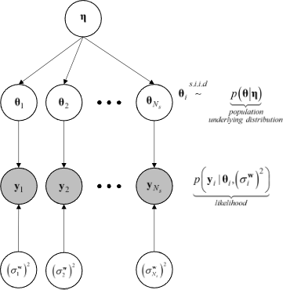

.. _lbluqUCSDSimTechnical:

Methods in UCSD UQ Engine 
*************************

.. _lbluqUCSD_TMCMC:

Transitional Markov chain Monte Carlo
=====================================

TMCMC is a numerical method used to obtain samples of the target posterior PDF. This algorithm is flexible, applicable in general settings, and parallelizable. Thus, it can be used to effectively sample the posterior PDF, when the likelihood function involves an FE model evaluation, using high-performance computing (HPC) resources.

In Bayesian inference, the posterior probability distribution of the unknown quantities, represented by the vector :math:`\mathbf{\theta}`, is obtained by applying Bayes' rule as follows:

.. math::
   p (\mathbf{\theta \ | \ y}) = \frac{p (\mathbf{y \ | \ \theta}) \times p(\mathbf{\theta})}{\int p (\mathbf{y \ | \ \theta}) \times p(\mathbf{\theta}) \ d\mathbf{\theta}}

The idea behind TMCMC is to avoid sampling directly from the target posterior PDF :math:`p(\mathbf{\theta \ | \ y})`,
but to sample from a series of simpler intermediate probability distributions that converge to the target posterior PDF. To achieve this, the TMCMC sampler proceeds through a series of stages, starting from the prior PDF until the posterior PDF. These intermediate probability distributions (called tempered posterior PDFs) are controlled by the tempering parameter :math:`\beta_j` as 

.. math::
   p(\theta|y)_j \propto p(y | \theta)^{\beta_j} \times p(\theta); \quad j = 0, 1, \ldots, m; \quad 0 = \beta_0 < \beta_1 < \ldots < \beta_m = 1

Index :math:`j` denotes the stage number, :math:`m` denotes the total number of stages, and :math:`p (\mathbf{\theta \ | \ y})_j` is the tempered posterior PDF at stage :math:`j` controlled by the parameter :math:`\beta_j`. At the initial stage :math:`(j = 0)`, parameter :math:`\beta_0 = 0`, the tempered distribution :math:`p(\mathbf{\theta \ | \ y})_{j=0}` is just the
prior joint PDF :math:`p(\theta)`. The TMCMC sampler progresses by monotonically increasing the value of :math:`\beta_j`, at each stage :math:`j`, until it reaches the value of 1. At the final stage :math:`(j = m)`, parameter :math:`\beta_m = 1`, the tempered distribution :math:`p(\mathbf{\theta \ | \ y})_{j = m}` is the target posterior joint PDF :math:`p(\mathbf{\theta \ | \ y})`. 

TMCMC represents the tempered posterior PDF at every stage by a set of weighted samples (known as particles). TMCMC approximates the :math:`j^{th}` stage tempered posterior PDF :math:`p(\mathbf{\theta \ | \ y})_j`  by weighing, resampling, and perturbing the particles of the :math:`j-1^{th}` stage intermediate joint PDF :math:`p(\mathbf{\theta \ | \ y})_{j-1}`. For details about the TMCMC algorithm, the interested reader is referred to Ching and Chen [Ching2007]_, Minson et. al. [Minson2013]_.

.. [Ching2007] 
   J. Ching and Y.-C. Chen, “Transitional Markov Chain Monte Carlo Method for Bayesian Model Updating, Model Class Selection, and Model Averaging”, *Journal of Engineering Mechanics*, 133(7), 816-832, 2007.
   
.. [Minson2013] 
   S. E. Minson, M. Simons, and J. L. Beck, “Bayesian Inversion for Finite Fault Earthquake Source Models I-Theory and Algorithm”, *Geophysical Journal International*, 194(3), 1701- 1726, 2013.

.. _lbluqUCSD_ugpab2:

Gaussian Process-Aided Bayesian Calibration (GP-AB)
===================================================

The GP-AB algorithm [Taflanidis2025]_ is a surrogate-aided extension of the Transitional Markov Chain Monte Carlo
(:ref:`lbluqUCSD_TMCMC`) sampling method. It is designed for Bayesian updating problems
in which evaluating the likelihood function :math:`L_D(\theta, q)` requires computationally expensive
finite element (FE) simulations. By replacing these simulations with predictions from a
Gaussian Process (GP) surrogate model, GP-AB can significantly reduce the computational cost of posterior sampling
while still converging to the same posterior distribution obtained if the original FE model was used.

In GP-AB, the GP surrogate is developed and **adaptively refined** in an iterative process using a
design of experiments (DoE) strategy that balances *exploitation* (focusing on regions of high
posterior probability) and *exploration* (sampling previously under-explored regions). This
adaptive refinement continues until the surrogate-based posterior converges according to specified
criteria described in the following sections.

Formulation of the Bayesian Calibration Problem
-----------------------------------------------

Consider a model with unknown parameters :math:`\theta \in \mathbb{R}^{n_\theta}` and
prediction error parameters :math:`q \in \mathbb{R}^{n_q}`, where :math:`n_\theta` and
:math:`n_q` denote their respective dimensions. Let :math:`D` denote the available
input-output data, consisting of measured system outputs
:math:`\hat{\mathbf{y}}` for known inputs :math:`\hat{\mathbf{u}}`.

The posterior probability density function (PDF) is given by Bayes' rule:

.. math::
   p(\theta, q \,|\, D) \ \propto\ L_D(\theta, q) \ p(\theta) \ p(q)
   :label: ugpab2_bayes_rule

where :math:`L_D(\theta, q)` is the likelihood of the data given the parameters,
and :math:`p(\theta)` and :math:`p(q)` are the prior PDFs.

The target posterior :math:`p(\theta, q \,|\, D)` is approximated using TMCMC, but
instead of evaluating the expensive model response :math:`\mathbf{y}(\theta|\mathbf{u})`
at every sample, GP-AB builds a GP surrogate that predicts this response accurately
in the regions of interest.

Likelihood Function
-------------------

In the quoFEM implementation, a Gaussian likelihood is used, with unknown error variances.  
Assigning a Jeffreys prior :math:`p(q) \propto 1/q` to the unknown variance  
yields a closed-form likelihood in terms of the model parameters :math:`\theta` only.

Let :math:`z(\theta) \in \mathbb{R}^{n_z}` be the stacked vector of all model outputs
for the observation cases in :math:`D`, and :math:`\hat{z}` the corresponding stacked
measurements. The residual vector is:

.. math::
   \mathbf{r}(\theta) = \hat{z} - z(\theta)

The resulting marginalized likelihood is:

.. math::
   L_D(\theta) \ \propto \
   \left[ \mathbf{r}(\theta)^\mathsf{T} \mathbf{r}(\theta) \right]^{-\,n_D/2}

where :math:`n_D = n_z` is the total number of scalar observations.

Surrogate Model Formulation
---------------------------

The surrogate is built for the vectorized model response:

.. math::
   z(\theta) = \mathrm{vec}\!\left( Y_D(\theta) \right) \in \mathbb{R}^{n_z}

where :math:`Y_D(\theta)` stacks the model outputs for all observation cases in :math:`D`,
and :math:`n_z = n_y \, n_D` is the total number of output components.

Because :math:`n_z` can be large, **Principal Component Analysis (PCA)** is used to
reduce the output dimension before GP training. Let :math:`\{ v_q \}_{q=1}^{n_v}`
be the retained principal component (PC) scores, chosen so that a prescribed fraction
:math:`r_{pc}` of the variance in the training outputs is preserved. A separate GP
metamodel is calibrated for each PC score:

.. math::
   v_q(\theta) \ \sim \ GP\!\left( \tilde{v}_q(\theta), \ \sigma_{v_q}^2(\theta) \right)

where :math:`\tilde{v}_q(\theta)` and :math:`\sigma_{v_q}^2(\theta)` are the GP-predicted mean
and variance, respectively. The predicted model response is reconstructed as:

.. math::
   \tilde{z}(\theta) \ =\ \mu_z + P \, \tilde{\mathbf{v}}(\theta)

with :math:`\mu_z` the mean output vector from training data, :math:`P` the PCA projection
matrix, and :math:`\tilde{\mathbf{v}}(\theta)` the vector of GP-predicted PC scores.

The GP-predicted response :math:`\tilde{z}(\theta)` is then used in place of
:math:`z(\theta)` when evaluating the likelihood and posterior.

Adaptive Design of Experiments (DoE)
------------------------------------

At each iteration :math:`k`, the surrogate is improved by adding :math:`2 * {n_\theta}` new
training points. Candidate points are chosen using the **weighted integrated mean
squared error (IMSE)** acquisition function:

.. math::
   \mathrm{IMSE}(\theta_\text{new}) =
   \int_{\Theta_d} \phi(\theta) \ \hat{\sigma}^2\!\left( \theta \,\middle|\, \Theta^{(k)}, \theta_\text{new}, s^{*(k)} \right) \, d\theta
   :label: ugpab2_imse

where:

- :math:`\Theta_d` is the parameter domain,
- :math:`\phi(\theta)` is a weight function prioritizing important regions,
- :math:`\hat{\sigma}^2` is the average GP predictive variance across all output components
  after adding :math:`\theta_\text{new}`,
- :math:`s^{*(k)}` are the optimized GP hyperparameters at iteration :math:`k`.

**Weight function:**
:math:`\phi(\theta)` is a convex combination of the GP-approximated *target* posterior and some *intermediate* TMCMC densities from the current iteration:

.. math::
   \phi(\theta) = \sum_{j={j^*}}^{j_t} \tau_j \ \tilde{\pi}^{(k)}_{[j]}(\theta),
   \quad \sum_j \tau_j = 1

This balances exploitation of the high-probability posterior regions with exploration
along the TMCMC path from prior to posterior. :math:`j^*` is defined in the following section on warm-starting TMCMC, and :math:`j_t` is the total number of stages in the current iteration.

A fraction of the new points is selected
purely for exploration by setting :math:`\phi(\theta) \equiv 1`.

Convergence Assessment
----------------------

Convergence of the surrogate-based posterior is tested between consecutive iterations
using a **dimension-normalized KL divergence:**

   .. math::
      g^{(k)}_{\mathrm{KL}} =
      \frac{1}{n_\theta} \ \mathrm{KL}\!\left( \tilde{\pi}^{(k)}(\theta) \ \big\| \ \tilde{\pi}^{(k-1)}(\theta) \right)
      :label: ugpab2_gkl

   where the KL divergence is estimated by importance sampling using the TMCMC samples.

An optional **LOOCV error metric** :math:`g^{(k)}_{\mathrm{CV}}` can be used to assess
GP predictive accuracy independently of the posterior approximation.

If :math:`g_{\mathrm{KL}} < c_{\mathrm{KL}}` and :math:`g_{\mathrm{CV}} < c_{\mathrm{CV}}`,
the algorithm stops.

Warm-Start TMCMC
----------------

If the LOOCV error :math:`g_{\mathrm{CV}}` is below a threshold, TMCMC can be *warm-started*
at a later stage :math:`j^*` by reweighting samples from the same stage of the previous
iteration, avoiding re-sampling from the prior. The stage :math:`j^*` is chosen such that
the coefficient of variation of these weights is below a specified limit.

Algorithm Summary
-----------------

The GP-AB algorithm proceeds as follows:

#. **Initialization:**
   - Select initial training points in :math:`\Theta_d` via a space-filling design.
   - Evaluate the high-fidelity model at these points and build the initial PCA+GP surrogate.

#. **Posterior Approximation:**
   - Use the GP surrogate to evaluate :math:`\tilde{L}^{(k)}_D(\theta, q)` and run TMCMC (warm-start if possible) to sample the posterior.

#. **Convergence Check:**
   - Compute :math:`g_{\mathrm{KL}}`.
   - If it is below a threshold (0.001), stop.

#. **Adaptive DoE:**
   - Select :math:`\lceil r_{\mathrm{ex}} * {2*n_\theta} \rceil` exploitation points using weighted IMSE.
   - Select the remainder for exploration.
   - Run high-fidelity simulations at new points, update the surrogate, and increment :math:`k`.

#. Repeat steps 2-4 until convergence or computational budget is reached.

Remarks
-------

- GP-AB focuses GP refinement on regions relevant to the posterior, improving
  efficiency over space-filling designs.
- The balance between exploitation and exploration controls robustness: more
  exploration is promoted automatically during the initial iterations of GP-AB to reduce the risk of missing important regions.
- Warm-starting TMCMC can further reduce sampling cost when surrogates are accurate.

.. [Taflanidis2025] 
   A.A. Taflanidis, B.S. Aakash, S.R. Yi, and J.P. Conte, “Surrogate-aided Bayesian calibration with adaptive learning strategies”, *Mechanical Systems and Signal Processing*, 237, 113014, 2025. https://doi.org/10.1016/j.ymssp.2025.113014

.. _lbluqUCSD_hierarchical:

Bayesian Inference of Hierarchical Models
=========================================

Consider for model calibration a dataset consisting of experimental results on test specimens of the same kind. Let :math:`\mathbf{y}_i`  denote the measured output response of the :math:`i^{th}` specimen in the dataset :math:`\mathbf{Y} = \{\mathbf{y}_1, \mathbf{y}_2, ..., \mathbf{y}_{N_s}\}` where :math:`N_s` designates the number of specimens. Let :math:`\theta_i` be the model parameter vector corresponding to the :math:`i^{th}` specimen, where :math:`n_\theta` denotes the number of model parameters. For the :math:`i^{th}` specimen, the output response :math:`\mathbf{y}_i`  can be viewed as a function of :math:`\theta_i`  through the model :math:`\mathbf{h}`  and the following measurement equation: 

.. math:: \mathbf{y}_i = \mathbf{h}(\theta_i)  + \mathbf{w}_i
   :label: measurement_equation
   
where  :math:`\mathbf{w}_i` denotes the discrepancy between the response predicted by the model parameterized with :math:`\theta_i`, i.e., :math:`\mathbf{h}(\theta_i)`, and the experimental output response :math:`\mathbf{y}_i`; :math:`\mathbf{w}_i` is termed the prediction error. With the measurement equation in :math:numref:`measurement_equation`, the sources of real-world uncertainties such as the measurement noise during data collection and model form error are lumped and accounted for in the prediction error (also called noise) term :math:`\mathbf{w}_i`  (i.e., :math:`\mathbf{w}_i` is also a proxy for model form error). In quoFEM, it is assumed that the prediction error is a zero-mean Gaussian white noise, thus,

.. math:: \mathbf{w}_i \sim N(0, (\sigma_i^w)^2 \times I_{n_{\mathbf{y}_i} \times n_{\mathbf{y}_i}})
   :label: gaussian_white_noise_prediction_error
   
where :math:`\sigma_i^2` denotes the variance of the prediction error :math:`\mathbf{w}_i`.

With the assumptions made in :math:numref:`measurement_equation` and :math:numref:`gaussian_white_noise_prediction_error`, :math:`\mathbf{y}_i` is Gaussian and centered at the model response :math:`\mathbf{h}(\theta_i)`, with a diagonal covariance matrix equal to :math:`\sigma_i^2 \times \mathbf{I}_{n_{\mathbf{y}_i} \times n_{\mathbf{y}_i}}` i.e., 

.. math:: p(\mathbf{y}_i | \theta_i, \sigma_i^2) = N(h(\theta_i), \sigma_i^2 \times \mathbf{I}_{n_{\mathbf{y}_i} \times n_{\mathbf{y}_i}})
   :label: likelihood_for_one_dataset

In the UCSD_UQ engine, hierarchical Bayesian modeling is used to account for specimen-to-specimen variability in the parameter estimates. In the hierarchical Bayesian modeling realm, the parameter vectors :math:`\theta_1, \theta_2, \ldots, \theta_{N_s}`  are considered as mutually statistically independent and identically distributed (s.i.i.d) random variables following a PDF :math:`p(\theta | \eta)`. This is the PDF of the parent distribution, which represents the aleatory specimen-to-specimen variability.  

The objective of hierarchical Bayesian inference is to jointly estimate the model parameters :math:`\theta_i` for each specimen i (along with its prediction error variance :math:`\sigma_i^2`) as well as the hyperparameters :math:`\eta`  of the parent distribution of the set :math:`\theta_i (i = 1, \ldots, N_s)`. 

Making use of the experimental results for a single specimen, :math:`\mathbf{y}_i`,  Bayes’ theorem for all parameters to be inferred from this specimen can be written as

.. math::
   p(\theta_i, \sigma_i^2, \eta | \mathbf{y}_i) \propto p(\mathbf{y}_i | \theta_i, \sigma_i^2, \eta)  p(\theta_i, \sigma_i^2, \eta)
   :label: bayes_rule_for_one_coupon

The specimen response  :math:`\mathbf{y}_i` depends solely on the model parameters :math:`\theta_i`  and the prediction error variance for that specimen,  :math:`\sigma_i^2`, and is independent of the hyperparameters :math:`\eta`. Consequently, the conditional PDF :math:`p(\mathbf{y}_i | \theta_i, \sigma_i^2, \eta)`  reduces to  :math:`p(\mathbf{y}_i | \theta_i, \sigma_i^2)`. 

Assuming :math:`\sigma_i^2`  to be statistically independent of :math:`\theta_i` and :math:`\eta` in the joint prior PDF of :math:`\theta_i`, :math:`\sigma_i^2`, and :math:`\eta`, :math:numref:`bayes_rule_for_one_coupon` becomes

.. math::
   p(\theta_i, \sigma_i^2, \eta | \mathbf{y}_i) \propto p(\mathbf{y}_i | \theta_i, \sigma_i^2)  p(\sigma_i^2) p(\theta_i | \eta) p(\eta)
   :label: bayes_rule_for_one_coupon_after_assumptions

In the context of hierarchical Bayesian modeling, the entire experimental dataset from multiple specimens of the same kind, :math:`\mathbf{Y} = \{\mathbf{y}_1, \mathbf{y}_2, ..., \mathbf{y}_{N_s}\}`, is considered. The model parameters and the prediction error variances for all specimens are assumed to be mutually statistically independent, while the set of model parameter estimates are assumed to be samples from a parent distribution. The figure :numref:`figHierarchicalModel` shows the structure of the hierarchical model.  

.. _figHierarchicalModel:

   
   Structure of the hierarchical model

Under these assumptions, the equation for Bayesian updating of all unknown quantities in the hierarchical model, including the model parameters :math:`\Theta = \{\theta_1, \theta_2, \ldots, \theta_{N_s}\}`, measurement noise variances  :math:`\mathbf{s} = \{\sigma_1^2, \sigma_2^2, \ldots, \sigma_{N_s}^2\}`, and hyperparameters :math:`\eta` is given by

.. math::
   p(\Theta, \mathbf{s}, \eta | \mathbf{Y}) \propto p(\eta) \prod_{i=1}^{N_s}[p(\mathbf{y}_i | \theta_i, \sigma_i^2)  p( \sigma_i^2) p(\theta_i | \eta) ] 
   :label: bayes_rule_for_hierarchical_model

The marginal posterior distribution of the hyperparameters, :math:`p(\eta | \mathbf{Y})` , is obtained by marginalizing out :math:`\mathbf{\Theta}`  and :math:`\mathbf{s}`  from  :math:`p(\Theta, \mathbf{s}, \eta | \mathbf{Y})` as

.. math::
   p(\eta | \mathbf{Y}) = \int_{\Theta, \mathbf{s}} p(\Theta, \mathbf{s}, \eta | \mathbf{Y}) d\Theta d\mathbf{s}
   :label: marginal_posterior_of_hyperparameters

The distribution :math:`p(\eta | \mathbf{Y})` describes the epistemic uncertainty in the value of the hyperparameters :math:`\eta` due to the finite number of specimens :math:`N_s` in the experimental dataset. 

In the hierarchical approach, the probability distribution of the model parameters conditioned on the entire measurement dataset, :math:`p(\theta | \mathbf{Y})`, is given by

.. math::
   p(\theta | \mathbf{Y}) = \int_\eta p(\theta | \eta) p(\eta | \mathbf{Y}) d\eta
   :label: posterior_predictive_distribution_of_theta

The conditional distribution :math:`p(\theta | \eta)` models the aleatory specimen-to-specimen variability. Therefore, the probability distribution :math:`p(\theta | \mathbf{Y})`, referred to as the posterior predictive distribution of the model parameters :math:`\theta`, encompasses both the aleatory specimen-to-specimen uncertainty and the epistemic estimation uncertainty (due to the finite number of specimens :math:`N_s`  in the experimental dataset and the finite length of the experimental data corresponding to each specimen). It can be utilized for uncertainty quantification and propagation in reliability and risk analyses. 

.. _lbluqUCSD_hierarchical_normal:

Special Case: Normal Population Distribution
--------------------------------------------
The hierarchical modeling approach discussed above captures the specimen-to-specimen aleatory variability by modeling the model parameters corresponding to each experiment as a realization from a population distribution. In the UCSD_UQ engine, a multivariate normal distribution :math:`\theta | \eta \sim N (\mu_\theta, \Sigma_\theta)` is adopted (i.e., :math:`\eta = (\mu_\theta, \Sigma_\theta)`) as:

.. math::
   \theta_i & \stackrel{s.i.i.d}{\sim} N (\mu_\theta, \Sigma_\theta), \quad i = 1, \ldots, N_s \\
   \mu_\theta = \begin{bmatrix} \mu_{\theta_1} \\ \mu_{\theta_2} \\ \vdots \\ \mu_{\theta_{n_\theta}}\end{bmatrix}; \quad \Sigma_\theta &= \begin{bmatrix}    \sigma_{\theta_1}^2 & cov(\theta_1, \theta_2) & \cdots & cov(\theta_1, \theta_{n_\theta}) \\
   cov(\theta_2, \theta_1) & \sigma_{\theta_2}^2 & \cdots & cov(\theta_2, \theta_{n_\theta}) \\ \vdots & \vdots & \ddots & \vdots \\
   cov(\theta_{n_\theta}, \theta_1) & cov(\theta_{n_\theta}, \theta_2) & \cdots &  \sigma_{n_\theta}^2 \end{bmatrix}
   :label: normal_population_distribution

In the Bayesian inference process, the hyperparameters characterizing the population probability distribution, the hypermean vector :math:`\mu_\theta` and the hypercovariance matrix :math:`\Sigma_\theta` are jointly estimated with all the :math:`\theta_i` s and :math:`\sigma_i^2` s.

So, for this special case, :math:numref:`bayes_rule_for_hierarchical_model` becomes 

.. math::
   p(\Theta, \mathbf{s}, \mu_\theta, \Sigma_\theta | \mathbf{Y}) \propto p(\mu_\theta, \Sigma_\theta) \prod_{i=1}^{N_s}[p(\mathbf{y}_i | \theta_i, \sigma_i^2)  p(\sigma_i^2) p(\theta_i | \mu_\theta, \Sigma_\theta) ] 
   :label: bayes_rule_for_hierarchical_model_with_normal_population

with :math:`\Theta`, :math:`\mathbf{Y}`, and :math:`\mathbf{s}` as defined above.

In the UCSD_UQ engine, the sampling algorithm operates in the standard normal space i.e., 

.. math::
   \theta_i  & \stackrel{s.i.i.d}{\sim} N (\mu_\theta, \Sigma_\theta), \quad i = 1, \ldots, N_s \\
   \mu_\theta & = \begin{bmatrix} 0 \\ 0 \\ \vdots \\ 0\end{bmatrix}; \quad \Sigma_\theta = \begin{bmatrix}   1 & 0 & \cdots & 0 \\
   0 & 1 & \cdots & 0 \\ \vdots & \vdots & \ddots & \vdots \\
   0 & 0 & \cdots &  1 \end{bmatrix}
   :label: standard_normal_population_distribution

and the :ref:`Nataf transform <lbluqSimTechnical_Nataf>` is utilized to map the values provided by the sampling algorithm to the physical space of the model parameters before the model is evaluated.

.. _lbluqUCSD_hierarchical_sampling_algorithm:

Sampling the Posterior Probability Distribution of the Parameters of the Hierarchical Model
-------------------------------------------------------------------------------------------
Due to the high dimensionality (:math:`n_\theta \times n_s + n_s + n_\theta + n_\theta \times \frac{(n_\theta+1)}{2}`, corresponding to the dimensions of the :math:`\theta_i` of each dataset, :math:`\sigma_i^2` for each dataset, :math:`\mu_\theta` and :math:`\Sigma_\theta`, respectively) of the posterior joint PDF shown in :math:numref:`bayes_rule_for_hierarchical_model_with_normal_population`, the Metropolis within Gibbs algorithm is used to generate samples from the posterior probability distribution. To do this, conditional posterior distributions are derived for blocks of parameters from the joint posterior distribution :math:numref:`bayes_rule_for_hierarchical_model_with_normal_population` of all the parameters of the hierarchical model. The Gibbs sampler generates values from these conditional posterior distributions iteratively. The conditional posterior distributions are lower dimensional than the joint distribution. The assumptions made next result in a few of the conditional posterior distributions being of a form that can be easily sampled from, thereby making it feasible to draw samples from the high-dimensional joint posterior PDF of the hierarchical model.

The prior distributions for each :math:`\sigma_i^2` are selected as the inverse gamma (IG) distribution:

.. math::
   p(\sigma_i^2) = IG(\alpha_0, \beta_0)
   :label: conjugate_prior_pdf_for_sigma_i

The prior probability distribution for :math:`(\mu_\theta, \Sigma_\theta)` is chosen to be the normal-inverse-Wishart (NIW) distribution:

.. math::
   p(\mu_\theta, \Sigma_\theta) = N(\mu_\theta | \mu_0, \frac{\Sigma_\theta}{\nu_0}) IW(\Sigma_\theta | \Sigma_0, m_0)
   :label: conjugate_prior_pdf_for_hyperparameters

With these assumptions, the conditional posterior distributions are the following:

.. math::
   p(\Sigma_\theta &| \mathbf{Y},  \Theta, \mathbf{s}, \mu_\theta) \propto IW(\Sigma_\theta | \Sigma_n, m_n) \\
   p(\mu_\theta &| \mathbf{Y},  \Theta, \mathbf{s}, \Sigma_\theta) \propto N(\mu_\theta | \mu_n, \frac{\Sigma_\theta}{\nu_n}) \\
   p(\sigma_i^2 &| \mathbf{Y}, \Theta, \mu_\theta, \Sigma_\theta) \propto IG(\alpha_{n_i}, \beta_{n_i})\\
   p(\theta_i &| \mathbf{Y}, \mathbf{s}, \mu_\theta, \Sigma_\theta ) \propto p(\mathbf{y}_i | \theta_i, \sigma_i^2)   p(\theta_i | \mu_\theta, \Sigma_\theta) 
   :label: conditional_posterior_distributions

where:

.. math::
   \nu_n &= \nu_0 + N_s \\
   \mu_n &= \frac{(\mu_0 * \lambda_0 + N_s * \bar{\theta})}{\nu_n} \\
   \Sigma_n &= \Sigma_0 + S + \frac{\nu_0 * N_s}{\nu_n} \times ((\bar{\theta} - \mu_0)(\bar{\theta} - \mu_0)^T) \\
   m_n &= m_0 + N_s \\
   \alpha_{n_i} &= \alpha_0 + \frac{n_{\mathbf{y}_i}}{2}\\
   \beta_{n_i} &= \beta_0 + \frac{{sse}_i}{2}

and,

.. math:: 
   \bar{\theta} &= \frac{1}{N_s}\sum_{i=1}^{N_s} \theta_i \\
   S &= \sum_{i=1}^{N_s} {(\bar{\theta} - \mu_0)(\bar{\theta} - \mu_0)^T} \\
   {sse}_i &= \sum_{k=1}^{n_{\mathbf{y}_i}}(\mathbf{y}_i^{(k)} - \mathbf{h}(\theta_i)^{(k)})^2 

The Metropolis within Gibbs sampler generates values from the posterior joint PDF shown in :math:numref:`bayes_rule_for_hierarchical_model_with_normal_population` using the posterior conditional distributions :math:numref:`conditional_posterior_distributions` through the following steps:

#. Select appropriate initial values for each of the :math:`\theta_i`.

#. Based on the :math:`k^{th}` sample value, the :math:`(k+1)^{th}` sample value is obtained using the following steps:

   #. Generate a sample value of :math:`\Sigma_{\theta}^{(k+1)}` from the conditional posterior distribution :math:`IW(\Sigma_n, m_n)`

   #. Generate a sample value of :math:`\mu_\theta^{(k+1)}` from the conditional posterior distribution :math:`N(\mu_n, \frac{\Sigma_\theta}{\nu_n})`

   #. For each dataset, generate independently a sample value of :math:`\sigma_i^{2(k+1)}` from the conditional posterior distribution of each :math:`\sigma_i^2`: :math:`IG(\alpha_n, \beta_n)`

   #. For each dataset, generate a sample value of the model parameters :math:`\theta_i` from the conditional posterior :math:`p(\mathbf{y}_i | \theta_i, \sigma_i^2)   p(\theta_i | \mu_\theta, \Sigma_\theta)` with a Metropolis-Hastings step as follows:

      a. Generate a candidate sample :math:`\theta_{i(c)}` from a local random walk proposal density :math:`\theta_{i(c)} \sim N(\theta_i^{(k)}, \Sigma_i^{(k)})` where :math:`\Sigma_i^{(k)}` is the proposal covariance matrix of the random walk.

      b. Calculate the acceptance ratio

      .. math::
         a_c = \frac{p(\mathbf{y}_i | \theta_{i(c)}, \sigma_i^{2(k+1)}) p(\theta_{i(c)} | \mu_\theta^{(k+1)}, \Sigma_{\theta}^{(k+1)})}{p(\mathbf{y}_i | \theta_i^{(k)}, \sigma_i^{2(k+1)})   p(\theta_i^{(k)}| \mu_\theta^{(k+1)}, \Sigma_{\theta}^{(k+1)})}

      c. Generate a random value :math:`u` from a uniform distribution on [0, 1] and set

      .. math::
         \theta_i^{(k+1)} = \quad &\theta_{i(c)} \quad \text{if} \quad u < a_c \\
         &\theta_i^{(k)} \quad \text{otherwise}
         :label: Metropolis_Hastings_criteria

After an initial burn-in period, the sample values generated by this algorithm converge to the target density. The proposal covariance matrix of the random walk :math:`\Sigma_i^{(k)}` is selected to facilitate proper mixing of the random walks used to generate sample values of the :math:`\theta_i`. Within the adaptation duration, a scaled version of the covariance matrix of the sample values of the last :math:`N_{cov}` samples (defined as the adaptation frequency in the UCSD_UQ engine) is used, to keep the acceptance rate in the range of 0.2 to 0.5. 

