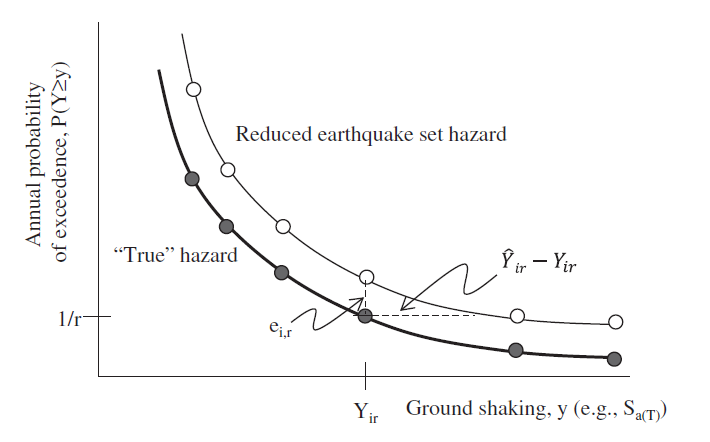
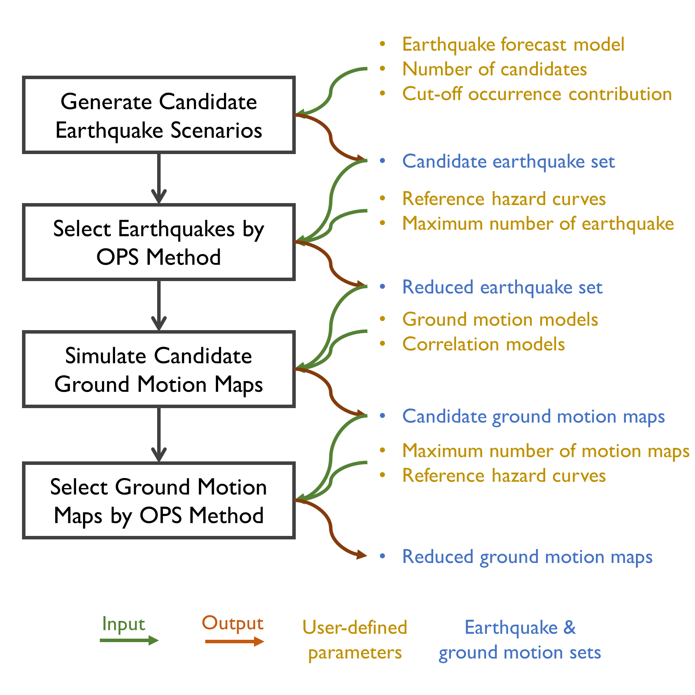
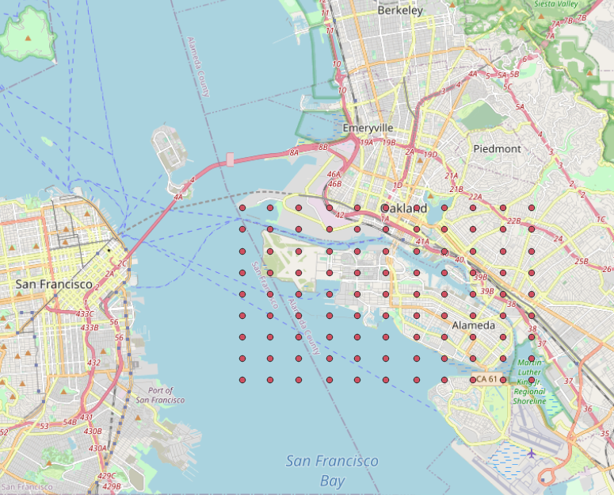
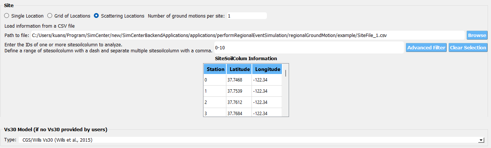
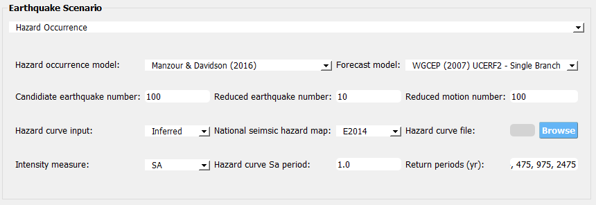
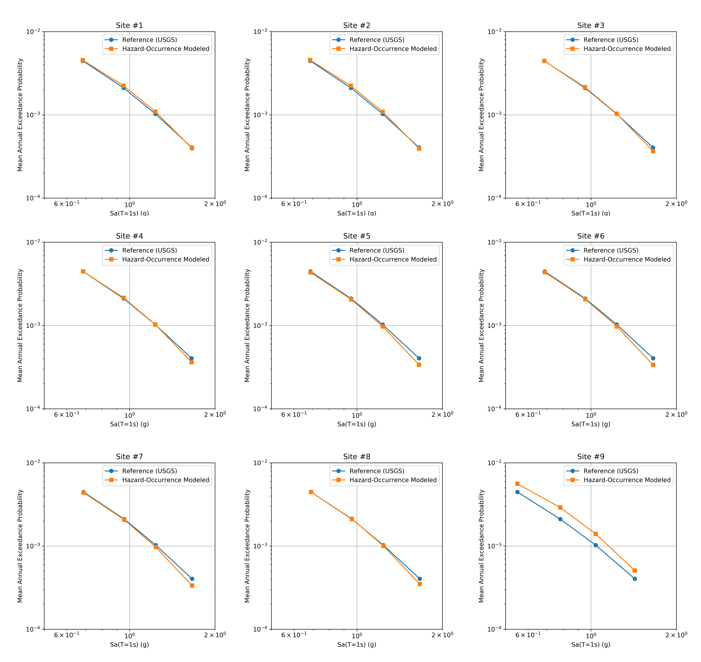

.. _lblHazardOCcurrence:

Hazard Occurrence
===================

A regional seismic risk ananlysis consists pf three elements: (1) an exposure time over which the risk is evaluated, 
(2) a loss or quantification to be evaluated, and (3) a specification of the probability of incurring the loss during the specified 
exposure time. These three elements can be formulated into different workflows and one of the possible workflows can include: 
(1) hazard analysis (understanding the possible seismic sources in the studied region), (2) ground motion characterization 
(representing the possible seismicity by earthquake ground motions at each site, e.g., time history records, intensity measures), 
(3) inventory identification (collecting the basic information of the buildings and infrastructures to be analyzed), and (4) 
response/damage/loss assessment (mapping the ground motion characteristics and building inventory to the response, damage and loss in the region).

Different than the seismic risk analysis of a single structure, the spatial correlation between different site locations usually needs to be 
considered in estimating the total damage and loss of a portfolio of buildings or infrastructures.  This consideration is naturally fulfilled if 
physics-based earthquake simulation is involved.  If empirical ground motion models are used, then spatial correlation models (please see more 
details in :ref:`lblCorrelation`) need to be evaluated and used in sampling the ground motion maps explicitly. The simulated ground motions are 
then used as the input for assessing the regional seismic risk of the portfolio.

To propagate the uncertainty in the seismic hazard, ground motion characteristics, and structural damage and loss fragility, the risk analysis 
typically needs a sufficient number of samples (realizations) to reliably estimate the mean and variation of possible damage and loss. For instance, 
if applying the conventional Monte Carlo method (e.g., [Bazzurro07]_), for each of the considered earthquake scenario (with a specific magnitude and location), 
a number of ground motion intensity maps are first simulated. Then, for each of the ground motion maps, a number of damage and loss assessments are 
conducted to propagate the uncertainty in the inventory, response analysis model, and/or fragility functions. The process is repeated for 
all considered earthquake scenarios which leads to a tremendous number of realizations and an excessive computational demand.

To alleviate the computational cost of regional seismic risk analysis, a concept of *probabilistic earthquake scenarios* was proposed and developed by 
many researchers (e.g., [Chang00]_, [Jayaram10]_, [Vaziri12]_). The key idea is to first reduce the full set of possible earthquake scenarios that affect the studied 
region to a select subset of earthquakes each of which is used to evaluate the building and infrastructure performance, and then aggregate the results with 
modified hazard-consistent probabilities for individual selected earthquakes.  The modified probabilities of selected earthquakes are optimized 
so that the original hazard curves of individual sites can be recovered as much as possible ([Han12]_). Different optimization algorithms are implemented 
(e.g., [Wang20]_), different target functions beyond the error in hazard curve (e.g., [Miller14]_) are considered, and multiple intensity measures (e.g., [Ma22]_) 
are included in the optimization to improve the accuracy of regional seismic risk analysis based on the subset earthquakes.

   Hazard curve of reduced earthquake subset with modified occurrence rates versus reference hazard curve ([Han12]_).

Currently, the hazard occurrence sampling method developed by [Han12]_ and [Manzour16]_ is implemented in R2D. The following section 
provides a brief overview of its framework and major steps.

Manzour and Davidson (2016)
----------------------------

Han and Davidson ([Han12]_) proposed an *Optimization-based probabilistic scenario method* (OPS) to select a subset of earthquakes from the entire candidate set along with 
new optimized occurrence rates. The method adapts the `mixed-integer linear programming <https://www.sciencedirect.com/topics/engineering/mixed-integer-linear-programming>`_ 
to minimize the different between the recovered hazard curve (using the new occurrence rates) and the "true" (reference) hazard curve with the constraint on the total number 
of earthquakes that can be selected for the reduced set.

Specifically, the objective of the optimization is to minimize the sum of the errors over all sites :math:`i` and return periods :math:`r`, 
between points on the reference hazard curves and the corresponding points on hazard curves developed with the reduced set of earthquakes and new occurrence rate:

.. math::
   min \Sigma_{i=1}^{I} \Sigma_{r=1}^{R} w_{ir} (e_{ir}^{+}+e_{ir}^{-})

where :math:`e_{ir}^{+}` and :math:`e_{ir}^{-}` are the errors resulting from overestimating and underestimating, respectively, the reference hazard curve for the site :math:`i` 
at the return period `r`. The weight :math:`w_{ir}` is taken as the return period so that the error occurs at a longer return period (i.e., higher intensity level) can be 
scaled relatively more than the error occurs at shorter return period. This typically helps the final fitting given the nonlinear shape of a hazard curve.

Assuming we have overall :math:`J` candidate earthquakes, for any earthquake scenario :math:`j`, we can use empirical ground motion model(s) to compute its resulting ground motion intensity
(i.e., the mean and standard deviation) for each individual site :math:`i`: :math:`m_{lnSa}` and :math:`\sigma_{lnSa}`.  Suppose that for the site :math:`i` and return period :math:`r`, 
:math:`Sa_{ir}` is the intensity level from the reference hazard curve, then with :math:`m_{lnSa}` and :math:`\sigma_{lnSa}` we could estimate the exceeding probability of :math:`Sa_{ir}` for 
the earthquake scenario :math:`j`: :math:`P(y \geq Sa_{ir})`. Now assuming the modified occurrence rate is :math:`P_j`, then the total exceedance probability using the reduced set of earthquake
could be written as:

.. math::
   \Sigma_{j=1}^{J} [P_j \times P(y \geq Sa_{ir})] - e_{ir}^{+}+e_{ir}^{-} = \frac{1}{r}, \forall i, r

Note if :math:`P_j=0`, then the earthquake :math:`j` is not included in the reduced set of earthquake scenarios (:math:`N_{red}`).  The other constraints in the optimization are:

.. math::
   0 \leq P_j \leq z_j, \forall j

.. math::
   z_j \in \{0, 1\}, \forall j

.. math::
   \Sigma_{j=1}^{J} z_j \leq N_{req}

.. math::
   e_{ir}^{+}, e_{ir}^{-} \geq 0, \forall i,r

The above OPS method can also be applied to reduce the number of ground motion maps to recover the reference hazard curves for the sites in the studied region.
The only difference is the computation of the exceedance probability given the ground motion map :math:`k`, :math:`P(y \geq Sa_{ir})`, which would be a binary 
variable (either 1 or 0) as whether to exceed :math:`Sa_{ir}` is deterministic given a ground motion map.

The flowchart below summarizes the workflow of using the OPS method to select reduced number of earthquakes, reduce ground motion maps given the selected earthquake scenarios, 
and assign new occurrence rates for the earthquake scenarios and ground motion maps. To illustrate the process, an example case will be introduced along with 
a bit more details of each major step.

   Workflow to generate a hazard-consistent reduced sample of earthquakes and ground motion maps using the OPS method.

In this example, we want to get minimal number of earthquakes with modified occurrence rates to recover the reference hazard curves at each site location as much as possible. 
The figure below plots the example sites in the San Francisco Bay Area, whose longitude and latitude data can be downloaded :download:`here <./src/SiteFile.csv>`. 

   Site locations for hazard occurrence modeling and probabilistic earthquake scenarios.

Once downloaded, the site csv file can be loaded in the site widget of the **HAZ** panel under the "Earthquake Scenario Simulation" option. The figure below shows the site widget 
after the file is loaded. The site-specific Vs30 data are fetched from Wills et al. 2015 model.

   Loading the site csv file in the site widget (scattering locations).

The figure below summarizes the hazard occurrence configuration: we want to select earthquake scenarios from the UCERF2 seismic sources. For 
this demostration, we want to have 100 candidate earthquakes.  The backend script in the R2D follows the suggestion by Han and Davidson (2012) 
([Han12]_) to first order the candidate by its true occurrence rates - so the 100 candidates here are the ones with highest occurrence rates to 
the region. For the reduced representation with the probabilistic earthquake scenarios, we want no more than 10 earthquakes and no more than 100 
ground motion maps. Note this setup is just for demonstration as the example site locations are not distant to each other - for more distributed 
sites, the candidate earthquak number as well as the reduced earthquake number should be increased to have better matching results ([Han12]_).

   Configurations for hazard occurrence modeling.

For all sites, we do not prescribe but fetch the site-specific hazard curves directly from `USGS API <https://earthquake.usgs.gov/nshmp-haz-ws/hazard>`_.
The intensity measure for the hazard curve is the response spectral acceleration at 1.0 second, Sa(T=1.0). The hazard curves are digitized at 
four different return periods from 224 years to 2475 years. These four levels will be used later to compute the error for fitting the hazard curve. 
These hazard curves are also saved during the simulation, please see the example format in :download:`./src/HazardCurves.json`. 

Once everything above set up, please click the "Run Hazard Simulation" button located in the bottom right of the **HAZ** panel. It may take 5 to 10 
minutes to run the entire example (internet connection is needed for fetching data in this example).  Once the run completed, there are three types of 
output files in the "Output Directory" (please feel free to change the default one to your own directory in the 
textbox located in the bottom left of the **HAZ** panel):

1. *RupSampled.json*: the information about the selected probabilistic earthquake ruptures (:download:`example <./src/RupSampled.json>`).
2. *InfoSampledGM.json*: the information about the selected ground motion maps (:download:`example <./src/InfoSampledGM.json>`).
3. *SiteIM.json*: the simulated intensity measures of the selected ground motion maps (:download:`example <./src/SiteIM.json>`).

To validate the selected earthquake scenarios, the figure below constrasts the recovered seismic hazard curve and the reference hazard curve
(ground truth) for each individual site.

   Comparison of recovered and reference hazard curves for the first 9 sites in the example.

.. [Bazzurro07]
   Bazzurro, P., & Luco, N. (2007). Effects of different sources of uncertainty and correlation on earthquake-generated losses. Australian Journal of Civil Engineering, 4(1), 1-14.

.. [Chang00]
   Chang, S. E., Shinozuka, M., & Moore, J. E. (2000). Probabilistic earthquake scenarios: extending risk analysis methodologies to spatially distributed systems. Earthquake Spectra, 16(3), 557-572.

.. [Vaziri12]
   Vaziri, P., Davidson, R., Apivatanagul, P., & Nozick, L. (2012). Identification of optimization-based probabilistic earthquake scenarios for regional loss estimation. Journal of Earthquake Engineering, 16(2), 296-315.

.. [Jayaram10]
   Jayaram, N., & Baker, J. W. (2010). Efficient sampling and data reduction techniques for probabilistic seismic lifeline risk assessment. Earthquake Engineering & Structural Dynamics, 39(10), 1109-1131.

.. [Han12]
   Han, Y., & Davidson, R. A. (2012). Probabilistic seismic hazard analysis for spatially distributed infrastructure. Earthquake Engineering & Structural Dynamics, 41(15), 2141-2158.

.. [Miller14]
   Miller, M., & Baker, J. (2015). Ground‐motion intensity and damage map selection for probabilistic infrastructure network risk assessment using optimization. Earthquake Engineering & Structural Dynamics, 44(7), 1139-1156.

.. [Wang20]
   Wang, P, Z Liu, SJ Brandenberg, P Zimmaro, JP Stewart (2022). Regression-based event selection for hazard-consistent seismic risk assessment. Proceedings of the 12th National Conference in Earthquake Engineering, Salt Lake City, UT.

.. [Ma22]
   Ma, L., Conus, D., & Bocchini, P. (2022). Optimal Generation of Multivariate Seismic Intensity Maps Using Hazard Quantization. ASCE-ASME Journal of Risk and Uncertainty in Engineering Systems, Part A: Civil Engineering, 8(1), 04021078.

.. [Manzour16]
   Manzour, H., Davidson, R. A., Horspool, N., & Nozick, L. K. (2016). Seismic hazard and loss analysis for spatially distributed infrastructure in Christchurch, New Zealand. Earthquake Spectra, 32(2), 697-712.