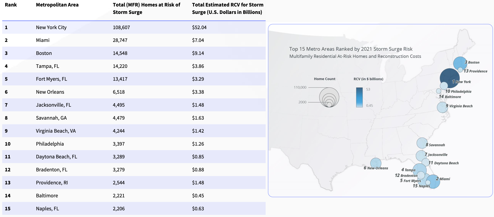

Storm surge risk
========================

In recent years, several works have estimated the risk of storm surge events on the eastern seaboard of the US. In the year 2020, on the eastern seaboard, there were 7,110,779 Single Family Residences (SFR) and 252,657 Multi-Family Residences (MFR) at risk of storm surge.

The reconstruction cost value (RCV) for SFR's is estimated to be $1.7 trillion, while MFR's be at $95 billion. Here RCV refers to the actual cost to rebuild a house considering complete destruction of the property. Here, it is assumed that the SFR's are residential structures with less than four stories and include mobile homes, duplexes, manufactured homes, and cabins. The MFR's are assumed to be apartments, condominiums, and multi-unit dwellings. Thus, multi-family residences tend to be multiple stories. These higher levels have less potential to be affected by storm surges.

.. _SurgeRiskHomes:

.. figure:: figures/SurgeRiskHomes.png
   :alt: Residences affected by different category of storm surges
   :width: 500px
   :align: center

   Residences affected by different category of storm surges (Source: CoreLogic 2021 report)

:numref:`SurgeRiskHomesS` shows the number of single-family residences and :numref:`SurgeRiskHomesM` the number of multiple-family homes at risk of storm surge in the top 15 metros in the US.

.. _SurgeRiskHomesS:

.. figure:: figures/Metros_SFR.png
   :alt: Residences affected by different category of storm surges
   :align: center

   Residences affected by different category of storm surges

.. _SurgeRiskHomesM:

   Residences affected by different category of storm surges

NJ coast
------------
Let us look at New Jersey (NJ) as an example. NJ coast has about 1792 miles of coastline covering 17 / 21 counties in the state. This accounts for approximately 80% of the state's population and caters to almost $400B in annual economic outputs. The changes in sea level and increased hurricane activity have significantly increased the coast's exposure to storm surges in the past four decades. :numref:`NJSeaLevel` shows the change in mean sea level in Atlantic City, which is almost 16 inches since 1912 and 6 inches since 1980.

.. _NJSeaLevel:

.. figure:: figures/SeaLevelAtCity.png
   :width: 600px
   :alt: Changes in mean sea level in Atlantic city 
   :align: center

   Mean sea level in inches w.r.t  1912 in Atlantic City. (Source: National Oceanic and Atmospheric Administration (NOAA))

This increase in sea levels increases the risk of tidal flooding and storm-related flooding that occurs during hurricanes and coastal storms. For example, during Hurricane Sandy in 2012, the storm tide measured as much as 8.9 feet. The inundation in Monmouth and Middlesex counties was up to 9 feet deep. The surge in 2012 flooded an area of almost 27 square miles greater than in 1880. A recent report by the `Rhodium group <https://rhg.com/research/new-jersey-flooding-hurricanes-costs-climatechange/>`_ estimated the NJ's hurricane flood risk and how it may change through 2050. They employed various techniques, including a GeoClaw model to estimate the hurricane-related flood risk as shown in :numref:`NJRisks` 

.. _NJRisks:

.. figure:: figures/FloodHomesNJ.png
   :width: 600px
   :alt: Changes in houses in NJ coast facing flood risk 
   :align: center

   Increase in the number of buildings that are subject to flood risk of once in 30 years. The uncertainty is due to changes in human activity and sea levels (Source: `Rhodium group report <https://rhg.com/research/new-jersey-flooding-hurricanes-costs-climatechange/>`_)
