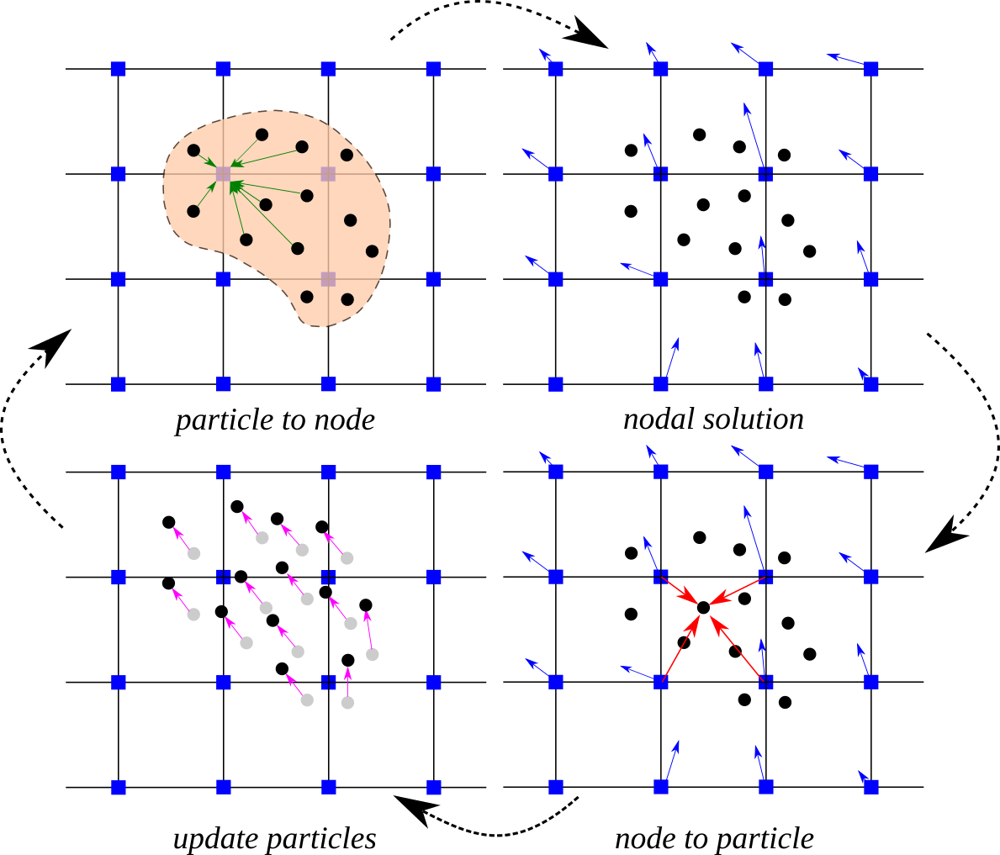

.. _lbl-mpm:

*********************
Material Point Method
*********************

.. contents:: Table of Contents
    :local:
    :backlinks: none

.. _lbl-mpm-intro:

============
Introduction
============

Similar to other numerical methods, the Material Point Method (MPM) [Sulsky1994]_ transforms a set of partial differential equations (PDE) into a system of linear algebraic equations. We explain our reasoning for choosing this method and our reasoning for avoiding others. Note that the derivation of traditional MPM presented here is similar to previous descriptions used by MPM researchers in natural hazards engineering (Carter Mast [Carter2013Dissertation]_, Wen-Chia Yang [Yang2016Dissertation]_, and Wookuen Shin [Shin2009Dissertation]_) to maintain nomenclature consistency. 

For the problem of large-deformation debris-fluid-structure interaction (DFSI), found in fluid-driven debris-fields (e.g. tsunamis, avalanches, landslides), the shortlist benefits of MPM appear ideal (large-deformation, nonlinear, multi-material, multi-phase). In theory, it is, although limitations are found. Some of these are alleviated algorithmically while others are a property of the hardware that computation is performed on. The former is to be addressed in part during discussion / derivation of modern numerical improvements in the methodology, such as the Affine Particle-in-Cell (APIC) and Moving Least Squares Material Point Method (MLS-MPM).

Loosely, a Material Point Method cycle can be described graphically by :numref:`MPM_CBGeo` and textually as follows: Space is discretized by a grid, where grid-nodes hold momentum. This introduces an Eulerian scheme. Material bodies are discretized by points (interchangeably referred to as particles), which hold positions and deformation gradients, as well as material parameters and velocities when necessary. This introduces a Lagrangian scheme. The equation of motion and boundary conditions are solved on the grid nodes. Material laws and advection are carried out on particles. Results of these computations pass between the particles and grid through a transfer-scheme (via shape-functions). MPM is thereby defined as a hybrid Euler-Lagrangian numerical method. 

.. _MPM_CBGeo:

   Material Point Method numerical steps as a flowchart (Source: `CB-Geo MPM <https://www.cb-geo.com/research/mpm/>`_)

In this context, the Material Point Method (MPM) is a numerical technique that is best suited for modeling history dependent materials in a dynamic, large deformation setting. The formulation tracks moving points relative to stationary nodes, and can be used to capture the behavior of both fluids and solids in a unified framework. The standard, or traditional implementation solves the governing equation of motion at fixed nodes that collectively form a grid.  

Each body or phase in the analysis is represented by a collection of discrete points known as **material points** or **particles**. This general concept is shown in the upper portion of :numref:`MPM_CBGeo`. Here the different components that make up an MPM simulation are classified as either Body/Phase-Based or Domain/Grid-Based, and properly understanding the role and interaction of these two categories will prove beneficial.

The Body/Phase-Based group is comprised of the continuum body itself and the computational points that, collectively, describe the object. Each particle represents a portion of the total mass, and thus caries an implied volume as well as various state variables depending on the application. For example, in solid mechanics each material point is assigned initial values for position, velocity, stress, strain, and any other state variable needed for the constitutive relationship. 

That being the case, these particles form a Lagrangian frame of reference from which the state of the body is determined at any instant in time. A crucial and fundamental characteristic of the Material Point Method is the following: these objects serve only as integration points for the governing equation in space (more on this shortly). 
As such, these entities are not physical particles, per se, and casting the MPM as a particle-based method is arguably incorrect or, at a minimum, misleading. This problem is compounded by two additional factors. The first is visualization, where viewing dynamic MPM simulations as moving material points is questionable if the true nature of the computational particles is not understood. Even simple effects like adjusting the plotting point size can severely distort the interpretation of what a material point is, can give false impressions of the implicit volume being occupied by the point, and lead to erroneous conclusions regarding the particle nature of the method. 

The second factor is the application of the method to discretely-based matter, such as granular materials, where the very nature of the medium lends itself to a particle description. 
In these applications the computational particles serve as integration points in space that contain the state of the continuum representation at that particular location, and not the individual constituent grains that make up the material. Those readers familiar with Gaussian quadrature in the FEM can relate to the computational particle's role in terms of Gauss points---the spatial location(s) in which definite integrals arising from the governing equations are approximated over each element. From this perspective particles may be viewed as moving Gauss points that can travel from element to element.

The second category of objects, the Domain/Grid-Based entities, are responsible for defining the physical space a body moves in. The primary object is a node, and a collection of nodes forms a grid. Typically nodes are arranged in a repeating and regular pattern, forming a line in 1-dimensional (1D) applications, a rectangular pattern in 2D simulations, or a rectangular cuboid in fully 3D environments. 
This repeatable structure is not a requirement of the method but is the most common scheme to date. The nodal arrangement also defines cells, or the region contained between adjacent nodes, as well as nodal supports, defined by piece-wise continuous shape functions residing at each node in the domain. The interplay between the grid, nodes, cells, and nodal support (assuming linear shape functions, which will not be true later on) is shown in :numref:`MPM_CBGeo`. Strictly speaking the nodal positions are arbitrary and can potentially change without penalty at any point in time. However, nodes are most commonly assumed to reside in a single location effectively creating a static grid. This facilitates an Eulerian frame of reference when viewed relative to the particle motion. The sharing of information between particles and nodes is governed solely by the shape function that serve as an effective weight for determining the importance of a given particle to any node in the domain. In general this process is referred to as mapping, and can occur from particle-to-node, or in the opposite direction, from node-to-particle. 

The primary goal of any analyses is to track the system in time while monitoring the evolution of key quantities in both the Body and Domain categories. This is accomplished by splitting a finite time increment into many smaller time intervals, :math:`\Delta t=t_{n+1}^{}-t_{n}^{}`, and approximating key equations over each :math:`\Delta t`. 
When the governing equation is conservation of linear momentum, material point quantities of mass, momentum, and force are mapped to the appropriate nodes as indicated in :numref:`MPM_CBGeo`. After collecting contributions from all particles in the support, the nodal acceleration and velocity vectors are determined over :math:`\Delta t` as observed in :numref:`MPM_CBGeo` (b). 
The velocity gradient and the corresponding strain increment are mapped to the particle location using the updated nodal velocity. The particle stress and material state variables are computed from the desired constitutive model as part of the third step highlighted in :numref:`MPM_CBGeo` (c). Finally, the incremental changes in nodal velocity and position are mapped from the nodes to the particles, resulting in a fully updated system at the particle level. After :numref:`MPM_CBGeo` (d) the procedure begins again and the computational cycle is repeated for a prescribed time duration. 

.. _lbl-mpm-derivation:

==========
Derivation
==========

The traditional approach [Sulsky1993]_ is built around conservation of linear momentum, which when expressed in differential form appears as follows:

.. math:: 
    :label: eq:STDLinMomBalance

    \rho\,\dot{\mathbf{v}} = \text{div}{\mathbf{\sigma}} + \mathbf{b} \,\,,

with the mass density :math:`\rho(\mathbf{x},t)` at position :math:`\mathbf{x}` and time :math:`t`, :math:`\dot{\mathbf{v}}(\mathbf{x},t)` as the material time derivative of the velocity field---also known as the acceleration field. Stress divergence  :math:`\text{div}{\mathbf{\sigma}} = \text{div} \mathbf{\sigma}` , where :math:`\mathbf{\nabla}` the gradient operator, :math:`\mathbf{\sigma}(\mathbf{x},t)` is the Cauchy stress tensor. :math:`\mathbf{b}(\mathbf{x},t)` is the body force per unit volume. In the present derivation the end goal is to obtain an expression for :math:`\dot{\mathbf{v}}(\mathbf{x},t)` consistent with the description of the MPM given in the previous section. Thus, it is necessary to build an approximation for the acceleration field in terms of the nodes and particles that make up a given analysis. For this purpose a weighted integral statement is constructed from :eq:`eq:STDLinMomBalance` as

.. math:: 
    :label: eq:STDWeak_1

    \int_{V_{\mathcal{B}}}\, \left(  \rho\,\dot{\mathbf{v}} - \text{div}{\mathbf{\sigma}} - \mathbf{b}   \right)  \cdot\mathbf{\eta}  \,dV = 0\,\,,

effectively transferring the strict, or strong, requirements of :eq:`eq:STDLinMomBalance` to a weighted statement known as a weak form. Here the integration domain is over the spatial volume :math:`V_{\mathcal{B}}` of a continuous body, :math:`\mathcal{B}`.
The vector field :math:`\mathbf{\eta}(\mathbf{x},t)` is an arbitrary vector-valued spatial function that is kinematically consistent with the desired boundary conditions. Separating each term according to

.. math:: 
    :label: eq:STDWeak_2

    \int_{V_{\mathcal{B}}}\,  \rho\, \dot{\mathbf{v}}\cdot\mathbf{\eta}   \,dV  -\int_{V_{\mathcal{B}}}\,   \text{div}{\mathbf{\sigma}}   \cdot\mathbf{\eta}  \,dV     -\int_{V_{\mathcal{B}}}\,  \mathbf{b}  \cdot\mathbf{\eta}   \,dV  = 0\,\,,

and using the product rule of differentiation yields 

.. math:: 
    :label: eq:STDWeak_3

    -\int_{V_{\mathcal{B}}}\,
    \text{div}{\mathbf{\sigma}}
    \cdot\mathbf{\eta}
    \,dV
    =
    -\int_{V_{\mathcal{B}}}\,
    \text{div}{\left(\mathbf{\sigma}\cdot\mathbf{\eta}\right)}
    \,dV
    +\int_{V_{\mathcal{B}}}\,
    \mathbf{\sigma}:\mathbf{\nabla}_{}^{s}\mathbf{\eta}
    \,dV\,\,.

.. At first glance this additional split is meaningless and provides nothing but more book keeping. However, like most things that are done seemingly random in a derivation, this treatment is not baseless and provides a crucial function. 

The modified form produces a term that can readily be transformed via the divergence theorem as

.. math:: 
    :label: eq:STDSurfaceTerm

    \int_{V_{\mathcal{B}}}\,
    \text{div}{\left(\mathbf{\sigma}\cdot\mathbf{\eta}\right)}
    \,dV
    =
    \int_{\mathcal{S}}^{}\,
    \left(\mathbf{\sigma}\cdot\mathbf{n}\right)
    \cdot\mathbf{\eta}
    \,d\mathcal{S}
    =
    \int_{\mathcal{S}_{\mathbf{\sigma}}}^{}\,
    \tilde{\mathbf{t}}
    \cdot\mathbf{\eta}
    \,d\mathcal{S}
    +
    \int_{\mathcal{S}_\mathbf{u}}^{}\,
    \left(\mathbf{\sigma}\cdot\mathbf{n}\right)
    \cdot\mathbf{\eta}
    \,d\mathcal{S}
    \,\,,

where :math:`\mathcal{S}` is the surface of the body :math:`\mathcal{B}` (sometimes written as :math:`\mathcal{S}=\partial V_{\mathcal{B}}` in the literature) and :math:`\mathbf{n}` is the outward normal defined on :math:`\mathcal{S}`. The terms :math:`\mathcal{S}_{\mathbf{\sigma}}` and :math:`\mathcal{S}_\mathbf{u}` correspond to the portions of the surface :math:`\mathcal{S}` where loads and displacements are prescribed, respectively. These subsets collectively form the entire surface and do not overlap. 
The latter statement is summarized concisely as :math:`\mathcal{S} = \mathcal{S}_{\mathbf{\sigma}}\cup\mathcal{S}_\mathbf{u}` and :math:`\mathcal{S}_{\mathbf{\sigma}}\cap\mathcal{S}_\mathbf{u}=0`.
The term :math:`\tilde{\mathbf{t}}=\mathbf{\sigma}\cdot\mathbf{n}` is a prescribed traction vector residing on the surface :math:`\mathcal{S}_{\mathbf{\sigma}}`. Requiring that :math:`\mathbf{\eta} = \mathbf{0}` on :math:`\mathcal{S}_\mathbf{u}` removes the last integral and the remaining terms are collected to form

.. math:: 
    :label: eq:weakstdmpm

    \int_{V_{\mathcal{B}}} \dot{\mathbf{v}} \cdot \mathbf{\eta}\,\rho\,dV
    =-\int_{V_{\mathcal{B}}} \mathbf{\sigma}:\mathbf{\nabla}_{}^{s}\mathbf{\eta}\, dV
    +\int_{V_{\mathcal{B}}} \mathbf{b} \cdot \mathbf{\eta}\, dV
    +\int_{\mathcal{S}_{\mathbf{\sigma}}} \, \tilde{\mathbf{t}} \cdot \mathbf{\eta}\, d\mathcal{S} \,\,,

the very foundation of the MPM approximation scheme---not to mention several other numerical techniques (e.g. Finite Element Method). In the current form two key items need to be addressed: the arbitrary vector-valued spatial function, :math:`\mathbf{\eta}(\mathbf{x},t)`, and the integration procedure for each term arising in :eq:`eq:weakstdmpm`. These items are discussed sequentially in what follows. 

The governing equations are solved at nodal points in the domain. That being the case it makes sense to build the unknown field quantities :math:`\dot{\mathbf{v}}(\mathbf{x},t)` and :math:`\mathbf{\eta}(\mathbf{x},t)` using the nodes themselves. These approximations are constructed as

.. math::
    :label: eq:etaandvel

    \mathbf{\eta}(\mathbf{x},t)\approx\mathbf{\eta}^h_{}(\mathbf{x},t) := \sum_{i}^{}\,N_{i}^{}(\mathbf{x})\,\mathbf{\eta}_{i}^{}(t) \quad \text{ and } \quad
    \dot{\mathbf{v}}(\mathbf{x},t)\approx\dot{\mathbf{v}}^h_{}(\mathbf{x},t) := \sum_{j}^{}\,N_{j}^{}(\mathbf{x})\,\dot{\mathbf{v}}_{j}^{}(t)

where :math:`N_{i}^{}(\mathbf{x})` and :math:`N_{j}^{}(\mathbf{x})` are the shape functions associated with nodes :math:`i` and :math:`j`, respectively.
:math:`\mathbf{\eta}_i^{}(t)` is an arbitrary, time-dependent nodal vector at a node :math:`i`, and :math:`\dot{\mathbf{v}}_{j}(t)` is the time-dependent nodal acceleration vector at a node :math:`j`. In this work the superscript :math:`h` indicates a grid-based approximation. Closer inspection of the second integral term in Equation :eq:`eq:weakstdmpm` reveals that :math:`\mathbf{\eta}^h_{}(\mathbf{x},t)` must be sufficiently smooth in order to accommodate non-zero action of the differential operator, :math:`\mathbf{\nabla}`. Thus, at a very minimum, the shape functions :math:`N_{}^{}(\mathbf{x})` must be linear in :math:`\mathbf{x}` (at least :math:`C^0_{}` continuous).

The next task is to identify an approximation scheme for the integral terms in :eq:`eq:weakstdmpm` Representing the total body as a collection of particles of fixed mass :math:`m_p` not only satisfies conservation of mass, but also allows integrals to be computed as sums over particles as follows:

.. math:: 
    :label: eq:Asum

    \begin{eqnarray}
        \int_{V_{\mathcal{B}}} \left( \bullet \right)\,\rho\,dV &= \sum_{p}^{}\,\int_{V_{p}} \left( \bullet \right)\,\rho_p\,dV_p \\
        &= \sum_{p}^{}\,\int_{m_{p}} \left( \bullet \right)\,dm_p \\
        &\approx \sum_{p}^{}\,\left( \bullet \right)_p\,m_{p} \,\,.
    \end{eqnarray}

The symbol :math:`\sum_{p}^{}` indicates a summation over all particles while the subscript :math:`p` refers to a particle quantity. The approximation leading to the last term in :eq:`eq:Asum` may be viewed either as a direct application of the **mean value theorem** of integration or as a single point numeric integration over the particle domain. This form is contingent upon the transformation to a mass element, defined as :math:`dm=\rho\,dV`. Comparing to :eq:`eq:weakstdmpm`, the proper mass element exists only for the first term and the other terms must be modified appropriately. The notion of a **mass-specific** term is introduced using the notation :math:`(\bar{\bullet})`, which indicates the transformation of a volume-specific quantity, i.e., :math:`\left(\bullet\right) = \rho\,(\bullet/\rho) = \rho\,(\bar{\bullet})` to its mass-specific counterpart. In the present example this transforms the weak form equation to

.. math::
    :label: eq:weakstdmpmmassmod

    \int_{m_{\mathcal{B}}} \dot{\mathbf{v}} \cdot \mathbf{\eta} \,dm = -\int_{m_{\mathcal{B}}} \bar{\mathbf{\sigma}}:\mathbf{\nabla}_{}^{s}\mathbf{\eta}\, dm 
    +\int_{m_{\mathcal{B}}} \bar{\mathbf{b}}\cdot\mathbf{\eta} \, dm 
    +\int_{\mathcal{S}_{\mathbf{\sigma}}} \, \tilde{\mathbf{t}}\cdot\mathbf{\eta} \, d\mathcal{S}  \,\,, 

where :math:`\bar{\mathbf{\sigma}}` and :math:`\bar{\mathbf{b}}` are the mass-specific Cauchy stress and body force, respectively. The primary integration domain has been transformed from the body volume :math:`V_{\mathcal{B}}`, to the body mass :math:`m_{\mathcal{B}}`.

.. \subsection{Constructing the System of Equations}

.. \label{Sec:MPM_ConstructingTheSystemOfEquations}

.. _lbl-mpm-soe:

====================================
Constructing the System of Equations
====================================

The discrete set of equations 

.. math::
    :label: eq:themainsystem

    \sum_j\,m_{ij}^{}\, \dot{\mathbf{v}}_j^{} = \mathbf{f}_{i}^{int} + \mathbf{f}_{i}^{ext} \,,

with

.. math::
    :label: eq:intextforce

    \begin{eqnarray}
        \mathbf{f}_{i}^{int} = -\sum_p\,\bar{\mathbf{\sigma}}_p^{} \cdot \mathbf{\nabla} N_{ip}^{} \, m_p^{}\,.
        \hspace{0.375in}
        \textrm{and}
        \hspace{0.375in}
        \mathbf{f}_{i}^{ext}= \sum_p\, \bar{\mathbf{b}}_p^{}\,N_{ip}^{}\,m_p^{}
        + \int_{\mathcal{S}_{\mathbf{\sigma}}} \, \tilde{\mathbf{t}}\,N_{ip}^{} \, dS
    \end{eqnarray}

is obtained for the unknown nodal accelerations :math:`\dot{\mathbf{v}}_j^{}` by substituting the grid-based definitions given in listing :eq:`eq:etaandvel` and the integral approximation scheme outlined in :eq:`eq:Asum` into the weak form :eq:`eq:weakstdmpmmassmod`. The resulting system utilizes :math:`m_{ij}^{}=\sum_p\,N_{ip}^{}\,N_{jp}^{}\,m_p^{}`, the consistent mass matrix coefficients with :math:`N_{ip}^{}` as the shape function evaluated at the particle location, i.e., :math:`N_{ip}^{} = N_i^{}(\mathbf{x}_p^{})`. Frequently the off diagonal coupling terms in :math:`m_{ij}^{}` are eliminated by approximating the mass matrix as a purely diagonal matrix: :math:`m_{i}^{}=\sum_p\,N_{ip}^{}\,m_p^{}`. In doing so the system in :eq:`eq:themainsystem` is reduced to a series of :math:`i` uncoupled equations for the :math:`i` nodes describing the spatial domain.

The external surface force term in :eq:`eq:intextforce` can be problematic in the MPM. The root of the problem lies in the fact that surface tractions must be applied on the body---a.k.a. the particles---and these objects move throughout nodal supports in time. Thus, the particle area and force orientation must be tracked appropriately so these terms can be applied at the correct nodes for any given position/orientation of the particle/surface. This is in contrast to other techniques, such as the Finite Element Method (FEM), where this term is applied directly to nodal values. 

..  In these cases both the magnitude and direction of the applied force can vary with time, but not the actual nodes these forces are applied to. One possible treatment of this term in the context of the MPM is provided in Chapter~\ref{Ch:ComputationalFramework}.

..  in Appendix~\ref{sec:grideqs}. Next the particle state is updated as outlined in~Appendix~\ref{sec:particleeqs}. The time step concludes with the particle position update as listed in Appendix~\ref{sec:A1.3}.

The primary goal of any analyses is to track the system in time while monitoring the evolution of key quantities at both the particle and nodal levels. This is accomplished in part by splitting a finite time increment, :math:`T`, into many smaller time intervals, :math:`\Delta t=t_{}^{n+1}-t_{}^{n}\ll~T`. Over each time step :math:`\Delta t` the current state is mapped to the nodes, a grid-based time integration is performed, and particle values are updated. In this section the details of each step are presented. The computational cycle is broken down and visualized as individual components in :numref:`MPM_CBGeo`.

The first step involves the transfer of particle quantities to the nodes. This is shown in :numref:`MPM_CBGeo` (a) and is accomplished by way of 

.. math::
    :label: eq:partstonode

    \begin{eqnarray}
        \mathbf{p}_{i}^{n}=\sum_p N_{ip}^{}\,m_p^{}\,\mathbf{v}_{p}^{n}
        \hspace{0.125in}
        \textrm{,}
        \hspace{0.125in}
        \mathbf{f}_{i}^{int} = -\sum_p\,\bar{\mathbf{\sigma}}_p^{} \cdot \mathbf{\nabla} N_{ip}^{} \, m_p^{}\,
    \nonumber
    \\
        \hspace{0.25in}
        \textrm{and}
        \hspace{0.25in}
        \mathbf{f}_{i}^{ext} = \sum_p\, \bar{\mathbf{b}}_p^{}\,N_{ip}^{}\,m_p^{}
        + \int_{\mathcal{S}_{\mathbf{\sigma}}} \, \tilde{\mathbf{t}}\,N_{ip}^{} \, dS
    \end{eqnarray}

for the momentum :math:`\mathbf{p}_{i}^{n}`, internal force :math:`\mathbf{f}_{i}^{int}`, and external force :math:`\mathbf{f}_{i}^{ext}` contributions, respectively. These values are used to solve the linear systems

.. math::
    :label: eq:nodalsolutions

    \begin{eqnarray}
        \dot{\mathbf{v}}_i^{} = \frac{1}{m_{i}}\left(\mathbf{f}_{i}^{int} + \mathbf{f}_{i}^{ext}\right)
        \hspace{0.25in}
        \textrm{and}
        \hspace{0.25in}
        \mathbf{v}_{i}^{n} =  \frac{\mathbf{p}_{i}^{n}}{m_{i}} \,\,,
    \end{eqnarray}

which yields the acceleration and velocity (:math:`\dot{\mathbf{v}}_i^{}` and :math:`\mathbf{v}_{i}^{n}`) at time :math:`t^{n}` for each node in the domain. Here it is assumed that the consistent mass matrix is approximated using a diagonal, or lumped mass matrix as explained in the previous section. For the explicit integration scheme the nodal acceleration is assumed constant over the time step, resulting in the updated velocity field 

.. math::
    :label: eq:velupdated

    \mathbf{v}_{i}^{n+1} =\mathbf{v}_{i,n}^{} + \Delta\mathbf{v}_i^{}
    \hspace{0.25in}
    \textrm{with velocity increment}
    \hspace{0.25in}
    \Delta\mathbf{v}_i^{}= \Delta t\,\dot{\mathbf{v}}_{i}^{}

describing the total field at the end of the time step :math:`\Delta t`. The velocity field at the beginning and end of each time step are used to define the effective nodal velocity  

.. math::
    :label: eq:veleffective

    \mathbf{v}_{i}^{n+\theta} = (1 - \theta)\,\mathbf{v}_{i}^{n} + \theta\,\mathbf{v}_{i}^{n+1} \,\,,

where :math:`\theta\in[0,1]` is an integration parameter that extracts the field at an arbitrary time, :math:`t_{n+\theta} = t_n^{} + \theta\Delta t`, between or at :math:`t_{n}^{}` and :math:`t_{n+1}^{}`. The effective velocity gives way to the position increment according to

.. math::
    :label: eq:posincrent

    \Delta\mathbf{x}_i^{} = \mathbf{v}_{i}^{n+\theta}\,\Delta t \,\,.

The series of computations outlined in :eq:`eq:partstonode` -- :eq:`eq:posincrent` are depicted in :numref:`MPM_CBGeo` (b) and together form the grid-based time integration portion of the MPM analysis. This series of nodal equations implies the nodes themselves are moving. Strictly speaking this statement is true. However, as noted previously, the nodal position is arbitrary at the beginning of each time step. It is common practice to continuously assume nodal positions coincide with their original position at :math:`t=t^{0}` for the start of each new time step. This may be interpreted as discarding the old grid and creating a new series of nodes each time step.

..  \footnote{Such an interpretation is fine for this discussion but could be regarded as wasteful from a computational perspective if an object-oriented approach is employed and . Thus, an alternative approach is to understand the role these nodes serve in the MPM and continuously re-use each node from the original position.}.

At this stage in the computational cycle the motion at the nodes is well defined over the time step and will not change. Therefore the resulting deformation, incurred in an incremental fashion as a result of the change in motion, is determined based on the last known state. This stage is represented in :numref:`MPM_CBGeo` (c). The velocity gradient is computed at the particle level according to

.. math::
    :label: eq:partvelgrad

    \mathbf{\nabla}\mathbf{v}_{p}^{h,n+\theta} = \sum_i \mathbf{v}_{i}^{n+\theta}\otimes\mathbf{\nabla}\,N_{ip} \,\,.

Multiple deformation, or strain, measures exist depending on the type of analysis. A single presentation cannot possibly accommodate all the options in this regard. This section will focus on a large deformation measure obtainable from the incremental deformation gradient:

.. math::
    :label: eq:incdefgrad

    \mathbf{f}_{p} = \mathbf{1} + \Delta t\,\mathbf{\nabla}\mathbf{v}_{p}^{h,n+\theta} \,\,.

The particle strain is updated according to

.. math::
    :label: eq:updatedpartstrain

    \mathbf{\varepsilon}_{p}^{n+1} = \tilde{\mathbf{\varepsilon}}(\mathbf{\varepsilon}_{p}^{n}, \mathbf{f}_{p}^{})

where :math:`\tilde{\mathbf{\varepsilon}}` is a general strain function of the known deformation state at :math:`t^{n}` and the incremental change over the time step. The strain function can take many forms and be dependent on other quantities, but this is beyond the scope of the current section.

The particle stress is determined from

.. math::
    :label: eq:generalstresspart

    \bar{\mathbf{\sigma}}_{p}^{n+1} = \frac{\partial \bar{\varPsi}(\mathbf{\varepsilon}_{p}^{n+1})}{\partial\mathbf{\varepsilon}_{p}^{n+1}} \,\,,

where :math:`\bar{\varPsi}` is the mass specific free energy function. Much like the strain function, :math:`\tilde{\mathbf{\varepsilon}}`, the free energy function is typically cast in terms of several additional variables, including state dependent quantities required for elastoplastic constitutive laws. For the time being these details are omitted. The key point to take from this presentation is the stress is a function of the updated strain. This implies a hierarchical structure that may be exploited. For the special case of a linear elastic material, the particle stress is obtained as

.. math::
    :label: eq:generalstresslinelastic

    \bar{\mathbf{\sigma}}_{p}^{n+1} = \frac{K}{\rho_{0}} (\text{tr}{\mathbf{\varepsilon}_{p}^{n+1}})\, \mathbf{1} + \frac{2\,G}{\rho_{0}}\text{dev}{\mathbf{\varepsilon}_{p}^{n+1}}

with initial mass density :math:`\rho_{0}`, bulk modulus :math:`K`, and shear modulus :math:`G`. The terms :math:`\text{tr}(\bullet)` and :math:`\text{dev} (\bullet)` are the standard trace and deviatoric operators on a second order tensor.

Depicted in :numref:`MPM_CBGeo`, the final portion of the computational cycle is the particle velocity and position update

.. math::
    :label: eq:generalposvelupdate

    \mathbf{v}_{p}^{n+1} = \mathbf{v}_{p}^{n} + \sum_i\,N_{ip}^{}\,\Delta \mathbf{v}_i^{}
    \hspace{0.25in}
    \textrm{and}
    \hspace{0.25in}
    \mathbf{x}_{p}^{n+1} = \mathbf{x}_{p}^{n} + \sum_i\,N_{ip}^{}\,\Delta \mathbf{x}_i^{} \,\,,

obtained from the incremental change in nodal velocity and position over the time step. Upon completion of this last step the cycle repeats until the analysis time reaches a user prescribed value.

The details provided here highlight the very basics of the Material Point Method. Of course, this traditional form is subject to change depending on the implementation strategy or details arising due to the extension of the traditional framework.

..  or any one of the several modifications discussed in the remainder of this chapter. The current state of the literature is examined next.

.. Discretization
.. ------------------
.. The discretization procedure used in the MPM involves two steps, namely

.. * The integration of the PDE's and their transformation into a form of the balance equations over a single element. This process involves modification of the integrals, both surface and volume, into discrete algebraic relations over elements. 

.. * In the second step, interpolation profiles are chosen to approximate the value of variables inside the element. Further on, these interpolation profiles are used to related the cell values to the surface values.

.. In this technical manual, we will give a brief overview of both the procedures. A more detailed technical outlook can be found in the literature, [MoMaDa2016]_ .

.. General overview
.. ^^^^^^^^^^^^^^^^^^^
.. MPM revolves around conservation of quantities such as mass, momentum and energy, typically associated with fluid mechanics problems. Since this method is based on applying conservation principles over each control volume, global conservation of each quantity is already ensured. One of the first objectives of MPM is discretization or dividing the physical domain into a finite number of small control volumes or cells. There is no restriction on the shape of the control volume although it is necessary that the resulting volume is convex and the faces that make up the control volume should be planar (3D) and bounded by straight edges (2D). All data about the control variables are stored at the centroid of each control volume and extra boundary nodes are often added for convenience. 

.. _lbl-mpm-references:

==========
References
==========
.. [Carter2013Dissertation] Mast, C. M. (2013). Modeling Landslide-Induced Flow Interactions with Structures using the Material Point Method. PhD thesis. University of Washington, Seattle, WA. https://digital.lib.washington.edu/researchworks/bitstream/handle/1773/23580/Mast_washington_0250E_11795.pdf?sequence=1

.. [Shin2009Dissertation] Shin, W. (2009). Modeling Mixing and Separation of Solid Matter and Fluid in Landslides and Debris Flows by Representing the Multiphase Material through Distinct Phases. PhD thesis. University of Washington, Seattle, WA.

.. [Sulsky1993] Sulsky, D., Chen, Z., & Schreyer, H. L. (1993). A particle method for history-dependent materials. Other Information: PBD: Jun 1993. https://doi.org/10.2172/10177049

.. [Sulsky1994] Sulsky, D., Chen, Z., & Schreyer, H. L. (1994). A particle method for history-dependent materials. Computer Methods in Applied Mechanics and Engineering, 118(1), 179-196. https://doi.org/https://doi.org/10.1016/0045-7825(94)90112-0

.. [Yang2016Dissertation] Yang, W.-C. (2016). Study of Tsunami-Induced Fluid and Debris Load on Bridges using the Material Point Method. PhD thesis. University of Washington, Seattle, WA.
