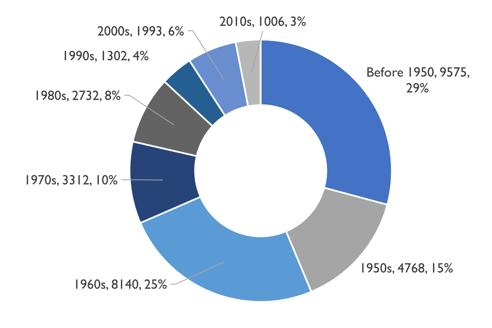
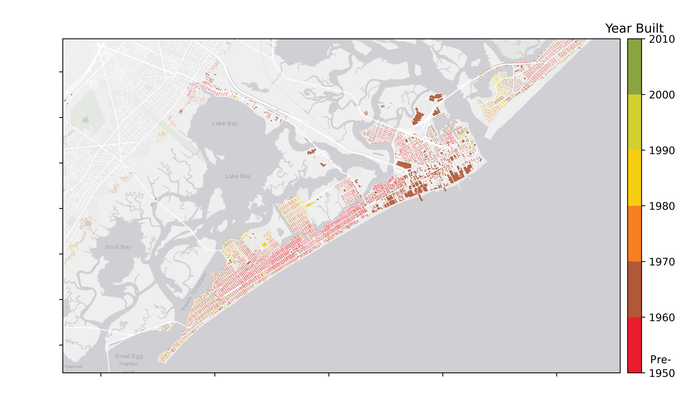
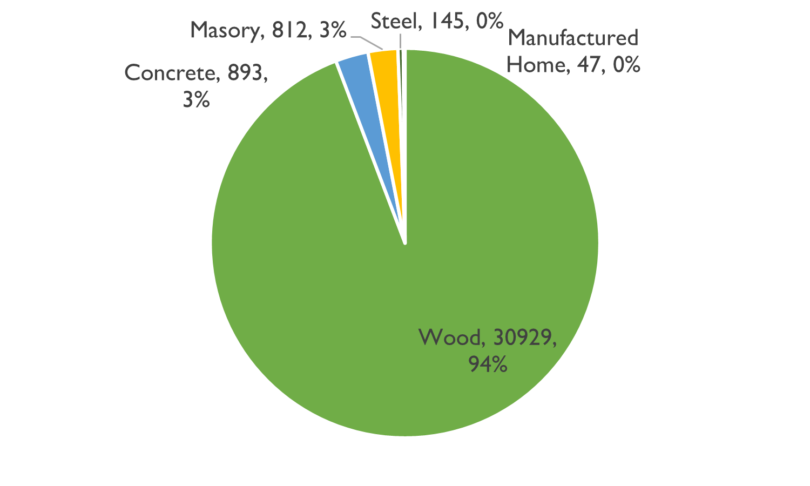
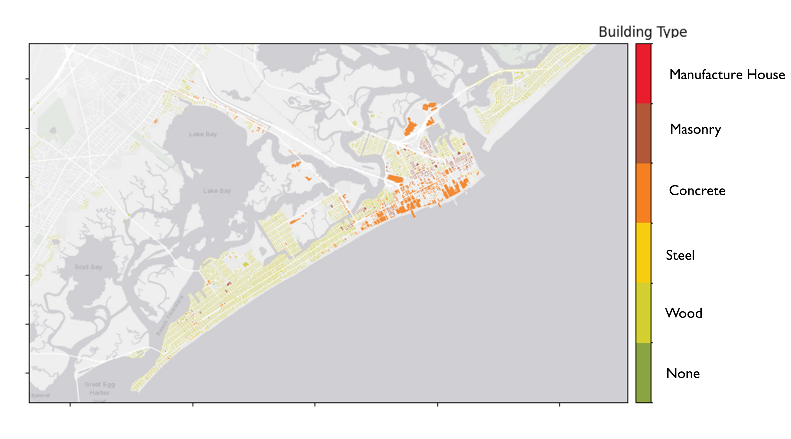

.. _lbl-testbed_AC_asset_description:

*****************
Asset Description
*****************

Testbed Building Inventory
===========================

This testbed includes 32,828 assets in the 23 cities of Atlantic County. The example
building inventory of these assets are shown in :numref:`bldg_inv`.

.. csv-table:: Example building inventory
   :name: bldg_inv
   :file: data/example_inventory.csv
   :header-rows: 1
   :align: center

The description of assets in the inventory adopts an augmented parcel approach
that initiates with the assignment of HAZUS-consistent building classifications
through a series of rulesets using fields common in tax assessor data, called
*MOD IV* in the New Jersey database ([NJGIN20]_). To overcome inevitable gaps
and errors in these large state-wide datasets, a SimCenter developed AI-powered
Spatial Uncertainty Research Framework package, SURF ([Wang19]_), is employed to
discover patterns in the dataset and to enhance it. Although the testbed still
does not able to include all existing assets in the Atlantic County, they resulting
inventory is believed to able to have a decent resolution, especially for the populated
coastal region. For instance, the most populated cities are Atlantic City
(6136 building assets), Margate City (5102), and Ventor City (4492) which
contribute to about 50% of the entire building inventory.

.. figure:: figure/num_building_city.png
   :name: num_building_city
   :align: center
   :figclass: align-center
   :figwidth: 90%

   Number of buildings in this testbed for the 23 cities of Atlantic County.

In the entire building inventory, :numref:`built_year` classifies the assets into 8
built eras from Pre-1950 to 2010s. Roughly 70% buildings in the testbed were built
before 1970. In the coastal region, large percentage buildings in the Ventor, Margate,
and Longport were dated to Pre-1950, while the downtown Atlantic City and South
Brigantine see more recent constructions (:numref:`built_year_spatial`).

   Distribution of built years.

   Distribution of built years in the coastal region.

The wood structure is found to be the predominant building type in the building
inventory which accounts for more than 90% of the assets in the County
(:numref:`building_type`). Concrete and masonry structures follow with roughly
3% contribution of each. Limited number of steel constructions and manufactured
home structures are seen in the inventory. The concrete structures are mainly
seen in the downtown Atlantic City (:numref:`building_type_spatial`).

   Distribution of structural types.

   Distribution of structural types in the coastal region.

Residential buildings contribute more than 90% of the entire inventory,
commercial buildings take about 5%, while other occupancy types are Agriculture,
Education, Government, Industry, and Religion (:numref:`occupancy_type`). Also,
most residential buildings are 1 to 2 stories, so these low rise buildings contribute
to about 90% of the entire inventory.

.. figure:: figure/occupancy_type.png
   :name: occupancy_type
   :align: center
   :figclass: align-center
   :figwidth: 80%

   Distribution of occupancy types.

.. figure:: figure/story_number.png
   :align: center
   :figclass: align-center
   :figwidth: 80%

   Distribution of stories numbers.

Processing Method of Building Inventory
========================================

This section, organized by the workflow's progressive levels of fidelity, describes how a large-scale
building inventory was derived for the case study region from tax assessor data, with various levels
of augmentation to address errors and omissions.

At Level 1, a building inventory is populated using publicly-available data and phased approach that
leverages machine learning and image processing to generate all attributes required for the corresponding
Level-1 loss assessment. It is emphasized that the intent is to demonstrate how an inventory could
be constructed and not to address potential errors, omissions or inaccuracies in the source data,
i.e., source data are assumed to be accurate and no  additional quality assurance was conducted outside
of addressing glaring omissions or errors.

Phase I: Attribute Definition
------------------------------

All the attributes required for loss estimation were first identified to develop the Building Inventory
data model, which catalogs each attribute, its purpose, its format (alphanumeric, floating point number,
etc.), the data source used to define that attribute and the field(s) needed from that data source, any
transformations of that source data necessary to align with the units or conventions used in the Building
Inventory, and any relevant details explaining notations, assumptions, or reference documents (:numref:`bldg_inv_dm`).

.. csv-table:: Building Inventory data model developed in this testbed.
   :name: bldg_inv_dm
   :file: data/building_inventory_data_model.csv
   :header-rows: 1
   :align: center

Phase II: Footprint Selection
------------------------------

The Atlantic County Building Inventory was populated initially with Footprint Data generated by the New
Jersey Department of Environmental Protection (NJDEP). The NJDEP dataset focused specifically on buildings
in Specific Flood Hazard Areas (SFHAs), creating two Geodatabases encompassing approximately 453,000 footprints
across the entire state:

1. **BF_NJDEP_20190612**: all building footprints within 1% annual chance (AC) floodplain, as defined by FEMA Flood
Insurance Rate Maps (FIRMs).

2. **02pct_20190520 Building_Footprints_02pct**: buildings that are not in the first dataset but fall within a
200-ft buffer of the 1% AC floodplain boundary.

Phase III: Augmentation Using Third-Party Data
-----------------------------------------------

Attributes parsed from third-party data providers are then populated into the Building Inventory for each
identified footprint, beginning first with the footprints form NJDEP. These footprints were enriched with
various attributes necessary to conduct standard FEMA risk assessments. Specifically, all footprints included
a set of Basic Attributes (:numref:`basic_attri`). A subset of the data, including Atlantic County,
had additional Advanced Attributes required by HAZUS User Defined Facilities (UDF) Module (:numref:`udf_attri`) and
FEMA Substantial Damage Estimator (SDE) Tool (:numref:`sde_attri`).

.. csv-table:: NJDEP basic attributes.
   :name: basic_attri
   :file: data/basic_attributes.csv
   :header-rows: 1
   :align: center

.. csv-table:: Advanced attributes for UDF.
   :name: udf_attri
   :file: data/udf_attributes.csv
   :header-rows: 1
   :align: center

.. csv-table:: Advanced attributes for SDE.
   :name: sde_attri
   :file: data/sde_attributes.csv
   :header-rows: 1
   :align: center

For footprints that were not included in the NJDEP dataset, attributes that were previously assigned using NJDEP Basic,
UDF or SDE fields were derived by parsing New Jersey Tax Assessor Data (called *MODIV*)
as defined in the MODIV User Manual . This notably affected attributes such as *OccupancyClass*,
*BuildingType* and *FoundationType*. In all cases where attributes were derived from *MODIV* data,
whose fields can be sparsely populated, default values were initially assigned to ensure that
every footprint would have the attributes required for the workflow. These default values were
selected using engineering judgement to represent the most common/likely attribute expected or
conservatively from the perspective of anticipated losses (i.e., picking the more vulnerable attribute option).
These initial assignments are then updated if additional data is available in *MODIV* to make a more faithful attribute assignment.

Phase IV: Augmentation Using Image Processing
----------------------------------------------

A number of required attributes pertaining to externally-visible features of the building were either
not included by NJDEP or warranted cross validation. Thus fields like roof shape, roof slope, building
elevations and the number of stories were augmented using image processing techniques.
As roof geometry is not a standard field in MOD IV data, satellite imagery is processed to further augment
the basic parcel data. The SimCenter developed application Building Recognition using Artificial Intelligence
at Large Scales, BRAILS ([Wang19]_), is used to interpret satellite images of building roofs, which
are collected from Google Maps.  The satellite images are labeled with shape types to form a dataset, upon
which a Convolutional Neural Network (CNN) is trained so that it can give rapid predictions of roof types
when given new images of roofs.  Microsoft Building Footprint data is used as the location index when
downloading images automatically from Google Maps. While more complex roof shapes could in theory be
classified, the current use of HAZUS damage and loss functions required the use of similitude measures to
define each roof as an “effective” gable, hip or flat geometry. Using BRAILS, this classification was
achieved with approximately 85% accuracy based on validation studies.

.. [NJGIN20]
   NJ Geographic Information Network, State of New Jersey, https://njgin.nj.gov/njgin/#!/

.. [Wang19]
   Wang C. (2019), NHERI-SimCenter/SURF: v0.2.0 (Version v0.2.0). Zenodo. http://doi.org/10.5281/zenodo.3463676
