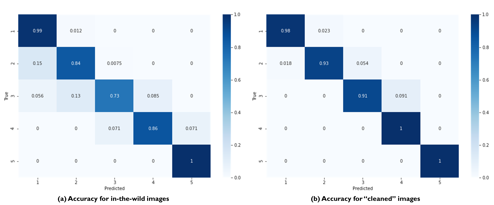

.. _lbl-testbed_AC_asset_description:

*****************
Asset Description
*****************

This section describes how a large-scale building inventory was constructed in two phases. The initial 
phase of this work involved identifying the attributes needed. The second phase comprised 
obtaining these attributes for each building using machine learning and 
computer vision techniques to create a core set of attributes. The remaining attributes were 
then obtained using other data sources as discussed below.

Phase I: Attribute Definition
===============================

All the attributes required for loss estimation were first identified to develop the Building Inventory 
data model. This Building Inventory data model presented in :numref:`tab-bldg_inv_data_model_ac`
provides a set of attributes that are assigned to each asset to form the building inventory file 
serving as input to the workflow. For each attribute a row in the table is provided. Each row has a number 
of columns: the attribute name, description, format (such as alphanumeric, floating-point number), the data source used to define that attribute.
An expanded version of :numref:`tab-bldg_inv_data_model_ac` with the full details of this data
model is available on DesignSafe PRJ-3314.

.. csv-table:: Building Inventory data model for Atlantic County Inventory.
   :name: tab-bldg_inv_data_model_ac
   :file: table/building_inventory_data_model_new.csv
   :header-rows: 1
   :align: center
   :widths: 15, 40, 25


Phase II: Inventory Generation
===============================

This section describes how the large-scale building inventory was constructed for Atlantic County using 
a phased approach that used machine learning, computer vision algorithm and data distributions to 
generate all attributes required for the corresponding loss assessment. It is emphasized that the intent is 
to demonstrate how an inventory could be constructed and not to address potential errors, omissions or 
inaccuracies in the source data, i.e., source data are assumed to be accurate, and no additional 
quality assurance was conducted outside of addressing glaring omissions or errors.

For each of the attributes identified in :numref:`tab-bldg_inv_data_model_ac`, 
a description of the attribute and information on how the data was identified and validated is presented.

Phase II: Footprint Selection
------------------------------------------------

Inventory development began with the footprint Data generated by the New Jersey Department of 
Environmental Protection (NJDEP). These NJDEP footprints include flood-exposed properties cataloged 
in two geodatabases encompassing approximately 453,000 footprints across the entire state:

1. **BF_NJDEP_20190612**: all building footprints within 1% annual chance (AC) floodplain, as defined by FEMA Flood
Insurance Rate Maps (FIRMs).

2. **02pct_20190520 Building_Footprints_02pct**: buildings that are not in the first dataset but fall within a
200-ft buffer of the 1% AC floodplain boundary.

These databases were then combined, with only properties within the limits of Atlantic County retained to form 
the Flood-Exposed Inventory. This inventory was then extended to include other footprints within the county 
boundaries. Microsoft (MS) Footprint Database was utilized as the primary source of Non-NJDEP footprint polygons.
One observed shortcoming of the MS Footprint Database is it incorrectly lumps together the footprints of closely 
spaced buildings. This issue was resolved by a combination of manual inspections and applying a separate roof 
segmentation algorithm to the satellite images obtained for the buildings. This resulted in the 
**Atlantic County Inventory**.

AI/ML Techniques combined with Computer Vision
------------------------------------------------

Most of the key building attributes were generated using SimCenter’s 
`BRAILS <https://nheri-simcenter.github.io/BRAILS-Documentation/index.html>`_. The following
 is a brief description of how these attributes were obtained and the utilized methods were validated.

Attribute: NumberOfStories
```````````````````````````

Number of floors of each building is determined using an object detection procedure implemented in BRAILS. A detection model that 
can automatically detect rows of building windows was established to generate the image-based detections 
of visible floor locations from street-level images. The model was trained on the 
`EfficientDet-D7 architecture <https://arxiv.org/abs/1911.09070>`_ with a dataset of 60,000 images, 
using 80% for training, 15% for validation, and 5% testing of the model. In order to ensure faster model 
convergence, initial weights of the model were set to model weights of the (pretrained) object detection 
model that, at the time, achieved state-of-the-art performance on the 
`2017 COCO Detection set <https://cocodataset.org/#download>`_. For this 
specific implementation, the peak model performance was achieved using the `Adam optimizer <https://arxiv.org/abs/1412.6980>`_ at a learning 
rate of 0.0001 (batch size: 2), after 50 epochs. :numref:`num_stories_detection` shows examples of the 
floor detections performed by the model.

.. figure:: figure/NumOfStoriesDetection.png
   :name: num_stories_detection
   :align: center
   :figclass: align-center
   :width: 600

   Sample floor detections of the floor detection model (each detection is indicated by a green bounding box). The percentage value shown on the top right corner of a bounding box indicates model confidence level associated with that prediction.

For an image, the described floor detection model generates the bounding box output for its 
detections and calculates the confidence level associated with each detection 
(see :numref:`num_stories_detection`). A post-processor that converts stacks of neighboring 
bounding boxes into floor counts was developed to convert this output into floor counts. 
Recognizing an image may contain multiple buildings at a time, this post-processor was 
designed to perform counts at the individual building level. 

For a random image dataset of buildings captured using arbitrary camera orientations (also 
termed in the wild images), the developed floor detection model was determined to capture 
the number of floors information of buildings with an accuracy of 86%. 
:numref:`num_stories_vali` (a) provides a breakdown of this accuracy measure for 
different prediction classes (i.e. the confusion matrix of model classifications). 
It was also observed that if the image dataset is established such that building images 
are captured with minimal obstructions, the building is at the center of the image, and 
perspective distortions are limited, the number of floors detections were performed at an 
accuracy level of 94.7% by the model. :numref:`num_stories_vali` (b)
shows the confusion matrix for the model predicting on the “cleaned” image data. 
In quantifying both accuracy levels, a test set of 3,000 images randomly selected 
across all counties of a companion testbed in New Jersey, excluding Atlantic County (site of that 
testbed), was utilized.



   Confusion matrices for the number of floors predictor used in this study.

.. _lbl-testbed_LC_asset_description_meanroofht:

Attribute: MeanRoofHt
``````````````````````

The elevation of the bottom plane of the roof (lowest edge of roof line) and elevation of the roof 
(peak of gable or apex of hip) are estimated with respect to grade (in feet) from street-level imagery. 
These geometric properties are defined visually for common residential coastal typologies in 
:numref:`building_elevation`. The mean height of the roof system is then derived as 
the average of these dimensions.

.. figure:: figure/BldgElev.png
   :name: building_elevation
   :align: center
   :figclass: align-center
   :width: 600
   
   Schematics demonstrating elevation quantities for different foundation systems common in coastal areas.

The MeanRoofHt is based on the following AI technique. :numref:`mean_roof_ht_app` 
plots the predicted roof height versus the number of floors of the inventory.

As in any single-image metrology application, extracting the building elevations from imagery requires:

#. Rectification of image perspective distortions, typically introduced during capturing of an image capture.
#. Determining the pixel counts representing the distances between ends of the objects or surfaces of interest 
   (e.g., for first-floor height, the orthogonal distance between the ground and first-floor levels).
#. Converting these pixel counts to real-world dimensions by matching a reference measurement with the 
   corresponding pixel count.

Given that the number of street-level images available for a building can be limited and sparsely spaced, 
a single image rectification approach was deemed most applicable for regional-scale inventory 
development. The first step in image rectification requires detecting line segments on the front 
face of the building. This is performed by using the `L-CNN <https://arxiv.org/abs/1905.03246>`_ 
end-to-end wireframe parsing method. Once the segments are detected, vertical and horizontal lines 
on the front face of the building are automatically detected using 
`RANSAC <https://dl.acm.org/doi/10.1145/358669.358692>`_ line fitting based on the 
assumptions that line segments on this face are the predominant source of line segments in the image 
and the orientation of these line segments change linearly with their horizontal or vertical position 
depending on their predominant orientation. The Another support vector model implemented for image 
rectification focuses on the street-facing plane of the building in an image, and, based on the 
Manhattan World assumption, (i.e., all surfaces in the world are aligned with two horizontal and 
one vertical dominant directions) iteratively transforms the image such that horizontal edges on the 
facade plain lie parallel to each other, and its vertical edges are orthogonal to the horizontal edges.

In order to automate the process of obtaining the pixel counts for the ground elevations, a facade 
segmentation model was trained to automatically label ground, facade, door, window, and roof pixels 
in an image. The segmentation model was trained using 
`DeepLabV3 architecture on a ResNet-101 backbone <https://arxiv.org/abs/1706.05587>`_, pretrained on 
`PASCAL VOC 2012 segmentation dataset <http://host.robots.ox.ac.uk/pascal/VOC/voc2012/>`_, using a 
facade segmentation dataset of 30,000 images supplemented with relevant portions of ADE20K segmentation 
dataset. The peak model performance was attained using the `Adam optimizer <https://arxiv.org/abs/1412.6980>`_ at a learning rate of 0.001 
(batch size: 4), after 40 epochs. The conversion between pixel dimensions and real-world dimensions were 
attained by use of field of view and camera distance information collected for each street-level imagery.

:numref:`mean_roof_ht_app` shows a scatter plot of the AI predicted mean roof heights vs AI-predicted number of floors. 
A general trend observed in this plot is that the roof height increases with the number of floors, 
which is in line with the general intuition.

.. figure:: figure/MeanRoofHtApp.png
   :name: mean_roof_ht_app
   :align: center
   :figclass: align-center
   :width: 400

   AI-predicted MeanRoofHt versus number of floors.

Attribute: FirstFloorElevation
`````````````````````
FirstFloorElevation is calculated using the distance between the bottom of the facade mask and the bottom of the fron door of the building. The process of
obtaining these masks follow the same approach used for roof mean height and is not repeated here.

Attribute: RoofSlope
`````````````````````
RoofSlope is calculated as the ratio between the roof height and the roof run. Roof height is obtained 
by determining the difference between the bottom plane and apex elevations of the roof as defined in the 
:ref:`lbl-testbed_LC_asset_description_meanroofht` 
section. Roof run is determined as half the smaller dimension of the building, as determined from 
the dimensions of the building footprint. :numref:`mean_slope_app` displays the AI-predicted mean roof height versus the 
AI-precited roof pitch ratios. As expected, very little correlation between these two parameters are observed.

.. figure:: figure/RoofSlopeApp.png
   :name: mean_slope_app
   :align: center
   :figclass: align-center
   :width: 400

   AI-predicted RoofSlope versus mean roof height.
   
Attribute: RoofShape
`````````````````````

The RoofShape is obtained by CityBuilder using the BRAILS Roof shape module. The roof shape module 
determines roof shape based on a satellite image obtained for the building. The module uses machine 
learning, specifically it utilizes a convolutional neural network that has been trained on satellite 
images. In AI/ML terminology the Roof Shape module is an image classifier: it takes an image and 
classifies it into one of three categories used in HAZUS: gable, hip, or flat as shown in 
:numref:`roof_shape`. The original training of the AI model utilized 6,000 images obtained from google 
satellite imagery in conjunction with roof labels obtained from 
`Open Street Maps <https://www.openstreetmap.org/>`_. As many roofs have more complex shapes, a 
similitude measure is used to determine which of these roof geometries is the best match to a given roof. 
More details of the classifier can be found 
`here <https://nheri-simcenter.github.io/BRAILS-Documentation/common/user_manual/modules/roofClassifier.html>`_. 
The trained classifier was employed here to classify the roof information for Atlantic County.

.. figure:: figure/RoofShape.png
   :name: roof_shape
   :align: center
   :figclass: align-center
   :width: 500
   
   Roof type classification with examples of aerial images (a-f) and simplified archetypes (d-f) used by Hazus.

The performance of the roof shape classifier was validated against two ground truth datasets.
The first is comprised of 125 manually labeled satellite images sampled from OpenStreetMap from 
across the US, retaining only those with unobstructed views of building roofs (a cleaned dataset). 
The second is 56 residences assessed by StEER for which roof types were one of the three HAZUS classes, 
e.g., removing all roofs labeled as "Complex" according to StEER's distinct image labeling standards. 
The validation process is documented
`here <https://nheri-simcenter.github.io/BRAILS-Documentation/common/technical_manual/roof.html>`_. 
The confusion matrices are presented in :numref:`roof_shape_vali`. These matrices visually present 
the comparison between the predictions and actual data and should have values of 1.0 along the diagonal 
if the classification is perfect, affirming the accuracy of the classification by the roof shape classifier.

.. figure:: figure/RoofShapeVali.png
   :name: roof_shape_vali
   :align: center
   :figclass: align-center
   :width: 600

   Validation of BRAILS predicted roof shapes to roof shapes from OpenStreetMap and StEER.

Attribute: RoofSlope
`````````````````````
RoofSlope is calculated as the ratio between the roof height and the roof run. Roof height is obtained 
by determining the difference between the bottom plane and apex elevations of the roof as defined in the 
:ref:`lbl-testbed_LC_asset_description_meanroofht` 
section. Roof run is determined as half the smaller dimension of the building, as determined from 
the dimensions of the building footprint. :numref:`mean_slope_app` displays the AI-predicted mean roof height versus the 
AI-precited roof pitch ratios. As expected, very little correlation between these two parameters are observed.

.. figure:: figure/RoofSlopeApp.png
   :name: mean_slope_app
   :align: center
   :figclass: align-center
   :width: 400

   AI-predicted RoofSlope versus mean roof height.

Attribute: WindowArea
`````````````````````
The proportion of windows to the overall surface area is not available in inventory and 
                    assessor datasets though required for wind loss modeling. Generally, window area can be 
                    assumed based on the building occupancy class given Department of Energy industry databases. 
                    This property can also be estimated from street-level imagery, by taking advantage of the 
                    window masks generated as part of the segmentation performed when determining building 
                    elevations. For this application, window area is defined as a percentage of the total 
                    facade area as the ratio of the area of windows masks to the area of the front facade 
                    of the building. The underlying assumption is that the proportion of surface area occupied 
                    by windows at the front of the building is representative of the amount of window openings 
                    on the sides and rear of the building. This enables the ratio calculated for the front 
                    face of the building to be used for the whole building. This assumption may hold for single 
                    family residential buildings, but possibly not for other commercial construction where 
                    street fronts have higher proportions of glass. In lieu of this computer vision approach, 
                    users may choose to adopt industry norms for their window areas (see callout box below).
                    
                    .. note::
                       
                     **Industry Norms on Window Area**: Engineered residential buildings can be assumed to have low window to wall  
                     area ratios (WWR) based on the information for Reference Buildings in Baltimore, MD from the 
                     `Office of Energy Efficiency and Renewable Energy <https://www.energy.gov/eere/downloads/reference-buildings-building-type-midrise-apartment>`_. Reference Buildings were created for select cities 
                     based on climate profile; of the available cities, Baltimore is selected since its climate is most 
                     similar to Atlantic City, NJ. Office buildings (used as a test case for commercial), have WWR of 
                     33% and apartments (used as a test case for residential) have WWR of 15%.

.. note::

   The process of constructing the **Atlantic County Inventory** for footprints beyond those in the 
   **Flood-Exposed Inventory** underscored a number of tasks/issues that are commonly encountered when constructing an inventory 
   in a location with sparse inventory data. Recommended best practices are summarized in :ref:`lbl-testbed_AC_best_practices`.

Phase III: Augmentation Using Third-Party Data
================================================

Attributes were then parsed from third-party data providers to populate all required attributes in the Building 
Inventory data model. For the Flood-Exposed Inventory, NJDEP had already enriched these footprints with various 
attributes necessary to conduct standard FEMA risk assessments. Specifically, all footprints included a set of 
Basic Attributes (:numref:`tab-basicAttri`). A subset of the data, including Atlantic County, had additional Advanced 
Attributes required by HAZUS User Defined Facilities (UDF) Module (:numref:`tab-udfAttri`) and FEMA Substantial Damage 
Estimator (SDE) Tool (:numref:`tab-sdeAttri`).

.. _tab-basicAttri:

.. csv-table:: NJDEP basic attributes available for all properties in Flood-Exposed Inventory.
   :file: data/basic_attributes.csv
   :header-rows: 1
   :align: center

.. _tab-udfAttri:

.. csv-table:: Advanced attributes for HAZUS User Defined Facilities (UDF), available for all properties in Flood-Exposed Inventory.
   :file: data/udf_attributes.csv
   :header-rows: 1
   :align: center
   :widths: 15, 85

.. _tab-sdeAttri:

.. csv-table:: Advanced attributes for FEMA Substantial Damage Estimator (SDE) Tool, available for all properties in Flood-Exposed Inventory.
   :name: sde_attri
   :file: data/sde_attributes.csv
   :header-rows: 1
   :align: center

For the Atlantic County Inventory, any building not included in the NJDEP footprints had attributes encompassed 
by NJDEP Basic, UDF or SDE fields assigned by parsing New Jersey Tax Assessor Data (called **MODIV**) ([MODIV]_) as defined in 
the MODIV User Manual ([MODIV18]_). This notably affected attributes such as OccupancyClass, BuildingType and FoundationType, 
whose rulesets (PDFs and Python scripts) are cross-referenced in :numref:`addinfo_ruleset_njdep`. 
In all cases where attributes were derived from MODIV data, whose fields can be sparsely populated, default 
values were initially assigned to ensure that every footprint would have the attributes required to execute 
the workflow. These default values were selected using engineering judgment to represent the most common/likely 
attribute expected or conservatively from the perspective of anticipated losses (i.e., picking the more 
vulnerable attribute option). These initial assignments were then updated if additional data is available in 
**MODIV** to make a more faithful attribute assignment.

.. list-table:: Additional details for rulesets assigning attributes available only in NJDEP dataset
   :name: addinfo_ruleset_njdep
   :header-rows: 1
   :align: center

   * - Ruleset Name
     - Ruleset Definition Table
     - Python script
   * - Building Type Rulesets
     - `Building Type Rulesets.pdf <https://github.com/kuanshi/AssetRepresentationRulesets/blob/main/rulesets/NJ/pdf/MODIVTransformations/Building%20Type%20Rulesets.pdf>`_
     - To be released
   * - Foundation Type Rulesets
     - `Foundation Type Rulesets.pdf <https://github.com/kuanshi/AssetRepresentationRulesets/blob/main/rulesets/NJ/pdf/MODIVTransformations/Foundation%20Type%20Rulesets.pdf>`_
     - To be released
   * - Occupancy Type Rulesets
     - `Occupancy Type Rulesets.pdf <https://github.com/kuanshi/AssetRepresentationRulesets/blob/main/rulesets/NJ/pdf/MODIVTransformations/Occupancy%20Class%20Rulesets.pdf>`_
     - To be released

Some attributes in the Building Inventory Data Model were not encompassed by NJDEP Basic, UDF or SDE fields, thus 
remaining attributes in both the Flood-Exposed and Atlantic County Inventories were assigned using data 
from the following third-party sources:
1. **Locations of essential facilities** were sourced from NJ Office of Information Technology (part of NJGIN Open Data [NJGIN20]_)
2. **ATC Hazards** by Location API ([ATC20]_) was used to query Design Wind Speeds as defined in ASCE 7 
3. **Terrain features** (roughness length associated with different exposure classes) was derived from Land Use Land Cover data (part of NJGIN Open Data [NJGIN20]_)

See the Transformation and Detail columns in the PDFs listed in :numref:`tab-bldgInventory` for specifics of how each attribute 
was assigned using these various third-party data sources.

.. _lbl-testbed_AC_asset_description_phase_iv:

Populated Inventories
========================

Executing this four-phase process resulted in the assignment of all required attributes at the asset description 
stage of the workflow for both the **Atlantic County Inventory** and the **Flood-Exposed Inventory**. 
:numref:`bldg_inv_ac` and :numref:`bldg_inv_fei` provide respective examples of each of these inventories. 
The Flood-Exposed Inventory then was used to extract out the subset of buildings defining the  
**Exploration Inventory** (see example in :numref:`bldg_inv_ei`). The full inventories can be downloaded 
`here <https://github.com/NHERI-SimCenter/SimCenterDocumentation/blob/master/docs/common/testbeds/atlantic_city/data/full_inventories.zip>`_.

.. csv-table:: Illustrative sample of building in Atlantic Inventory.
   :name: bldg_inv_ac
   :file: data/example_inventory_ac.csv
   :align: center
   :widths: 8, 8, 10, 10, 8, 10, 10, 10, 10

.. raw:: latex

    \begin{landscape}
    \begin{tiny}

.. csv-table:: Illustrative sample of building in Flood-Exposed Inventory.
   :name: bldg_inv_fei
   :file: data/example_inventory.csv
   :align: center

.. csv-table:: Illustrative sample of building in Exploration Inventory.
   :name: bldg_inv_ei
   :file: data/example_inventory_exploration.csv
   :align: center

.. raw:: latex

    \end{tiny}
    \end{landscape}

.. list-table:: Summary of the three building inventories.
   :name: access_inventories
   :header-rows: 1
   :align: center

   * - Inventory Name
     - DesignSafe Document
     - Number of Assets
     - Typical Run Time
   * - Atlantic County Inventory
     - Atlantic County Inventory
     - 100,721
     - ~ 1,500 CPU-Hour
   * - Flood-Exposed Inventory
     - `Flood-Exposed Inventory <https://github.com/NHERI-SimCenter/SimCenterDocumentation/blob/master/docs/common/testbeds/atlantic_city/data/FloodExposedInventory.csv>`_
     - 32,828
     - ~ 440 CPU-Hour
   * - Exploration Inventory
     - `Exploration Inventory <https://github.com/NHERI-SimCenter/SimCenterDocumentation/blob/master/docs/common/testbeds/atlantic_city/data/ExplorationInventory.csv>`_
     - 1,000
     - ~ 12 CPU-Hour


.. [ATC20]
   ATC (2020b), ATC Hazards By Location, https://hazards.atcouncil.org/, Applied Technology Council, Redwood City, CA.

.. [NJGIN20]
   NJ Geographic Information Network, State of New Jersey, https://njgin.nj.gov/njgin/#!/

.. [Wang19]
   Wang C. (2019), NHERI-SimCenter/SURF: v0.2.0 (Version v0.2.0). Zenodo. http://doi.org/10.5281/zenodo.3463676

.. [Microsoft2018]
   Microsoft (2018) US Building Footprints. https://github.com/Microsoft/USBuildingFootprints

.. [MODIV]
   Parcels and MOD-IV of Atlantic County, NJ. NJGIN Open Data, https://njogis-newjersey.opendata.arcgis.com/datasets/680b02ff9b4348409a2f4ccd4c238215.

.. [MODIV18]
   Department of the Treasury, State of New Jersey (2018), MOD IV User Manual. https://www.state.nj.us/treasury/taxation/pdf/lpt/modIVmanual.pdf