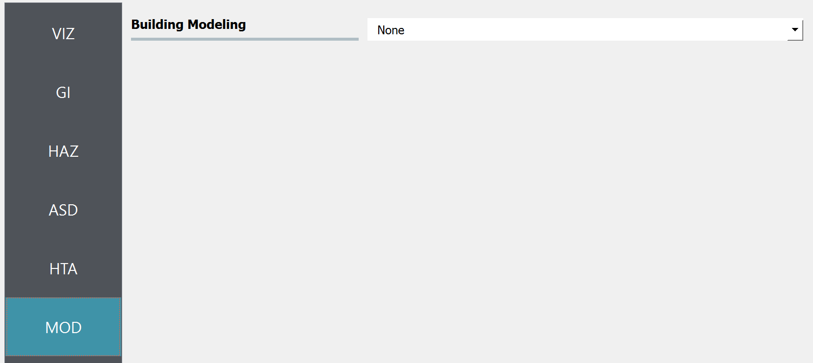
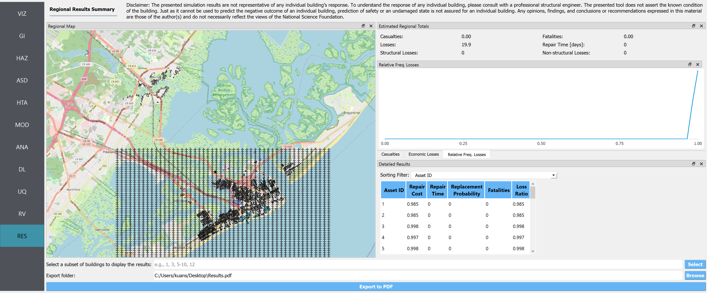
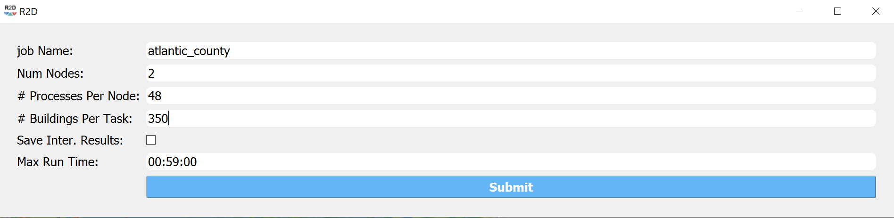

.. _lbl-testbed_AC_example_outputs:

**************************
Getting Started
**************************

R2D Interface
---------------

One approach to running the testbed simulation is via the 
`R2D application <https://www.designsafe-ci.org/data/browser/public/designsafe.storage.community/SimCenter/Software/R2Dt>`_.
After successfully downloading and launching, the major steps for setting up the run are listed as follows:

#. Set the **Units** in the **GI** panel as shown in :numref:`r2d_gi_ac` and check the desired output files.

   .. figure:: figure/R2D_GI.png
      :name: r2d_gi_ac
      :align: center
      :figclass: align-center
      :width: 500

      R2D GI setup.
#. Download and unzip the `IMs.zip <https://www.designsafe-ci.org/data/browser/public/designsafe.storage.published//PRJ-3314/02.%20Input:%20HAZ%20-%20Hazard%20Characterization?doi=10.17603%2Fds2-83ca-r890>`_. 
   Set the **Event File Listing Wind Field** in the **HAZ** panel to the "EventGrid.csv" in the unzipped "IMs" folder.
   The app will automatically load the directory (:numref:`r2d_haz_ac`). The **Units of Event Input File** should be 
   "Miles per hour".

   .. figure:: figure/R2D_HAZ.png
      :name: r2d_haz_ac
      :align: center
      :figclass: align-center
      :width: 500

      R2D HAZ setup.
#. Download the `BIM_AtlanticCounty_FloodExposed.csv <https://www.designsafe-ci.org/data/browser/public/designsafe.storage.published/PRJ-3314/01.%20Input:%20BIM%20-%20Building%20Inventory%20Data?doi=10.17603%2Fds2-83ca-r890>`_ (under **01. Input: BIM - Building Inventory Data** folder). 
   Select **CSV to BIM** in the **ASD** panel and set the **Import Path** to "BIM_AtlanticCounty_FloodExposed.csv" (:numref:`r2d_asd_ac`). 
   Specify the building IDs that you want to include in the simulation.

   .. figure:: figure/R2D_ASD.png
      :name: r2d_asd_ac
      :align: center
      :figclass: align-center
      :width: 500

      R2D ASD setup.
#. Set the **Regional Mapping** and **SimCenterEvent** in the **HTA** panel (e.g., :numref:`r2d_hta_ac`).

   .. figure:: figure/R2D_HTA.png
      :name: r2d_hta_ac
      :align: center
      :figclass: align-center
      :width: 500

      R2D HTA setup.
#. Set the "Building Modeling" in the **MOD** panel to "None".

   R2D MOD setup.
#. Set the "Building Analysis Engine" in the **ANA** panel to "IMasEDP". 

   .. figure:: figure/R2D_ANA.png
      :name: r2d_ana_ac
      :align: center
      :figclass: align-center
      :width: 500

      R2D ANA setup.
#. Set the "Damage and Loss Method" in the **DL** panel to "HAZUS MH HU". Download and extract the ruleset scripts from 
   `DesignSafe PRJ-3314 <https://www.designsafe-ci.org/data/browser/public/designsafe.storage.published/PRJ-3314/03.%20Input:%20DL%20-%20Rulesets%20for%20Asset%20Representation?doi=10.17603%2Fds2-83ca-r890>`_ 
   (the **03. Input: DL - Rulesets for Asset Representation/script.zip** folder) and 
   set the **Auto populate script** to "auto_HU_NJ.py" (:numref:`r2d_dl_ac`). Please note, place the ruleset scripts 
   in an individual folder so that the application can copy and load them later. 

   .. figure:: figure/R2D_DL.png
      :name: r2d_dl_ac
      :align: center
      :figclass: align-center
      :width: 500

      R2D DL setup.
#. Set the "UQ Application" in the **UQ** panel to "None". 

   .. figure:: figure/R2D_UQ.png
      :name: r2d_uq_ac
      :align: center
      :figclass: align-center
      :width: 500

      R2D UQ setup.

After setting up the simulation, click **RUN** to execute the analysis. Once the simulation is completed, 
the app will direct you to the **RES** panel (:numref:`r2d_res_ac`) where you can examine and export the results.

   R2D RES panel.

For simulating the damage and loss for a large region of interest (remember to reset the building IDs in **ASD**), it is efficient to submit and run the job 
to `DesignSafe <https://www.designsafe-ci.org/>`_ on `Frontera <https://www.tacc.utexas.edu/systems/frontera>`_. 
This can be done in R2D by clicking **RUN at DesignSafe** (you will need to have a valid 
`DesignSafe account <https://www.designsafe-ci.org/account/register/>`_ for login and access to the computing resource). 
:numref:`r2d_run_ds_ac` provides an example configuration to run the analysis (see `R2D User Guide <https://nheri-simcenter.github.io/R2D-Documentation/common/user_manual/usage/desktop/usage.html#figremjobpanel>`_ for detailed descriptions).
The individual building simulations are parallelized when conducted on Frontera, which accelerates the process. It is suggested for the entire building 
inventory in this testbed to use 20 minutes with 96 Skylake (SKX) cores (e.g., 2 nodes with 48 processors per node) to complete 
the simulation. You will receive a job failure message if the specified CPU hours are not sufficient to complete the run. 
Note that the product of the node number, processor number per node, and buildings per task should be greater than the 
total number of buildings in the inventory to be analyzed.

   R2D - Run at DesignSafe (Configuration)

Users can monitor the job status and retrieve result data by clicking the **GET from DesignSafe** button (:numref:`r2d_get_ds_ac`). The retrieved data includes
four major result files, namely, *BIM.hdf*, *EDP.hdf*, *DM.hdf*, and *DV.hdf*. R2D also automatically converts the hdf files to csv files for easier manipulation.
While R2D provides basic visualization functionalities (:numref:`r2d_res_ac`), users can access the data downloaded under the remote work directory, e.g., 
*/Documents/R2D/RemoteWorkDir* (this directory is machine-specific and can be found in **File->Preferences->Remote Jobs Directory**).
Upon obtaining these result files, users can extract and process the information of interest - the next section will use 
the results from this testbed as an example to discuss more details.

.. figure:: figure/get_from_designsafe.png
   :name: r2d_get_ds_ac
   :align: center
   :figclass: align-center
   :width: 400

   R2D GET from DesignSafe.

Sample Results 
---------------

The estimated wind-only, flood-only, and total losses under the four hurricane
scenarios (:numref:`hurricane_cat`) are shown in :numref:`dl_c2` to :numref:`dl_c5`.

.. figure:: figure/DL_category2.png
   :name: dl_c2
   :align: center
   :figclass: align-center
   :width: 700

   Estimated regional loss maps for the **Category 2** hurricane.

.. figure:: figure/DL_category3.png
   :name: dl_c3
   :align: center
   :figclass: align-center
   :width: 700

   Estimated regional loss maps for the **Category 3** hurricane.

.. figure:: figure/DL_category4.png
   :name: dl_c4
   :align: center
   :figclass: align-center
   :width: 700

   Estimated regional loss maps for the **Category 4** hurricane.

.. figure:: figure/DL_category5.png
   :name: dl_c5
   :align: center
   :figclass: align-center
   :width: 700

   Estimated regional loss maps for the **Category 5** hurricane.

Average expected loss ratios are also computed for individual cities, which are
summarized in :numref:`cl_c2` to :numref:`cl_c5`.

.. figure:: figure/city_loss_c2.png
   :name: cl_c2
   :align: center
   :figclass: align-center
   :width: 800

   City-wise average expected loss ratios (**Category 2** hurricane).

.. figure:: figure/city_loss_c3.png
   :name: cl_c3
   :align: center
   :figclass: align-center
   :width: 800

   City-wise average expected loss ratios (**Category 3** hurricane).

.. figure:: figure/city_loss_c4.png
   :name: cl_c4
   :align: center
   :figclass: align-center
   :width: 800

   City-wise average expected loss ratios (**Category 4** hurricane).

.. figure:: figure/city_loss_c5.png
   :name: cl_c5
   :align: center
   :figclass: align-center
   :width: 800

   City-wise average expected loss ratios (**Category 5** hurricane).

For the top five cities with the most assets in the building inventory, the average
expected wind losses are computed for different construction eras. Buildings built before the 1980s generally
have relatively higher wind loss ratios, with the 1970s found to be the worst decade for
Atlantic City, Brigantine, and Galloway. Since 1980, building performance has improved,
with post-2000 buildings found to perform much better than buildings from other periods.

.. figure:: figure/atlantic_wind_loss.png
   :name: wl_atlantic
   :align: center
   :figclass: align-center
   :width: 800

   Average expected wind loss ratios (Atlantic City).

.. figure:: figure/brigantine_wind_loss.png
   :name: wl_brigantine
   :align: center
   :figclass: align-center
   :width: 800

   Average expected wind loss ratios (Brigantine).

.. figure:: figure/galloway_wind_loss.png
   :name: wl_galloway
   :align: center
   :figclass: align-center
   :width: 800

   Average expected wind loss ratios (Galloway).

.. figure:: figure/margate_wind_loss.png
   :name: wl_margate
   :align: center
   :figclass: align-center
   :width: 800

   Average expected wind loss ratios (Margate City).

.. figure:: figure/ventor_wind_loss.png
   :name: wl_ventnor
   :align: center
   :figclass: align-center
   :width: 800

   Average expected wind loss ratios (Ventnor City).

The results from the loss estimation for each scenario above (Category 2-5) and each available inventory, 
can be accessed (:numref:`example_results`). 

.. list-table:: Access points for example results
   :name: example_results
   :header-rows: 1
   :align: center

   * - Scenario
     - Inventory Options
     - Location
   * - Scaled Category 2
     - Flood-Exposed Inventory, Exploration Inventory
     - `Category2.zip <https://github.com/NHERI-SimCenter/SimCenterDocumentation/tree/master/docs/common/testbeds/atlantic_city/data/Category2.zip>`_
   * - Scaled Category 3
     - Flood-Exposed Inventory, Exploration Inventory
     - `Category3.zip <https://github.com/NHERI-SimCenter/SimCenterDocumentation/tree/master/docs/common/testbeds/atlantic_city/data/Category3.zip>`_
   * - Scaled Category 4
     - Flood-Exposed Inventory, Exploration Inventory
     - `Category4.zip <https://github.com/NHERI-SimCenter/SimCenterDocumentation/tree/master/docs/common/testbeds/atlantic_city/data/Category4.zip>`_
   * - Category 5
     - Flood-Exposed Inventory, Exploration Inventory
     - `Category5.zip <https://github.com/NHERI-SimCenter/SimCenterDocumentation/tree/master/docs/common/testbeds/atlantic_city/data/Category5.zip>`_
