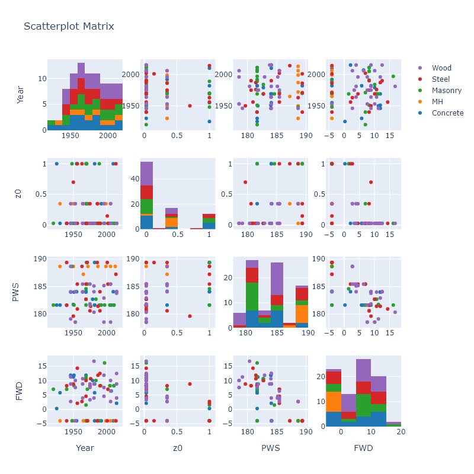

.. _lbl-testbed_AC_sample_results:

********************
Verification Results
********************

This page summarizes sample results from the testbed runs with three major focuses:

1. Verifying the estimated loss ratios by hand calculations,
2. Demonstrating the sensitivity study with different hurricane categories, and
3. Illustrating the influence of building properties on the hurricane loss using the observations from the sample results.

Building Inventory
===================

From the entire building inventory, `85 buildings <https://github.com/NHERI-SimCenter/SimCenterDocumentation/blob/master/docs/common/testbeds/atlantic_city/data/VerificationSample.csv>`_ are selected from 5 building
classes and 8 built eras. :numref:`scatter_matrix_ac` shows the data distributions of the built year, surface
roughness (:math:`z_0`), peak wind speed (PWS), and peak water depth (PWD).

   Scatter matrix of sampled buildings.

Hand Calculation
==================

Hand calculations of wind, flood, and combined losses are conducted using the
input building information and intensity measures for the sampled buildings.
The calculations are made for all four hurricane categories:

.. note::
   1. Cat-5: PWS (3s-gust) ~= 190 mph, maximum surge depth ~= 18 ft
   2. Cat-4: PWS ~= 140 mph, maximum surge depth ~= 15 ft
   3. Cat-3: PWS ~= 120 mph, maximum surge depth ~= 10 ft
   4. Cat-2: PWS ~= 100 mph, maximum surge depth ~= 7 ft

:numref:`hand_calc_ac` compares the hand-calculated loss ratios and the simulated
results, which are in good agreement. The finite differences seen in the flood loss ratios
are due to the random sampling process in estimating the expected loss ratios.

.. figure:: figure/SimuVSHandCalc.png
   :name: hand_calc_ac
   :align: center
   :figclass: align-center
   :width: 600

   Hand-calculated results vs. simulated results

Wind Loss by Building Class and Year
====================================

To understand the driving factors that influence the regional loss assessment results, 
the 85 sampled buildings are grouped into five building classes and the average wind loss values
are computed (:numref:`wind_loss_bt`). Regardless of the hurricane category, concrete, steel,
and masonry buildings perform better than wood buildings and manufactured homes on average.

.. figure:: figure/WindLossBuildingType.png
   :name: wind_loss_bt
   :align: center
   :figclass: align-center
   :width: 600

   Average expected wind losses by building class.

To further investigate the influence of the year built on the wind loss of wood buildings,
:numref:`wind_loss_yr` shows the estimated expected wind loss ratios by the year built.
Coupled with the hurricane category effect, in the Category 5 hurricane, the year built does not
appear as a driving factor, but in the other three scenarios, the wind losses are shown to be
related to the year built. The worst cases are seen in the 1970s and 1980s, while the buildings from the
past two decades perform much better than the other groups. Note that this
comparison is made for the limited sample size in this verification study.

.. figure:: figure/WoodBuildingWindLoss.png
   :name: wind_loss_yr
   :align: center
   :figclass: align-center
   :width: 600

   Average expected wind losses of wood buildings by year built.
