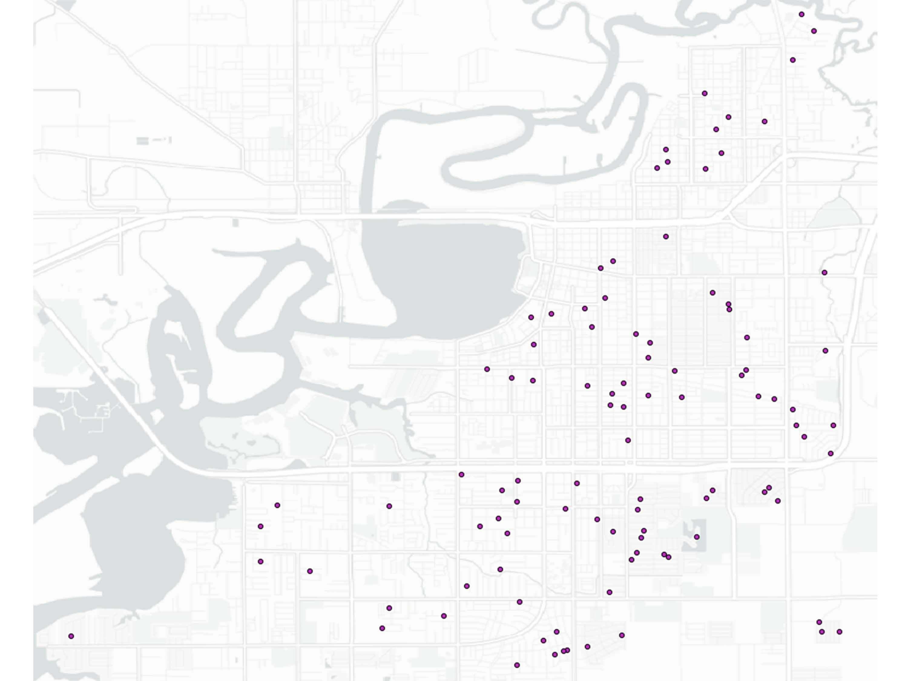

.. _lbl-testbed_LC_asset_description:

*****************
Asset Description
*****************

This section describes how a large-scale building inventory was constructed in two phases. The initial 
phase of this work involved identifying the attributes needed and the second phase involved work to 
obtain these attributes for each building. The second phase involved the use of machine learning and 
techniques from computer vision to create an initial set of attributes. The remaining attributes were 
then obtained using other data sources as will be discussed. For The Lake Charles testbed only wood 
residential houses were considered.

Phase I: Attribute Definition
===============================

All the attributes required for loss estimation were first identified to develop the Building Inventory 
data model. These attributes are presented in :numref:`tab-bldg_inv_data_model_lc`. For each attribute a 
row in the table is provided. Each row has a number of columns: the attribute name, description, 
format (alphanumeric, floating point number, etc.), the data source used to define that attribute 
and the field(s) needed from that data source. This Building Inventory data model presented in 
:numref:`tab-bldg_inv_data_model_lc` provides a set of attributes needed for the columns in an input 
asset description file provided to the workflow. Those attributes in white background are the minimal 
attributes needed, additional attributes shown in yellow can be provided in the input file or are 
automatically provided by rulesets in the running workflow.

.. _tab-bldg_inv_data_model_lc:

.. csv-table:: Building inventory data model, detailed for Lake Charles Inventory.
   :file: table/building_inventory_data_model_new.csv
   :header-rows: 1
   :align: center

Phase II: Inventory Generation
===============================

This section describes how the large-scale building inventory was constructed for Lake Charles using 
a phased approach that used machine learning, computer vision algorithm and data distributions to 
generate all attributes (attributes in white in :numref:`tab-bldg_inv_data_model_lc`) required for 
the corresponding loss assessment. It is emphasized that the intent is to demonstrate how an 
inventory could be constructed and not to address potential errors, omissions or inaccuracies in 
the source data, i.e., source data are assumed to be accurate and no additional quality assurance 
was conducted outside of addressing glaring omissions or errors. In the process of assembling this 
inventory, a number of scripts were developed to facilitate the actions described in the following 
sections. While these scripts were not intended to be production-quality software and were written 
assuming a particular data format/endpoint which may change over time, they do provide an example 
of the type of operations necessary to assemble a building inventory and thus are made available 
at GitHub as an illustrative example.

For each of the attributes identified in Table 2.2.1 the attribute, a description of the attribute 
and information on how the data was identified and validated is presented.

AI/ML Techniques combined with Computer Vision
------------------------------------------------

Many of those attributes were generated with the SimCenter’s 
`BRAILS <https://nheri-simcenter.github.io/BRAILS-Documentation/index.html>`_ CityBuilder application. 
To avoid replication in the text, for those attributes the following describes how those attributes 
were obtained. The sections below will present the validation of the data.

CityBuilder is a python application that incorporates different AI/ML modules from BRAILS for performing 
specific tasks. The user creates a python script importing City Builder, constructing a CityBuilder 
object and then asking that object to build the inventory. An example script, as shown below, albeit 
our GoogleMapAPIKey removed, will create a  building inventory file for use in the workflow.  
The example file:

.. code-block:: python

  # Import the module from BRAILS
  from brails.CityBuilder import CityBuilder
  # Initialize the CityBuilder
  cityBuilder = CityBuilder(attributes=['occupancy','roofshape'], 
                    numBldg=10,random=True, place='Lake Charles, Louisiana', 
                    GoogleMapAPIKey='REMOVED GOOGLE API KEY')
  # create the city-scale BIM file
  BIM = cityBuilder.build()

When running CityBuilder will do the following:

#. Download footprints for all buildings in the interested region, Lake Charles, from the 
   `Microsoft Footprint Dataset <https://github.com/microsoft/USBuildingFootprints>`_.
#. Based on the footprint information, CityBuilder calculates the coordinate (Latitude, 
   Longitude) for each building’s centroid.
#. These coordinates are then used as a reference for downloading both a satellite image and 
   a street view image for each building using Google API’s.
#. A series of pre-trained AI models are then called to perform computations on the images to 
   obtain the interested building attributes.

RoofShape
````````````

The RoofShape is obtained by CityBuilder using the BRAILS Roof shape module. The roof shape module 
determines roof shape based on a satellite image obtained for the asset. The module uses machine 
learning, specifically it utilizes a convolutional neural network that has been trained on satellite 
images. In AI/ML terminology the Roof Shape module is an image classifier: it takes an image and 
classifies it into 1 of several categories. This classifier identifies the buildings as gabled, 
hipped, and flat. The original training of the AI model utilized 6,000 images obtained from google 
satellite imagery in conjunction with roof labels obtained from 
`Open Street Maps <https://www.openstreetmap.org/>`_. While more complex roof shapes could in 
theory be classified, Hazus defines roofs in one of three classes (gable, hip or flat as shown in 
:numref:`roof_shape`), so a similitude measure is used to determine which of these roof 
geometries is the best match to a given roof. More details of the classifier can be found 
`here <https://nheri-simcenter.github.io/BRAILS-Documentation/common/user_manual/modules/roofClassifier.html>`_. 
The trained classifier was employed here to classify the roof information for Lake Charles.

.. figure:: figure/RoofShape.png
   :name: roof_shape
   :align: center
   :figclass: align-center
   :figwidth: 600
   
   Roof type classification with examples of aerial images (a-f) and simplified archetypes (d-f) used by Hazus.

The performance of the roof shape classifier was validated against a ground truth dataset comprising 125 
manually labeled satellite images from the U.S comprising images with unobstructed views of building roofs 
(a cleaned dataset).  The validation was documented 
`here <https://nheri-simcenter.github.io/BRAILS-Documentation/common/technical_manual/roof.html>`_. 
The confusion matrix, which presents visually    the predictions versus actual data from the original 
125 image validation set is as shown in :numref:`roof_shape_vali`a below. 
:numref:`roof_shape_vali`b shows predictions for Lake Charles testbed against data for 
56 buildings that were obtained from StEER dataset. It should be noted that 
the labeling systems are different for the BRAILS RoofShape model and the StEER dataset. In addition 
to flat, gabled, and hipped, there are hybrid types (e.g., Gable-Hip Combo). To compare the performance 
of the model, we removed those labels from StEER, resulting in 56 ground truth labels. 

.. figure:: figure/RoofShapeVali.png
   :name: roof_shape_vali
   :align: center
   :figclass: align-center
   :figwidth: 600

   Validation of BRAILS predicted roof shapes to roof shapes from OpenStreetMap and StEER.

OccupancyClass
```````````````

The occupancy class attribute is also determined by CityBuilder using the occupancy class classifier 
module in BRAILS. The occupancy classifier is also a convolutional neural network. The training data 
for this network was done using 15,743 google street view images with labels gained from OpenStreetMaps 
and the NJDEP dataset. This classifier labels buildings as one of: RES1 (single family building), RES3 
(multi-family building), COM1(Commercial building). More details of the classifier can be found 
`here <https://nheri-simcenter.github.io/BRAILS-Documentation/common/user_manual/modules/occupancyClassifier.html>`_. 
This classifier was used to classify the buildings in this dataset. 

The performance of the classifier was validated against a ground truth dataset that contains 293 street 
view images from the United States with unobstructed views of the buildings (cleaned data). The full 
validation was documented `here <https://nheri-simcenter.github.io/BRAILS-Documentation/common/technical_manual/occupancy.html>`_. 
The confusion matrix, which presents visually the predictions versus actual data from the original 
293 image validation set is as shown in :numref:`occ_class_vali`a below. 
:numref:`occ_class_vali`b shows the confusion matrix for the validation against the NJDEP dataset. 
:numref:`occ_class_vali`c shows how well the classifier captures occupancy classes for 121 
(117 single-family residential and 4 commercial) buildings contained in the Lake Charles StEER dataset.

.. figure:: figure/OccupancyClassVali.png
   :name: occ_class_vali
   :align: center
   :figclass: align-center
   :figwidth: 900

   Validation of BRAILS predicted occupancy classes to OpenStreetMap, NJDEP, and StEER.

The occupancy predictions from AI for Lake Charles is plotted on the map for a selected region as shown 
in :numref:`occ_class_pred`.

.. figure:: figure/OccupancyClassPred.png
   :name: occ_class_pred
   :align: center
   :figclass: align-center
   :figwidth: 600

   AI predicted occupancy types from street view images.

NumberOfStories
````````````````

This attribute is determined using CityBuilder using an object detection procedure. A detection model that 
can automatically detect rows of building windows was established to generate the image-based detections 
of visible floor locations from street-level images. The model was trained on the 
`EfficientDet-D7 architecture <https://arxiv.org/abs/1911.09070>`_ with a dataset of 60,000 images, 
using 80% for training, 15% for validation, and 5% testing of the model. In order to ensure faster model 
convergence, initial weights of the model were set to model weights of the (pretrained) object detection 
model that, at the time, achieved state-of-the-art performance on the 
`2017 COCO Detection set <https://cocodataset.org/#download>`_. For this 
specific implementation, the peak model performance was achieved using the Adam optimizer at a learning 
rate of 0.0001 (batch size: 2), after 50 epochs. :numref:`num_stories_detection` shows examples of the 
floor detections performed by the model.

.. figure:: figure/NumOfStoriesDetection.png
   :name: num_stories_detection
   :align: center
   :figclass: align-center
   :figwidth: 1000

   Sample floor detections of the floor detection model (each detection is indicated by a green bounding box). The percentage value shown on the top right corner of a bounding box indicates model confidence level associated with that prediction.

For an image, the described floor detection model generates the bounding box output for its 
detections and calculates the confidence level associated with each detection 
(see :numref:`num_stories_detection`). A post-processor that converts stacks of neighboring 
bounding boxes into floor counts was developed to convert this output into floor counts. 
Recognizing an image may contain multiple buildings at a time, this post-processor was 
designed to perform counts at the individual building level. 

For a random image dataset of buildings captured using arbitrary camera orientations (also 
termed in the wild images), the developed floor detection model was determined to capture 
the number of floors information of buildings with an accuracy of 86%. 
:numref:`num_stories_vali`a provides a breakdown of this accuracy measure for 
different prediction classes (i.e. the confusion matrix of model classifications). 
It was also observed that if the image dataset is established such that building images 
are captured with minimal obstructions, the building is at the center of the image, and 
perspective distortions are limited, the number of floors detections were performed at an 
accuracy level of 94.7% by the model. :numref:`num_stories_vali`b
shows the confusion matrix for the model predicting on the “cleaned” image data. 
In quantifying both accuracy levels, a test set of 3,000 images randomly selected 
across all New Jersey counties, excluding Atlantic County, was utilized.

.. figure:: figure/NumOfStoriesVali.png
   :name: num_stories_vali
   :align: center
   :figclass: align-center
   :figwidth: 1000

   Confusion matrices for the number of floors predictor used in this study.

MeanRoofHt
````````````````

The elevation of the bottom plane of the roof (lowest edge of roof line) and elevation of the roof 
(peak of gable or apex of hip) are estimated with respect to grade (in feet) from street-level imagery. 
These geometric properties are defined visually for common residential coastal typologies in 
:numref:`building_elevation`. The mean height of the roof system is then derived as 
the average of these roof elevations.

.. figure:: figure/BldgElev.png
   :name: building_elevation
   :align: center
   :figclass: align-center
   :figwidth: 900
   
   Schematics demonstrating elevation quantities for different foundation systems common in coastal areas.

Two different approaches were explored in this testbed for populating the mean roof height for the inventory. 
First method is built on the closed-form equation:

.. math::

   MeanRoofHt (ft) = NumberOfStories \times 12.0 + RoofSlope / 0.33 \times 6.0

And the second method is based on the AI technique that will be discussed in detail. :numref:`mean_roof_ht_app` 
shows the comparison between these two approaches.

.. figure:: figure/MeanRoofHtApp.png
   :name: mean_roof_ht_app
   :align: center
   :figclass: align-center
   :figwidth: 600

   Comparison of MeanRoofHt between the two approaches.

As in any single-image metrology application, extracting the building elevations from imagery requires:

#. Rectification of image perspective distortions, typically introduced during capturing of an image capture.
#. Determining the pixel counts representing the distances between ends of the objects or surfaces of interest 
   (e.g., for first-floor height, the orthogonal distance between the ground and first-floor levels).
#. Converting these pixel counts to real-world dimensions by matching a reference measurement with the 
   corresponding pixel count.

Given that the number of street-level images available for a building can be limited and sparsely spaced, 
this a single image rectification approach was deemed most applicable for regional-scale inventory 
development. The first step in image rectification requires detecting line segments on the front 
face of the building. This is performed by using the `L-CNN <https://arxiv.org/abs/1905.03246>`_ 
end-to-end wireframe parsing method. Once the segments are detected, vertical and horizontal lines 
on the front face of the building are automatically detected using 
`RANSAC <https://dl.acm.org/doi/10.1145/358669.358692>`_ line fitting based on the 
assumptions that line segments on this face are the predominant source of line segments in the image 
and the orientation of these line segments change linearly with their horizontal or vertical position 
depending on their predominant orientation. The Another support vector model implemented for image 
rectification focuses on the street-facing plane of the building in an image, and, based on the 
Manhattan World assumption, (i.e., all surfaces in the world are aligned with two horizontal and 
one vertical dominant directions) iteratively transforms the image such that horizontal edges on the 
facade plain lie parallel to each other, and its vertical edges are orthogonal to the horizontal edges.

In order to automate the process of obtaining the pixel counts for the ground elevations, a facade 
segmentation model was trained to automatically label ground, facade, door, window, and roof pixels 
in an image. The segmentation model was trained using 
`DeepLabV3 architecture on a ResNet-101 backbone <https://arxiv.org/abs/1706.05587>`_, pretrained on 
`PASCAL VOC 2012 segmentation dataset <http://host.robots.ox.ac.uk/pascal/VOC/voc2012/>`_, using a 
facade segmentation dataset of 30,000 images supplemented with relevant portions of ADE20K segmentation 
dataset. The peak model performance was attained using the Adam optimizer at a learning rate of 0.001 
(batch size: 4), after 40 epochs. The conversion between pixel dimensions and real-world dimensions were 
attained by use of edge detections performed on satellite images.

RoofSlope
````````````````
Similar to the MeanRoofHt, two approaches are explored for determining the roof slope. First, RoofSlope is 
developed based on RoofShape and a uniform distribution: if the RoofShape is “flat” a slope of 0.0 is assigned; 
if Roof Shape is Hipped or Gabled, the roof slope is drawn from a uniform distribution of between 1/12 and 1/3.

Second, RoofSlope is calculated as the ratio between the roof height and the roof run. Roof height is obtained 
by determining the difference between the bottom plane and apex elevations of the roof as defined in the Building 
Elevations section. Roof run is determined as half the smaller dimension of the building, as determined from 
the dimensions of the building footprint. :numref:`mean_slope_app` shows the comparison between these two approaches.

.. figure:: figure/RoofSlopeApp.png
   :name: mean_slope_app
   :align: center
   :figclass: align-center
   :figwidth: 600

   Comparison of RoofSlope between the two approaches.


Phase III: Augmentation Using Third-Party Data, Site-specific Observations, and Existing Knowledge
====================================================================================================

The AI generated building inventory is further augmented with multiple sources of information, including the 
third-party datasets, site-specific statistics summarized from observations, and existing knowledge and 
engineering judgement. The following attributes are obtained or derived from third-party data.

DSWII
------

Design Wind Speed II in mph (ASCE 7), was obtained by queries to the 
`ATC Hazards by Location API <https://hazards.atcouncil.org/>`_.

LULC
------

Land use code is downloaded from the `webgis website <http://www.webgis.com/terr_pages/LA/lulcutm/calcasieu.html>`_.
Each land use class is represented by a integer as listed in :numref:`tab-bldg_inv_data_model_lc`

Year Built
------------

We derived the year built information based on the National Structure Inventory (NSI), which contains year 
built information for geocoded addresses in the region of interest. It should be noted that not all buildings 
are included in the NSI dataset and the geocodes of the addresses do not match perfectly with buildings, 
as shown in :numref:`year_built_nsi`.

.. figure:: figure/YearBuiltNSI.png
   :name: year_built_nsi
   :align: center
   :figclass: align-center
   :figwidth: 600

   National Structure Inventory data points.

To this end, `SURF <https://github.com/NHERI-SimCenter/SURF>`_ is employed to construct and train a neural 
network on the year built information from 
National Structure Inventory (NSI). The neural network is then used to predict the year built 
information for each building based on the spatial patterns it learned from the NSI dataset. 
The theory of using neural networks to learn the spatial patterns in data and to predict for 
missing values is detailed `hear <https://doi.org/10.1016/j.autcon.2020.103474>`_.  
The result is shown in :numref:`year_built_comp`.

.. figure:: figure/YearBuiltComp.png
   :name: year_built_comp
   :align: center
   :figclass: align-center
   :figwidth: 600

   Comparison of year built between NSI and SURF.

Garage
------------

The garage type is assumed based on Hazus Inventory Technical Manual and Statistics of 100 randomly 
selected residential buildings in Lake Charles. The random selection is performed by the sample function 
provided by the pandas module of python. The locations of these random buildings are plotted as dots in 
:numref:`garage_loc`.



   Locations of 100 randomly selected single-family residential buildings.

We downloaded the street view images for each building from Google Maps and manually classified the images 
into the following categories: None, AG-open, AG-standard, Carport. We didn’t find any detached garages in 
the 100 samples. Detailed statistics can be found in :numref:`tab-garage_statistics`. 
Examples of different types can be found in :numref:`garage_eg`. 
All street view images can be found `here <https://berkeley.app.box.com/folder/134698333377>`_. 
A csv file of coordinates and classifications of each building can be found 
`here <https://berkeley.app.box.com/file/794299957489>`_.

.. _tab-garage_statistics:

.. csv-table:: Statistics of 100 randomly sampled garages in Lake Charles.
   :file: table/garage_statistics.csv
   :header-rows: 1
   :align: center

.. figure:: figure/GarageExample.png
   :name: garage_eg
   :align: center
   :figclass: align-center
   :figwidth: 600

   Examples of different types garages.

The Table 5-12 in Hazus Inventory Technical Manual provides the statistics of garages in the south 
of the United States. It shows that 8% single-family residential buildings have carports, 35% have 
no garages. In our validation dataset, there are 7% carports which is close to Hazus Inventory 
Technical Manual. But we notice there are as high as 61% that have no garages. 
We used the statistics in Table to generate values for garages in the testbed.

BuildingType
------------

Based on information found in the National Structure Inventory, 89% of residential buildings 
(single-family and multi-family) are wood, the rest are masonry. In the analysis, we conservatively 
assume all residential buildings are wood.

AvgJanTemp
------------

The average temperature in Lake Charles in January is above the critical value of 25F, 
based on NOAA average daily temperature.


.. [ATC20]
   ATC (2020b), ATC Hazards By Location, https://hazards.atcouncil.org/, Applied Technology Council, Redwood City, CA.

.. [NJGIN20]
   NJ Geographic Information Network, State of New Jersey, https://njgin.nj.gov/njgin/#!/

.. [Wang19]
   Wang C. (2019), NHERI-SimCenter/SURF: v0.2.0 (Version v0.2.0). Zenodo. http://doi.org/10.5281/zenodo.3463676

.. [Microsoft2018]
   Microsoft (2018) US Building Footprints. https://github.com/Microsoft/USBuildingFootprints

.. [MODIV]
   Parcels and MOD-IV of Atlantic County, NJ. NJGIN Open Data, https://njogis-newjersey.opendata.arcgis.com/datasets/680b02ff9b4348409a2f4ccd4c238215.

.. [MODIV18]
   Department of the Treasury, State of New Jersey (2018), MOD IV User Manual. https://www.state.nj.us/treasury/taxation/pdf/lpt/modIVmanual.pdf