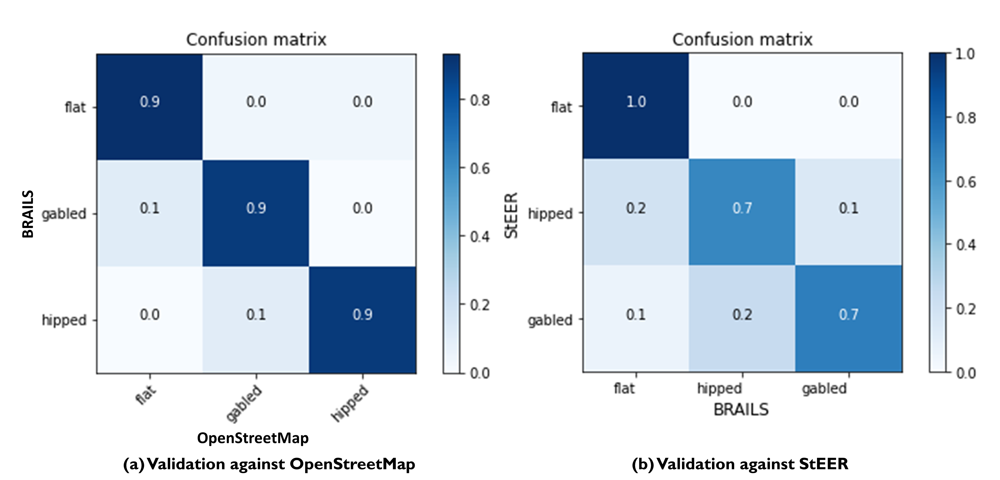
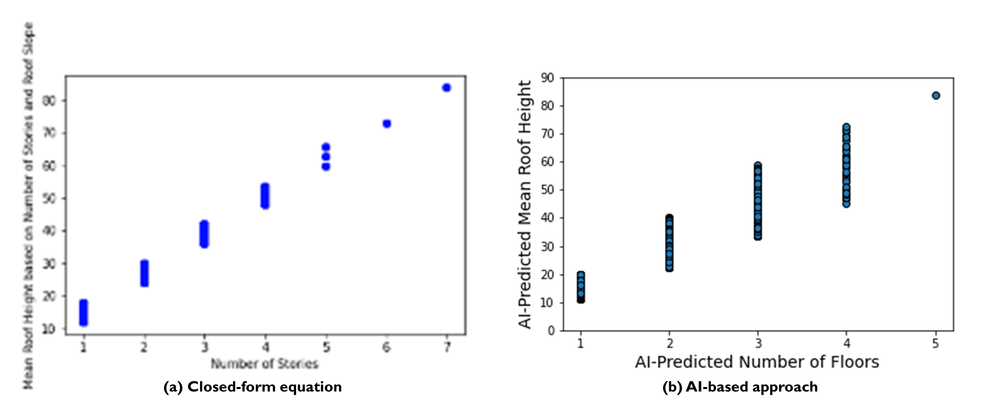
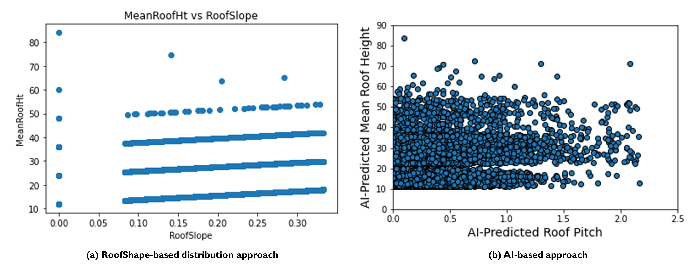
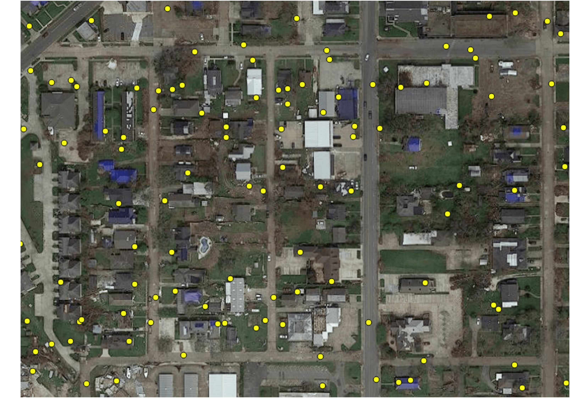
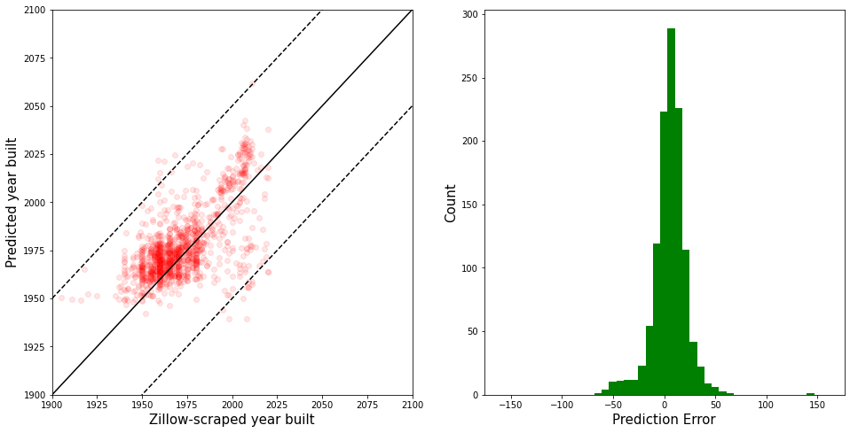
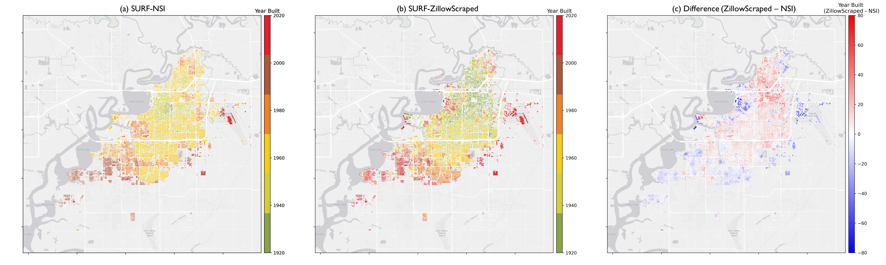
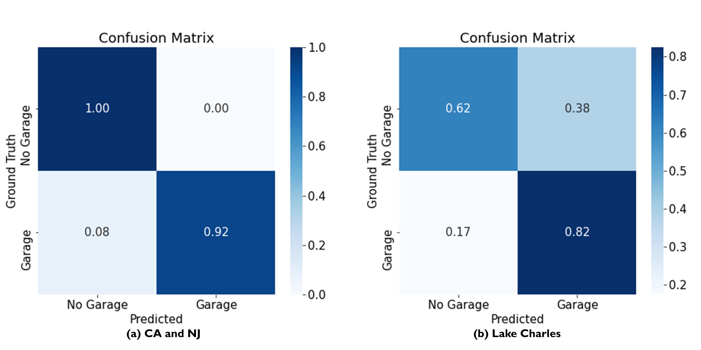

.. _lbl-testbed_LC_asset_description:

*****************
Asset Description
*****************

This section describes how a large-scale building inventory was constructed in two phases. The initial 
phase of this work involved identifying the attributes needed. The second phase involved work to 
obtain these attributes for each building using machine learning and 
techniques from computer vision to create an initial set of attributes. The remaining attributes were 
then obtained using other data sources as discussed below.

Phase I: Attribute Definition
===============================

All the attributes required for loss estimation were first identified to develop the Building Inventory 
data model. This Building Inventory data model presented in :numref:`tab-bldg_inv_data_model_lc`
provides a set of attributes that will be assigned to each asset to form the building inventory file 
serving as input to the workflow. For each attribute a 
row in the table is provided. Each row has a number of columns: the attribute name, description, 
format (alphanumeric, floating point number, etc.), the data source used to define that attribute.
An expanded version of :numref:`tab-bldg_inv_data_model_lc` with the full details of this data
model are available on `DesignSafe PRJ-3207 <https://www.designsafe-ci.org/data/browser/public/designsafe.storage.published//PRJ-3207v3/01.%20Input:%20BIM%20-%20Building%20Inventory%20Data>`_.

.. csv-table:: Building inventory data model, detailed for Lake Charles Inventory.
   :name: tab-bldg_inv_data_model_lc
   :file: table/building_inventory_data_model_new.csv
   :header-rows: 1
   :align: center
   :widths: 15, 40, 25, 20

Phase II: Inventory Generation
===============================

This section describes how the large-scale building inventory was constructed for Lake Charles using 
a phased approach that used machine learning, computer vision algorithm and data distributions to 
generate all attributes required for 
the corresponding loss assessment. It is emphasized that the intent is to demonstrate how an 
inventory could be constructed and not to address potential errors, omissions or inaccuracies in 
the source data, i.e., source data are assumed to be accurate and no additional quality assurance 
was conducted outside of addressing glaring omissions or errors.

For each of the attributes identified in :numref:`tab-bldg_inv_data_model_lc`, 
a description of the attribute and information on how the data was identified and validated is presented.

AI/ML Techniques combined with Computer Vision
------------------------------------------------

Many of those attributes were generated with the SimCenter’s 
`BRAILS <https://nheri-simcenter.github.io/BRAILS-Documentation/index.html>`_ CityBuilder application. 
To avoid replication in the text, the following describes how those attributes 
were obtained. The sections below will present the validation of the data.

CityBuilder is a python application that incorporates different AI/ML modules from BRAILS for performing 
specific tasks. The user creates a python script importing City Builder, constructing a CityBuilder 
object and then asking that object to build the inventory. The example script shown below, albeit 
our GoogleMapAPIKey removed, will create a building inventory file for use in the workflow.  

.. code-block:: python

  # Import the module from BRAILS
  from brails.CityBuilder import CityBuilder
  # Initialize the CityBuilder
  cityBuilder = CityBuilder(attributes=['occupancy','roofshape'], 
                    numBldg=10,random=True, place='Lake Charles, Louisiana', 
                    GoogleMapAPIKey='REMOVED GOOGLE API KEY')
  # create the city-scale BIM file
  BIM = cityBuilder.build()

Upon execution, CityBuilder will:

#. Download footprints for all buildings in the interested region, Lake Charles, from the 
   `Microsoft Footprint Dataset <https://github.com/microsoft/USBuildingFootprints>`_ ([Microsoft18]_).
#. Calculates the coordinate (Latitude, Longitude) for each building’s centroid, based on the footprint information.
#. Download both a satellite image and a street view image for each building using Google API's and the extracted coordinates.
#. Perform computations on the images to obtain the interested building attributes using a series of pre-trained AI models.

Attribute: RoofShape
`````````````````````

The RoofShape is obtained by CityBuilder using the BRAILS Roof shape module. The roof shape module 
determines roof shape based on a satellite image obtained for the building. The module uses machine 
learning, specifically it utilizes a convolutional neural network that has been trained on satellite 
images. In AI/ML terminology the Roof Shape module is an image classifier: it takes an image and 
classifies it into one of three categories used in HAZUS: gable, hip, or flat as shown in 
:numref:`roof_shape`. The original training of the AI model utilized 6,000 images obtained from google 
satellite imagery in conjunction with roof labels obtained from 
`Open Street Maps <https://www.openstreetmap.org/>`_. As many roofs have more complex shapes, a 
similitude measure is used to determine which of these roof geometries is the best match to a given roof. 
More details of the classifier can be found 
`here <https://nheri-simcenter.github.io/BRAILS-Documentation/common/user_manual/modules/roofClassifier.html>`_. 
The trained classifier was employed here to classify the roof information for Lake Charles.

.. figure:: figure/RoofShape.png
   :name: roof_shape
   :align: center
   :figclass: align-center
   :width: 500
   
   Roof type classification with examples of aerial images (a-f) and simplified archetypes (d-f) used by Hazus.

The performance of the roof shape classifier was validated against two ground truth datasets.
The first is comprised of 125 manually labeled satellite images sampled from OpenStreetMap from 
across the US, retaining only those with unobstructed views of building roofs (a cleaned dataset). 
The second is 56 residences assessed by StEER for which roof types were one of the three HAZUS classes, 
e.g., removing all roofs labeled as "Complex" according to StEER's distinct image labeling standards. 
The validation process is documented
`here <https://nheri-simcenter.github.io/BRAILS-Documentation/common/technical_manual/roof.html>`_. 
The confusion matrices are presented in :numref:`roof_shape_vali`. These matrices visually present 
the comparison between the predictions and actual data and should have values of 1.0 along the diagonal 
if the classification is perfect, affirming the accuracy of the classification by the roof shape classifier.



   Validation of BRAILS predicted roof shapes to roof shapes from OpenStreetMap and StEER.

Attribute: OccupancyClass
```````````````````````````

The occupancy class attribute is also determined by CityBuilder using the occupancy class classifier 
module in BRAILS. The occupancy classifier is also a convolutional neural network. This network trained 
using 15,743 google street view images with labels derived from OpenStreetMaps and the NJDEP dataset in 
the `Atlantic County, NJ testbed Asset Description <https://nheri-simcenter.github.io/R2D-Documentation/common/testbeds/atlantic_city/asset_description.html>`_.
This classifier labels buildings as one of: RES1 (single family building), RES3 
(multi-family building), COM1 (Commercial building). More details of the classifier can be found 
`here <https://nheri-simcenter.github.io/BRAILS-Documentation/common/user_manual/modules/occupancyClassifier.html>`_.

The performance of the classifier was validated against a ground truth dataset that contains 293 street 
view images from the United States with unobstructed views of the buildings (cleaned data). The full 
validation was documented `here <https://nheri-simcenter.github.io/BRAILS-Documentation/common/technical_manual/occupancy.html>`_. 
The confusion matrix, which presents visually the predictions versus actual data from the original 
293 image validation set, is as shown in :numref:`occ_class_vali` for OpenStreetMaps (see plot a), and 
the NJDEP dataset (see plot b). :numref:`occ_class_pred` displays the BRAILS occupancy predictions for 
Lake Charles for a selected region. Note that only those classified as RES1 or RES3 are retained in 
this testbed focused on residential construction (and the COM1 is assigned to the buildings that are classified 
other than the two residential classes by BRAILS).

.. figure:: figure/OccupancyClassVali.png
   :name: occ_class_vali
   :align: center
   :figclass: align-center
   :width: 600

   Validation of BRAILS predicted occupancy classes to OpenStreetMap and NJDEP.

.. figure:: figure/OccupancyClassPred.png
   :name: occ_class_pred
   :align: center
   :figclass: align-center
   :width: 600

   AI predicted occupancy types from street view images in Lake Charles.

Attribute: NumberOfStories
```````````````````````````

This attribute is determined by CityBuilder using an object detection procedure. A detection model that 
can automatically detect rows of building windows was established to generate the image-based detections 
of visible floor locations from street-level images. The model was trained on the 
`EfficientDet-D7 architecture <https://arxiv.org/abs/1911.09070>`_ with a dataset of 60,000 images, 
using 80% for training, 15% for validation, and 5% testing of the model. In order to ensure faster model 
convergence, initial weights of the model were set to model weights of the (pretrained) object detection 
model that, at the time, achieved state-of-the-art performance on the 
`2017 COCO Detection set <https://cocodataset.org/#download>`_. For this 
specific implementation, the peak model performance was achieved using the `Adam optimizer <https://arxiv.org/abs/1412.6980>`_ at a learning 
rate of 0.0001 (batch size: 2), after 50 epochs. :numref:`num_stories_detection` shows examples of the 
floor detections performed by the model.

.. figure:: figure/NumOfStoriesDetection.png
   :name: num_stories_detection
   :align: center
   :figclass: align-center
   :width: 600

   Sample floor detections of the floor detection model (each detection is indicated by a green bounding box). The percentage value shown on the top right corner of a bounding box indicates model confidence level associated with that prediction.

For an image, the described floor detection model generates the bounding box output for its 
detections and calculates the confidence level associated with each detection 
(see :numref:`num_stories_detection`). A post-processor that converts stacks of neighboring 
bounding boxes into floor counts was developed to convert this output into floor counts. 
Recognizing an image may contain multiple buildings at a time, this post-processor was 
designed to perform counts at the individual building level. 

For a random image dataset of buildings captured using arbitrary camera orientations (also 
termed in the wild images), the developed floor detection model was determined to capture 
the number of floors information of buildings with an accuracy of 86%. 
:numref:`num_stories_vali` (a) provides a breakdown of this accuracy measure for 
different prediction classes (i.e. the confusion matrix of model classifications). 
It was also observed that if the image dataset is established such that building images 
are captured with minimal obstructions, the building is at the center of the image, and 
perspective distortions are limited, the number of floors detections were performed at an 
accuracy level of 94.7% by the model. :numref:`num_stories_vali` (b)
shows the confusion matrix for the model predicting on the “cleaned” image data. 
In quantifying both accuracy levels, a test set of 3,000 images randomly selected 
across all counties of a companion testbed in New Jersey, excluding Atlantic County (site of that 
testbed), was utilized.

.. figure:: figure/NumOfStoriesVali.png
   :name: num_stories_vali
   :align: center
   :figclass: align-center
   :width: 600

   Confusion matrices for the number of floors predictor used in this study.

.. _lbl-testbed_LC_asset_description_meanroofht:

Attribute: MeanRoofHt
``````````````````````

The elevation of the bottom plane of the roof (lowest edge of roof line) and elevation of the roof 
(peak of gable or apex of hip) are estimated with respect to grade (in feet) from street-level imagery. 
These geometric properties are defined visually for common residential coastal typologies in 
:numref:`building_elevation`. The mean height of the roof system is then derived as 
the average of these dimensions.

.. figure:: figure/BldgElev.png
   :name: building_elevation
   :align: center
   :figclass: align-center
   :width: 600
   
   Schematics demonstrating elevation quantities for different foundation systems common in coastal areas.

The MeanRoofHt is based on the following AI technique. :numref:`mean_roof_ht_app` 
plots the predicted roof height versus the number of floors of the inventory.

As in any single-image metrology application, extracting the building elevations from imagery requires:

#. Rectification of image perspective distortions, typically introduced during capturing of an image capture.
#. Determining the pixel counts representing the distances between ends of the objects or surfaces of interest 
   (e.g., for first-floor height, the orthogonal distance between the ground and first-floor levels).
#. Converting these pixel counts to real-world dimensions by matching a reference measurement with the 
   corresponding pixel count.

Given that the number of street-level images available for a building can be limited and sparsely spaced, 
a single image rectification approach was deemed most applicable for regional-scale inventory 
development. The first step in image rectification requires detecting line segments on the front 
face of the building. This is performed by using the `L-CNN <https://arxiv.org/abs/1905.03246>`_ 
end-to-end wireframe parsing method. Once the segments are detected, vertical and horizontal lines 
on the front face of the building are automatically detected using 
`RANSAC <https://dl.acm.org/doi/10.1145/358669.358692>`_ line fitting based on the 
assumptions that line segments on this face are the predominant source of line segments in the image 
and the orientation of these line segments change linearly with their horizontal or vertical position 
depending on their predominant orientation. The Another support vector model implemented for image 
rectification focuses on the street-facing plane of the building in an image, and, based on the 
Manhattan World assumption, (i.e., all surfaces in the world are aligned with two horizontal and 
one vertical dominant directions) iteratively transforms the image such that horizontal edges on the 
facade plain lie parallel to each other, and its vertical edges are orthogonal to the horizontal edges.

In order to automate the process of obtaining the pixel counts for the ground elevations, a facade 
segmentation model was trained to automatically label ground, facade, door, window, and roof pixels 
in an image. The segmentation model was trained using 
`DeepLabV3 architecture on a ResNet-101 backbone <https://arxiv.org/abs/1706.05587>`_, pretrained on 
`PASCAL VOC 2012 segmentation dataset <http://host.robots.ox.ac.uk/pascal/VOC/voc2012/>`_, using a 
facade segmentation dataset of 30,000 images supplemented with relevant portions of ADE20K segmentation 
dataset. The peak model performance was attained using the `Adam optimizer <https://arxiv.org/abs/1412.6980>`_ at a learning rate of 0.001 
(batch size: 4), after 40 epochs. The conversion between pixel dimensions and real-world dimensions were 
attained by use of field of view and camera distance information collected for each street-level imagery.

:numref:`mean_roof_ht_app` shows a scatter plot of the AI predicted mean roof heights vs AI-predicted number of floors. 
A general trend observed in this plot is that the roof height increases with the number of floors, 
which is in line with the general intuition.



   AI-predicted MeanRoofHt versus number of floors.

Attribute: RoofSlope
`````````````````````
RoofSlope is calculated as the ratio between the roof height and the roof run. Roof height is obtained 
by determining the difference between the bottom plane and apex elevations of the roof as defined in the 
:ref:`lbl-testbed_LC_asset_description_meanroofht` 
section. Roof run is determined as half the smaller dimension of the building, as determined from 
the dimensions of the building footprint. :numref:`mean_slope_app` displays the AI-predicted mean roof height versus the 
AI-precited roof pitch ratios. As expected, very little correlation between these two parameters are observed.



   AI-predicted RoofSlope versus mean roof height.


Phase III: Augmentation Using Third-Party Data, Site-specific Observations, and Existing Knowledge
====================================================================================================

The AI-generated building inventory is further augmented with multiple sources of information, including the 
third-party datasets, site-specific statistics summarized from observations, and existing knowledge and 
engineering judgement. The following attributes are obtained or derived from third-party data.

Attribute: DWS II
-----------------

Design Wind Speed for Risk Category II construction in mph (ASCE 7-16), was obtained by queries to the 
`ATC Hazards by Location API <https://hazards.atcouncil.org/>`_ ([ATC20]_).

Attribute: LULC
----------------

Land use code is downloaded from `WebGIS <http://www.webgis.com/terr_pages/LA/lulcutm/calcasieu.html>`_.
Each land use class is represented by a integer as listed in :numref:`tab-bldg_inv_data_model_lc`

Attribute: YearBuilt
----------------------

We initially derived the year built information based on the National Structure Inventory (NSI), which contains year 
built information for geocoded addresses in the region of interest. It should be noted that not all buildings 
are included in the NSI dataset and the geocodes of the addresses do not match perfectly with building locations, 
as shown in :numref:`year_built_nsi`.



   National Structure Inventory data points.

To address this issue, `SURF <https://github.com/NHERI-SimCenter/SURF>`_ ([Wang19]_) is employed to construct and train a neural 
network on the year built information from 
National Structure Inventory (NSI). The neural network is then used to predict the year built 
information for each building based on the spatial patterns it learned from the NSI dataset. 
The theory of using neural networks to learn the spatial patterns in data and to predict for 
missing values is detailed `here <https://doi.org/10.1016/j.autcon.2020.103474>`_.  
The result is shown in :numref:`year_built_comp`.

.. figure:: figure/YearBuiltComp.png
   :name: year_built_comp
   :align: center
   :figclass: align-center
   :width: 700

   Comparison of year built between NSI and SURF.

In parallel to this exploration, `Zillow <https://www.zillow.com/>`_ also provides the year built information for 
many of the residual buildings in the studied region.

Similar to the implementation of NSI dataset, the 1182 data points of year built from Zillow are used to train a 
neural network, :numref:`surf_yb_test` shows the verification of the trained neural network (predicted vs. true values,
Zillow dataset). More than :math:`85%` buildings have prediction errors less than 20 years.  



   SURF-predicted vs. original year built from Zillow dataset.

The neural network is used to predict the year built information for the entire Lake Charles inventory. :numref:`surf_yb_comp`
contrast the resulting SURF-Zillow and the SURF-NSI year built spatial distribution. The difference in year built is relatively 
small for the downtown buildings (~1960s) but increases at the bounds with a maximum of 80 years.
The Zillow-trained classifier is undergoing continued improvements and will be released with the next version of this testbed. 
The current version of the testbed will thus use the NSI data as the basis for the Year Built Attribute



   SURF-NSI vs. SURF-Zillow: year built information.

Attribute: Garage
------------------

A garage detector utilizing EfficienDet object detection architecture was trained to identify the 
existence of attached garage and carport structures in street-level imagery of the buildings 
included in the Lake Charles inventory. Properties are either classified as having an attached garage 
or not having an attached garage (which includes both detached garages and homes with no garage)
The model was trained on the `EfficientDet-D4 architecture <https://arxiv.org/abs/1911.09070>`_ with 
dataset of 1,887 images, using 80% for training, 10% for validation, and 10% for testing of the model. 
Similar to the number of floors detector model, initial weights of this model were set to model weights 
of the (pretrained) object detection model that, at the time, achieved state-of-the-art performance on 
the `2017 COCO Detection set <https://cocodataset.org/#download>`_. For this task, the peak detector 
performance was attained using the `Adam optimizer <https://arxiv.org/abs/1412.6980>`_ 
at a learning rate of 0.0001 (batch size: 2) after 25 epochs. :numref:`garage_eg` shows sample 
garage detections performed by the model.

.. figure:: figure/GarageDetection.png
   :name: garage_eg
   :align: center
   :figclass: align-center
   :width: 700

   Samples of the garage detection model showing successful identification of attached garages and carports.

On the test set, the model achieves an accuracy of 92%. :numref:`garage_cm` shows the confusion matrix of the 
model classifications on the test set. On a seperate test set consisting of images from only Lake Charles, 
model performance is lower at 71%. :numref:`garage_cm` (b) shows the confusion matrix for model predictions on this 
latter dataset.



   Confusion matrices for the garage predictor used in this study. The matrix on the left (a) shows the model’s prediction accuracy when tested on a set of 189 images randomly selected from CA and NJ. The matrix on the right (b) depicts the model accuracy on images selected from the Lake Charles area.


Attribute: BuildingType
------------------------

Based on information found in the National Structure Inventory, 89% of residential buildings 
(single-family and multi-family) are wood, the rest are masonry. In the analysis, we conservatively 
assume all residential buildings are wood.

Attribute: AvgJanTemp
----------------------

The average temperature in Lake Charles in January is above the critical value of 25F, 
based on NOAA average daily temperature. Referring :numref:`tab-bldg_inv_data_model_lc`, we used 
"Above" for the buildings in the studied inventory.


Populated Inventories
========================

Executing this three-phase process resulted in the assignment of all required attributes at the asset description 
stage of the workflow for the Lake Charles building inventory, and :numref:`bldg_inv_lc` shows example data samples. 
The entire inventory can be accessed `here <https://doi.org/10.17603/ds2-jpj2-zx14>`_.

.. csv-table:: Illustrative sample of building in Lake Charles Inventory.
   :name: bldg_inv_lc
   :file: data/example_inventory_lc.csv
   :align: center
   :widths: 5, 7, 5, 6, 9, 7, 6, 7, 7, 7, 7, 9, 7, 6, 6, 9

.. [ATC20]
   ATC (2020b), ATC Hazards By Location, https://hazards.atcouncil.org/, Applied Technology Council, Redwood City, CA.

.. [Wang19]
   Wang C. (2019), NHERI-SimCenter/SURF: v0.2.0 (Version v0.2.0). Zenodo. http://doi.org/10.5281/zenodo.3463676

.. [Microsoft18]
   Microsoft (2018), US Building Footprints. https://github.com/Microsoft/USBuildingFootprints

.. [FEMA21]
   FEMA (2021), Hazus Inventory Technical Manual. Hazus 4.2 Service Pack 3. Federal Emergency Management Agency, Washington D.C.