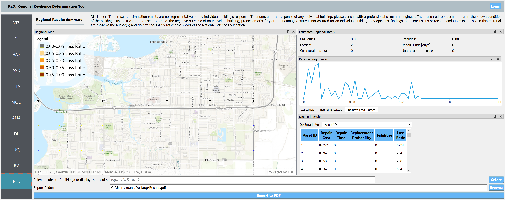
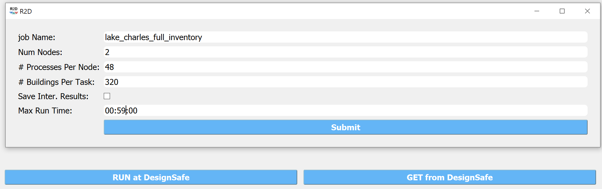
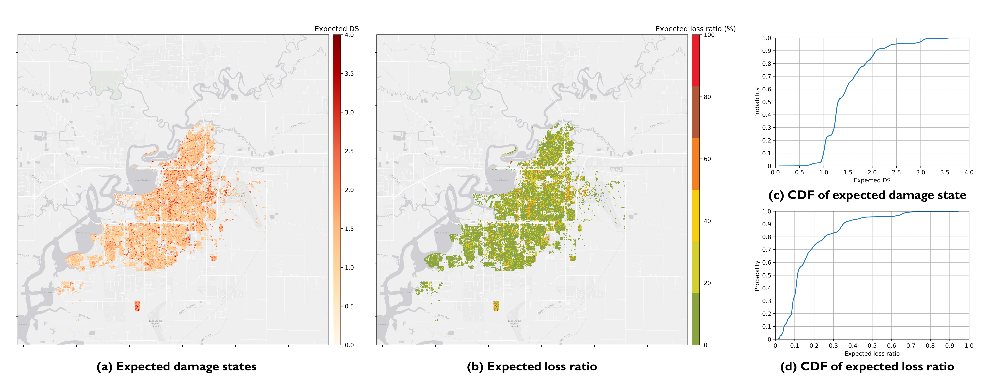

.. _lbl-testbed_LC_example_outputs:

**************************
Example Outputs
**************************

Running Testbed
===================

R2D Interface
---------------

One approach to run the testbed simulation is via the 
`R2D application <https://www.designsafe-ci.org/data/browser/public/designsafe.storage.community/SimCenter/Software/R2Dt>`_.
After successfully downloading and launching, the major steps for setting up the run are listed as follows:

#. Set the **Units** in the **GI** panel as shown in :numref:`r2d_gi` and check interested output files.

   .. figure:: figure/R2D_GI.png
      :name: r2d_gi
      :align: center
      :figclass: align-center
      :width: 500

      R2D GI setup.
#. Download and unzip the `HurricaneLaura_MappedPWS <https://www.designsafe-ci.org/data/browser/public/designsafe.storage.published//PRJ-3207v3/02.%20Input:%20HAZ%20-%20Hazard%20Characterization>`_. 
   Set the **Event File Listing Wind Field** in the **HAZ** panel to the "EventGrid.csv" in the unzipped "IMs" folder.
   The app would automatically load the directory (:numref:`r2d_haz`). And the **Units of Event Input File** should be 
   "Miles per hour".

   .. figure:: figure/R2D_HAZ.png
      :name: r2d_haz
      :align: center
      :figclass: align-center
      :width: 500

      R2D HAZ setup.
#. Download the `BIM_LakeCharles_Full.csv <https://www.designsafe-ci.org/data/browser/public/designsafe.storage.published//PRJ-3207v3/01.%20Input:%20BIM%20-%20Building%20Inventory%20Data>`_ (under **01. Input: BIM - Building Inventory Data** folder). 
   Select **CSV to BIM** in the **ASD** panel and set the **Import Path** to "BIM_LakeCharles_Full.csv" (:numref:`r2d_asd`). 
   Specify the building IDs that you would like to include in the simulation (e.g., 1-30078 for the entire inventory - note this may take very long time to run 
   on a local machine, so it is suggested to first test with a small sample like 1-100 locally and then submit the entire run to DesignSafe - see more details in :numref:`r2d_run_ds`).

   .. figure:: figure/R2D_ASD.png
      :name: r2d_asd
      :align: center
      :figclass: align-center
      :width: 500

      R2D ASD setup.
#. Set the **Regional Mapping** and **SimCenterEvent** in the **HTA** panel (e.g., :numref:`r2d_hta`).

   .. figure:: figure/R2D_HTA.png
      :name: r2d_hta
      :align: center
      :figclass: align-center
      :width: 500

      R2D HTA setup.
#. Set the "Building Modeling" in **MOD** panel to "None". 

   .. figure:: figure/R2D_MOD.png
      :name: r2d_mod
      :align: center
      :figclass: align-center
      :width: 500

      R2D MOD setup.
#. Set the "Building Analysis Engine" in **ANA** panel to "IMasEDP". 

   .. figure:: figure/R2D_ANA.png
      :name: r2d_ana
      :align: center
      :figclass: align-center
      :width: 500

      R2D ANA setup.
#. Set the "Damage and Loss Method" in **DL** panel to "HAZUS MH HU". Download the rulset scripts from 
   `DesignSafe PRJ-3207 <https://www.designsafe-ci.org/data/browser/public/designsafe.storage.published//PRJ-3207v3/03.%20Input:%20DL%20-%20Rulesets%20for%20Asset%20Representation/scripts>`_ 
   (under **03. Input: DL - Rulesets for Asset Representation/scripts** folder) and 
   set the **Auto populate script** to "auto_HU_LA.py" (:numref:`r2d_dl`). Note please place the rulset scripts 
   in an individual folder so that the application could copy and load them later. 

   .. figure:: figure/R2D_DL.png
      :name: r2d_dl
      :align: center
      :figclass: align-center
      :width: 500

      R2D DL setup.
#. Set the "UQ Application" in **UQ** panel to "None". 

   .. figure:: figure/R2D_UQ.png
      :name: r2d_uq
      :align: center
      :figclass: align-center
      :width: 500

      R2D UQ setup.

After setting up the simulation, please click the **RUN** to execute the analysis. Once the simulation completed, 
the app would direct you to the **RES** panel (:numref:`r2d_res`) where you could examine and export the results.

   R2D RES panel.

For simulating the damage and loss for a large region of interest (please remember to reset the building IDs in **ASD**), it would be efficient to submit and run the job 
to `DesignSafe <https://www.designsafe-ci.org/>`_ on `Stampede2 <https://www.tacc.utexas.edu/systems/stampede2>`_. 
This can be done in R2D by clicking **RUN at DesignSafe** (one would need to have a valid 
`DesignSafe account <https://www.designsafe-ci.org/account/register/>`_ for login and access the computing resource). 
:numref:`r2d_run_ds` provides an example configuration to run the analysis.
The individual building simulations are paralleled when being conducted on Stampede2 which accelerate the process, e.g., 
for the entire building inventory in this testbed, it takes about 15 minutes using 96 Skylake (SKX) cores to complete 
the simulation and result post-processing.

   R2D - Run at DesignSafe (configuration).

Users could monitor the job status and retrieve result data by **GET from DesignSafe** button (:numref:`r2d_get_ds`). The retrieved data include
four major result files, i.e., *BIM.hdf*, *EDP.hdf*, *DM.hdf*, and *DV.hdf*. R2D also automatically converts the hdf files to csv files that are easier to work with.
While R2D provides basic visualization functionalities (:numref:`r2d_res`), users could access the data which are downloaded under the remote work directory, e.g., 
*/Documents/R2D/RemoteWorkDir* (this directory is machine specific and can be found in **File->Preferences->Remote Jobs Directory**).
Once having these result files, users could extract and process interested information - the next section will use 
the results from this testbed as an example to discuss more details.

.. figure:: figure/get_from_designsafe.png
   :name: r2d_get_ds
   :align: center
   :figclass: align-center
   :width: 400

   R2D GET from DesignSafe.

Regional Results (NSI-Based Year Built)
========================================

The *BIM.hdf* file saves the building information models with populated building attributes as described in 
:ref:`lbl-testbed_LC_asset_representation`. The *EDP.hdf* summarizes the EDP realizations. The *DM.hdf* and 
*DV.hdf* files summarizes the statistics of damage states and estimated loss metrics. These results of this testbed
can be accessed in the `DesignSafe project <https://www.designsafe-ci.org/data/browser/public/designsafe.storage.published//PRJ-3207v3/04.%20Output:%20Results>`_, along with the Jupyter 
notebook used to visualize them. The zip file consists of (1) four result hdf files (*BIM.hdf*, *EDP.hdf*, *DM.hdf*, and *DV.hdf*), (2) 
four parsed result files (in .csv), (3) Input inventory csv file, (4) two jupyter notebook scripts, and (5) a requirement txt file listing the 
dependencies. *post-process.ipynb* can be run locally and first-time users are suggested to run the first cell to install necessary packages, and 
*post-processing_designsafe.ipynb* can be run on DesignSafe Jupyter Notebook if one uploads the entire folder to the Data Depot.

:numref:`terrain_swr` (a) and (b) show the sample figures for the geospatial distribution of populated 
terrain type and second water resistance of the building inventory. The influence of different building 
attributes on the damage and loss results will be investigated in :ref:`lbl-testbed_LC_validation_results`
The geospatial distribution of estimated wind damage states and losses under Hurricane Laura
are shown in :numref:`dl_and_cdf_lc` (a) and (b), respectively. Referring to :numref:`dl_and_cdf_lc` (c), most of the buildings 
in the studied region (75%) have relatively low to moderate damage (expected Damage State less than 2.0) 
due to the wind hazard. Referring to :numref:`dl_and_cdf_lc` (c), about 5% buildings would expected damage states lower than 
DS-1 and only about 5% buildings would expect to have damage states exceeding DS-3. 
The CDF of resulting loss ratios is shown in :numref:`dl_and_cdf_lc` (d) where about 20% buildings would expect 
a loss less than 10% of the total reconstruction cost, and about 30% buildings could see a loss more than 35% of the total 
reconstruction cost. 

.. figure:: figure/BIM_data.png
   :name: terrain_swr
   :align: center
   :figclass: align-center
   :width: 600

   Terrain and second water resistance features populated and used in the simulation.

   Estimated regional damage states and loss ratios.