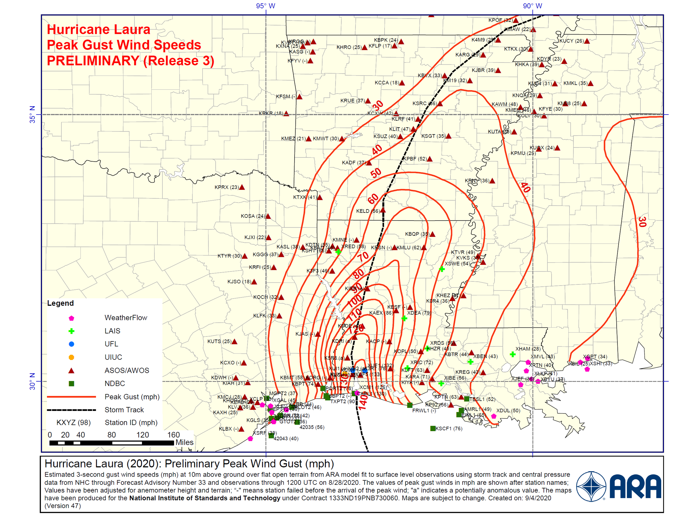

.. _lbl-testbed_LC_hazard_characterization:

***********************
Hazard Characterization
***********************

This testbed considers the wind hazard and its affect on the building inventory. 
The National Institute of Standards and Technology (NIST), working with Applied Research Associates, Inc. 
(ARA), has developed a rapid response estimate of the surface-level windfield for Hurricane Laura in 
support of a Mission Assignment from FEMA. The wind field, shown in :numref:`pws_field` was produced on 
September 4, 2020, and is available to be downloaded from 
`here <https://www.designsafe-ci.org/data/browser/public/designsafe.storage.community//Recon%20Portal/2020%20Hurricane%20Laura%20Cameron%20Louisiana%20USA/NIST%20ARA%20Rapid%20Reponse%20Windfield%20Estimate>`_. 
It incorporates storm track and central pressure data from the National Hurricane Center through 
Forecast Advisory Number 33 and observations through 1200 UTC on 08/28/2020. The wind hazard is 
quantified by the peak wind speed averaged over a 3 second gust period measured at 10m height 
under open terrain conditions.

   Peak wind speed (3s-gust) field by ARA.

For Lake Charles itself, the ARA wind field is first mapped to a rectangular grid with 0.01 to 0.02 
degree intervals.  Then peak wind speed at each building site is then randomly sampled from its nearest 
4 neighboring grid points. :numref:`pws_interp` shows the averaged peak wind speed from 1000 random samples for 
each building site in our area of interest. 

.. figure:: figure/PeakWindSpeed.png
   :name: pws_interp
   :align: center
   :figclass: align-center
   :figwidth: 600

   Interpolated Peak Wind Speed at Building Sites Being Studied for Hurricane Laura.

