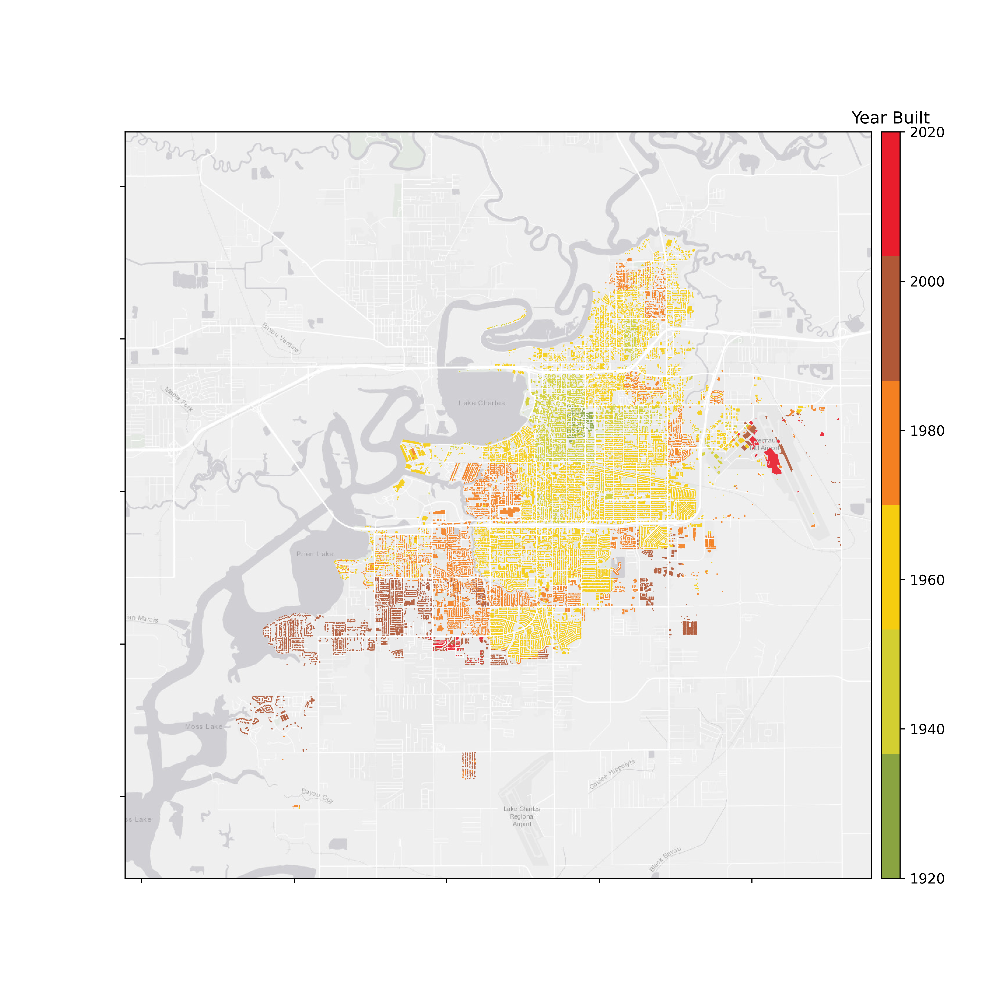

.. _lbl-testbed_LC_overview:

********
Overview
********

This testbed for regional hurricane risk assessment of Lake Charles, LA under wind hazards adopts an approach 
consistent with that developed for earthquake hazards. Its intent is to demonstrate the computational scaffolding 
upon which community developers can progressively contribute refinements that increase the fidelity and capabities 
of the backend regional resilience assessment workflow. This documentation specifically demonstrates the process of: 
(1) asset description, (2) hazard characeterization, (3) asset representation, (4) damage and loss modeling for 
the Lake Carles inventory. Sample results are presented to verify the workflow and demonstrate its usage.

Rationale
===========

As detailed in [Roueche20]_, Hurricane Laura made landfall as a strong Category 4 storm near Cameron, LA in the 
early hours of 27 August 2020, tying the Last Island Hurricane of 1856 as the strongest land-falling hurricane 
in Louisiana history. Wind speeds are estimated to have reached or exceeded the design wind speeds for Risk 
Category II buildings and other structures, as defined in ASCE 7-16 ([ASCE16]_) and the 2018 International Building 
Code (MRI = 700 years) ([ICC18]_), by as much as :math:`8 km/h` (:math:`5 mph`) near Lake Charles, LA (specifically), 
northeastern Calcasieu Parish and the eastern half of Beauregard Parish) (ARA 2020). Meanwhile, storm sruge 
resulted in high water marks of over :math:`5 m` (:math:`17 ft`) above ground in Oak Grove, LA in Cameron Parish 
([Pasch21]_). These combined hazards resulted in substantial impacts to port and industrial facilities serving the 
oil and gas sector, widespread damages in the residential sector, and sustaned outages of water and power impacting 
the operation of hospitals providing critical care during a pandemic. Notable damage was reported to commercial 
facilities, particularly to hetels, including high-rise buildings in Lake Charles associated with casinos and 
resorts. As the storm's well-predicted track facilities coordinated, multi-entity surface measurements of wind 
fields (surface observation networks and mobile rada) and storm surge, Laura is one of the best documented storm 
events and thus provides novel opportunities to understand the vulnerabilities underpinning losses across a diversity 
of building occupancies and other critical infrastructure.

This testbed builds upon existing relationships between SimCenter and the Structural Extreme Events Response (StEER) 
Network, which made available various reconnaissance data in the affected region available for initial validation. The 
validation did not take advantage of the extensive street-level panoramas (available in Google Maps) that can provide 
an even richer validation data set for this hurricane. Notably, the areas impacted by Laura were previously impacted by 
Hurricane Rita (2005), with many structures reconstructed or repaired and unfortunately again damaged. As a large 
swath of modern (post-IBC/IRC construction) single-family residential structures were impacted by design-level winds 
during Hurricane Laura, underscoring vulnerabilities to garage doors and high rates of roof cover losses, the 
current implementation focuses on estabilishing the residential inventories, though other building classes warrant 
future investigation, including mobile homes where even Zone II anchorages were observed to fail. Notably, 
regrettably low rates of impact-resistant fenestration was observed by StEER across the region, futher suggesting 
opportunities to expore this attribute in the ensuring losses.

Thist testbed also demonstrates the challenges of creating inventories in areas where tax assessor and other open 
inventory data are limited. Thus, the experience creating this testbed models best practices and strategies for 
augenting sparse inventory data in a given region, e.g., semantically describing assets using information inferred 
by artificial intelligence.

Capabilities & Supported Hazards
==================================

The testbed supports the transition from census-block-level loss projections to asset-level projections that assess 
the damage to individual buildings under hurricane-induced wind hazards. Water penetration due to the breach of building 
envelopes and/or wind-borne debris impact are also captured in the damage and loss modeling, though the physics of 
these phenomena themselves are not explicitly modeled. Storm surge, flood and other focuses only on wood-frame 
residential construction. These intentional focuses of the current implementation leave ample room for further 
community-led development. The adoption of HAZUS loss estimation frameworks takes advantage of a process developed 
in Atlantic County, NJ for assigning attributes to specific building footprints using time-evolving heuristic 
rulesets grounded in local codes/standards and normative practice. As this testbed demonstrates a quick 
“spin-up” after a hurricane, the rulesets from New Jersey are directly applied; while many of the practices 
are common, further refinements of the workflow should revise these rulesets to reflect the phasing of 
specific regulations and mitigation measures in Lake Charles.

Current Implementation
========================

For the initial implementation of the backend workflow, asset description adopts an augmented parcel and 
available hindcast windfields provide the Peak Wind Speed (PWS) during the hurricane (used as hazard 
intensity measure). In lieu of a structural analysis model, assets are assigned attributes associated 
with various HAZUS-consistent building classifications. The adoption of HAZUS damage and loss assessment 
methodology for hurricanes thus enables these intensity measures to be related to probabilities of 
damage and loss, based on the building class and assigned attributes.

Available Inventories
========================

The constructed building inventory developed for Lake Charles wiil be accessable via DesignSafe. 
This testbed includes 30,072 assets in the city of Lake Charles. :numref:`fig-yearBuilt` visualizes the 
built years of the buildings in the inventory.  :numref:`fig-occupancyClass` shows the geospatial distribution 
of the occupancy classes in the inventory.

.. _fig-yearBuilt:

   Geospatial visualization of the building inventory by year built.

.. _fig-occupancyClass:

.. figure:: figure/OccupancyClass.png
   :align: center
   :figclass: align-center
   :figwidth: 1000

   Geospatial visualization of the building inventory by occupancy class.

.. [Roueche20]
   Roueche, D., Kameshwar, S., Marshall, J., Mashrur, N., Kijewski-Correa, T., Gurley, K., et al. (2020). Hybrid Preliminary Virtual Reconnaissance Report-Early Access Reconnaissance Report (PVRR-EARR). StEER - Hurricane Laura. DesignSafe-CI. doi:10.17603/ds2-ng93-se16

.. [ASCE16]
   ASCE (2016), Minimum Design Loads for Buildings and Other Structures, ASCE 7-16, American Society of Civil Engineers.

.. [ICC18]
   International Code Council. (2018). International building code. Falls Church, Va. :International Code Council,

.. [Pasch21]
   Pasch, R. J., Berg, R., Roberts, D. P., & Papin, P. P. (2021). National Hurricane Center Tropical Cyclone Report (Hurricane Laura). National Hurricane Center. https://www.nhc.noaa.gov/data/tcr/AL132020_Laura.pdf

.. [FEMA18a]
   FEMA (2018), HAZUS – Multi-hazard Loss Estimation Methodology 2.1, Hurricane Model Technical Manual, Federal Emergency Management Agency, Washington D.C., 718p.

.. [FEMA18b]
   FEMA (2018), HAZUS – Multi-hazard Loss Estimation Methodology 2.1, Flood Model Technical Manual, Federal Emergency Management Agency, Washington D.C., 569p.

.. [KijewskiCorrea19]
   Kijewski-Correa, T., Taflanidis, A., Vardeman, C., Sweet, J., Zhang, J., Snaiki, R., ... & Kennedy, A. (2020). Geospatial environments for hurricane risk assessment: applications to situational awareness and resilience planning in New Jersey. Frontiers in Built Environment, 6, 549106.

.. [NJCoast20]
   NJ Coast (2020), Storm Hazard Projection Tool, NJ Coast, https://njcoast.us/resources-shp/