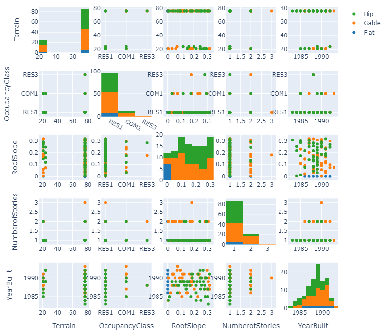
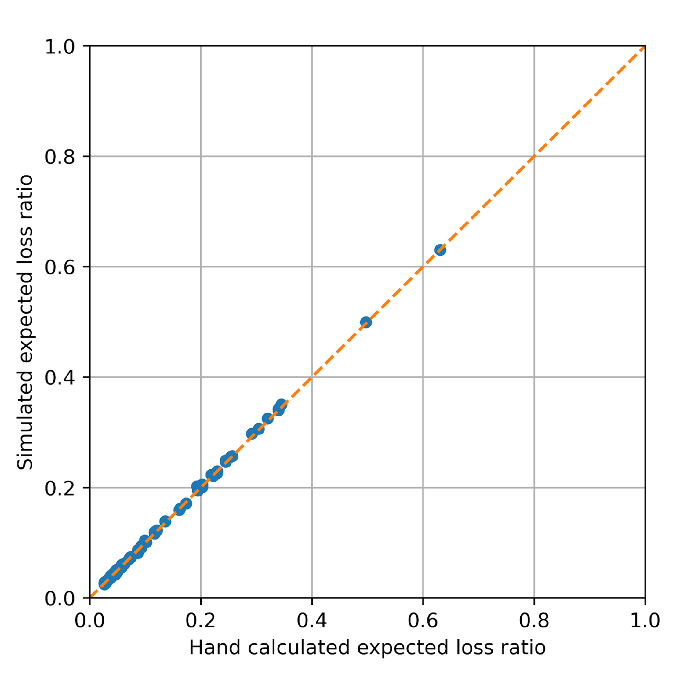

.. _lbl-testbed_LC_sample_results:

********************
Verification Results
********************

This page summarizes sample results from the 
testbed runs with the emphasis on verifying the estimated loss ratios by hand-calculations.

Building Inventory
===================

From the entire building inventory, 109 buildings are randomly selected
(examples are shown in :numref:`sample_table` and the full inventory can be accessed 
`here <https://github.com/NHERI-SimCenter/SimCenterDocumentation/blob/master/docs/common/testbeds/lake_charles/table/veri_sample.csv>`_).
:numref:`scatter_matrix` shows the data distributions of the built year, surface
roughness (i.e., Terrain), roof shape, number of stories, and occupancy class.

.. csv-table:: Example sampled building inventory
   :file: table/veri_sample_example.csv
   :name: sample_table
   :align: center
   :widths: 5, 7, 5, 6, 9, 7, 6, 7, 7, 7, 7, 9, 7, 6, 6, 9

   Scatter matrix of sampled buildings.

Hand Calculation
==================

Hand calculations of wind loss ratios are conducted using the
input building information and intensity measures for the sampled buildings.
Note that there are two major processes in the damage and loss assessment: 
(1) translating the building inventory to corresponding HAZUS building classes 
and (2) estimating the damage and loss given the HAZUS building class and the 
intensity measure (i.e., PWS in this testbed) for each building. 
The first process is addressed by the 
`pytest module <https://github.com/NHERI-SimCenter/AssetRepresentationRulesets/blob/main/rulesets/LA/scripts/tests/test_auto_HU_LA.py>`_ 
in the `AssetRepresentationRulesets <https://github.com/NHERI-SimCenter/AssetRepresentationRulesets/releases/tag/v1.0.0>`_. 
The second process is the addressed by this section with key steps:

#. Mapping the building inventory to HAZUS building classes using the `AssetRepresentationRulesets <https://github.com/NHERI-SimCenter/AssetRepresentationRulesets/releases/tag/v1.0.0>`_
#. Fetching the individual damage fragilities and loss ratios for each building given its HAZUS building class
#. Sampling the PWS from nearby grid sites
#. Evaluating the damage states and average loss ratio given the damage and loss functions as well as the sampled PWS

Following these steps, :numref:`hand_calc` compares the hand-calculated loss ratios and the simulated
results, which are in good agreement.

   Hand-calculated results vs. simulated results.