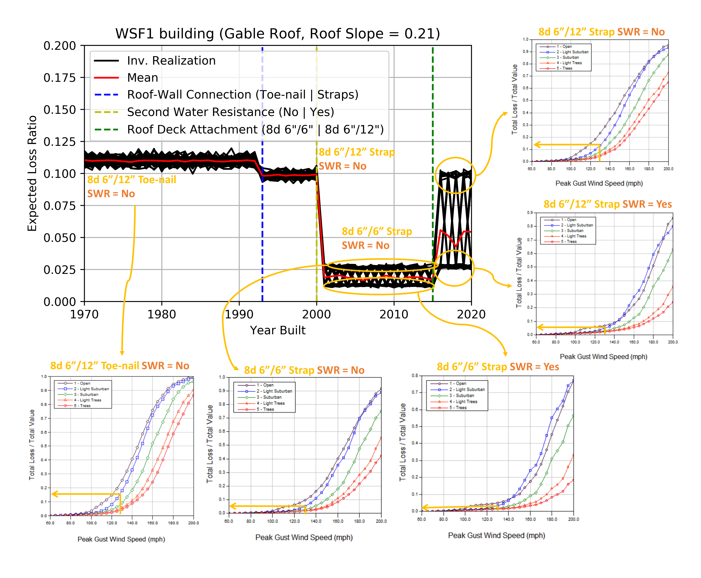
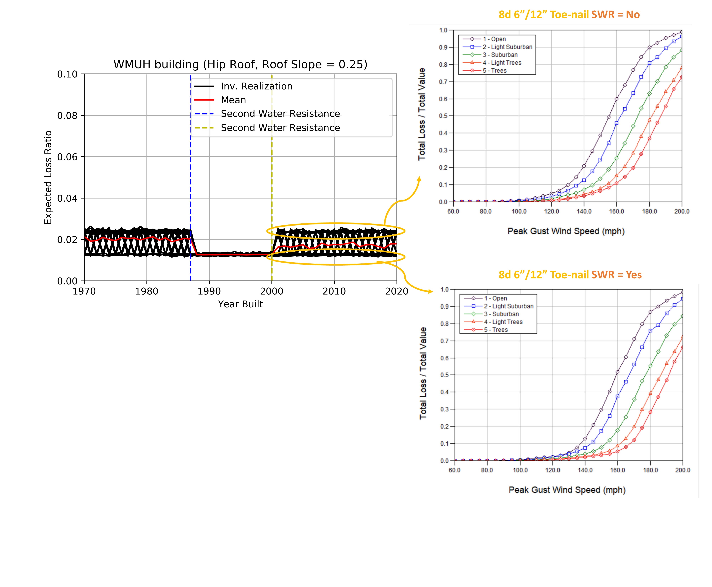

.. _lbl-testbed_LC_sample_results:

********************
Verification Results
********************

This page summarizes sample results from the 
testbed runs with the emphasis on verifying the estimated loss ratios by hand-calculations.

Building Inventory
===================

From the entire building inventory, 109 buildings are randomly selected
(examples are shown in :numref:`sample_table` and the full inventory can be accessed 
`here <https://github.com/NHERI-SimCenter/SimCenterDocumentation/blob/master/docs/common/testbeds/lake_charles/table/veri_sample.csv>`_).
:numref:`scatter_matrix` shows the data distributions of the built year, surface
roughness (i.e., Terrain), roof shape, number of stories, and occupancy class.

.. csv-table:: Example sampled building inventory
   :file: table/veri_sample_example.csv
   :name: sample_table
   :align: center
   :widths: 5, 7, 5, 6, 9, 7, 6, 7, 7, 7, 7, 9, 7, 6, 6, 9

.. figure:: figure/ScatterMatrix.png
   :name: scatter_matrix
   :align: center
   :figclass: align-center
   :width: 500

   Scatter matrix of sampled buildings.

Hand Calculation
==================

Hand calculations of wind loss ratios are conducted using the
input building information and intensity measures for the sampled buildings.
Note that there are two major processes in the damage and loss assessment: 
(1) translating the building inventory to corresponding HAZUS building classes 
and (2) estimating the damage and loss given the HAZUS building class and the 
intensity measure (i.e., PWS in this testbed) for each building. 
The first process will be discussed in :ref:`lbl-testbed_LC_verification_rulesets`.
The second process is the addressed by this section with key steps:

#. Mapping the building inventory to HAZUS building classes using the `AssetRepresentationRulesets <https://github.com/NHERI-SimCenter/AssetRepresentationRulesets/releases/tag/v1.0.0>`_
#. Fetching the individual damage fragilities and loss ratios for each building given its HAZUS building class
#. Sampling the PWS from nearby grid sites
#. Evaluating the damage states and average loss ratio given the damage and loss functions as well as the sampled PWS

Following these steps, :numref:`hand_calc` compares the hand-calculated loss ratios and the simulated
results, which are in good agreement.

.. figure:: figure/SimuVSHandCalc.png
   :name: hand_calc
   :align: center
   :figclass: align-center
   :width: 300

   Hand-calculated results vs. simulated results.

.. _lbl-testbed_LC_verification_rulesets:

Verification of Rulesets
===========================

Following the discussion in the previous section, this section would discuss the verification process 
for the Rulesets introduced in :ref:`lbl-testbed_LC_asset_representation`. This verification includes 
two aspects: (1) verifying the implementation of Rulesets and (2) verifying the influence 
of rulesets. The first aspect is addressed by the 
`pytest module <https://github.com/NHERI-SimCenter/AssetRepresentationRulesets/blob/main/rulesets/LA/scripts/tests/test_auto_HU_LA.py>`_ 
in the `AssetRepresentationRulesets <https://github.com/NHERI-SimCenter/AssetRepresentationRulesets/releases/tag/v1.0.0>`_.  Each 
pytest examines a set of rulesets for a specific HAZUS building class to see if the resulting HAZUS classifier is as expected.
The second aspect involves examinations of damage and loss results from the testbed to investigate the influence of a specific 
building attribute on the building performance, i.e., if the results is rational then the corresponding rulesets 
are verified. As an example of this process, the construction year (YearBuilt) is focused in this section. 

In order to investigate the cause and rationalize potential influence of year built, a parametric study is conducted for 
a single-family house (ID = 2 in :numref:`bldg_inv_lc`). The original building record is expanded to 51 different buildings 
by varying the year built only (i.e., from 1970 to 2020). For each building, expected loss ratio is estimated with 50 
realizations to consider the uncertainty from the random sampling in the rulesets. The black curves in :numref:`year_built_infl` 
plots the individual realizations of expected loss ratio against different year built values. The red curve shows the mean value 
based on the 50 realizations at each year built. It is clear to see that the building 
performance improves following major code revisions. For example, labeled by the yellow dashed line at 2000, the IRC 2000-2009 
requires 8d nails (with spacing 6"/6") for sheathing thickness of 1" (as default in this testbed) for basic wind speeds greater than 
100 mph which enhances the building performance (reducing the loss ratio); while this ultimate wind speed is increased to 130 mph (just 
above the DWSII of the building) after 2016 accepting the use of spacing to 6"/12" which in turns slightly degrades the 
building performance. This observation highlights the particular importance of nail spacing requirements for sheathing in 
reducing wind-induced losses for this class of building.

   Expected loss ratio vs. year built (WSF1, Gable Roof, Roof Slope=0.21)

A similar study is also conducted for a multi-unit wood building (i.e., WMUH1) with year of construction varying from 1970 to 2020.
For each building, expected loss ratio is estimated with 50 realizations to consider the uncertainty from the random sampling in the rulesets.
:numref:`year_built_infl_wmuh1` plots individual realizations of expected loss ratio in black and average in red. Two year divisions (1987 and 2000) are noticed where buildings are 
estimated to have different performances. Further investigating the cause of this trend indicates that the building from 1988 to 2000 are classified
by our ruleset to have the second water resistance (SWR) given the roof slope is less than 0.33, whereas for the pre-1988 and post-2000 buildings
random samplings are conducted to assign SWR to the building by chances (30% for pre-1988 and 60% for post-2000, which also explains that on average 
the expected loss after 2000 is lower than the expected loss before 1988).

   Expected loss ratio vs. year built (WMUH1, Hip Roof, Roof Slope=0.25)

