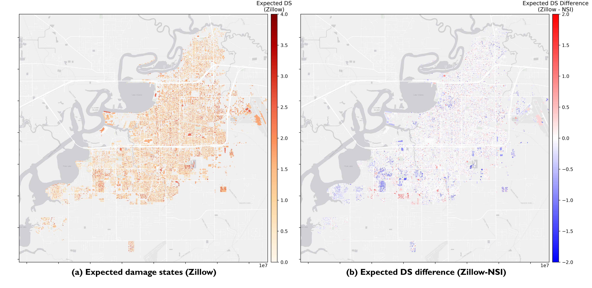
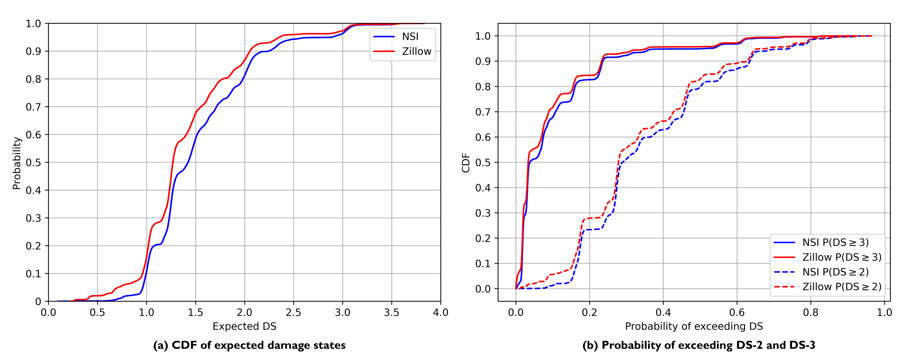
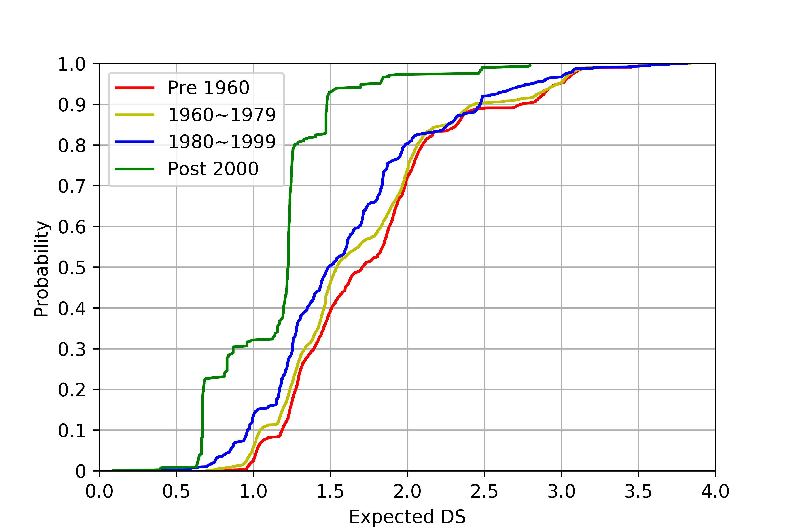
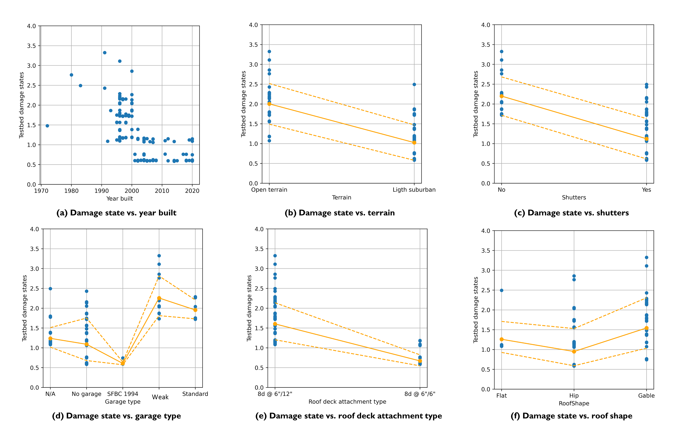
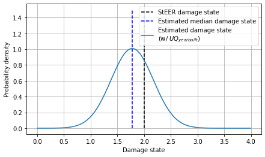
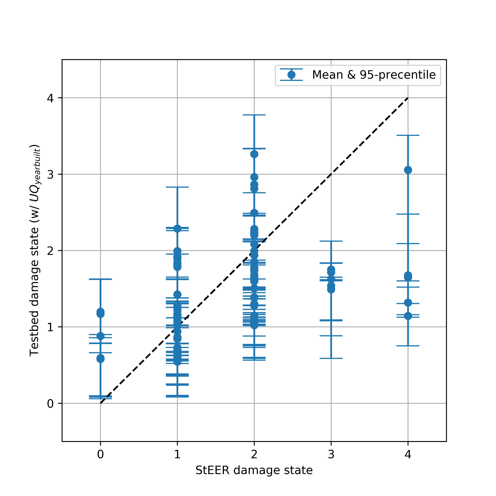
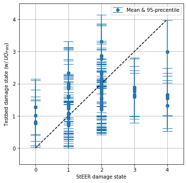
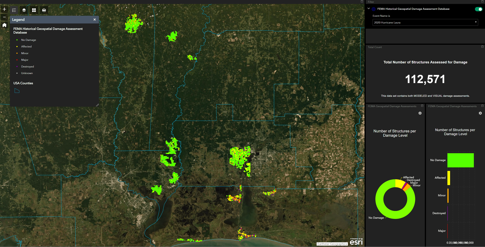
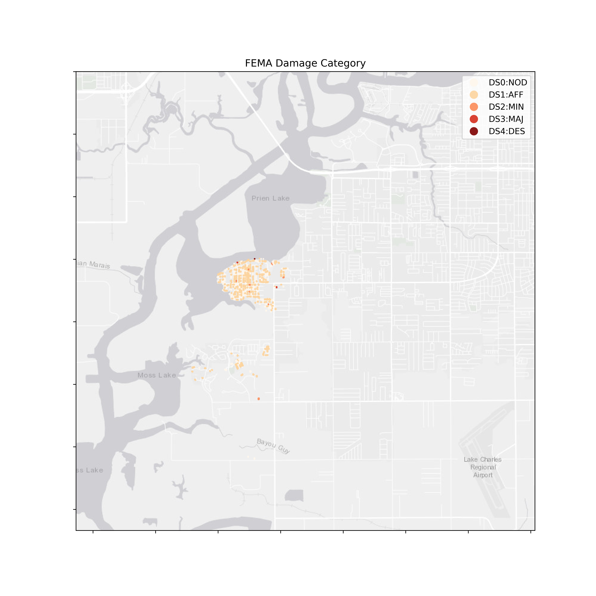
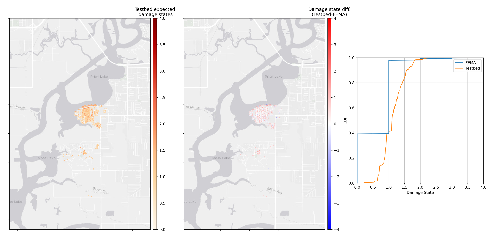

.. _lbl-testbed_LC_validation_results:

**************************
Validation Results
**************************

This section discusses damage and loss results from three comparative and validation studies with different emphases:

#. The :ref:`lbl-testbed_LC_surf-zillow_year_built_results` first explores the implications of utilizing year built based on two data resources 
   (NSI and Zillow). As discussed in :ref:`lbl-testbed_LC_asset_description`, the Zillow-based model tends to predict 
   higher year predictions (more recent constructions) than the NSI-based model, especially for the southern edge on the 
   city. This is reflected by the fact that Zillow-based damage and loss in that region is lower than the NSI-based results.
   Following the parametric study in :ref:`lbl-testbed_LC_verification_rulesets`, 
   the observed trend in damage and loss with respect to year built is discussed.
#. The :ref:`lbl-testbed_LC_validation_steer` contrasts the testbeds damage estimates versus the visually-assigned damage 
   states from StEER members and explores influence of uncertainty in building attributes and peak wind speed. Several notable 
   trends between building damage and building attribute type will be discussed and reasoned.
#. The :ref:`lbl-testbed_LC_validation_fema` focuses on validating the testbed damage estimates against the FEMA
   Historical Damage Assessment Database (535 records associated with this testbed). The testbed results are found to
   slightly overestimate the damage for the undamaged state (DS-0) which suggests that future investigations are still 
   needed given uncertainties around the methodology used to generate the FEMA data.

.. _lbl-testbed_LC_surf-zillow_year_built_results:

Influence of Year Built (Zillow vs. NSI and Parametric Study)
==============================================================

The year built is a critical attribute as it triggers attribute assignments by various rulesets. 
As discussed in :ref:`lbl-testbed_LC_asset_description`, different sources of data were used 
to predict the YearBuilt engaging both the National Structural Inventory (NSI) (with SURF correcting some 
misalignments and gaps) and `Zillow <https://www.zillow.com/>`_, which also provides the year built 
information for many of the residual buildings in the studied region. The implications of using different 
sources of year built information to project damage is explored in :numref:`ds_zillow_comp`, noting the 
contrast map that depicts the difference between the damage state projected by SURF-NSI and that projected 
by Zillow. Note that the difference is not prominent in downtown Lake Charles, although divergence is noted 
southwest of the city where the Zillow set predicts relatively lower damage states. Compared in 
:numref:`PDS_cdf` are the the CDF distributions of expected damage states (NSI vs. Zillow) as well as the 
probability of exceeding DS-2 and DS-3.  :numref:`year_built_infl_bin` plots the cumulative distributions of
expected damage states for four different year built bins: Pre 1960, 1960-1979, 1980-1999, and Post 2000.  
In general, we see improved building performance (low damage states) as code revisions by years 
as recalling the parametric study in :ref:`lbl-testbed_LC_verification_rulesets`, the dominate building type is 
WSF1 (:numref:`fig-inventoryPineChart`) whose wind-induced loss is particularly sensitive to nail spacing requirements
varied by years.

   Comparison of expected damage states (NSI vs. Zillow).

   CDFs of expected DS and probability of exceeding DS-2 and DS-3.

   CDFs of expected DS by year bins (NSI results).

.. _lbl-testbed_LC_validation_steer:

Validation: StEER
==================

For Hurricane Laura, the `Structural Extreme Reconnaissance (StEER) Network <https://www.steer.network/>`_ 
has released a dataset of the visual inspection and damage estimation 
for sample buildings in Lake Charles ([Roueche21]_, refereed as StEER buildings). There are 99 StEER buildings 
included in this testbed, which offers an opportunity to validate the workflow. In the meantime, the relatively 
small sample size also offers the convenience of investigating the influence of different modeling parameters 
on the estimated damage states and relating them to corresponding field observations to help understand the 
dominant trends in the data. As will be illustrated, some of these trends validate the effectiveness of the 
methodology and others indicate potential measures to improve the wind resistance.

Before presenting results, it is important to note, as discussed in StEER’s report on Hurricane Laura ([Roueche21]_), 
that StEER’s assessments for Laura were conducted virtually from streetview imagery due to COVID-19 restrictions 
on travel; thus this “ground truth” is less reliable in discerning some aspects of the damage than a traditional 
StEER mission with in-person, up-close forensic assessments. Also note that since rulesets from New Jersey are 
applied to assign attributes and are not consistent with the historical regulatory environment in Louisiana, 
the predicted damage states are also likely to be lower, particularly for construction older than 2006 (the 
year Louisiana first implemented its statewide building codes linked to IBC/IRC). Finally, as also discussed in 
StEER’s report ([Roueche21]_), there were low rates of compliance with shuttering requirements in the affected 
area (based on observations immediately after landfall). Thus it is likely that the shutter attributes are 
assigned in this workflow at a rate higher than actually observed in the event, leading to lower rates of 
predicted damage than those observed in the field.

:numref:`influential_var` plots the estimated damage states against key building attributes that are found
to influence the resulting damage state under the hurricane wind hazard. Major observed trends are as follows:

#. In general, the damage state is negatively correlated to the year built. Buildings with built year after 2000 
   are found to have prominent improvement in the wind resistance and have lower damage states. This is reasoned 
   by the authors to be led by the assumption in the ruleset that the post-2000 buildings would have shutter 
   measures and stronger roof deck attachment. It is import to note, however, that this effect predicted based on 
   New Jersey rulesets will not be observed in Louisiana until at least 2006 when statewise codes were enacted, 
   and further, is likely to not be pronounced given the earlier observation about low rates of compliance with shuttering 
   requirements.
#. The surface roughness, i.e., terrain feature, is found to be a key variable when considering the potential 
   damage from the hurricane to the building. Even moving from open terrain to light suburban, following the 
   damage functions in HAZUS, we see about 50% reduction in the average damage state. This is associated with the 
   reduction in mean wind speed as surface roughness increases.
#. Shutters could significantly help reduce the potential wind-induced damage: average damage state is reduced 
   from 2.2 to 1.2. This observation makes the low compliance noted by StEER particularly noteworthy.
#. Garage type also would influence the building performance against the wind hazard: garages per SFBC 1994 are 
   found to have much better behaviors than the standard and weak garages. This effect is not expected to be 
   pronounced in Lake Charles given the low incidence of attached garages noted in the samples discussed in 
   :ref:`lbl-testbed_LC_asset_description`.
#. As expected, roof deck attachment using a tighter nail spacing (6 in vs. 12 in) is found to perform much better.
#. As also expected, gable roof is found to have slightly worse performance than the hip and flat roofs.

   Influential building attributes on the wind-induced damage state.

It is noted that the trends observed in :numref:`influential_var` are based on a so-called "median" model representing 
our best estimates of building attributes. However, in reality, because of the lack of high-resolution or multiple 
data resources, we may not have 100% confidence about certain building attributes or hazard fields, e.g., year built 
or peak wind speed at a specific site. Hence, the estimated "median" damage state from the "median" model may not give 
the full representation of the real damage potential.  As illustrated in :numref:`ds_uq`, if considering the uncertainty 
in the year built (instead of a deterministic value, assuming it follows a normal distribution with a standard deviation 
of 10 years), we could sample year built from the distribution and repeat the damage assessment by sufficient number of times to 
estimate the distribution of the damage state. This however assumes differences are attributable to uncertainties in 
the year built and neglects the fact that the predictors are biased by attribute assignments using rulesets that are derived from 
a difference regulatory environment (New Jersey) with a longer history of adopting and enforcing model building codes 
statewide. This fact may explain why the predicted damage states bias toward lower levels of damage (assuming less 
vulnerable structures than was the case in practice).

   Uncertainty in the estimated damage state.

Following this idea, for each of the 99 StEER buildings, we sampled 100 year built values from a distribution with the mean of 
the given year built value and a standard deviation of 10 years, and ran the damage assessment for each sampled case.
:numref:`ds_uq_yb` summarizes the comparison between the mean and 95-percentile of estimated damage state and the 
StEER damage state. Similar exercises (:numref:`ds_uq_pws`) are conducted for the peak wind speed where we sampled 100 PWS from a 
distribution with a standard deviation of 20 mph.

   Influence of uncertainty in year built on the estimated damage state.

   Influence of uncertainty in PWS on the estimated damage state.

.. _lbl-testbed_LC_validation_fema:

Validation: FEMA Historical Geospatial Damage Assessment
========================================================

FEMA and the Department of Interior lead the development of the 
`Geospatial Platform <https://communities.geoplatform.gov/disasters/>`_, an internet-based service environment that 
provides a suite of well-manged geospatial data, services, applications, and tools. The 
`FEMA Historical Damage Assessment Database <https://communities.geoplatform.gov/disasters/historical-damage-assessment-database/>`_ 
is a repository of geospatial damage assessments from past National Disaster events where 
damage assessments were conducted either using high-resolution imagery or by means of geospatial modeling. 

For Hurricane Laura, the damage categories of 112,571 buildings in the Louisiana were modeled from flood depths at the 
structure as characterized based on modeled wind, flood or surge data. Five damage categories are 
used: No Damage (NOD), Affected (AFF), Minor (MIN), Major (MAJ), and Destroyed (DES). Out of the 112,571 buildings, 535 buildings, located in 
the west bound of the Lake Charles city at the waterfront of the Prein Lake, are also investigated 
in this testbed. :numref:`fema_damage_subset` is a subset of data obtained from 
`FEMA Public Data <http://disasters.geoplatform.gov/publicdata/National/Data/HistoricalDamageAssessmentDatabase/PublicRelease_20210622/>`_.
:numref:`fema_damage_bim` is the building inventory for this subset. The full inventory and FEMA damage assessment 
results can be accessed by `FEMA Damage Assessment of the 535 buildings <https://github.com/NHERI-SimCenter/SimCenterDocumentation/blob/master/docs/common/testbeds/lake_charles/data/FEMA_DamageDatabase_LakeCharles_Sample.csv>`_ and 
`BIM inventory of the 535 buildings <https://github.com/NHERI-SimCenter/SimCenterDocumentation/blob/master/docs/common/testbeds/lake_charles/data/BIM_LakeCharles_FEMA.csv>`_.

   FEMA Historical Geospatial Damage Assessment Database (2020 Hurricane Laura).

.. csv-table:: FEMA Damage Assessment example buildings in Lake Charles.
   :name: fema_damage_subset
   :file: data/FEMA_DamageDatabase_LakeCharles_Sample_example.csv
   :header-rows: 1
   :align: center

.. csv-table:: BIM inventory of example buildings in this testbed overlapped with the FEMA Damage Assessment Database.
   :name: fema_damage_bim
   :file: data/BIM_LakeCharles_FEMA_example.csv
   :align: center
   :widths: 5, 7, 5, 6, 9, 7, 6, 7, 7, 7, 7, 9, 7, 6, 6, 9

:numref:`fema_dc` shows the damage categories collected from the FEMA Damage Assessment Database, where most buildings 
are assessed as having No Damage or Affected. Also noted from :numref:`fema_damage_subset` is that all these 
buildings are subject to CAT-4 gust wind speed, which is consistent with our input wind field where the 3-s gust peak 
wind speed is about 130 :math:`mph` (please see :ref:`lbl-testbed_LC_hazard_characterization`).

To compare these damage categories with the estimated damage states by the workflow in this testbed, we assume that the 
five damage categories are mapped to the five damage states in the HAZUS wind damage functions, assuming the inundation does 
not cause prominent flood-induced damage to the buildings. While this assumption will be the subject of future validation, 
:numref:`fema_ds_comp` summarizes (1) the expected damage states of the 535 buildings, (2) the spatial distribution of difference between the FEMA 
Damage Categories and estimated damage states, and (3) the statistical distribution of the difference between the two.
Given the FEMA set is based on a discrete (category-based) description while the testbed set is based on probabilistic 
estimates, the two results have fairly good agreement except the FEMA set has buildings predicted as no damage (DS-0). 
This over-prediction of DS-0 is also seen in StEER set results (:numref:`ds_uq_yb` and :numref:`ds_uq_pws`). The uncertainty 
in the year built and wind speed, to some extent, can help explain this over-prediction, as can the fact that 
the rulesets applied are translated directly from New Jersey. It is further important to 
note that FEMA assessments also consider the effects of storm surge. Future investigations are still 
needed to consider other possible factors causing this mismatch in predicted DS-0.

   FEMA Damage Category in the Geospatial Damage Assessment Database (for the 535 buildings).

   Comparison: FEMA Damage Category vs. expected damage state by the workflow (for the 535 buildings).

.. [Roueche21]
   Roueche, D. Kameshwar, S. Vorce, M. Kijewski-Correa, T. Marshall, J. Mashrur, N. Ambrose, K. Brown, C. Childress, O. Fox, D. Morris, 
   K. Rawajfih, H. Rodriguez, L. (2021) "Field Assessment Structural Teams: FAST-1, FAST-2, FAST-3", in StEER - Hurricane Laura. 
   DesignSafe-CI. https://doi.org/10.17603/ds2-dha4-g845