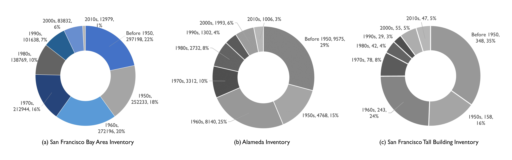
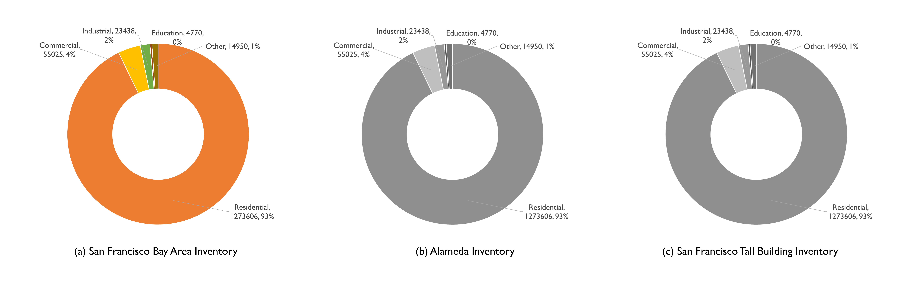
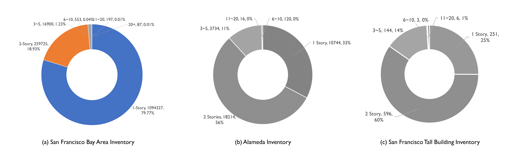
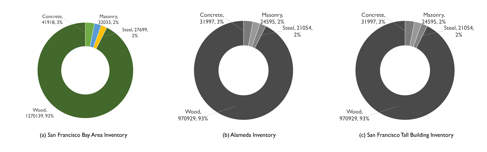

.. _lbl-testbed_SF_overview:

********
Overview
********

This testbed for regional earthquake risk assessment of San Francisco Bay Area under Hayward Earthquake. 
Its intent is to demonstrate the computational scaffolding upon which community developers can progressively 
contribute refinements that increase the fidelity and capacities of the backend regional resilience assessment workflow. 
This documentation specifically demonstrates the process of: (1) asset description, (2) hazard characterization, 
(3) asset representation, (4) damage and loss modeling. Sample results are 
presented to verify the workflow and demonstrate its usage.

Rationale
===========

The San Francisco Bay Area encompasses three large cities, San Francisco, Oakland and San Jose, which together with
the surrounding communities have a population of about 7.7 million people and accomendate a well-defined metro area 
with a blend of low-rise commercial (1-3 stories), industrial, high-rise hotels/casinos (over 20 stories), 
and single/multi-family residences. The seismic hazard in the San Francisco Bay
Area is dominated by the San Andreas and Hayward faults that straddle the region. The San Andreas Fault is located just to
the west of San Francisco and is capable of a magnitude Mw 8 earthquake, such as the Mw 7.8 event that occurred in 1906.
The Hayward Fault, which runs up the eastern edge of the Bay Area, is capable of a magnitude Mw 7 earthquake, such as
the Mw 6.7 event that occurred in 1868. Recently, the USGS completed an earthquake scenario study for a Mw 7 event on
the Hayward fault, which provided an opportunity to contrast existing regional assessment methods with the SimCenter’s
computational workflow. This testbed can help inform the decision making to face the potential damage and loss under 
the earthquake hazard.

Capabilities and Supported Hazards
====================================

The testbed supports the transition from census-block-level loss projections to asset-level projections that 
assess the damage to individual buildings under ground shaking. Supported building classes include residential, 
commercial and industrial construction, critical facilities, and manufactured homes, constructed of wood, steel, 
reinforced concrete and masonry.

Current Implementation
========================

For the initial implementation of the backend workflow, asset description adopts an augmented parcel approach 
that enriches tax assessor data. Finite difference models are employed to simulate the earthuqake hazards, which 
leads to three-component seismograms for grid points spaced every 2 km throughout the study region. 
In lieu of a structural analysis model, assets are assigned attributes associated with 
various HAZUS-consistent building classifications. The story-based damage and loss fragility models are derived from 
correspoinding building-level damage and loss functions from the HAZUS earthquake methodology ([FEMA18]_).

Available Inventories
========================

Three different building inventories have been developed for the Atlantic County testbed and can be accessed on DesignSafe.

**San Francisco Bay Area Inventory**: Full inventory of 1.84 M buildings in San Francisoc Bay Area, 
described based on a variety of data sources (:numref:`fig-buildingClassSFBA`).

.. _fig-buildingClassSFBA:

.. figure:: figure/BuildingClass_sfba.png
   :align: center
   :figclass: align-center
   :width: 1200

   Geospatial visualization of subclasses of buildings in San Francisco Bay Area.

**Alameda Inventory**: To be added

.. _fig-buildingClassFEI:

.. figure:: figure/new_inventory_map.png
   :align: center
   :figclass: align-center
   :width: 1200

   Geospatial visualization of subclasses of buildings in Alameda Inventory.

**San Francisco Tall Building Inventory**: To be added

.. _fig-buildingClassEI:

.. figure:: figure/new_inventory_map_expl.png
   :align: center
   :figclass: align-center
   :width: 700

   Geospatial visualization of subclasses of buildings in San Francisco Tall Building Inventory.

The following figures summarize characteristics of these inventories, including distribution by year built (:numref:`fig-distBuiltYear`), by occupancy (:numref:`fig-occupancyType`), 
by number of stories (:numref:`fig-numStory`) and by primary construction material (:numref:`fig-constrMaterial`). 
Notably, these inventories are typified by older vintages of construction (76% of the buildings were constructed 
before 1980), with a dominance of low-rise (1-2 stories), residential, wood construction (approximately 
93% of San Francisco Bay Area buildings). Steel and reinforced concrete constructions are more prevalent in downtown 
San Francisco, Oakland, and San Jose. 

.. _fig-distBuiltYear:

   Distribution of year built for buildings.

.. _fig-occupancyType:

   Distribution of occupancy types.

.. _fig-numStory:

   Distribution of total story numbers for buildings.

.. _fig-constrMaterial:

   Distribution of primary construction material types.

.. [FEMA18]
   FEMA (2018), HAZUS – Multi-hazard Loss Estimation Methodology 2.1, Earthquake Model Technical Manual, Federal Emergency Management Agency, Washington D.C.

