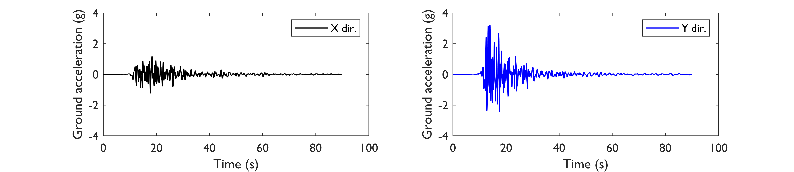
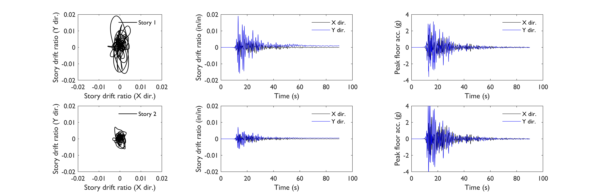
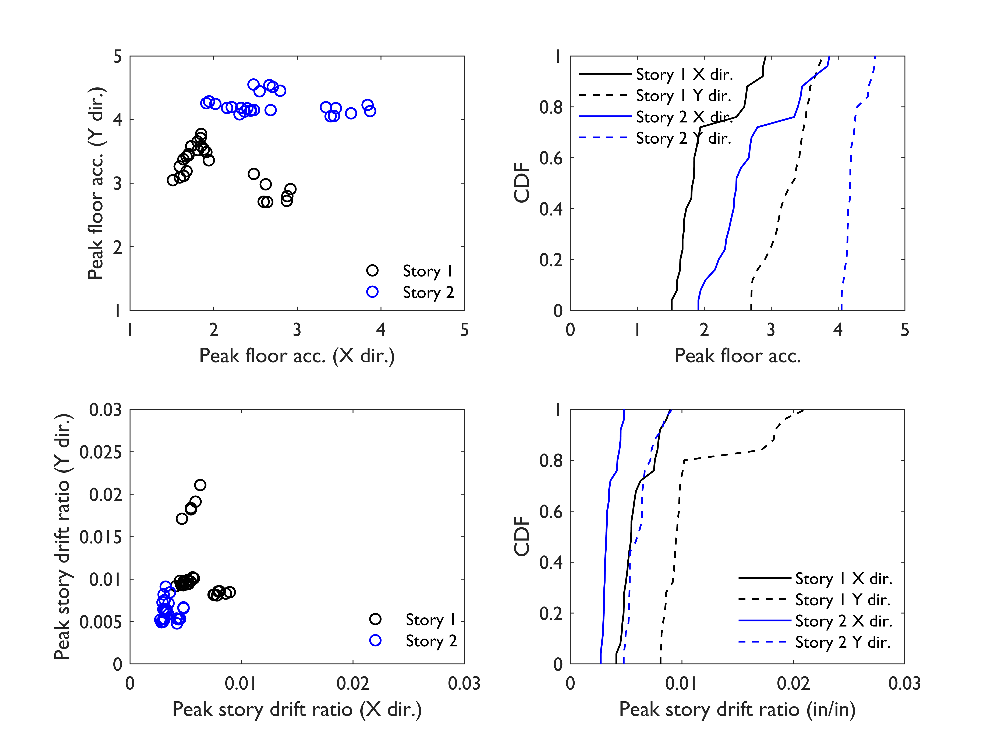

.. _lbl-testbed_SF_response_simulation:

*******************
Response Simulation
*******************

The non-linear response of buildings to ground shaking is
simulated using OpenSees ([OpenSees20]_) and an application,
**MDOF-LU**, that generates an idealized structural analysis model
based on structure type, height, plan area, year of construction,
and the type of occupancy. The **MDOF-LU** application is based
on a method developed by [Lu14]_ that uses the
building configurations in the HAZUS earthquake technical
manual and corresponding capacity curve descriptions to define
a multi-story non-linear shear-column finite element model
with lumped masses.

Each of the 1.84 M building models is analyzed for 25 pairs
of 2D ground motions, where the peak story drift ratios and 
peak floor accelerations are recorded for subsequent damage
and loss analyses. :numref:`fig-acc` shows one example pair of 
2D ground motion acceleration histories. It is used for analyzing 
a 2-story wood frame multi-unit residential building in Berkeley 
(initially built in 1972 and tagged as a Moderate-Code design). 
:numref:`fig-srd` shows the resulting story drift ratio and 
peak floor acceleration demands under the example ground motion 
pair. The vibration in the Y direction (North-South) is more intense 
(peak story drift ratio is around 1.9\% in the first story, and 
peak floor acceleration is around 4 g in the second story).

.. _fig-acc:

   Example ground motion acceleration histories of simulated SW4 seismograms.

.. _fig-srd:

   Structural responses of the wood frame under the example ground motion pair.

The approximations and uncertainties in the
structural model and behavior are considered by treating the
initial stiffness and the damping ratio as random variables with
a 0.1 coefficient of variation. These uncertainties are propagated
through the analysis using different realizations of the stiffness
and damping parameters for each of the 25 non-linear dynamic
analyses for each building. :numref:`fig-srd` shows the distributions 
of the simulated structural responses of the example wood frame.

.. _fig-edp_dist:

   Simulated structural response distribution of the wood frame with modeling uncertainty under the 25 ground motion pairs.

.. [OpenSees20]
   OpenSees (2020). Open System for Earthquake Engineering Simulation. Berkeley: OpenSees.

.. [Lu14]
   Lu, X., Han, B., Hori, M., Xiong, C., and Xu, Z. (2014). 
   A coarse-grained parallel approach for seismic damage simulations of urban areas based on refined
   models and GPU/CPU cooperative computing. Adv. Engine. Soft. 70, 90–103. 
   doi: 10.1016/j.advengsoft.2014.01.010