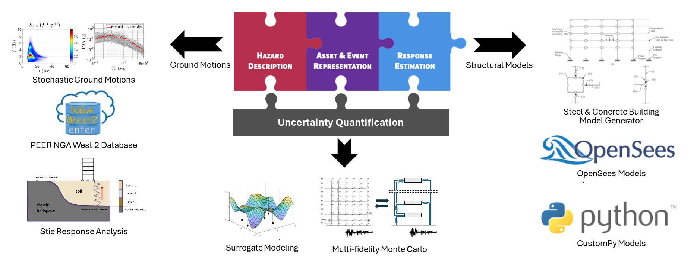

.. _lblAbout:

******
About
******

This open-source research application, which is available at |tool github link|, is released under a **2-Clause BSD** license (see :ref:`lblLicense`). The **Earthquake Engineering with Uncertainty Quantification (EE-UQ)** application creates and launches simulation workflows to **assess the response of a structure subjected to earthquakes**. The application provides: 1) multiple methods to represent the seismic hazard at a site through the selection/generation of a set of acceleration time histories, 2) multiple approaches to create a numerical model of the structure, and 3) various options to perform the numerical simulation of the response. Both deterministic and probabilistic simulations are supported. In probabilistic simulations, random variables can represent uncertainties in the seismic event, structural model, and numerical simulation solver. These uncertainties are automatically propagated through the simulation to arrive at a probabilistic description of structural response. Probabilistic simulation results can be further processed to perform sensitivity analysis or train surrogate models. As the computations to make these determinations can be prohibitively expensive to perform on a user's local computer, the user has the option to perform the computations remotely on the Frontera supercomputer. Frontera is located at the Texas Advanced Computing Center (TACC) and made available to the user through NHERI DesignSafe, the cyberinfrastructure provider for the distributed NSF-funded Natural Hazards in Engineering Research Infrastructure (NHERI) facility.

.. _fig-ExperimentalWind6:

	Earthquake Engineering with Uncertainty Quantification (EE-UQ)

Whether running locally or remotely, the computations are performed, as will be discussed in :ref:`lbl-technical-manual`, in a workflow application. That is, the numerical simulations are performed by several different applications. The |app| backend software runs these different applications for the user, taking the outputs from some programs and providing them as inputs to others. The design of the |app| is such that researchers can modify the backend application to utilize their application in the workflow computations. This will ensure researchers are not limited to using the default applications we provide and will be enthused to provide their applications for others to use.

This document covers Version |tool version|  of the tool. Users are encouraged to comment on what additional features and capabilities
they would like to see in this application. These requests and feedback can be submitted through the |messageBoard| we greatly appreciate any input you have. If there are features you want, chances are many of your colleagues also would benefit from them. Users are encouraged to review |app requirements| to see what features are planned for this application.
