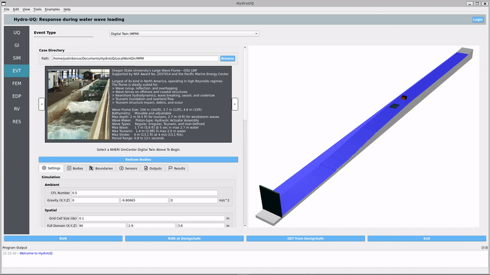

.. _lblAboutHydroUQ:

*****
About
*****

.. _lblOverviewHydroUQ:

Overview
========

|full tool name| (|app|) is an open-source software tool developed by the NHERI SimCenter. It allows for utilization of existing simulation software applications, e.g. OpenSees and OpenFOAM, in uncertainty quantification (UQ) workflows. The application provides popular UQ methods (e.g., forward, inverse, reliability, sensitivity, parameter estimation, and surrogate modeling) to engineers, researchers, and students for tsunamis, hurricane storm-surges, and other water-borne hazards. The SimCenter is part of the Natural Hazards Engineering Research Infrastructure (NHERI) program, funded by the National Science Foundation (see :ref:`lblAcknowledgements`). 

.. figure:: NHERI_SimCenter_DamBreakAnimation_VelocityPressureVisualized_2.5MParticles_res0.05m_23012023.gif
   :align: center
   :figclass: align-center

   Using HydroUQ to model the text "NHERI SimCenter" during a dam-break simulation. "NHERI" is made of Drucker-Prager sand, "SimCenter" is made of Non-Associative Cam-Clay concrete. The Material Point Method (ClaymoreUW) was used for the simulation within HydroUQ.

To download the HydroUQ desktop application for Windows 10 or Mac OS X, navigate to |appLink|. For Linux systems, e.g. Ubuntu 18.04-LTS, download the source code at |tool github link| and build the program file by following steps provided in the :ref:`Build Guide <lblHowToBuild>`. |app| is released under the **2-Clause BSD** license (see :ref:`HydroUQ's License <lblLicense>`).

   The HydroUQ Desktop Application's User Interface for Oregon State University's Large Wave Flume Digital Twin.

This is Version |tool version| of the tool. Users are encouraged to comment on what additional features and capabilities they would like to see in this application. These requests and feedback can be submitted through an anonymous |user survey link|. We greatly appreciate any input you have. If there are features you want, chances are many of your colleagues also would benefit from them. We encourage you to review the :ref:`Requirments Traceability Matrix <lblHydroRequirements>` to see what features are planned.

The additional simulations required for uncertainty quantification can be prohibitively expensive. To overcome this impediment, the user has the option to perform the response simulations on the Frontera and Lonestar6 supercomputers, located at the Texas Advanced Computing Center (TACC). These HPC resources are made available to the user through NHERI DesignSafe-CI, the cyberinfrastructure provider for the distributed NSF-funded Natural Hazards Engineering Research Infrastructure (NHERI) facility.

.. _lblCapabilitiesAndLimitationsHydroUQ:

Capabilities
============

Below are key, modular capabilities of |short tool id|, categorized by Uncertainty Quantification (UQ), Design Building General Information (GI), Structural Information & Analysis Model (SIM), Natural Hazard Event (EVT), Engineering Demand Parameters (EDP), Finite Element Method (FEM), Random Variables (RV), and Results (RES).

.. list-table:: 
   :widths: 5 100 
   :header-rows: 1

   * - Item
     - Capabilities
   * - UQ
     - Easy access to different UQ methods. Parallelized UQ algorithms. Multiple alternative algorithms for each method.
   * - GI
     - Basic interface for user-provided general building information (e.g. location, age, and building type).
   * - SIM
     - Easy interface for user-provided structural information and analysis models (e.g. geometry, material properties, and boundary conditions). Provides a multi-degree-of-freedom (MDOF) building model. Allows for OpenSeesPy models defined in user-provided scripts. Supports investigation of multiple potential building models with associated "belief" values for each. 
   * - EVT 
     - OpenFOAM computational fluid dynamics (CFD) simulations. GeoClaw Shallow-Water Equations (SWE) and OpenFOAM CFD one-way coupled simulations. FOAMySees two-way coupled CFD-FEA simulations. Material Point Method (MPM, ClaymoreUW) simulations. Pre-built and validated digital wave-flume twins. 
   * - FEM
     - Easy interface for user-provided simulation models (not only FEM models but *any model*), including Opensees, Python, or any other simulation models (e.g. FEM or non-FEM software) with only a python-scripted interface provided by the user to HydroUQ.
   * - RV
     - Twelve different kinds of probability distributions with correlations.
   * - EDP
     - Scalar and vector EDP parsing. Hazard specific EDP lists (e.g. tsunami and storm-surge). Support for user-defined EDPs.
   * - RES
     - Interactive plotting of scatter charts, histograms, and cumulative mass functions. Summary of statistics. Save data into a CSV file.
   * - General
     - Graphical user interface. Free and easy one-click remote running option. 
