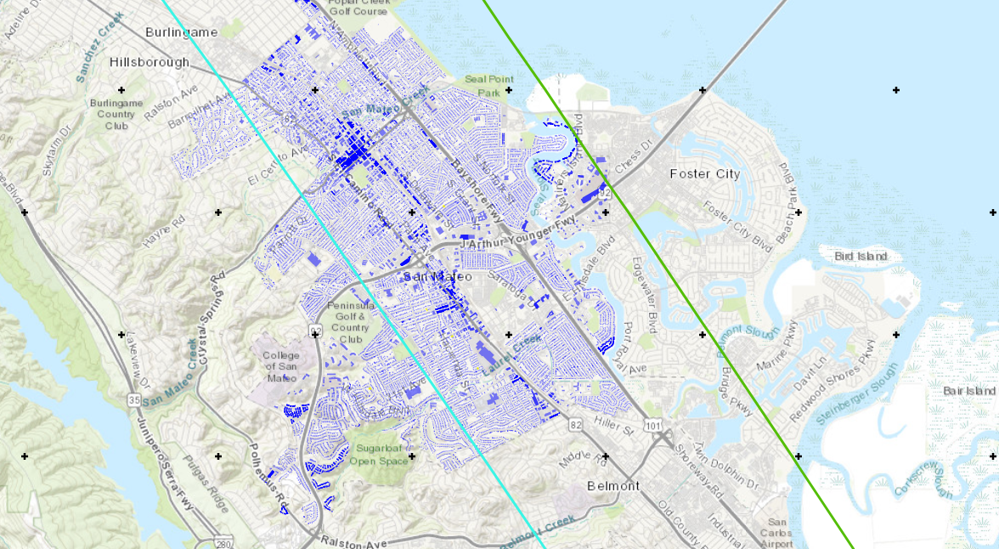

≈
E6 - ShakeMap Scenario
========================

+-----------------+-----------------------------------------------------+
| Download files  | :examplesgithub:`Github <E6ShakemapScenario/>`      |
+-----------------+-----------------------------------------------------+

This example demonstrates HAZUS earthquake damage and loss assessment capabilities with a USGS ShakeMap as an input. Building-level Damage and Losses (D&L) are calculated directly from an Intensity Measures (IM) grid for a Mw7.8 Scenario Earthquake - North San Andreas + North Coast + Peninsula + Santa Cruz Mountain scenario earthquake. Approximately 21,000 buildings are considered in the city of San Mateo, CA. The ShakeMap for this example can be downloaded `here <https://earthquake.usgs.gov/scenarios/eventpage/nclegacynpsanandreassansapsasm7p8_se/shakemap/>`_. 

#. **VIZ** This example illustrates the PGA contours of a ShakeMap scenario earthquake, i.e., one that has not occurred, on the San Andreas fault. In addition, it shows the building assets available in San Mateo, CA. 

   .. figure:: figures/r2dt-0006-VIZ.png
      :width: 600px
      :align: center

#. **GI** First, the unit system and asset type are prescribed in this panel, and we're interested in the building engineering demand parameters, damage measures, and the resulting decision variables.

   .. figure:: figures/r2dt-0006-GI.png
      :width: 600px
      :align: center

#. **HAZ** The **ShakeMap Earthquake Scenario** input panel allows for the import of a USGS ShakeMap, as shown with the SanAdreasM7.8 ShakeMap selected here. To load a ShakeMap a user must specify the path to a folder containing the ShakeMap files. At a minimum, the folder must contain a ``grid.xml`` file. More than one ShakeMap can be loaded at once. The ShakeMap that is selected on the list seen on the right side of the figure below will be employed in the analysis. 

   .. figure:: figures/r2dt-0006-HAZ.png
      :width: 600px
      :align: center

#. **ASD** In the asset definition panel, the path to the ``San_Mateo_buildings.csv`` file is specified. Once this file is loaded, the user can select which particular assets will be included in the analysis by entering a valid range (e.g., 1-50) in the form and clicking **Select**. The ``San_Mateo_buildings.csv`` includes parameters for the damage and loss assessment (i.e., number of stories, year of built, occupancy class, structure type, and plan area) for more than 20,000 buildings in the community.

   .. figure:: figures/r2dt-0006-ASD.png
      :width: 600px
      :align: center

#. **HTA** Next, a hazard mapping algorithm is specified using the **Nearest Neighbor** method and the **SimCenterEvent** application, which are configured as shown in the following figure with **100** samples in **4** neighbors, i.e., randomly sampling 100 ground motions from the nearest four stations (each station has one ground motion recording specified in the **HAZ**).

   .. figure:: figures/r2dt-0006-HTA.png
      :width: 600px
      :align: center

#. **MOD** In the building modeling panel, simply leave the first dropdown box set to **None**.

   .. figure:: figures/r2dt-0006-MOD.png
      :width: 600px
      :align: center

#. **ANA** In the analysis panel, **IMasEDP** is selected from the primary dropdown.

   .. figure:: figures/r2dt-0006-ANA.png
      :width: 600px
      :align: center

#. **DL** The damage and loss panel is now used to configure the **Pelicun3** backend. The **HAZUS MH EQ** damage and loss method is selected and configured as shown in the following figure:

   .. figure:: figures/r2dt-0006-DL.png
      :width: 600px
      :align: center

#. **UQ** For this example the **UQ** dropdown box should be set to **None**.

   .. figure:: figures/r2dt-0006-UQ.png
      :width: 600px
      :align: center
	  
#. **RV**

   The random variable panel will be left empty for this example.

#. **RES** The analysis outputs for the selected buildings are shown in the figure below. It is important to note that the results are based on an approximate characterization of the ground motions and preliminary building data that has not been curated or verified thoroughly yet. The results presented herein are only for demonstrating the use of R2DTool and do not serve as an accurate representation of the real losses resulting from the earthquake.

   .. figure:: figures/r2dt-0006-RES.png
      :width: 600px
      :align: center
