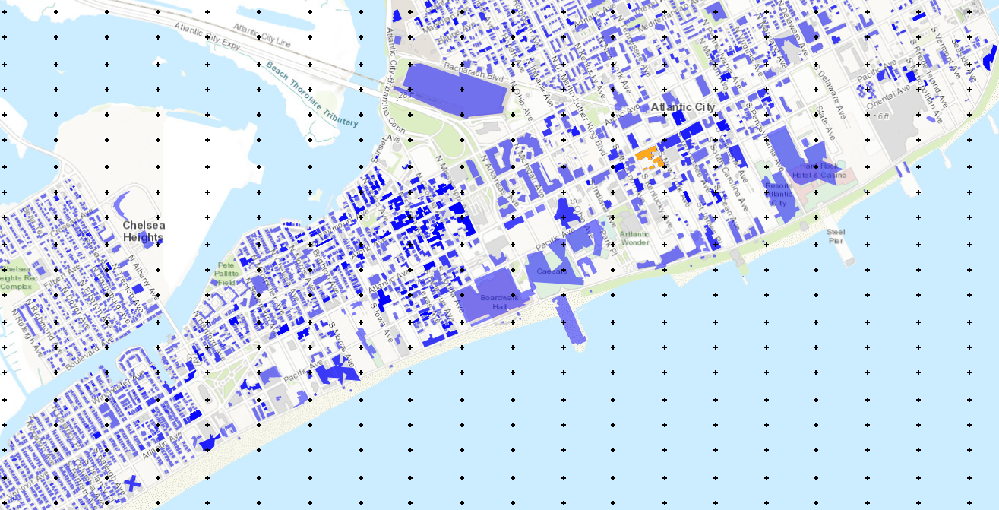

E7 - Hurricane Wind + Water
=============================

+-----------------+-----------------------------------------------------------------+
| Download files  | :examplesgithub:`Download <E7HurricaneWindWater/>`              |
+-----------------+-----------------------------------------------------------------+

This example presents a coupled damage assessment for hurricane wind and water inundation hazards. Approximately 6600 buildings are considered in the city of Atlantic City, NJ.

#. **VIZ** This example shows simulation for pseudo earthquake scenarios in Bay Area. The damage and loss of a sample of buildings in the Alameda County due to the soil liquefaction are estimated.  The results presented herein are only for demonstrating the use of R2DTool and do not serve as an accurate representation of the real losses.

   .. figure:: figures/r2dt-0007-VIZ.png
      :width: 600px
      :align: center

#. **GI** Next, the general information panel is used to broadly characterize the problem at hand. In this example, the imperial force and length units are used, and we're interested in the engineering demand parameters, damage measures, and the resulting decision variable (e.g., expected replacement cost).

   .. figure:: figures/r2dt-0007-GI.png
      :width: 600px
      :align: center

#. **HAZ** Now in the hazard panel, the **User Specified Wind Field** option is selected which allows for the use of pre-generated hurricane wind field scenarios. The following figure shows the relevant example files which are now entered in this pane. The peak wind speed is used as intensity measure to quantify the potential hurricane effects.

   .. figure:: figures/r2dt-0007-HAZ.png
      :width: 600px
      :align: center

#. **ASD** In the asset definition panel, the path to the ``AtlanticBuildingInventory.csv`` file is specified. Once this file is loaded, the user can select which particular assets will be included in the analysis by entering a valid range in the form and clicking **Select**. For this example, the range **1-20** is used to include all buildings. The ``AtlanticBuildingInventory.csv`` includes parameters for the damage and loss assessment (i.e., number of stories, year of built, occupancy class, structure type, plan area, replacement cost, and population).

   .. figure:: figures/r2dt-0007-ASD.png
      :width: 600px
      :align: center

#. **HTA** Next, a hazard mapping algorithm is specified using the **Nearest Neighbor** method and the **SimCenterEvent** application, which are configured as show in the following figure with **10** samples in **4** neighbours.

   .. figure:: figures/r2dt-0007-HTA.png
      :width: 600px
      :align: center

#. **MOD** In the building modeling panel, simply leave the first dropdown box set to **None**.

   .. figure:: figures/r2dt-0007-MOD.png
      :width: 600px
      :align: center

#. **ANA** In the analysis panel, **IMasEDP** is selected from the primary dropdown.

   .. figure:: figures/r2dt-0007-ANA.png
      :width: 600px
      :align: center

#. **DL** The damage and loss panel is now used to configure the **Pelicun** backend. The **HAZUS MH EQ HU** damage and loss method is selected and configured as shown in the following figure:

   .. figure:: figures/r2dt-0007-DL.png
      :width: 600px
      :align: center

#. **UQ** For this example the **UQ** dropdown box should be set to **None**.

   .. figure:: figures/r2dt-0007-UQ.png
      :width: 600px
      :align: center

#. **RV**

   The random variable panel will be left empty for this example.

