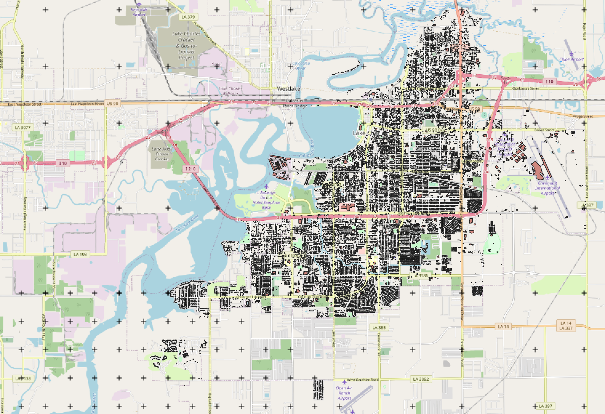
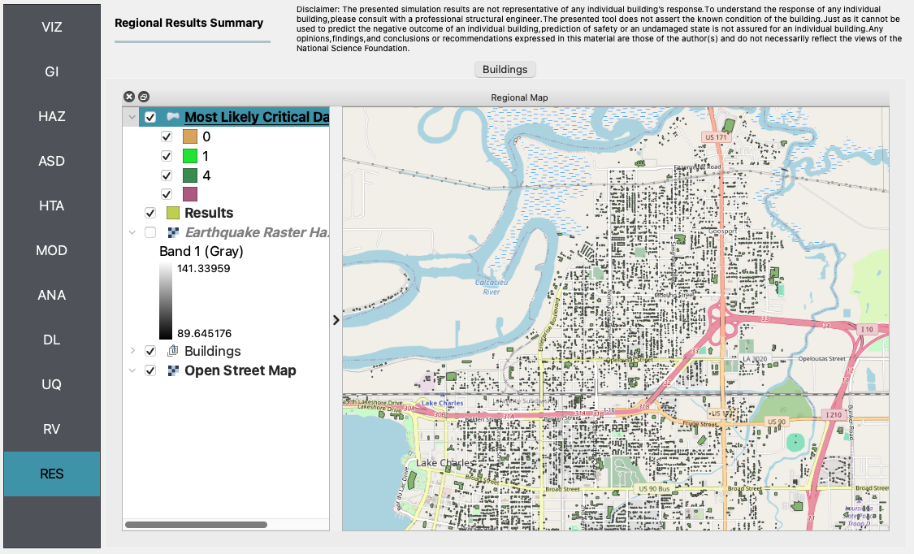
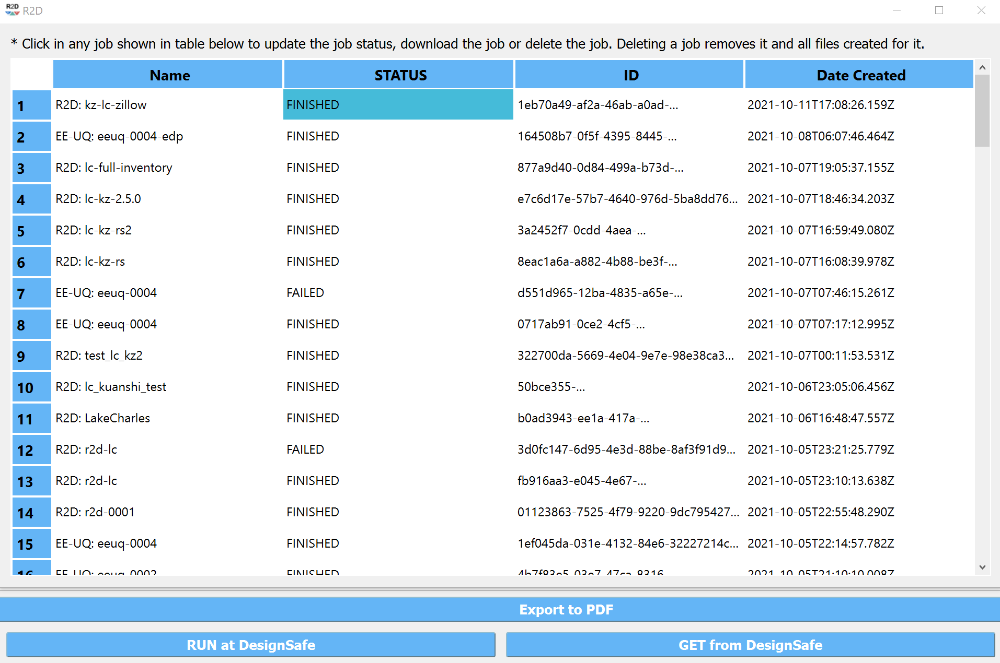

E8 - Hurricane Wind
===================

+-----------------+-----------------------------------------------------------------+
| Download files  | :examplesgithub:`Download <E8HurricaneWind/>`                   |
+-----------------+-----------------------------------------------------------------+

Hurricane Laura made landfall as a strong Category 4 storm near Cameron, LA in the early hours of 27 August 2020, tying the Last Island Hurricane of 1856 as the strongest land-falling hurricane in Louisiana history.
This example presents a wind-induced damage assessment for Lake Charles, LA. Peak wind speed data of Hurricane Laura from Applied Research Associates, Inc. is used as intensity measure, inventory data of about 26,000 wood residential buildings
is used along with the rulesets developed to map the inventory to HAZUS-type damage assessment. Final results include the damage and loss estimations along with the building information models based on the rulesets.

#. Set the **Units** in the **GI** panel as shown in :numref:`r2d_gi_E8` and check interested output files.

   .. figure:: figures/r2dt-0008-GI.png
      :name: r2d_gi_E8
      :align: center
      :figclass: align-center
      :width: 500

      R2D GI setup.
#. The **Raster Defined Hazard** option is used to define the peak gust wind speed field in the region.

   .. figure:: figures/r2dt-0008-HAZ.png
      :name: r2d_haz_E8
      :align: center
      :figclass: align-center
      :width: 500

      R2D HAZ setup.
#. Download the `BIM_LakeCharles_Full.csv <https://www.designsafe-ci.org/data/browser/public/designsafe.storage.published//PRJ-3207v4/01.%20Input:%20BIM%20-%20Building%20Inventory%20Data>`_ (under **01. Input: BIM - Building Inventory Data** folder). 
   Select **CSV to BIM** in the **ASD** panel and set the **Import Path** to "BIM_LakeCharles_Full.csv" (:numref:`r2d_asd_E8`). 
   Specify the building IDs that you would like to include in the simulation (e.g., 1-26516 for the entire inventory - note this may take very long time to run 
   on a local machine, so it is suggested to first test with a small sample like 1-100 locally and then submit the entire run to DesignSafe - see more details in :numref:`r2d_run_ds_E8`).

   .. figure:: figures/r2dt-0008-ASD.png
      :name: r2d_asd_E8
      :align: center
      :figclass: align-center
      :width: 500

      R2D ASD setup.
#. Select the **Site Specified** option in the **HTA** panel (e.g., :numref:`r2d_hta_E8`).

   .. figure:: figures/r2dt-0008-HTA.png
      :name: r2d_hta_E8
      :align: center
      :figclass: align-center
      :width: 500

      R2D HTA setup.
#. Set the "Building Modeling" in **MOD** panel to "None". 

   .. figure:: figures/r2dt-0008-MOD.png
      :name: r2d_mod_E8
      :align: center
      :figclass: align-center
      :width: 500

      R2D MOD setup.
#. Set the "Building Analysis Engine" in **ANA** panel to "IMasEDP". 

   .. figure:: figures/r2dt-0008-ANA.png
      :name: r2d_ana_E8
      :align: center
      :figclass: align-center
      :width: 500

      R2D ANA setup.
#. Set the "Damage and Loss Method" in **DL** panel to "HAZUS MH HU". Download the ruleset scripts from 
   `DesignSafe PRJ-3207 <https://www.designsafe-ci.org/data/browser/public/designsafe.storage.published//PRJ-3207v4/03.%20Input:%20DL%20-%20Rulesets%20for%20Asset%20Representation/scripts>`_ 
   (under **03. Input: DL - Rulesets for Asset Representation/scripts** folder) and 
   set the **Auto populate script** to "auto_HU_LA.py" (:numref:`r2d_dl_E8`). Note please place the ruleset scripts 
   in an individual folder so that the application could copy and load them later. 

   .. figure:: figures/r2dt-0008-DL.png
      :name: r2d_dl_E8
      :align: center
      :figclass: align-center
      :width: 500

      R2D DL setup.
#. Set the "UQ Application" in **UQ** panel to "None". 

   .. figure:: figures/r2dt-0008-UQ.png
      :name: r2d_uq_E8
      :align: center
      :figclass: align-center
      :width: 500

      R2D UQ setup.

After setting up the simulation, please click the **RUN** to execute the analysis. Once the simulation is completed, 
the app would direct you to the **RES** panel (:numref:`r2d_res_E8`) where you could examine and export the results.

   R2D RES panel.

For simulating the damage and loss for a large region of interest (please remember to reset the building IDs in **ASD**), it would be efficient to submit and run the job 
to `DesignSafe <https://www.designsafe-ci.org/>`_ on `Frontera <https://tacc.utexas.edu/systems/frontera/>`_. 
This can be done in R2D by clicking **RUN at DesignSafe** (one would need to have a valid 
`DesignSafe account <https://www.designsafe-ci.org/account/register/>`_ for login and access the computing resource). 
:numref:`r2d_run_ds_E8` provides an example configuration to run the analysis (and please see `R2D User Guide <https://nheri-simcenter.github.io/R2D-Documentation/common/user_manual/usage/desktop/usage.html#figremjobpanel>`_ for detailed descriptions).
The individual building simulations are paralleled when being conducted on Stampede2 which accelerate the process. It is suggested for the entire building 
inventory in this testbed to use 15 minutes with 96 Skylake (SKX) cores (e.g., 2 nodes with 48 processors per node) to complete 
the simulation. One would receive a job failure message if the specified CPU hours are not sufficient to complete the run. 
Note that the product of node number, processor number per node, and buildings per task should be greater than the 
total number of buildings in the inventory to be analyzed.

.. figure:: figures/r2dt-0008-RUN.png
   :name: r2d_run_ds_E8
   :align: center
   :figclass: align-center
   :width: 300

   R2D - Run at DesignSafe (configuration).

Users could monitor the job status and retrieve result data by **GET from DesignSafe** button (:numref:`r2d_get_ds_E8`). The retrieved data include
four major result files, i.e., *BIM.hdf*, *EDP.hdf*, *DM.hdf*, and *DV.hdf*. R2D also automatically converts the hdf files to csv files that are easier to work with.
While R2D provides basic visualization functionalities (:numref:`r2d_res`), users could access the data which are downloaded under the remote work directory, e.g., 
*/Documents/R2D/RemoteWorkDir* (this directory is machine specific and can be found in **File->Preferences->Remote Jobs Directory**).
Once having these result files, users could extract and process interested information - the next section will use 
the results from this testbed as an example to discuss more details.

   R2D GET from DesignSafe.

