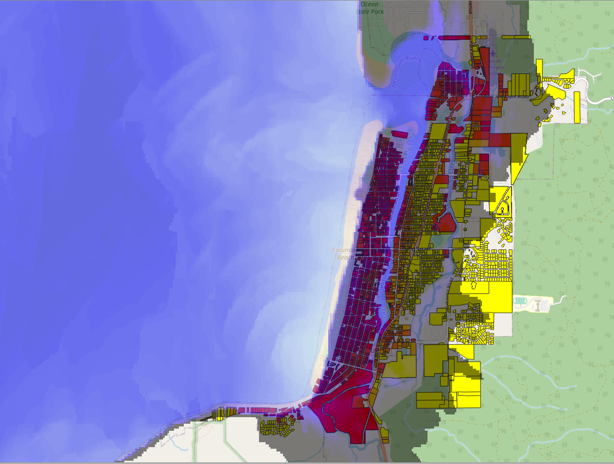
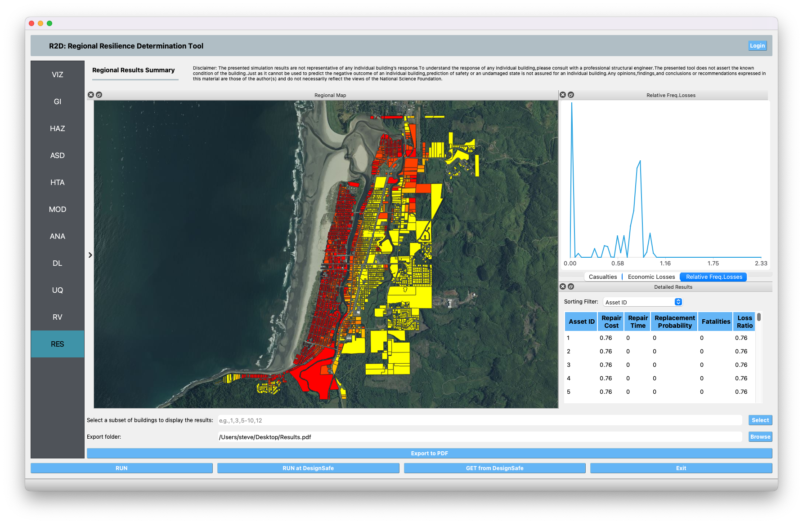

E9 - Tsunami
============

+-----------------+-----------------------------------------------------------------+
| Download files  | :examplesgithub:`Download <E9Tsunami/>`                   |
+-----------------+-----------------------------------------------------------------+

The Cascadia Subduction Zone (CSZ) separates the Juan de Fuca and North America plates, stretching approximately 1,000 km between California and British Columbia, Canada. A rupture of the CSZ may result in a megathrust earthquake and a subsequent tsunami. This example considers a tsunami event in the city of Seaside, located along the northern Oregon coast. A highlight of this example is that it shows how user-provided fragility functions are employed in the SimCenter workflow. The building inventory consists of 4744 buildings of different types and construction materials. For the tsunami hazard, the results of a Probabilistic Seismic-Tsunami Hazard Analysis (PSTHA; Park et. al. 2017), with a recurrence interval of 500 years, is employed. The building inventory, tsunami hazard raster, and building fragility functions are all from the Seaside testbed, made available by the Center of Excellence for Risk-Based Community Resilience Planning (CoE) as part of their Interdependent Networked Community Resilience Modeling Environment (IN-CORE) platform. They can be accessed online on the IN-CORE Web Tools website (https://incore.ncsa.illinois.edu/doc/incore/webtools.html).

#. Set the **Units** in the **GI** panel as shown in :numref:`r2d_gi` and check interested output files.

   .. figure:: figures/r2dt-0009-GI.png
      :name: r2d_gi
      :align: center
      :figclass: align-center
      :width: 500

      R2D GI setup.
#. Set the **Event Raster File** in the **HAZ** panel to the "E9Tsunami/input_data/IMs/500yr/Tsu_500yr_Hmax.tif" in the "IMs" folder.
   The app would automatically load the hazard (:numref:`r2d_haz`). And the **Units of Event Input File** should be 
   "meter". In addition, set the coordinate reference system of your hazard raster. 

   .. figure:: figures/r2dt-0009-HAZ.png
      :name: r2d_haz
      :align: center
      :figclass: align-center
      :width: 500

      R2D HAZ setup.
#. Select **GIS File to BIM** in the **ASD** panel and set the **Import Path** to "E9Tsunami/input_data/GISBuildingInventory/Seaside_Buildings.gpkg" (:numref:`r2d_asd`). 
   Specify the building IDs that you would like to include in the simulation (e.g., 1-4744 for the entire inventory - note this may take very long time to run 
   on a local machine, so it is suggested to first test with a small sample like 1-100 locally and then submit the entire run to DesignSafe - see more details in :numref:`r2d_run_ds`).

   .. figure:: figures/r2dt-0009-ASD.png
      :name: r2d_asd
      :align: center
      :figclass: align-center
      :width: 500

      R2D ASD setup.
#. Set the **Regional Mapping** and **SimCenterEvent** in the **HTA** panel (e.g., :numref:`r2d_hta`). In this case, because we are using a raster for a hazard, select "Site Specified." The raster will be sampled at each asset location. 

   .. figure:: figures/r2dt-0009-HTA.png
      :name: r2d_hta
      :align: center
      :figclass: align-center
      :width: 500

      R2D HTA setup.
#. Set the "Building Modeling" in **MOD** panel to "None". 

   .. figure:: figures/r2dt-0009-MOD.png
      :name: r2d_mod
      :align: center
      :figclass: align-center
      :width: 500

      R2D MOD setup.
#. Set the "Building Analysis Engine" in **ANA** panel to "IMasEDP". 

   .. figure:: figures/r2dt-0009-ANA.png
      :name: r2d_ana
      :align: center
      :figclass: align-center
      :width: 500

      R2D ANA setup.
#. Set the "Damage and Loss Method" in **DL** panel to "User-provided fragilitites". Note please place the ruleset scripts and fragility functions
   in their individual folders so that the application could copy and load them later. 

   .. figure:: figures/r2dt-0009-DL.png
      :name: r2d_dl
      :align: center
      :figclass: align-center
      :width: 500

      R2D DL setup.
#. Set the "UQ Application" in **UQ** panel to "None". 

   .. figure:: figures/r2dt-0009-UQ.png
      :name: r2d_uq
      :align: center
      :figclass: align-center
      :width: 500

      R2D UQ setup.

After setting up the simulation, please click the **RUN** to execute the analysis. Once the simulation completed, 
the app would direct you to the **RES** panel (:numref:`r2d_res`) where you could examine and export the results.

   R2D RES panel.

For simulating the damage and loss for a large region of interest (please remember to reset the building IDs in **ASD**), it would be efficient to submit and run the job 
to `DesignSafe <https://www.designsafe-ci.org/>`_ on `Frontera <https://tacc.utexas.edu/systems/frontera/>`_. 
This can be done in R2D by clicking **RUN at DesignSafe** (one would need to have a valid 
`DesignSafe account <https://www.designsafe-ci.org/account/register/>`_ for login and access the computing resource). 
:numref:`r2d_run_ds` provides an example configuration to run the analysis (and please see `R2D User Guide <https://nheri-simcenter.github.io/R2D-Documentation/common/user_manual/usage/desktop/usage.html#figremjobpanel>`_ for detailed descriptions).
The individual building simulations are paralleled when being conducted on Stampede2 which accelerate the process. It is suggested for the entire building 
inventory in this testbed to use 15 minutes with 96 Skylake (SKX) cores (e.g., 2 nodes with 48 processors per node) to complete 
the simulation. One would receive a job failure message if the specified CPU hours are not sufficient to complete the run. 
Note that the product of node number, processor number per node, and buildings per task should be greater than the 
total number of buildings in the inventory to be analyzed.

.. figure:: figures/r2dt-0009-RUN.png
   :name: r2d_run_ds
   :align: center
   :figclass: align-center
   :width: 300

   R2D - Run at DesignSafe (configuration).

Users could monitor the job status and retrieve result data by **GET from DesignSafe** button (:numref:`r2d_get_ds`). The retrieved data include
four major result files, i.e., *BIM.hdf*, *EDP.hdf*, *DM.hdf*, and *DV.hdf*. R2D also automatically converts the hdf files to csv files that are easier to work with.
While R2D provides basic visualization functionalities (:numref:`r2d_res`), users could access the data which are downloaded under the remote work directory, e.g., 
*/Documents/R2D/RemoteWorkDir* (this directory is machine specific and can be found in **File->Preferences->Remote Jobs Directory**).
Once having these result files, users could extract and process interested information - the next section will use 
the results from this testbed as an example to discuss more details.

.. figure:: figures/r2dt-0009-GFD.png
   :name: r2d_get_ds
   :align: center
   :figclass: align-center
   :width: 400

   R2D GET from DesignSafe.

