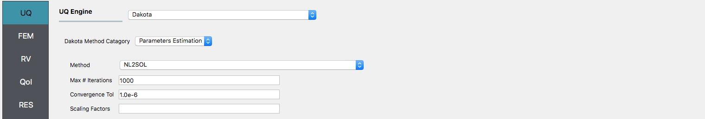
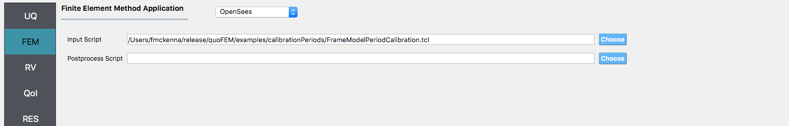
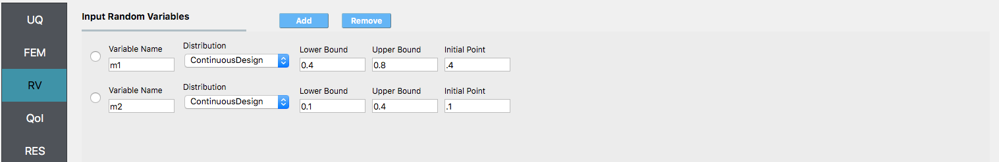
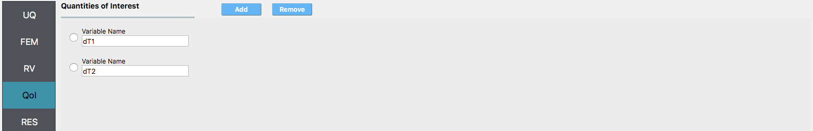
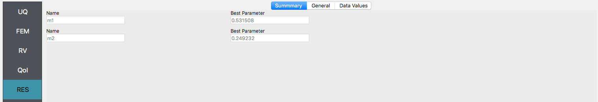

Steel Frame: Parameter Calibration
==================================

Consider the problem of estimating parameters for a model given some experimental data. In this example, provided by Prof. Joel Conte and doctoral students Maitreya Kurumbhati and Mukesh Ramancha from UC San Diego, a finite element model of a steel building is being developed. Consider the two-story building structure shown in :numref:`lblJoelFrame`. Each floor slab of the building is made of composite metal deck and is supported on four steel columns. For modelling purposes, the four columns are assumed fixed at the base. Story heights of 10" are measured as are the lengths of building along the X and Y direction, which are measured at 30'4" and 30". For the steel columns, Young's modulus is measured to be :math:`29,000 ksi`, :math:`Area = 110 in^2`, and :math:`I_{xx} = 1190 in^4`.

.. _lblJoelFrame

.. figure:: figures/joelFrame.png
   :align: center
   :width: 600
   :figclass: align-center

   Two Story Steel Building

What is unknown is the mass of the building. However from data collected the periods of the structure are determined to be 0.19052sec and 0.08887sec. For this exercise the unknown quantaties, m1 and m2, the mass of first and second floors to be used in the model will be considered our unknown variables. The goal of this exercise it to come up with estimates of these quantaties using the |app|.

The exercise requires a single OpenSees script file. The user is required to download this file and place it in a **NEW** folder. The file: 

1. `FrameModelPeriodCalibration.tcl <https://github.com/NHERI-SimCenter/quoFEM/blob/master/examples/calibrationPeriods/FrameModelPeriodCalibration.tcl>`_ 

.. literalinclude:: FrameModelPeriodCalibration.tcl
   :language: tcl

.. note::
   
   1. The lines containing pset will be read by the application when the file is selected and the application will autopopulate the Random Variables input panel with these same variable names. It is of course possible to explicitly use Random Variables without the pset command as is demonstrated in the verification section.
   2. The tcl script when it runs creates a **results.out**. As a consequence, no postprocessing script is needed.

.. warning::

   Do not place the files in your root, downloads, or desktop folder as when the application runs it will copy the contents on the directories and subdirectories containig these files multiple times. If you are like me, your root, Downloads or Documents folders contains and awful lot of files.

The steps involved:

1. Start the application and the UQ Selection will be highlighted. In the panel for the UQ selection, keep the UQ engine as that selected, i.e. Dakota, and the UQ Category Method as Parametr Calibration, and the method as N2SOL. Change the #samples to 1000 and the seed to 20 as shown in the figure.

2. Next select the FEM tab from the input panel. This will default in the OpenSees FEM engine. For the main script copy the path name to TrussSelection.tcl or select choose and navigate to the file. For the postprocess script, repeat the same procedure for the postpropcess.tcl script.

3. Next select the RV tab from the input panel. This should be prepopulated with four random variables with same names as those having pset in the tcl script. For each variable, from the drop down menu change them from having a constant disatribution to a lognormal one and then provide the means and standard deviations specified for the problem.

4. Next select the QoI panel. Here enter **2** quantaties, 'T1diff' and 'T2diff'

.. note::

.. note::   

   The user can add additional QoI by selecting add and then providing additional names. As seen from the postprocess script any of the 6 nodes may be specified and for any node either the 1 or 2 dof direction.

5. Next click on the 'Run' button. This will cause the backend application to launch dakota. When done the RES panel tab will be selected and the results will be displayed. The results show the values the mean and standard deviation.

