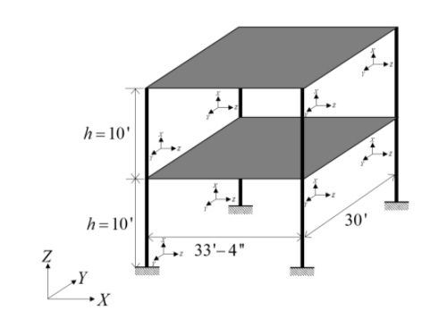

Steel Frame: Parameter Estimation
==================================

Consider the problem of estimating parameters for a model given some experimental data. In this educational example, which has been provided by Professor Joel Conte and his doctoral students Maitreya Kurumbhati and Mukesh Ramancha from UC San Diego, a simplified finite element model of a steel building is being developed. Consider the two-story building structure shown in :numref:`lblJoelFrame`. Each floor slab of the building is made of composite metal deck and is supported on four steel columns. Story heights of 10' are measured as are the lengths of the building along the X and Y direction, which are measured at 33'4" and 30'. For the steel columns, Young's modulus is measured to be :math:`29,000 \mathrm{ ksi}`, :math:`Area = 110 \mathrm{ in}^2`, and :math:`I_{xx} = 1190 \mathrm{ in}^4`. For modelling purposes, the four columns are assumed fixed at the base and the beams connecting them are assumed to be rigid.

.. _lblJoelFrame:

   Two Story Steel Building

What is unknown is the mass of the building. However from data collected the periods of the structure are determined to be 0.19 sec and 0.09 sec. For this exercise the unknown quantities, m1 and m2, the mass of first and second floors to be used in the model will be considered our unknown variables. We will assume some bounds on these variables and provide initial estimates as shown in following table:

.. csv-table:: 
   :header: "variable", "lower (k-in/sec^2)", "upper (k-in/sec^2)", "initial estimate (k-in/sec^2)"
   :widths: 20, 20, 20, 20

   m1, 0.4, 0.8, 0.4
   m2, 0.1, 0.4, 0.1

The goal of this exercise it to come up with estimates of these quantities using the |app| that result in reasonably good matches between finite element model periods and the observed periods of the structure.

The exercise requires a single OpenSees script file. The user is required to download this file and place it in a **NEW** folder. The file: 

1. `FrameModelPeriodCalibration.tcl <https://github.com/NHERI-SimCenter/quoFEM/blob/master/examples/calibrationPeriods/FrameModelPeriodCalibration.tcl>`_ 

.. literalinclude:: FrameModelPeriodCalibration.tcl
   :language: tcl

.. note::
   1. The tcl script when it runs creates a ``results.out``. As a consequence, no postprocessing script is needed. 
   2. The values placed in ``results.out`` file are the difference between computed and observed values. Expressed another way, the function ``f(m1,m2)`` computed and written to the  ``results.out`` file is ``f(m1,m2) = ObservedPeriods - ComputedPeriods(m1,m2)``. The UQ algorithm when running is searching for values of the random variable parameters (``m1`` and ``m2``) that attempt to minimize the function. The user must take this fact into account when formulating the output from their own scripts for their own problems.

.. warning::

   Do not place the files in your root, downloads, or desktop folder as when the application runs it will copy the contents on the directories and subdirectories containing these files multiple times. If you are like me, your root, Downloads or Documents folders contains and awful lot of files.

The steps involved:

1. Start the application and the UQ Selection will be highlighted. In the panel for the UQ selection, keep the UQ engine as that selected, i.e. Dakota. In the UQ Method category drop down menu change the category to **Parameters Estimation**, and the method as **NL2SOL**, the convergence tolerance to ``1.0e-6`` and leave the scaling factors empty (assumes weights of 1.0 on all response values) as shown in the figure.

.. figure:: frame/joelUQ.png
   :align: center
   :figclass: align-center

2. Next select the **FEM** tab from the input panel selection. This will default in the OpenSees FEM engine. For the main script copy the path name to the FrameModelPeriodSelection.tcl file or select choose and navigate to the file. 

.. figure:: frame/joelFEM.png
   :align: center
   :figclass: align-center

.. note::

   As discussed but it is worth noting again, because the script generates a ``results.out`` file, no postprocessing script is needed for this example. This might not always be the case for some of your problems.

3. Next select the **RV** tab from the input panel. This should be prepopulated with two random variables with same names as those having ``pset`` in the tcl script, i.e. m1 and m2. For each variable, from the drop down menu change them from having a constant distribution to a continuous design one and then provide the lower bounds, upper bounds and the starting points shown in the figure below.

.. figure:: frame/joelRV.png
   :align: center
   :figclass: align-center

.. note::
   
   For the Parameter Estimation category of UQ methods, only continuous design distributions may be entered.

4. Next select the **QoI** panel. Here enter **2** variable names ``dT1`` and ``dT2``.

.. figure:: frame/joelQoI.png
   :align: center
   :figclass: align-center

.. note::   

   For this particular problem setup in which the user is not using a postprocessing script, the user may specify any names for the QoI variables. They are only being used by Dakota to return information on the errors. We used 'dT1' and 'dT2' due to our affinity for 3 letter acronyms!

5. Next click on the **Run** button. This will cause the backend application to launch Dakota. When done the **RES** tab will be selected and the results will be displayed as shown in the figure below. The figure shows Dakota returned, for inputs provided, estimates of our unknown parameters to be :math:`m1=0.52 (0.515549)` and :math:`m2=0.26 (0.256492)`.

.. figure:: frame/joelRES.png
   :align: center
   :figclass: align-center

.. note::

   1. The computed values compare favorably to the values used to generate the 'observed results' when developing this problem, these being the values shown in the script, i.e. :math:`m1=0.52` and :math:`m2=0.26`. 

   2. It would prove useful for you to adjust the parameters, observed values and inputs for the continuous design variables. The numbers were chosen to demonstrate the methods can give good results. They do not always return such good numbers.

   

