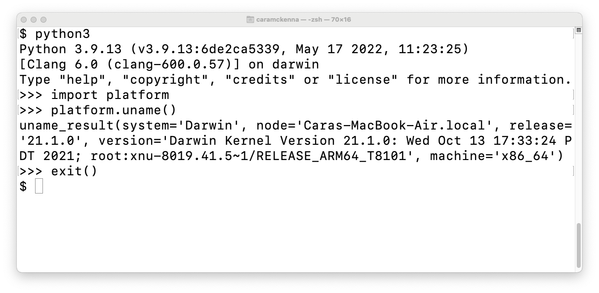
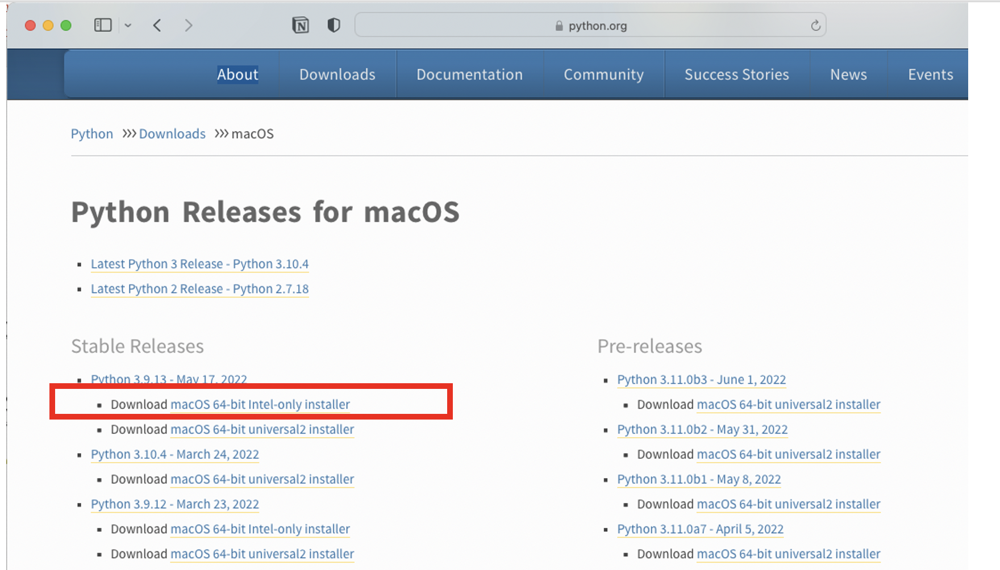

.. _lblInstallMac:

Install on macOS 10
===================

Install Python 3.9
^^^^^^^^^^^^^^^^^^

SimCenter tools require an x86-based version of Python 3.9 to run properly. You may already use other versions of Python, or Python served by a larger scientific package such as Anaconda or homebrew.

To see if your python kernel is compatable with SimCenter tools, issue the following in a terminal window.

 .. note::

   You can use the spotlight app (magnifying glass at the top right corner of the desktop) to start a Terminal window. Start the spotlight app and type in terminal. The Terminal application should appear as the top hit.

.. code::
   
   python3
   import platform
   platform.uname()
   exit()

As shown in screenshot below, you should see Python 3.9 after issuing the python3 command and machine='x86_64' in the last line of output of the platform.uname() command. If you see another Python version or machine='arm64', you will need to install an x86 Python 3.9 on your computer.

      Python: Kernel Version

.. note::

   The latest MacBooks use ARM-based processors in their M1 and M2 chips. Older MacBooks utilize Intel x86 processors. The new ARM-based processors present a problem for Python users of scientific applications beacuse Python programs typically import many different modules and not all modules have been ported to the new ARM environments. The python3 kernels provided with macOS 12 (Monterey) and later are ARM based. You will need to download and install an **x86** version of Python to use the SimCenter applications on these systems. Such Python versions will run fine on the ARM-based machines, thanks to `Rosetta <https://support.apple.com/en-us/HT211861#:~:text=Rosetta%202%20is%20available%20only,to%20allow%20installation%20to%20proceed.>`_.

**1.** To obtain an x86 version of Python, we recommend installing Python 3.9, we tested the 3.9.13 version,  from |PythonDownload|. It is important to select the **macOS 64-bit Intel-only installer** version of the installer. The **intel-only** is key to obtaining the 64-bit x86 version.

      Python: python.org MacOS Download Page

.. note::
   
   #. We prefer the python.org installation over others due to it's simplicity.
   #. Python 3.10 from python.org, does not provide an x86 version.
   #. Homebrew can also be used to install a Python x86 version, the instructions are convoluted but can be found using **Google**.. If installed correctly python3 will be in /usr/local/Cellar directory and not in the /usr/local/opt directory. Remember the platform.uname() output above will show you if you have installed a correct version.

**2.** The Python.org installer leaves two script files in the Python directory at the end of the installation and these appear in a pop up window when installation is complete. You need to execute both script files to get Python set up correctly so that it can be invoked from the terminal application. To execute the files, double click on them with your mouse. The two files, shown in the image below, are: ``Update Shell Profile.command.sh`` and ``Install CertificateCommand.sh``.

   .. figure:: figures/pythonInstallShell.png
      :align: center
      :figclass: align-center

      Python: Folder Displayed at Conclusion of Install

.. warning::

**3.** Once Python is installed, you need to extend it by installing a few additional packages. To facilitate this phase of the installation, we created a **nheri_simcenter** python package that automatically installs all other dependencies. Start a Terminal window and type the following command:

.. code-block:: bash

      pip3 install nheri_simcenter --upgrade

Make sure you see a message that confirms the successful installation of the nheri-simcenter package before proceeding to the next step.

.. note::

   If you forget to invoke the ``UpdateShellProfile.command.sh`` script at the end of the install, you can always edit the correct shell file later to update the ``PATH`` variable to point to the Python application.

   On Linux systems, the shell is the program that takes commands from the keyboard that you enter in the terminal window and passes them to the operating system to perform by invoking applications and passing data between applications. In the good old days, it was the only interface available to the user, i.e., there was no such thing as Finder! There are a number of shell programs that can be installed and made available to you. The most popular is the **bash** shell, the up and coming one is the **Z** shell. Power MacOS users will write shell scripts to do many many useful things. By default the applications that the shell program will invoke are limited to applications in a few specific directories that are defined in the users ``PATH``. Users can modify this path by editing files that the shell program will read from everytime the program is started.

   When the frontend application is running the computations it is actually running a backend application using the shell program. As a consequence the shell program must be made aware of the locations of  some of the external applications that you have installed as **OpenSees** and **Dakota** do not provide installers that automatically do this when they are installed. Other applications, like **Tcl** provide scripts that you invoke to do it. In short you have to edit the file appropriate to the shell you are using.

   
   To find which shell program you are using when you issue commands inside the terminal window, type the following:

   .. code:: bash

      env | grep SHELL

   If the result is ``/bin/bash`` you will need to edit the ``.bashrc`` file or the ``bash_profile`` file. If the result is ``/bin/zsh`` you will need to edit the ``.zshrc`` or ``.zprofile``. Typically, the ``.bash_profile`` or the ``.zprofile`` file is the one to edit as by design these will invoke the ``.bashrc`` or ``.zshrc`` file. If in doubt, look for these files in your home directory and see which of these other installers have modified.

.. only:: R2D_app

   Install Java
   ^^^^^^^^^^^^

   .. note::
      Java is needed to use OpenSHA to characterize the regional seismic hazard (see :ref:`ground_motion_tool`). If you do not plan to use that feature, you can skip this step of the installation.

   If you have not yet installed Java, please download the installer from java website. The version `16.0.2 <https://www.oracle.com/java/technologies/javase/jdk16-archive-downloads.html>`_ has been tested to be working with the latest |app|. Follow the on-screen instructions to install Java.

   .. note::
      
      The Java website should automatically detect your operating system and offer the corresponding installer for you to download. Make sure you see "Mac OS X" at the top of the page before downloading the installer.

Download the Application
^^^^^^^^^^^^^^^^^^^^^^^^

To download the |app|, navigate to the |appLink| page which should resemble |figDownload|. The download page contains a list of downloadable files and directories.

.. only:: R2D_app

   .. _figDownload-R2D:

   .. figure:: figures/R2DDownload.png
      :align: center
      :figclass: align-center

      R2DTool download page.

.. only:: PBE_app

   .. _figDownload-PBE:

   .. figure:: figures/pbeDownload.png
      :align: center
      :figclass: align-center

      PBE download page.

.. only:: EEUQ_app

   .. _figDownload-EE:

   .. figure:: figures/eeDownload.png
      :align: center
      :figclass: align-center

      EE-UQ download page.

.. only:: WEUQ_app

   .. _figDownload-WE:

   .. figure:: figures/weDownload.png
      :align: center
      :figclass: align-center

      WE-UQ download page.

.. only:: quoFEM_app

   .. _figDownload-quoFEM:

   .. figure:: figures/quoFEMDownload.png
      :align: center
      :figclass: align-center

      quoFEM download page.

.. only:: Hydro

   .. _figDownload-HydroUQ:

   .. figure:: figures/H20Download.png
      :align: center
      :figclass: align-center

      HydroUQ tool download page.

Click on the file with a name ending with **Mac_Download.dmg** to download the |app|. In the pop-up window, click on the **Download** button in the bottom right corner. After the download has completed, open the dmg file and copy the |short tool name| application to a location in your filesystem.

.. note::

   We suggest copying the application to your Desktop. After copying the application, you can move the dmg file to the trash or eject it.

Test the Installation
^^^^^^^^^^^^^^^^^^^^^

Once the installation procedure has been completed, it is a good practice to run some basic checks. Navigate to the location where you placed the application and open it by running the |short tool id|.exe executable.

.. note::

   SimCenter apps are code-signed and notarized, but because they are not downloaded from the operating system's app store, they may not be recognized as safe applications. Depending on your security settings, when you start a SimCenter app for the first time, your operating system may show a dialog box indicating it is unsafe. If this dialog appears, choose the cancel button. Restart the app by right clicking on it and selecting open.

Once the application started, you should see the user interface shown in |figUI|. We recommend running the example problem |test example| to test the application.

.. only:: R2D_app

   .. _figUI-R2D:

   .. figure:: figures/R2D-Startup.png
    :align: center
    :figclass: align-center

    R2DTool on startup.

.. only:: PBE_app

   .. _figUI-PBE:

   .. figure:: figures/PBE_startup.png
    :align: center
    :figclass: align-center

    PBE application on startup.

.. only:: EEUQ_app

   .. _figUI-EE:

   .. figure:: figures/EE-UQ.png
    :align: center
    :figclass: align-center

    EE-UQ application on startup.

.. only:: WEUQ_app

   .. _figUI-WE:

   .. figure:: figures/WE-UQ.png
    :align: center
    :figclass: align-center

    WE-UQ application on startup.

.. only:: quoFEM_app

   .. _figUI-quoFEM:

   .. figure:: figures/quoFEM.png
    :align: center
    :figclass: align-center

    quoFEM application on startup.

.. only:: Hydro

   .. _figUI-HydroUQ:

   .. figure:: figures/HydroMac.png
    :align: center
    :figclass: align-center

    HydroUQ application on startup.    

.. note::

   When the |app| is running, open the app/preferences or File/Preferences and make sure that python3 appears under **External Applications:Python**, as shown in the figure below. If you used older versions of SimCenter tools this was not the default. The exact location of python3 that you installed can be found by opening the terminal application and executing the **which python3** command. Enter the path shown as a response to the Preferences panel under Python and then press the **Save** button.

      .. figure:: figures/pythonPreferences.png
    :align: center
    :figclass: align-center

    Set Python Preferences.    

