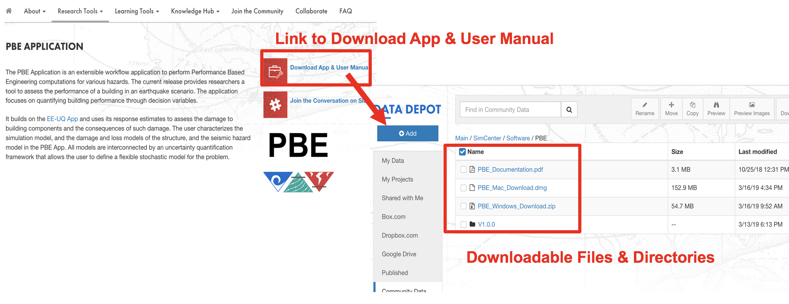
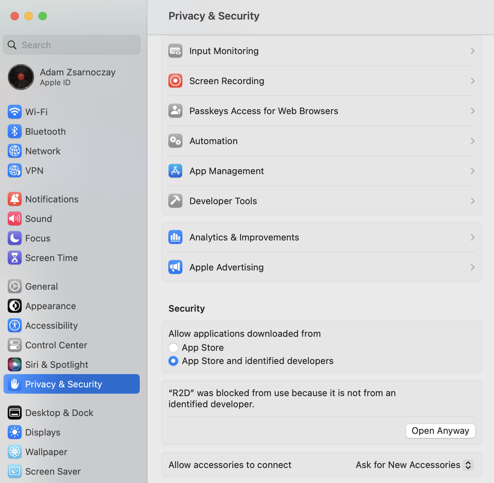
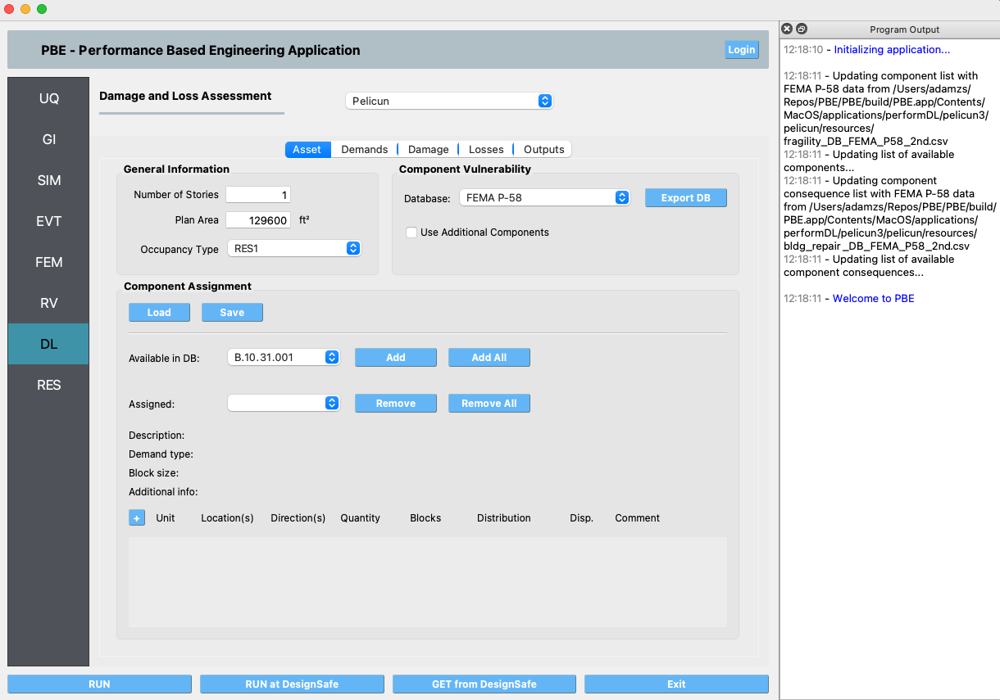
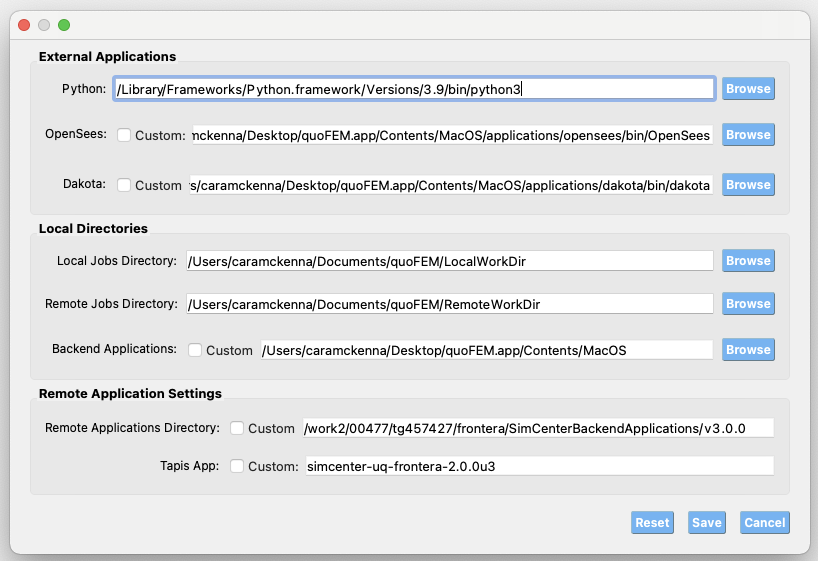

.. _lblInstallMac_PBE:

================
Install on macOS
================

Setting up |app| on macOS takes five short steps:

#. **Install Python** (3.10, 3.11, or 3.12).
#. **Install the SimCenter Python package** (one ``pip install`` command).
#. **Note your Python path** -- PBE needs it.
#. **Download and install** the PBE app.
#. **Launch PBE and tell it where Python is.**

When you're done, run a test example to confirm everything works.

Step 1 -- Install Python
^^^^^^^^^^^^^^^^^^^^^^^^

PBE works with any Python in the **3.10 -- 3.12** range. We recommend
3.12. Pick one of the three options below.

**Option A: Install the bundled Python 3.12** (recommended for most
users)

Click |appLink|. On the download page, find
``python-3.12.X-macos11.pkg`` (we provide a copy from
`python.org's macOS downloads <https://www.python.org/downloads/macos/>`__).
Download and double-click the ``.pkg`` to run the installer;
accept the defaults and let it finish.

**Option B: Use an existing Python**

If you already have Python 3.10, 3.11, or 3.12 installed, you can
reuse it. We strongly recommend creating a **virtual environment**
first so PBE's packages don't mix with whatever else you've got --
see the appendix at the end of this page, then come back here.

To check what you have, open Terminal (Spotlight: ⌘+Space, type
"Terminal", press Enter) and run::

   python3 --version

If it reports a 3.10, 3.11, or 3.12 number, you're set.

**Option C: Use a virtual environment**

If you'd like a clean, isolated Python environment dedicated to
PBE -- whether or not you already have Python installed -- see the
appendix at the end of this page, then continue with Step 2.

Step 2 -- Install the SimCenter Python Package
^^^^^^^^^^^^^^^^^^^^^^^^^^^^^^^^^^^^^^^^^^^^^^

In Terminal, run::

   python3.12 -m pip install --upgrade "nheri_simcenter[pbe]"

The ``[pbe]`` extra tells the installer to pull in only what PBE
needs (Pelicun for damage and loss, atc138 for functional recovery,
the REDi engine, and a few support libraries). The download is
modest -- a few hundred megabytes -- and the install typically
finishes in 1 to 3 minutes.

If you used Option B and your Python is 3.10 or 3.11, replace
``python3.12`` with ``python3.10`` or ``python3.11`` in the command
above. If you used Option C, activate your virtual environment
first (see appendix); then the command is just
``pip install --upgrade "nheri_simcenter[pbe]"``.

.. note::
   **If pip fails with an SSL error** ("CERTIFICATE_VERIFY_FAILED"
   or similar), open ``/Applications/Python 3.12/`` in Finder and
   double-click ``Install Certificates.command``. That installs
   the certificate authority bundle Python uses for HTTPS. Then
   re-run the ``pip install`` command.

.. note::
   **If Terminal says "command not found: python3.12"**, you need
   to add Python to your shell's ``$PATH``. The simplest fix is to
   open ``/Applications/Python 3.12/`` in Finder and double-click
   ``Update Shell Profile.command``. Close Terminal and reopen it,
   then retry.

   PBE itself does not require Python to be on your ``$PATH``; this
   step is only for convenience when running ``pip`` from the
   command line. If you'd rather not modify your shell, you can run
   ``pip`` using the full path::

      /Library/Frameworks/Python.framework/Versions/3.12/bin/python3.12 -m pip install --upgrade "nheri_simcenter[pbe]"

Step 3 -- Note Your Python Path
^^^^^^^^^^^^^^^^^^^^^^^^^^^^^^^

PBE needs the full path to the Python interpreter you just used.
Find it with the ``which`` command in Terminal.

**If you used the bundled Python 3.12 (Option A)**::

   which python3.12

You should see something like::

   /Library/Frameworks/Python.framework/Versions/3.12/bin/python3.12

**If you used a virtual environment (Option C)**, activate it
first, then run::

   which python3

You should see a path inside your environment, for example::

   /Users/YOUR_LOGIN/PBE_env/bin/python3.12

**Copy this path** -- you'll paste it into PBE in Step 5.

Step 4 -- Download and Install PBE
^^^^^^^^^^^^^^^^^^^^^^^^^^^^^^^^^^

Click |appLink| again. Two macOS builds are listed:

- ``...arm64...Mac_Download.dmg`` -- for Apple Silicon Macs
  (chips named **M1**, **M2**, **M3**, or **M4**)
- ``...x86_64...Mac_Download.dmg`` -- for older Intel-based Macs

To check which you have: click the **Apple menu** in the top-left
corner of your screen and choose **About This Mac**. Look at the
**Chip** (or **Processor**) line. If it starts with "Apple", you
want the **arm64** download. If it says "Intel", you want the
**x86_64** download. If you pick the arm64 build on an Apple
Silicon Mac, PBE runs natively and is significantly faster than
under emulation.

.. _figDownload-PBE:

   PBE download page.

Click the matching ``.dmg`` file to download it. When the download
finishes, double-click the ``.dmg`` to mount it, drag **PBE** to a
folder on your computer (most users put it in **Applications** or
on the **Desktop**), then eject the ``.dmg``.

Step 5 -- First Launch and Configure Python Path
^^^^^^^^^^^^^^^^^^^^^^^^^^^^^^^^^^^^^^^^^^^^^^^^

Double-click PBE to launch it.

PBE is code-signed and notarized by NHERI SimCenter, but because it
isn't distributed through the App Store, macOS may flag it as
coming from an unidentified developer the first time you open it.
If you see a dialog refusing to open the app:

#. Right-click PBE in Finder and choose **Open** from the menu;
   confirm the prompt.
#. If that still fails, open **System Settings -> Privacy &
   Security**, scroll to the section about PBE having been blocked,
   and click **Open Anyway**.

   Privacy & Security panel showing the **Open Anyway** option.

Once PBE is running, you'll see the main window:

.. _figUI-PBE:

   PBE on first launch.

In the menu bar, choose **File -> Preferences** (on some macOS
versions, this is **PBE -> Settings**). Paste the Python path you
saved in **Step 3** into the **Python** field at the top, then
click **Save**.

.. _figUI-preferences:

   Setting the Python path in PBE's Preferences.

Test the Installation
^^^^^^^^^^^^^^^^^^^^^

To confirm everything works end-to-end, run our smallest example,
|test example|. Open the example via the **Examples** menu. Click the
**RUN** button at the bottom. After a minute the **RES** tab
becomes active and shows results -- if it does, you're done.

If anything goes wrong at any of the steps above, please post on
our |messageBoard|.

.. _macInstallVenv:

Appendix -- Using a Virtual Environment
^^^^^^^^^^^^^^^^^^^^^^^^^^^^^^^^^^^^^^^

A **virtual environment** is a self-contained folder that holds
its own copy of the Python packages PBE needs, without touching
the rest of your system. It's the safest option if you already
use Python for other things, or if you'd just like a clean,
contained PBE setup. Here's how to make one.

**Create the environment.** In Terminal, run::

   python3.12 -m venv ~/PBE_env

This creates a folder named ``PBE_env`` in your home directory.
You can pick any other location and any other name -- just keep
the path in mind for the next steps.

If you have Python 3.10 or 3.11 instead of 3.12, replace
``python3.12`` with ``python3.10`` or ``python3.11`` here and in
every command below.

**Activate the environment.** Each Terminal session that wants to
use this environment must "activate" it first::

   source ~/PBE_env/bin/activate

Your prompt will change to show ``(PBE_env)`` at the front --
that's how you know the environment is active. While active,
``python3.12`` and ``pip`` refer to the copies inside ``PBE_env``,
not the ones on your wider system.

Now go back to **Step 2** and run the ``pip install`` command.

**Deactivate when you're done** (optional). To leave the
environment, run::

   deactivate

Your prompt returns to normal. You don't have to deactivate
manually -- closing the Terminal window has the same effect. Next
time you want to install or update PBE's Python packages, just
open Terminal and run the activate command again.
