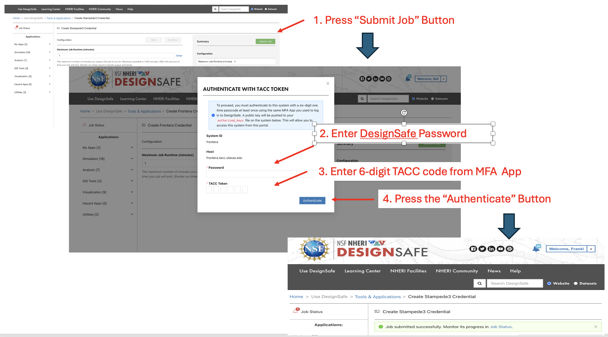

.. _lblInstallWindows:

Running Jobs at DesignSafe
==========================

To run jobs on TACC high performance compute resources using the **Run at DesignSafe** button, the user must obtain a job allocation and then they must run applications to create **credentials** on each of the compute resourcses their jobs will run on.

**Allocation**
^^^^^^^^^^^^^^

To obtain an allocation, the user can either submit a `DesignSafe Ticket <https://www.designsafe-ci.org/help/new-ticket/>`_ requesting an allocation or through the more formal `TACC allocation process <https://tacc.utexas.edu/use-tacc/allocations/>`_. The **DesignSafe** process is probably quickest and easiest, e.g. a ticket with "Please can I have an allocation to run SimCenter jobs at DesignSafe" will be sufficient.

**Credentials**
^^^^^^^^^^^^^^^

Due to cybersecurity issues, DesignSafe is requiring that all users obtain credentials for the machines on which jobs will run. Before you can run the application using the 'Run at DesignSafe' button, you must first obtain credentials for the machine(s) your jobs will run on. If you follow the links provided you will be taken to a DesignSafe app launch page specifically created for this process:

.. only:: R2D_app

    1. `Stampede3 Credentials <https://www.designsafe-ci.org/rw/workspace/stampede3-credential>`_

.. only:: PBE_app

     1. `Frontera Credentials <https://www.designsafe-ci.org/rw/workspace/frontera-credential>`_
   
.. only:: HydroUQ_app
	  
     1. `Frontera Credentials  <https://www.designsafe-ci.org/rw/workspace/frontera-credential>`_
     2. `LoneStar6 Credentials <https://www.designsafe-ci.org/rw/workspace/ls6-credential>`_	
   
.. only:: EEUQ_app

     1. `Frontera Credentials <https://www.designsafe-ci.org/rw/workspace/frontera-credential>`_	  

.. only:: WEUQ_app

     1. `Frontera Credentials <https://www.designsafe-ci.org/rw/workspace/frontera-credential>`_
     2. `Stampede3 Credentials<https://www.designsafe-ci.org/rw/workspace/stampede3-credential>`_	

.. only:: quoFEM_app

    1. `Stampede3 Credentials <https://www.designsafe-ci.org/rw/workspace/stampede3-credential>`_

Simply press the green "Submit Job" button. On the pop up window that is then displayed,  enter your DesignSafe password and the 6 digit MFA token before pressing the 'Authentificate' button. Once you see the words "Job submitted successfully. Monitor its progress in Job Status" in green, your credentials have been set-up and you can exit the webpage. If no pop up is displayed, you already have credentials for that machine and can exit the page.  

