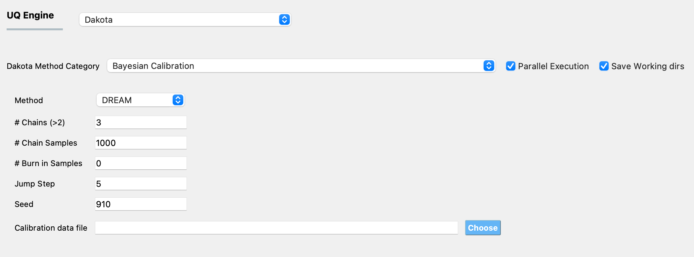

.. _lblDakotaBayesianCalibration:

Bayesian Calibration
********************

The methods in the Bayesian calibration category are concerned with estimation of the probability distribution of the parameter values given observational measurements. Unlike deterministic parameter estimation methods, in which the user provides a range and an initial starting point for the input random variables, when using the methods in this category, the user has some idea about the probability distribution of the parameter values. This information is provided in the form of the prior distributions in the **RV** panel. The Bayesian calibration methods take this prior information and combine it with information from the observed data provided in the **UQ** panel, to infer posterior distributions of the parameter values. A Bayesian updating paradigm is followed, the prior distribution on a parameter is updated through a Bayesian framework involving experimental data and a likelihood function. The likelihood function  specifies the likelihood that a particular parameter value of the model produced the observed data. Dakota uses a Gaussian likelihood function. The algorithms that generate the samples to characterize the posterior distributions are typically based on some Markov Chain Monte Carlo (MCMC) methods. Currently, |appName| provides access to the DREAM algorithm implemented in Dakota.

..
	QUESO
	^^^^^

	The QUESO option supports the following MCMC algorithms from the QUESO library: DRAM (Delayed Rejection Adaptive Metropolis), delayed rejection (DR) only, adaptive metropolis (AM) only, pure Metropolis Hasting (MH)s, and multilevel (ML). The user is requested to select from one of the algorithms, provide a seed and to specify the number of markov chain samples, and has the option of specifying the number of burn in samples (those samples generated at the start to start the markov chain, but not included in the result)

	.. _figQUESO:
	
	.. figure:: figures/QUESO.png
	:align: center
	:figclass: align-center

  	DREAM input panel.

	.. [QUESO]
	     Prudencio, Ernesto E and Schulz, Karl W, "The parallel C++ statistical library ‘QUESO’: Quantification of Uncertainty for Estimation, Simulation and Optimization, Euro-Par 2011: Parallel Processing Workshops, Springer, 2012, 398-407

DREAM 
^^^^^

The Differential Evolution Adaptive Metropolis ([DREAM]_) method runs multiple Markov chains simultaneously for global exploration of the space, and automatically tunes and scales the orientation of the proposal distributions in randomized subspaces during the search. :numref:`figDREAM` shows the input panel corresponding to the DREAM method. The required inputs for this method are:

1. # Chains: number of chains in the DREAM algorithm
2. # Chain Samples: number of sample values to be drawn from the posterior probability distribution of the parameters
3. # Burn in Samples: the number of samples at the beginning of the chain that are discarded
4. Jump Step: a long step in forced every Jump Step number of samples in the DREAM algorithm
5. Seed: seed of the random number generator, this option is provided for repeatability. If the same analysis is run multiple times with the same seed, the results will be identical from all the runs. If the same analysis is run with differing seed values, the results from all the runs will not be identical. 
6. Calibration data file: the path to the file which contains the calibration data (i.e., the measured values of the reponses).

.. note::

	Calibration data file requirements
	==================================
	The data are provided in the calibration data file, which must fulfill the following requirements:

	1. Each row of the calibration data file contains data from one experiment. The individual entries in every row of this file can be separated by spaces, tabs, or commas.
	2. The number of entries in each row must equal the sum of the length of all outputs defined in the **QoI** panel.
	3. The order of the entries in each row of the calibration data file must match the order in which the outputs are defined in the **QoI** panel, and must correspond to the output from the computational model in the ``results.out`` file.

	For example, if there are data from two experiments, and there are 2 response quantities, of length 2 and 1 respectively, then, there must be two rows of values in the calibration data file, the length of each row must be 3, the first two values in each row correspond to the first response quantity and the third value in each row corresponds to the second response quantity. 

.. _figDREAM:

  	DREAM input panel.

.. [DREAM]
   J. A. Vrugt, C. J. F. ter Braak, C. G. H. Diks, B. A. Robinson, J. M. Hyman, and D. Higdon. Accelerating Markov chain Monte Carlo simulation by self-adaptive differential evolution with randomized subspace sampling. International Journal of Nonlinear Scientific Numerical Simulation, 10(3), 2009. 1804, 2550
