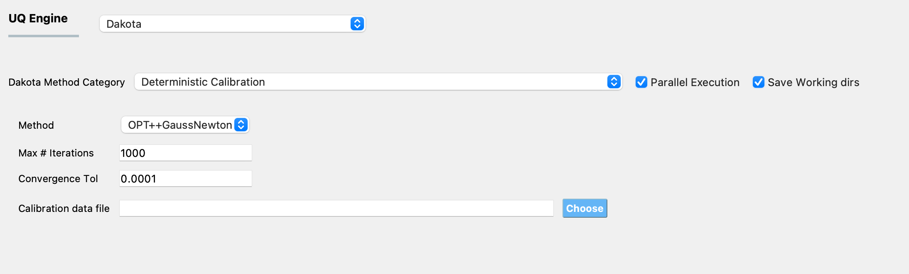

.. _lblDakotaDeterministicCalibration:

Deterministic Calibration
*************************

Deterministic calibration methods (also known as non-linear least squares methods or deterministic parameter estimation methods) are used to fit a set of m observations (provided in the calibration data file defined in the **UQ** panel) with a model (defined in the **FEM** panel) that is non-linear with n unknown parameters. The unknown parameters of this model are defined in the **RV** panel. The bounds of the domain within which the optimal values of the parameters need to be searched for are also specified in the **RV** panel, along with the initial point at which the search will begin. No prior specification of the distribution associated with the random variables is necessary. The output quantities from the model are defined in the **QOI** panel. For each evaluation of the computational model, the processing scripts should write the values of the simulated response quantities of interest in a file called ``results.out``. The algorithms employed will find a set of parameter values that **minimizes** the sum of the squared differences between the measured values of the QoIs and the predicted values of the QoIs from the computational model. The algorithms themselves are general functional minimization algorithms seeking to minimize:

.. math::

      f(\theta) = \sum_{i=1}^{m} R_i(\theta)^2 = \sum_{i=1}^{m} \left ( y_i(\theta)^{predicted} - y_i^{measured} \right)^2

where :math:`R_i(\theta)`, typically called the residuals, are the differences between the measured data :math:`y_i^{measured}` provided in the calibration data file, and predictions from the model :math:`y_i(\theta)^{predicted}` of the corresponding response quantity, and :math:`\theta \in \mathbb{R}^n` the :math:`n` model parameters whose values are not precisely known and are being calibrated to match available data.

The panel that is presented to the user when this Dakota Category is chosen, is as shown in :numref:`figParameterEstimation`.

.. _figParameterEstimation:

  	Dakota deterministic calibration input panel.

For deterministic calibration two different optimization algorithms are currently provided under the Method drop-down menu, namely OPT++GaussNewton and NL2SOL. For both methods three input parameters need to be specified as shown in the figure: 

1. the maximum number of iterations for the optimization algorithm
2. the convergence tolerance
3. the path to the file containing the calibration data

OPT++GaussNewton
^^^^^^^^^^^^^^^^

OPT++ provides a Gauss-Newton least squares capability which, on zero-residual test problems, can exhibit quadratic convergence rates near the solution. As a consequence, good starting point values for the parameters should be provided. The Hessian is constructed with a Gauss-Newton approximation and the OPT++ Optimization routines are used. ([OPT]_).

NL2SOL
^^^^^^

The NL2SOL method is based on an adaptive nonlinear least-squares algorithm, devised by Dennis and colleagues ([Dennis81a]_, [Dennis81b]_). NL2SOL uses a trust region method and adaptively switches between two Hessian approximations, the Gauss-Newton approximation alone and the Gauss-Newton approximation plus a quasi-Newton approximation to the rest of the Hessian. This latter approximation is useful when the starting guess is far from the solution. For problems with large residuals, this algorithm is known to be more reliable than Gauss-Newton.

.. note:: Calibration data file requirements

	The data are provided in the calibration data file, which must fulfill the following requirements:

	1. Each row of the calibration data file contains data from one experiment. The individual entries in every row of this file can be separated by spaces, tabs, or commas.
	2. The number of entries in each row must equal the sum of the length of all outputs defined in the **QoI** panel.
	3. The order of the entries in each row of the calibration data file must match the order in which the outputs are defined in the **QoI** panel, and must correspond to the output from the computational model in the ``results.out`` file.

	For example, if there are data from two experiments, and there are 2 response quantities, of length 2 and 1 respectively, then, there must be two rows of values in the calibration data file, the length of each row must be 3, the first two values in each row correspond to the first response quantity and the third value in each row corresponds to the second response quantity. 

.. [Dennis81a]
   J. E. Dennis, D. M. Gay, and R. E. Welsch. An adaptive nonlinear least-squares algorithm. ACM Trans. Math. Softw.. 7(3). 348 - 368. 1981.

.. [Dennis81b]
   J. E. Dennis, D. M. Gay, and R. E. Welsch. Algorithm 573: NL2SOL—An Adaptive Nonlinear Least-Squares Algorithm [E4] ACM Trans. Math. Softw.. 7(3). 369 - 383. 1981.

.. [OPT] 
   J. C. Meza, R. A. Oliva, P. D. Hough, and P. J. Williams, "OPT++: An Object Oriented Toolkit for Nonlinear Optimization", ACM Transactions on Mathematical Software, Volume 33, Number 2, June 2007.

