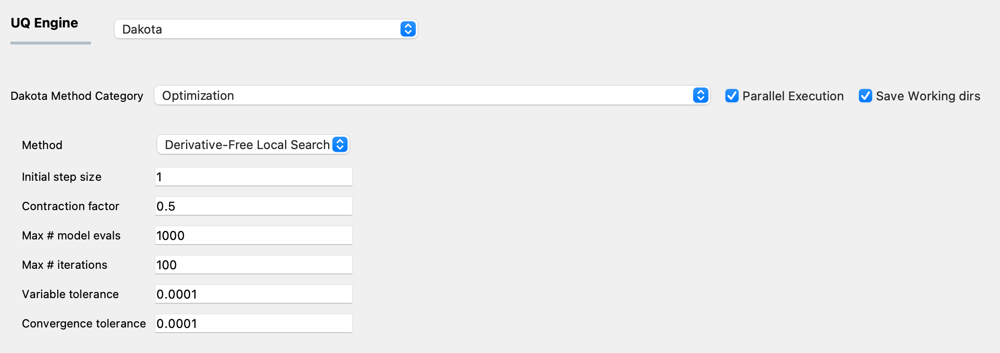

.. _lblDakotaGradientFreeEstimation:

Gradient-free Parameter Estimation
**********************************

It is not uncommon for engineering problems that the gradient of a computational model with respect to the model parameters is not reliably estimated. Sometimes, the objective function for deterministic calibration is not differentiable. In such situations, a gradient-based local search algorithm might fail to locate the optimum parameter values that provide the best fit of the model predictions to the data. A gradient-free local search method can be employed for deterministic calibration instead of a gradient-based algorithm in such scenarios.

Gradient-free optimization methods are used to minimize an objective function based solely on evaluation of the objective function values without the use of any derivative information or any approximation of the derivatives. When concerned with parameter estimation, the objective function is typically the sum of the squared differences between the predictions from a model and the calibration data. However, any objective function that the user desires can be employed. When performing grdient-free parameter estimation, the model (or the post-processing script, if any), should be defined in a way that returns the  objective function value (a single scalar quantity) in a file called ``results.out``.

The parameters of the model (which is defined in the **FEM** panel) are defined in the **RV** panel. The bounds of the domain within which the optimal values of the parameters need to be searched for are also specified in the **RV** panel, along with the initial point at which the search will start. No prior specification of the distribution associated with the random variables is necessary. 

The output from the model is the objective function value, and this can be given a name which is defined in the **EDP** panel. The length must be set equal to 1. 

The algorithms employed will find a set of parameter values that **minimizes** the objective function. 

The panel that is presented to the user when this Dakota Category is chosen, is as shown in :numref:`figGradientFreeParameterEstimation`.

.. _figGradientFreeParameterEstimation:

  	Input panel for gradient-free parameter estimation using Dakota.

Pattern Search
^^^^^^^^^^^^^^
Gradient-free parameter estimation uses the pattern search algorithm that is available in Dakota, called *coliny_pattern_search*. Please refer to the Dakota user manual for more details about the algorithm. The inputs that are required for this algorithm are: 

1. Initial step size: this defines the initial size of the offsets used in the pattern search algorithm
2. Contraction factor: this specifies the ratio of the reduction in the offset size used in the pattern search algorithm
3. Max # model evals: This is a termination criterion. This specifies the maximum number of model evaluations allowed during the search for the optimum parameter values. This sets the total compuational budget for the pattern search algorithm. 
4. Max # iterations: This is a termination criterion. This specifies the maximum number of iterations allowed in the optimization algorithm. During each iteration of the algorithm, several model evaluations occur in parallel.
5. Variable tolerance: This is a terminiation criterion. This specifies the maximum permitted change in the value of the parameters being estimated from one iteration to the next.
6. Convergence tolerance: This is a termination criterion. This soecifies the maximum permitted change in the value of the objective function from one iteration to the next.

The search for the optimum parameter value will terminate once any of the four available termination criteria are met.

.. [Torczon]
   Virginia Torczon. On the convergence of pattern search algortihms. SIAM J. Optim. Vol. 7, No. 1, pp. 1–25, February 1997.

