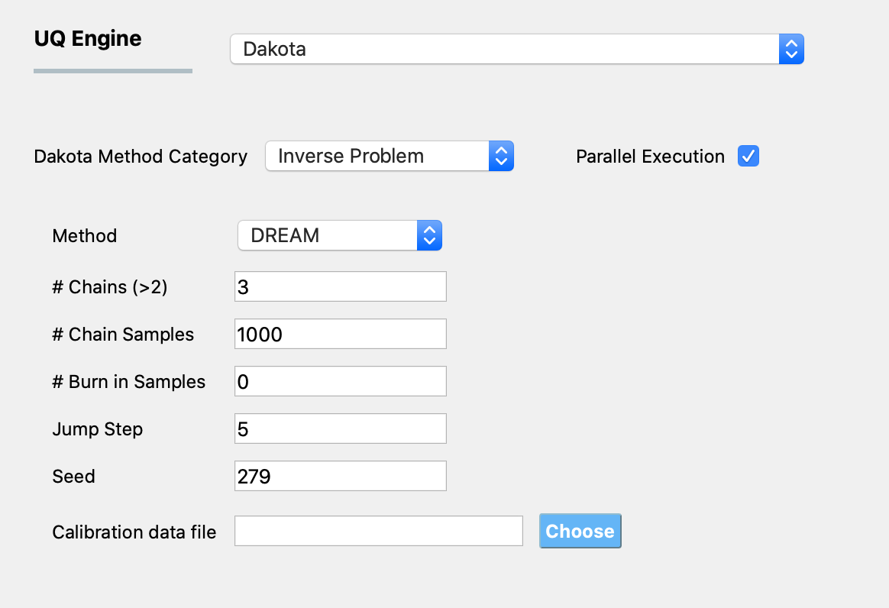

.. _lblInverseProblem:

Inverse Problem
***************

The inverse problem methods, like the parameter estimation methods presented in :ref:`_lblParameterEstimation`, are concerned with estimation of input parameters given observational measurements. Unlike parameter estimation methods, in which the user provides a range and an initial starting point for the input random variables, when using an inverse method the user has some idea of the distributions associated with these parameters. This information is known as the prior distributions. The Inverse  methods take this prior information and combines it with observational data (e.g. from experiments) to infer posterior distributions on the parameter values. For the Inverse problem, a Bayesian updating paradigm is followed, the prior distribution on a parameter is updated through a Bayesian framework involving experimental data and a likelihood function. For the likelihood function, that function that specifies the likelihood of observing a particular observation given the model and its associated parameterization, Dakota uses a Gaussian likelihood function. The algorithms that generate the samples to produce the posterior distributions are typically based on some Markov Chain Monte Carlo (MCMC) algorithm. For |appName| two families of algorithms are provided for the MCMC: DREAM, and the algorithms provided by the QUESO library.

..
	QUESO
	^^^^^

	The QUESO option supports the following MCMC algorithms from the QUESO library: DRAM (Delayed Rejection Adaptive Metropolis), delayed rejection (DR) only, adaptive metropolis (AM) only, pure Metropolis Hasting (MH)s, and multilevel (ML). The user is requested to select from one of the algorithms, provide a seed and to specify the number of markov chain samples, and has the option of specifying the number of burn in samples (those samples generated at the start to start the markov chain, but not included in the result)

	.. _figQUESO:
	
	.. figure:: figures/QUESO.png
	:align: center
	:figclass: align-center

  	DREAM input panel.

	.. [QUESO]
	     Prudencio, Ernesto E and Schulz, Karl W, "The parallel C++ statistical library ‘QUESO’: Quantification of Uncertainty for Estimation, Simulation and Optimization, Euro-Par 2011: Parallel Processing Workshops, Springer, 2012, 398-407

DREAM 
^^^^^

The DiffeRential Evolution Adaptive Metropolis (DREAM) method runs multiple markov chains simultaneously for global exploration of the space, and automatically tunes and scales the orientation of the proposal distributions in randomized subspaces during the search. The inputs for the method are the number of chains, seed, number of markov chain samples and burn in samples. The number of Markov chain samples per chain is number of samples divided by number of chains.

.. _figDREAM:

  	DREAM input panel.

.. [DREAM] 
   J. A. Vrugt, C. J. F. ter Braak, C. G. H. Diks, B. A. Robinson, J. M. Hyman, and D. Higdon. Accelerating Markov chain Monte Carlo simulation by self-adaptive differential evolution with randomized subspace sampling. International Journal of Nonlinear Scientific Numerical Simulation, 10(3), 2009. 1804, 2550
