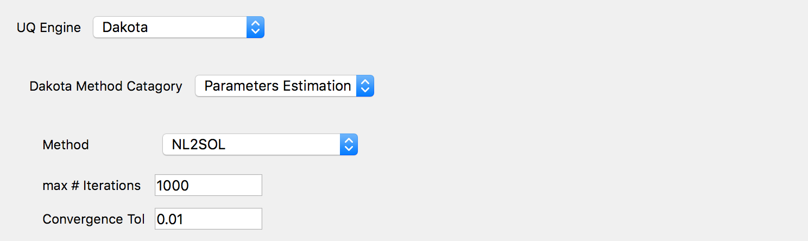

.. _lblDakotaParameterEstimation:

Parameter Estimation
********************

Parameter Estimation methods (also known as non-linear least squares methods) are  used to fit a set of m observations (in this tool defined in the **QoI** tab) with a model that is non-linear with n unknown parameters (in thus tool the unknown parameters are defined in the **RV** tab) :math:`(m \ge n)`.  The method are obtaining the parameters that best fits the experimental results, that is that **minimizes** the QoI, given no prior estimation as to the distribution associated with the random variables. As such the processing scripts should leave in the ``results.out`` file differences between observed response and simulated response. The algorithms employed will find a set of parameters that minimizes these differences. The algorithms themselves are general functional minimization algorithms seeking to minimize:

.. math::

      f(x) = \sum_{i=1}^{m} w_i R_i^2 = \sum_{i=1}{m} w_i \left ( y(x)_i^{model} - y_i^{experiment} \right)^2

where :math:`R_i` might be the difference between experimental data :math:`y_i^{experiment}` and model predictions :math:`y(x)_i^{model}` for a response quantity at a particular location and/or time step, :math:`w_i` optional weights, and :math:`x \in R^n` the :math:`n` model parameters which are not precisely known and are being calibrated to match available data.

The panel that is presented to the user when this Dakota Category is chosen, is as shown below.

.. _figParameterEstimation:

  	Dakota parameter estimation input panel.

.. note::
   The unknown parameters (the random variables options in the **RV** tab) are limited to Continuous Design. The user provides min, max and starting point values for each random variable.

For parameter estimation two different optimization algorithms are currently provided under the Method drop down menu, namely OPT++GaussNewton and NL2SOL. For both methods three input parameters need to be specified as shown in the figure: 
1. the convergence tolerance
2. the maximum number of iterations for the optimization subroutine.
3. the weights, :math:`w_i`, for each of the QoI. If no weights are specified, then :math:`w_i = 1.0`.

OPT++GaussNewton
^^^^^^^^^^^^^^^^

OPT++ Provides a Gauss-Newton least squares capability which, on zero-residual test problems, can exhibit quadratic convergence rates near the solution. As a consequence, a good starting point values for the parameters should be provided. The Hessian is constructed with a Gauss-Newton approximation and the OPT++ Optimization routines are used. 

.. [OPT] 
   J. C. Meza, R. A. Oliva, P. D. Hough, and P. J. Williams, "OPT++: An Object Oriented Toolkit for Nonlinear Optimization", ACM Transactions on Mathematical Software, Volume 33, Number 2, June 2007.

NL2SOL
^^^^^^

The NL2SOL method is based on an adaptive nonlinear least-squares algorithm, devised by Dennis and colleagues[Dennis81]. NL2SOL uses a trust region method and adaptively switches between two Hessian approximations, the Gauss-Newton approximation alone and the Gauss-Newton approximation plus a quasi-Newton approximation to the rest of the Hessian. This later approximation being useful when the starting guess is far from solution. For problems with large number of residuals, this algorithm is known to be more reliable than Gauss-Newton.

.. [Dennis81a]
   J. E. Dennis, D. M. Gay, and R. E. Welsch. An adaptive nonlinear least-squares algorithm. ACM Trans. Math. Softw.. 7(3). 348 - 368. 1981.

.. [Dennis81b]
   J. E. Dennis, D. M. Gay, and R. E. Welsch. Algorithm 573: NL2SOL—An Adaptive Nonlinear Least-Squares Algorithm [E4] ACM Trans. Math. Softw.. 7(3). 369 - 383. 1981.

