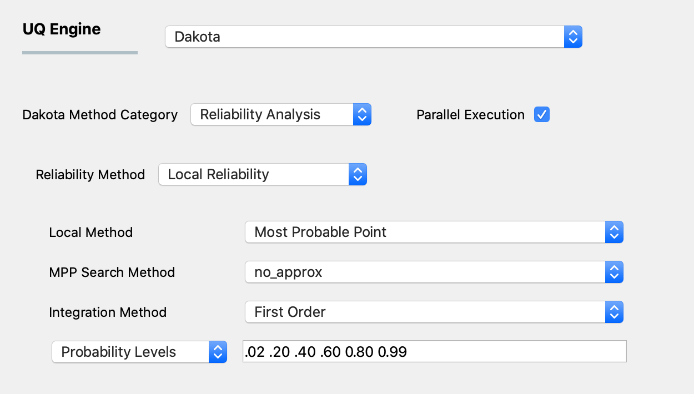
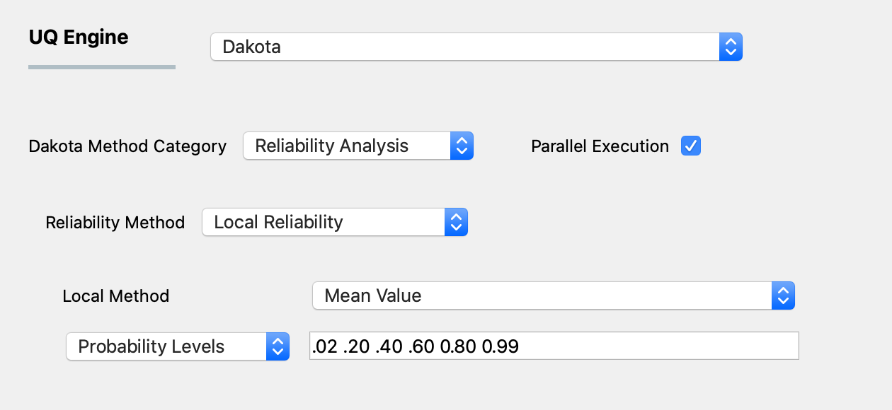
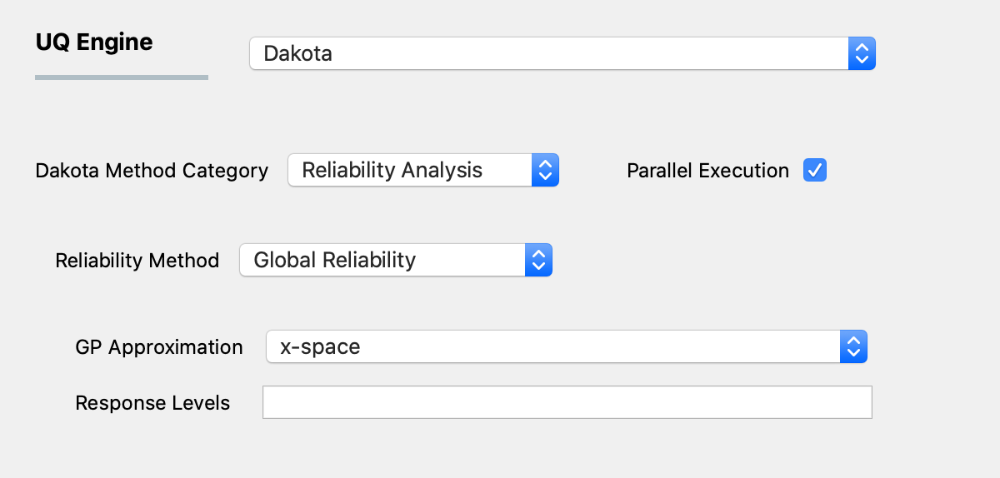

.. _lblDakotaReliability:

Reliability Analysis
********************

Reliability methods are another class of probabilistic algorithms used for quantifying the effect of uncertainties in simulation input on response metrics of interest. These methods, unlike forward methods, provide PDFs and CDFs about user specified response and probability levels, i.e. given a set of uncertain input variables, they model the probability that the response output is below or above a certain level.  As a consequence of concentrating on only certain response outputs, these models are often more efficient when calculating responses in the tails of the response distributions (events with low probability) since the number of samples required by a forward method to resolve a low probability can be prohibitive.

Reliability methods can be split into local and global methods, as elaborated in the following sections. 

Local Reliability Methods
^^^^^^^^^^^^^^^^^^^^^^^^^

Local reliability methods include the Mean Value method and a family of most probable point (MPP) search methods. Each of these methods is gradient-based, employing local approximations and/or local optimization methods. The user selects the local method using the pull down menu.

The default local reliability method is the most probable point (MPP) method. For the MPP method the user provides the following inputs:

.. _figLocalMPP:

  	Local reliability analysis using the MPP option.
	

1. The first input involves selection of the MPP search method from the following options:

- ``no_approx``: the MPP search on the original response functions without the use of any approximations. Combining this option with first-order and second-order integration approaches (see next section) results in the traditional first-order and second-order reliability methods (FORM and SORM).

- ``x_taylor_mean``: a single Taylor series per response/probability level in x-space centered at the uncertain variable means. (Combined with a first-order approach, this is commonly known as the Advanced Mean Value (AMV) method and combined with the second-order approach the method has been named AMV2:)

- ``u_taylor_mean``: same as AMV/AMV2, except that the Taylor series is expanded in u-space, termed u-space AMV methods.

- ``x_traylor_mpp``: an initial Taylor series approximation in x-space at the uncertain variable means, with iterative expansion updates at each MPP estimate until the MPP converges. The first-order option is commonly known as AMV+

- ``u_taylor_mpp``: same as AMV+/AMV2+, except that the expansions are performed in u-space.

2. The second input involves the user selecting the integration approach for computing probabilities at the MPP. These can be selected to be first-order or second-order integration. 

3. Finally the user selects either response levels or probability level from a drop down menu. The user then provides these levels in the line edit to the right of the pull down menu.

.. warning::
   
   Only a single quantity of interest may be specified when using MPP

.. [EldredBichonAdams2006]:

   Eldred, M.S., Bichon, B.J., and Adams, B.M., "Overview of Reliability Analysis and Design Capabilities in DAKOTA,Proceedings of the NSF Workshop on Reliable Engineering Computing (REC 2006), Savannah, GA, February 22-24, 2006.

The second local reliability method available is the Mean Value method (also known as MVFOSM). It is the simplest and least-expensive reliability method because it estimates the response means, response standard deviations, and all response-probability levels from a single evaluation of the response functions and their gradients at the uncertain variable means. This approximation can have acceptable accuracy when the response functions are nearly linear and their distributions are approximately Gaussian, but **can have poor accuracy in other situations**.

As shown in the figure below the user selects either to use response levels or probability levels. The user then inputs the levels.

.. _figLocalMV:

  	Local reliability analysis using the MVFOSM option.

.. [HaldarMahadevan2000]: 
   
   A. Haldar and S. Mahadevan. Probability, Reliability, and Statistical Methods in Engineering Design. Wiley, New York, 2000

Global Reliability Methods
^^^^^^^^^^^^^^^^^^^^^^^^^^

Local reliability methods, while computationally efficient, do not always work. When confronted with a limit state function that is nonsmooth, local gradient-based optimizers may stall due to gradient inaccuracy and fail to converge to an MPP. Moreover, if the limit state is multimodal (multiple MPPs), then a gradient-based local method can, at best, locate only one local MPP solution. Finally, an approximation to the limit state at this MPP may fail to adequately capture the contour of a highly nonlinear limit state. Global reliability methods are designed to handle nonsmooth and multimodal failure surfaces. They do this by creating global approximations based on Gaussian process models. They accurately resolve a particular contour of a response function and then estimate probabilities using multimodal adaptive importance sampling. 

The user specifies if the gaussian process is to be created in x-space (original) or u-space (transformed). The user also specifies the response quantity levels (there is no option available for probability levels) and a seed.

.. _figGlobalReliability:

  	Global reliability analysis.

.. warning::
   
   Only a single quantity of interest may be specified when using global reliability
   