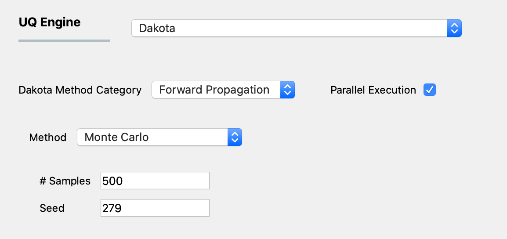
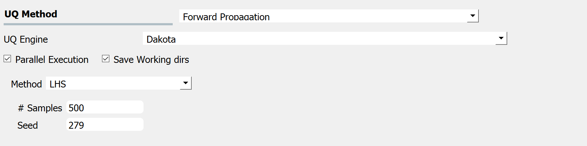
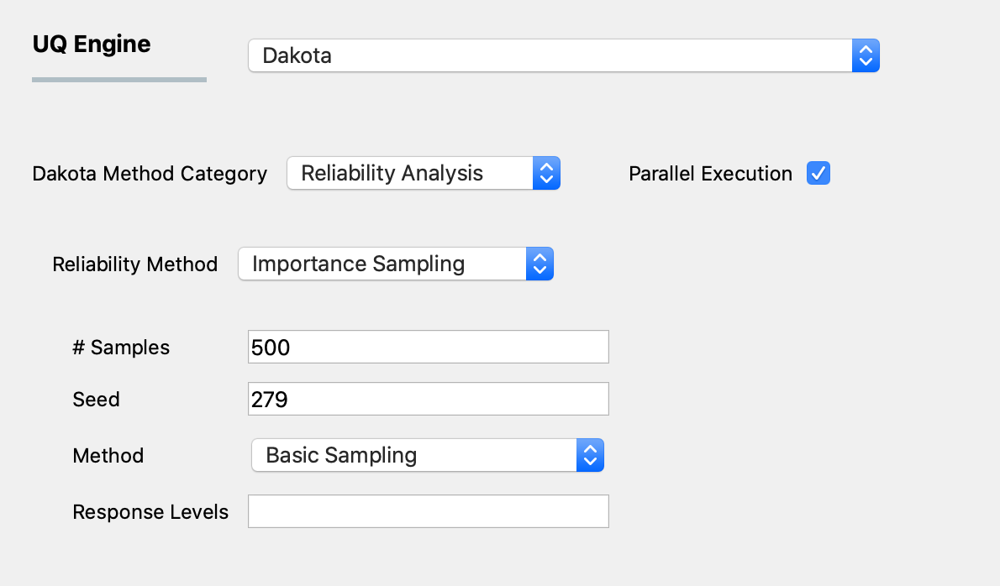
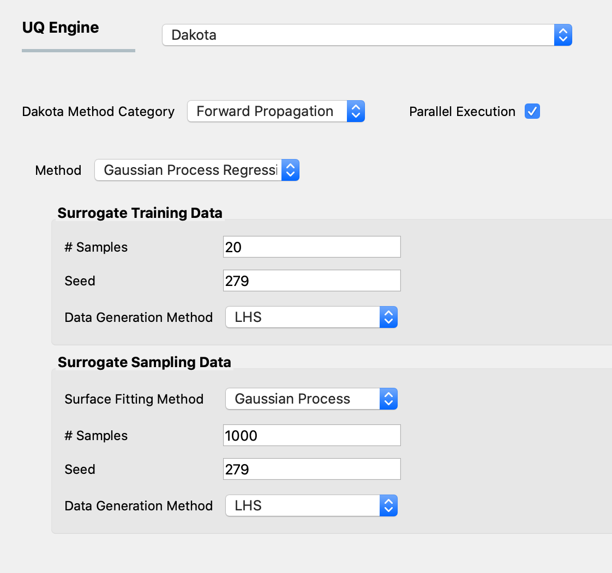

.. _lblDakotaForward:

Forward Propagation Methods
***************************
 
The forward propagation of uncertainty is concerned with the quantification of uncertainties in the output propagated from uncertain inputs.
Currently there are five options available:  Monte Carlo Sampling (MCS),  Latin Hypercube Sampling (LHS), Importance Sampling (IS), and sampling based on surrogate models, including Gaussian Process Regression (GPR) and Polynomial Chaos Expansion (PCE). Depending on the option selected, the user must specifies the appropriate input parameters for each. For instance, for MCS, the number of samples specifies the number of simulations to be performed, and providing a random seed allows the user to reproduce the same set of samples from the random variables multiple times.

The the user selects the sampling method to use from the sampling methods dropdown menu. Additional information regarding sampling methods offered in Dakota can be found `here <https://dakota.sandia.gov//sites/default/files/docs/6.9/html-ref/method-sampling.html>`_. 

Monte Carlo Sampling (MCS) 
^^^^^^^^^^^^^^^^^^^^^^^^^^

MCS is based on random sampling and is among the most robust approaches for problems where other uncertainty propagation schemes fail. Moreover, the convergence rate of MCS methods is independent of the problem dimensionality, albeit the convergence rate of such MCS methods is relatively slow at :math:`N^{-1/2}`. In MCS, a sample drawn at any step is independent of all previous samples. 

:numref:`figMCS` shows the input panel corresponding to the Monte Carlo Sampling setting. Two input parameters need to be specified, the number of samples to be executed, as well as the seed used in generating the random samples. 

.. _figMCS:

  	Monte Carlo Sampling input panel.

Latin Hypercube Sampling (LHS) 
^^^^^^^^^^^^^^^^^^^^^^^^^^^^^^

LHS represents a pseudo-random, stratified sampling approach for uncertainty propagation. With a better convergence rate than MCS, LHS pseudo-sampling take into account all previous sample points before drawing a new sample point.  

:numref:`figLHS` shows the input panel corresponding to the Latin Hypercube Sampling (LHS) scheme. Two input parameters also need to be specified, the number of samples to be executed, as well as the seed used in generating the LHS samples. 

.. _figLHS:

	Latin Hypercube Sampling input panel.

Importance Sampling
^^^^^^^^^^^^^^^^^^^

For problems where one is interested in the tail events rather than the distribution itself, such as rare earthquake or storm surge events, conventional sampling methods do not perform well, or might need a high number of samples to obtain an accurate estimation of tail distribution. For such problems, Importance Sampling provide a bypass to conventional sampling (LHS or MCS), whereby an alternative distribution is constructed with more weight on the tail part so that samples are concentrated there and this more accurate estimates of tail events are achieved. 

For rare event analysis,  :numref:`figIS` shows the input panel for Importance Sampling (IS) scheme. Similar to MCS and LHS, the IS requires both the number of samples to be executed and the corresponding seed for generating such random samples. In addition, the Importance Sampling algorithm can performed via three different approaches, as specified by the third input method. The latter includes

1.  Basic Sampling: a sampling density is constructed in the failure region based on an initial LHS sampling, followed by generation of importance samples and weights and evaluation of the Cumulative Distribution Function.  
2. Adaptive Sampling: similar to based sampling, with the exception that the basic sampling procedure is repeated iteratively until a convergence in failure probability is achieved. 
3. Multimodal Adaptive Sampling: a multimodal sampling density is constructed based on samples in the failure region, from which, the adaptive sampling procedure is used.

.. _figIS:

	Importance Sampling input panel.

For more information on each, please refer to the Dakota manual. 

Gaussian Process Regression (GPR)
^^^^^^^^^^^^^^^^^^^^^^^^^^^^^^^^^

One of methods for uncertainty propagation with surrogates is Gaussian Process Regression (GPR).
:numref:`figGPR` shows the input panel for the GPR model, with input panels for training and sampling. 

.. _figGPR:

  	GPR forward propagation input panel.

For problems where conventional sampling schemes such as LHS, MCS, or other fail, surrogates can be leveraged to obtain an approximation of the response surface, and than sample from that surface accordingly. 

Gaussian Process Regression, also known as Kriging, represent a well-established method for interpolation and response surface construction based on Gaussian process models with covariance matrices.  

For uncertainty propagation with Gaussian Process Regression (GPR),  :numref:`figGPR` shows the input panel for the PCE model, with input panels for training and sampling as well. The first set of input parameters in the surrogate training data specify the dataset used for training the surrogate model, while the second set of input parameters in the surrogate sampling data relate to the dataset used for sampling the surrogate. Care must be taken in specifying the training dataset to results in an accurate response surface approximation. 

Polynomial Chaos Expansion (PCE)
^^^^^^^^^^^^^^^^^^^^^^^^^^^^^^^^

Another response surface approximation scheme using surrogates is based on Polynomial Chaos Expansion (PCE). For uncertainty propagation with Polynomial Chaos Expansion (PCE), :numref:`figPCE` shows the input panel for the PCE model, with input panels for training and sampling as well, similar to the input GPR panel. The first set of input parameters in the surrogate training data specify the dataset used for training the surrogate model, while the second set of input parameters in the surrogate sampling data relate to the dataset used for sampling the surrogate. Extreme care must be taken in specifying the parameters of the training dataset to results in an accurate response surface approximation. 

.. _figPCE:

.. figure:: figures/fwPCE.png
	:align: center
	:figclass: align-center

	PCE forward propagation input panel.

If you are not sure about the training parameters of the surrogates, please refrain from using the surrogates (PCE in particular) for forward propagation and use instead conventional sampling such as MCS and LHS as discussed above, even at a higher computational cost. 

