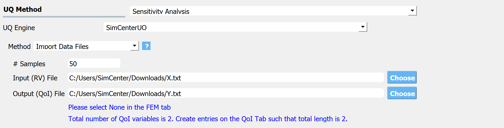

.. _lblDakotaSensitivity:

Global Sensitivity Analysis
***************************

Sensitivity analysis provides information on how uncertainty in the output can be divided/allocated to the uncertainties in the inputs.
It is used to identify most important input variables that influence the model response and their interactions. This can be useful for down-selecting the random variables to use in forward propagation problems, and identifying the input variables for which extra experimentation/research may be useful in reducing the uncertainty in the initial specification.

For Sensitivity Analysis the user has two options to generate the samples on which the statistics are created: Monte Carlo, and Latin Hypercube Sampling (LHS). For both they are required, as shown in figure below, to specify the number of samples and a seed.

.. _figSensitivity:

  	Sensitivity analysis input panel.

The results of the Sensitivity analysis will show both the main effect and total effect `Sobol indices <https://en.wikipedia.org/wiki/Variance-based_sensitivity_analysis>`_ for each RV for each of the QoI.

