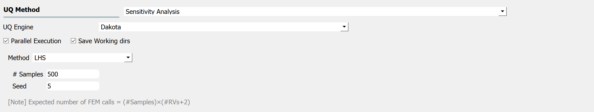

.. _lblDakotaSensitivity:

Global Sensitivity Analysis
**********************************************

Global sensitivity analysis is used to quantify contribution of each input variable to the uncertainty in the output quantity of interest (QoI). In particular, by calculating the global sensitivity indices, users can set preferences between random variables considering both inherent randomness and its propagation through the model. Global sensitivity analysis helps users to understand the overall impact of different sources of uncertainties and their interactions, as well as to accelerate UQ computations by focusing on dominant dimensions or screening out trivial input variables. Sensitivity index can also be used to identify the input variables for which extra experimentation/research may be useful in reducing the uncertainty in the initial specification.

**Sobol indices** are widely used variance-based global sensitivity measures which have two types: main effect and total effect sensitivity indices. The **main effect index** quantifies the fraction of variance in QoI that can be attributed to specific input random variable(s) but without considering interactive effect with other input variables. The **total effect index**, on the other hand, additionally takes the interactions into account. **Please read** :ref:`HERE<lbluqSimTechnical>` **for more details on the equations.**

**Dakota Sensitivity Analysis** is based on efficient Monte Carlo method (See Eqs. (8) and (9) in [Weirs12]_ which is referred in Dakota Technical manual [Adams20]_), and the user has two options to generate the samples on which the statistics are created: Monte Carlo, and Latin Hypercube Sampling (LHS). For both, they are required, as shown in figure below, to specify the number of samples and a seed.

The results of the Sensitivity analysis will show both the main effect and total effect `Sobol indices <https://en.wikipedia.org/wiki/Variance-based_sensitivity_analysis>`_ for each random variable (RV) for each of the quantity of interest (QoI).

.. _figSensitivity:

  	Sensitivity analysis input panel.

.. note::

	When the associated FEM model is computationally expensive, the user should consider that the actual number of the simulation runs is larger than the number of samples specified in the input panel. The actual number of simulation runs are NS*(2+NRV)
	
		- NS = number of samples specified by user
		- NRV = number of random variables

.. [Weirs12]
	V. G. Weirs, J. R. Kamm, L. P. Swiler, M. Ratto, S. Tarantola, B. M. Adams, W. J. Rider, and M. S Eldred. Sensitivity analysis techniques applied to a system of hyperbolic conservation laws. *Reliability Engineering and System Safety*, 107:157–170, 2012

.. [Adams20]
	B. M. Adams *et al*. DAKOTA, a multilevel parallel object-oriented framework for design optimization, parameter estimation, uncertainty quantification, and sensitivity analysis: version 6.12 user's manual. *Sandia National Laboratories, Tech. Rep.* SAND2020-5001 (2020).

