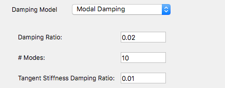
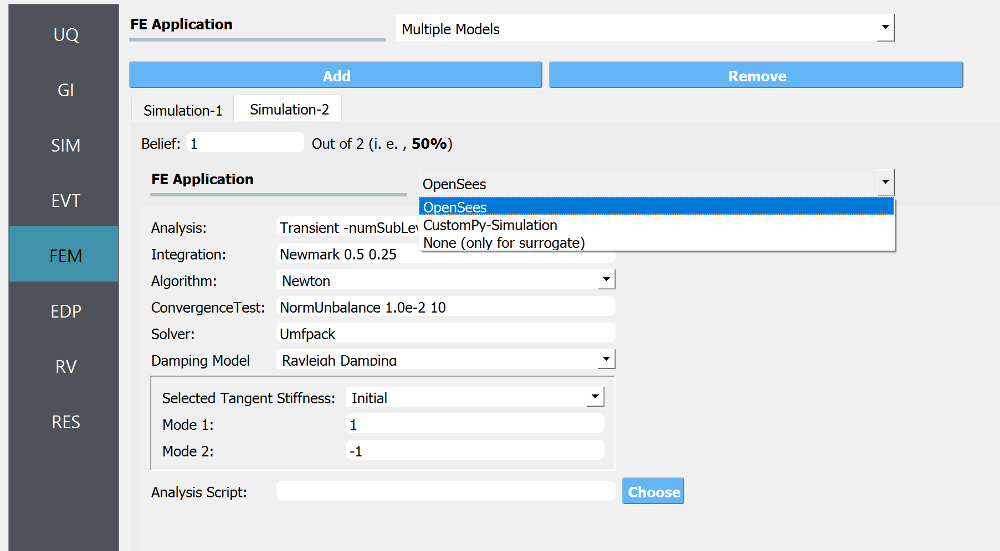

.. _lblFEM:

FEM: Finite Element Method
==========================

The **FEM** tab will present users with a selection of FEM applications that will take a building model generated by the BIM application and the EVENT from the event application and perform a deterministic simulation of structural response. 

.. contents::
    :local:

OpenSees
-----------

The default application is the OpenSees application. The current OpenSees implementation extends the standard OpenSees executable with a pre- and post-processor to take the BIM and EVENT files and use OpenSees to simulate the response, and return it in an EDP file.

.. _figFEM:

	Options for OpenSees. 

For the |OpenSees| application the user is required to specify the
options to be used in the transient analysis. As shown in :numref:`figFEM`,
this includes the choice of:

     #. `Solution Algorithm <http://opensees.berkeley.edu/wiki/index.php/Algorithm_Command>`_: The solution algorithm is the numerical algorithm used to solve the nonlinear equations at each time step/. The default is Newton Raphson, other options include ModifiedNewton, Newton -initial, BFGS, Linear.

     #. `System <http://opensees.berkeley.edu/wiki/index.php/System_Command>`_: The system defines how the matrix equation :math:`Ax = b` is stored in memory and solved. The default is the unsymmetric sparse solver Umfpack. Other options available include: profileSPD, BandSPD, BandGEM, Diagonal, SuperLU.

     #. `Integration Scheme <http://opensees.berkeley.edu/wiki/index.php/Integrator_Command>`_: The integration scheme specifies the time stepping algorithm being employed to solve the transient problem (:math:`M \ddot{U}(t) + C \dot{U}(t)  + Fs(U(t)) = P(t)`). The integration scheme determined the coefficients in the :math:`A` matrix,  the meaning of the :math:`x` and :math:`b` vectors and how the nodal displacements, velocities, and accelerations should be updated given :math:`x`. The default is Newmark's linear acceleration method (Newmark 0.5 0.25). Other Newmark methods can be employed by changing the :math:`\alpha` and  :math:`\beta` terms, and other methods, HHT, CentralDifference, can be selected.

     #. `Convergence Test <http://opensees.berkeley.edu/wiki/index.php/Test_Command>`_, the default is a norm on the unbalance force with a convergence tolerance of 1.0e-2 and a limit of 10 trial steps to achieve convergence. Other convergence criteria that can be chosen incude: NormDispIncr, EnergyIncrement, and the relative norms.

     #. Damping Model: The pull down menu defaults to **Rayleigh Damping**. The other option is **Modal Damping**. The theory behind the two is presented in :ref:`lblDamping`.

          #. Rayleigh Damping. With Rayleigh damping the user must provide the damping ratio, :math:`\zeta` and specify two modes from which the damping coefficients :math:`a_0` and :math:`a_1` will be determined. Mass proportional damping can be obtained by setting the **Mode 2** option to 0, **stiffness proportional damping** by setting **Mode 1** option to 0.

	  #. Modal Damping: With modal damping the user specifies the number of modes and the damping ratio :math:`\zeta`. In addition, the user has the option of specifying a **stiffness proportional damping ratio**, which as mentioned in the :ref:`lblDamping` is used to provide additional damping for the higher modes.

	  .. figure:: figures/OpenSeesFEM-Modal.png
	     :align: center
	     :figclass: align-center

	     Modal Damping Options for OpenSees 

     #. Analysis Script. This shall be left blank by default. Advanced users of OpenSees who have their preferred analysis script and wish to provide their own damping model can provide it here. If this option is provided, the user in their script should use the variables **numStep** and **dt**.

A default transient analysis script is run with these inputs. It is
built for Version 3.0.0+ of OpenSees and uses a divide and conquer
algorithm to overcome convergence issues. This new algorithm
does not work for every nonlinear problem. The actual analysis command
that is created based on the defaults is the following:

.. code-block:: none

   numberer RCM
   system Umfpack
   integrator Newmark 0.5 0.25
   test NormUnbalance 0.01 20 
   algorithm Newton
   analysis Transient -numSubLevels 2 -numSubSteps 10 
   analyze $numStep $dt

If the user specifies their own analysis script to run
instead of the default, they can take advantage of the **numStep** and **dt** variables that
are obtained from the EVENT and are automatically set by the program.

Multiple Models
-----------

The **Multiple Models** simulation application allows users to define multiple finite element analysis options. The Add and Remove buttons allow users to control the number of sets of options they want to use while conducting the analysis. 

By adding a model, a new tab is created in the FEM panel where users can choose one of the finite element analysis applications described in the sections above and provide the inputs necessary to define the required analysis options. Users also need to specify their belief corresponding to that analysis option. The beliefs are expressed as non-negative numerical values. The belief value in each tab is defined relative to the values in the other tabs, and the beliefs do not need to sum to 1.

  Selecting a set of finite element analysis options within a Multiple Models FEM Application

.. Note:: 

  If the Multiple Models application is selected, at least 2 models must be defined. 

.. Note:: 

  If the "Multi-fidelity Monte Carlo (MFMC)" option was selected in the UQ tab, the belief values will be ignored. The premise of MFMC is that the high-fidelity model response is always the best response, therefore, *belief in each model* does not apply.

None
-----------

This option is used only when the user specifies a surrogate model in SIM tab. Because they do not need an FEM solver, the option None should be selected.

.. Note::   
   This option is not for training a surrogate model but for using a pre-trained surrogate model.
